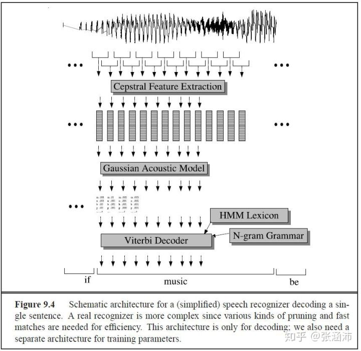
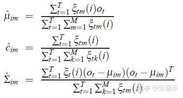

# 基于GMM-HMM的自动语音识别框架
自动语音识别(automaic speech recognition)就是建立一个将声学信号转化为文字的系统,而自动语言理解则更进一步,它需要对句子的含义进行理解.

一个性能良好的ASR系统面临如下挑战:

1) 语音识别任务中存在大量的词汇.

2) 语音的连续性,流畅性,通用性.

3) 信号道以及噪音问题.

4) 说话者的口音.

因此在本讲及下讲我们讲介绍一个简单的大词量ASR系统(LVCSR).

## 语音识别系统的结构

### 噪声道模型
基于HMM的语音识别系统将语音识别任务看做"噪声道模型".即若我们知道噪声是如何扰乱源信号的话,我们就能通过尝试每个可能句子来找到正确的源句子对应的波形,而后判断其与输出的匹配程度.下图为噪声道模型的图示.

假如最终我们采用概率来评估结果的好坏,那么就将语音识别问题转化为贝叶斯推断的特例.同时由于英语中的状态空间会很大,因此我们不能完全对其遍历.这也就带来了解码的问题.幸好随着技术的发展,我们可以使用Viterbi算法来方便的进行解码.

### 语音识别中的基本公式
1) 声学输入O定义为HMM中的可观测量.通常来讲,它是通过对波形文件进行分帧处理得到的声学特征向量.

$O = o_{1}, o_{2}, o_{3},\ldots , o_{t}$

2)句子是由一系列的单词w组成的:

$W = w_{1}, w_{2}, w_{3},\ldots , w_{n}$

有了以上的定义,根据ASR的任务要求,我们要在给定声学输入O的情况下找出最有可能的字符串输出W,用公式表达为:

$W^{max} = \arg\max\limits_{W\in L}P(W | O) $

因此我们要计算 $P(W | O) $ ,利用贝叶斯公式得:

$W^{max} = \arg\max\limits_{W\in L} \frac{P(O | W) P(W)}{P(O)}$

由于我们要针对W进行优化,而输入O是不变的,因此公式简化为:

$W^{max} = \arg\max\limits_{W\in L}P(O | W)P(W)$

在上式中, $P(O | W)$ 成为观察序列的似然值(Likelihood),由声学模型(Acoustic Model, AM)提供,P(W)称为先验概率,由语言模型(Language model, LM)提供.

对于LM的获得由多种途径,LM的形式也多种多样,一般情况下我们采用N-gram作为我们的语言模型,N取值在3-5之间.之前我使用的百度Deepspeech框架和谷歌Wavenet框架的语言模型都是通过Kenlm获取的N-gram语言模型.

## 语音识别框架
下图给出语音识别系统的三个步骤:

第1阶段为特征抽取阶段或称之为信号处理阶段.在该阶段我们先将声学波形文件按时间切分为一帧一帧的片段,一般以10/15/20 毫秒为一帧时间.在分为帧后我们通过变化将其转化为特征频谱,对于每帧我们用39个特征向量来表示它.(在采用MFCC时是13*3=39个特征,后面会讲到).

第二阶段是声学模型建立或音素识别阶段.在该阶段我们对特征向量计算似然值,如采用高斯混合模型(Gaussian Mixture Model, GMM)来计算HMM的隐态q(对应于音素或子音素)的似然值$P(o | q) $.

第三阶段是解码阶段,我们将声学模型和HMM的单词发音词典和语言模型结合来得到最优可能 的文本序列.之前大部分的ASR系统都是用Viterbi算法进行解码(真的很好用...).

## HMM在语音识别中的应用
在语音识别任务中,隐藏状态q对应于音素,部分音素或单词.可观察量是波形文件帧的频谱和能量信息.解码过程就是将声学信息映射到音素和单词.

下图给出基本的HMM音素状态结构概览,例子中的单词是"six":

这个单词由四个音素组成(emitting states),加上开始和终止状态.转移概率A表示状态间的转移,观察概率B表示每个音素的似然度.需要注意的是除初始和终止状态外,音素状态可以向下一个音素状态转移,也可以转移到自身.但不能向前一个状态转移,这种从左到右的HMM结构叫做Bakis网络.状态循环回自身允许模拟单因素持续时间较长的情况.

为了捕捉音素在时间长度上的非均匀性,在LVCSR中我们通常将一个音素用多个HMM状态来表示.其中最常用的是采用开始(beginning),中间(middle),结束(end)状态.因此每个音素都对应与HMM的三个状态(对于单个词还会有开始和结束状态).下图给出5状态的HMM音素模型事例.此时我们要想建立一个基于子音素的声学模型,我们只需讲之前的单音素换成HMM的3音素状态,将开始和结束状态换成上下链接的音素状态,最终一句中只保留一个开始和一个结束状态即可.图9.8给出了样例.

综上所述,对于HMM在ASR的应用中,我们得到了如下对应关系:

1) $Q = q_{1}, q_{2}, \ldots q_{N} ~~$ 表示子音素对应的状态,HMM中的隐态.
2) $A = a_{01}a_{02}\ldots a_{n1}\ldots a_{nn} ~~ $表示转移概率矩阵A,矩阵中的每个元素 $a_{ij}$ 表示子音素转移到下一个子音素或回到自身的概率.
3) $B = b_{i}(o_{t}) ~~$ 可观测态的似然值.也叫发射概率.表示由子音素状态i生成倒谱特征向量 o_{t} 的概率.

### 建立声学模型
经过上面的介绍后,我们现在将给出:给定HMM状态时的输入特征向量似然度, $b_{t}(i)$ .

### 高斯密度函数(Gaussian PDFs)
在很久之前,人们会使用矢量化(Vector quantization, VQ)来计算声学模型,但对于变化多端的语音信号来对,小规模的codewords不足以充分表达这种变化,因此人们采用直接计算连续特征向量输入来得到声学模型.这种声学模型基于连续空间中的概率密度函数(Pribability density function, PDF).其中最常用的就是GMM PDFs啦,虽然其他的如SVMs,CRFS也在用但是最常用的还是它.

单变量高斯分布的定义及均值方差的公式这里就不多写,大家应该都知道.这里直奔主题.

我们采用单变量高斯密度函数来估计一个特定的HMM状态j生成的一维特征向量 $o_{t}$ ,这里假设 $o_{t}$ 满足正态分布.通俗一点表达就是我们用一个高斯函数来表示可观察变量的似然函数 $b_{j}(o_{t})$ .用公式表达就是:

$b_{j}(o_{t}) = \frac{1}{2\pi\sigma_{j}^{2}}exp(-\frac{(o_{t}-\mu_{j})^{2}}{2\sigma_{j}^{2}})$

好了,定义完b后我们就可以采用Baum-Welch算法来训练HMM啦~.根据该算法,我们首先计算 $\xi_{t}(i)$ ,然后计算均值 $\mu_{}$ 和 $\sigma$ :

$\mu_{i*} = \frac{\sum\limits_{t=1}^{T}\xi_{t}(i)o_{t}}{\sum\limits_{t=1}^{T}\xi_{t}(i)}$

$\sigma_{i*}^{2} =\frac{\sum\limits_{t=1}^{T}\xi_{t}(i)(o_{t} - \mu_{i})}{\sum\limits_{t=1}^{T}\xi_{t}(i)}$

这样我们根据EM算法进行迭代就好啦~

### 多元高斯函数
由于一个可观察特征向量有39个特征,因此单变量高斯分布并不能满足我们的要求.于是很自然的我们想用一个D=39维的多元高斯分布来搞事情.多元高斯函分布的公式为:

对应的协方差期望为:

因此,我们可以得出多元高斯分布的 $b_{j}(o_{t})$ :

对于实际应用中来说,尽管一个完全的协方差矩阵 $\Sigma$ 可能更有利于对声学模型建模,但会增加计算消耗和太多的参数.因此我们讲采用对角协方差矩阵来代替完全协方差矩阵.这样我们就可以对上式进行简化:

这样在获得了b后我们同样采用Baum-Welch算法等进行迭代.

### 高斯混合模型
上面的模型看起来虽然很好,但它的前提假设是每个特征是正态分布的,这对于实际中的特征来说假设太强了,因此在实际应用中我们往往一个加权的混合多变量高斯分布.我么称之为高斯混合模型或GMM.下面给出该分布的定义式以及对应的输出似然函数 $b_{j}(o_{t})$ :

好了,按照惯例,我们知道了b又要用Baum-Welch算法了...(真的很简单粗暴直接有效...竟然可以从数据中自动习得那个观察量来自哪个组分....)

上式就是在Baum-Welch算法中的 $\xi_{t}$ 定义, 需要注意的是这里的 $\xi$ 下角标和公式中的对应部分下角标多个一个m表示第m个混合组分.得到 $\xi$ 后再对下面三个值进行更新就OK啦~

### 字典和语言模型
字典是指包含大量词汇的列表,同时在每个词后还带有音素级的发音.语言模型现在常用的就是N-gram语言模型,可以采用的工具很多,百度采用的是Kenlm语言模型,它是一个基于C++的N-gram语言模型,输入是分好词的文本,输出就是语言模型了,同时还可以将语言模型存为二进制文件方便存储调用.

## 参考文献
1. https://zhuanlan.zhihu.com/p/39390280