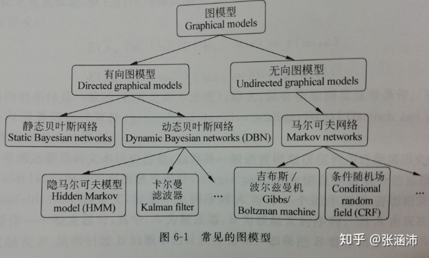
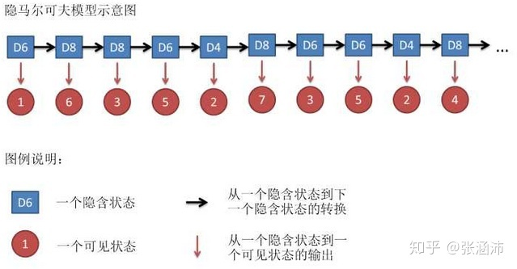

# 隐马尔可夫模型
概率图模型是在概率模型的基础上，使用了基于图的方法来表示概率分布，是一种通用化的不确定性知识和处理方法。下图给出常见的图模型：

## 马尔可夫模型
若系统在时间t的状态q只与其在时间t-1的状态相关，即：

$P(q_{t} = s_{i} | q_{t-1} = s_{j}, q_{t-2} = s_{k}, \ldots) = P(q_{t} = s_{i} | q_{t-1} = s_{j})$

那么系统构建成一个离散的一阶马尔科夫链(Markov Chain)。

若只考虑上式独立于时间t的随机过程:

$P(q_{t} = s_{j} | q_{t-1} = s_{i}) = a_{ij} , i,j \in [1, N]$

则该过程为马尔科夫模型，其转移概率 a_{ij} 需满足半正定和归一的条件

## 隐马尔可夫模型
在在马尔科夫模型中，每个状态代表了一个可观察的事件，所以马尔科夫模型有时叫做可视马尔科夫模型。但在实际应用中我们有时不知道模型所经过的状态序列，只知道状态的概率函数，因此该模型是一个双重的随机过程。其中模型的转换状态是隐蔽的，可观察事件的随机过程是隐蔽的状态转换过程的随机函数。

下图给出HMM的图解：

### 举个例子
上面的定义看以来很晦涩，我们来举个例子来理解它：

假设在暗室中由N个口袋，每个口袋中由M种不同颜色的求。一个实验员根据某一概率分布随机的选取一个初始口袋，从中根据不同颜色的求的分布概率随机的取出一个球并记录下该球的颜色。而后再根据口袋的概率分布选取一个口袋，再根据不用管色球的概率分布随机选取一个球，记录下颜色。重复这个过程我们就得到了一串标记球颜色的序列，如“红黄红蓝...”。当你把这串序列给暗室外的人看的时候，他们只是看到最终球的颜色序列，但不知道口袋的序列。

在上面的例子中，口袋对应于HMM中的隐藏状态，而颜色序列则代表可观察的输出序列。从一个口袋转向另一个口袋代表状态间的转换，从口袋中取球代表该状态的观察状态输出。

### HMM的组成部分
从上面的例子可以看出，HMM由如下几个部分组成。

1) 模型中状态的数目N(上例中口袋的数目)。

2) 从每个状态可能输出的不同符号的数目M（上例中口袋的数目球的不同颜色的数目)；

3) 状态转移概率矩阵 $A = {a_{ij}}, ~a_{ij} $为实验员从一个口袋 $s_{i}$ 转向另一个口袋 $s_{j}$ 取球的概率，其中:

$a_{ij} = P(q_{t} = s_{j} | q_{t-1} = s_{i}), ~1 \leq i, j\leq N$

$a_{ij} \geq 0$

$\sum_{j=1}^{N} a_{ij} = 1$

4)从状态 $s_{j}$ 观察到符号 $v_{k}$ 的概率分布矩阵 $B = {b_{j}(k)} , b_{j}(k)$ 为实验员从第j个口袋中抽取出第k种颜色的球的概率，其中：

$b_{j}(k) = P(O_{i} = v_{k} | q_{t} = s_{i}), ~~~~1\leq j \leq N;1 \leq k \leq M$

$b_{j}(k) \geq 0$

$\sum_{k=1}^{M}b_{j}(k) = 1$

观察符号的概率又称为符号发射概率。

5) 初始状态概率分布 $\pi = {\pi_{i}}$ ，其中:

$\pi_{i} = P(q_{i} = s_{i}), ~~~~1\leq i \leq N$

$\pi_{i} \geq 0$

$\sum\limits_{i=1}^{N}\pi_{i}=1$

一般地，一个HMM记为一个五元组 $\mu = (S, K, A, B, \pi)$ ,其中S为状态的集合，K为输出符号的集合， $\pi, A, B$ 分别为初始状态的概率分布、状态转移概率和符号发射概率。当考虑潜在时间随机地生成表面事件时，HMM是非常有用的。

## 参考文献
1. https://zhuanlan.zhihu.com/p/39388283