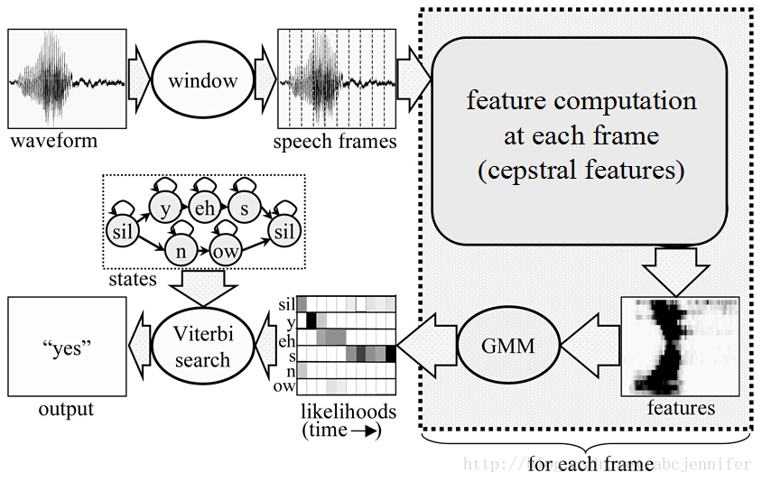
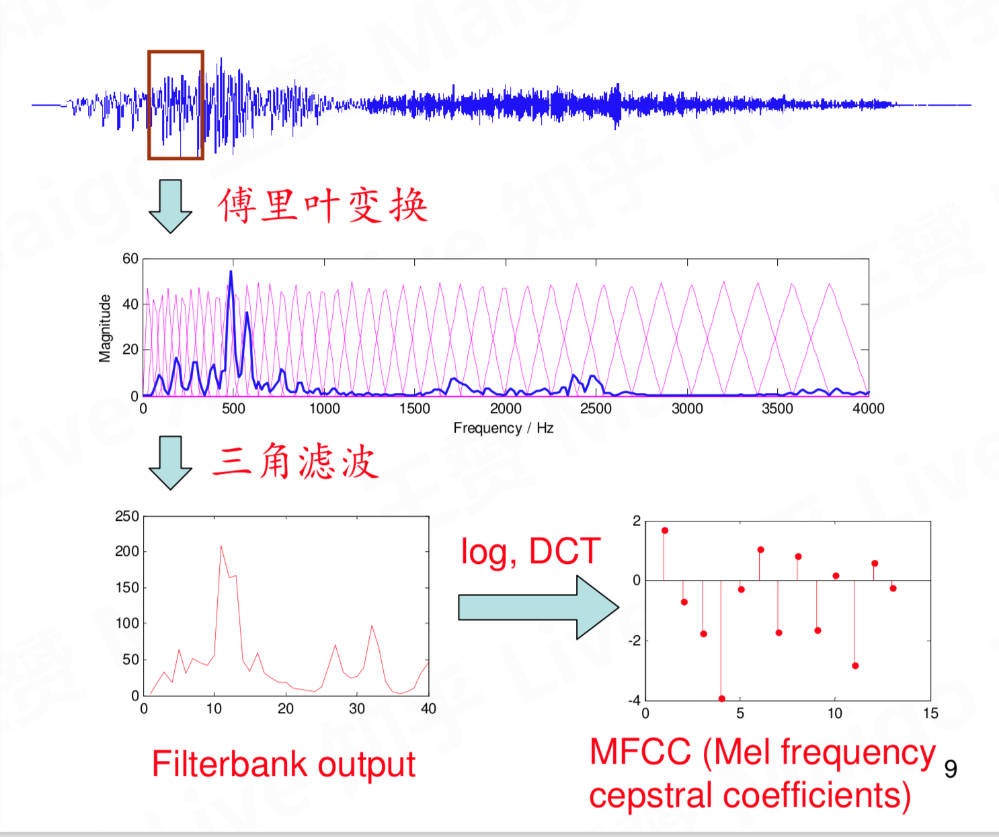
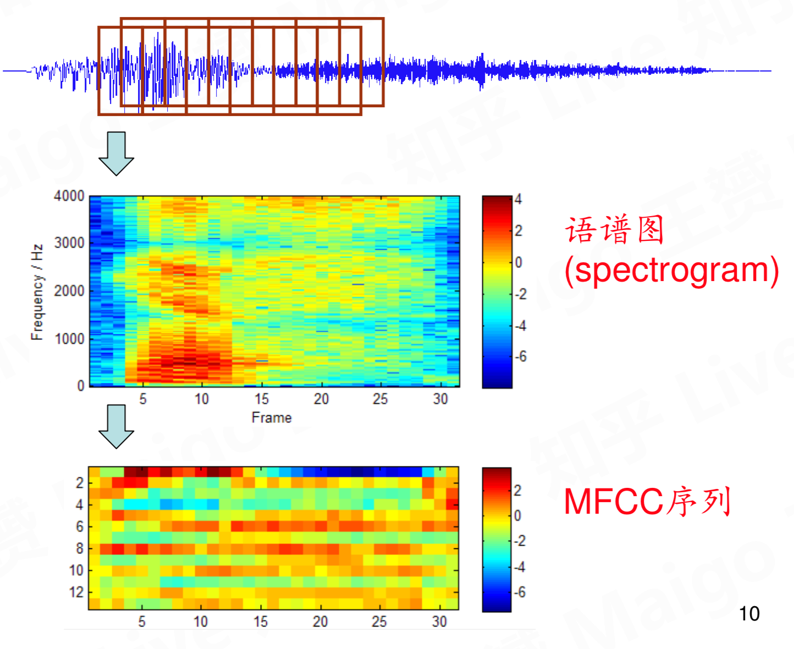
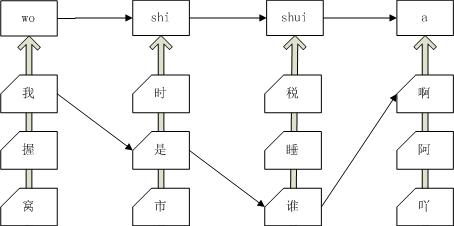
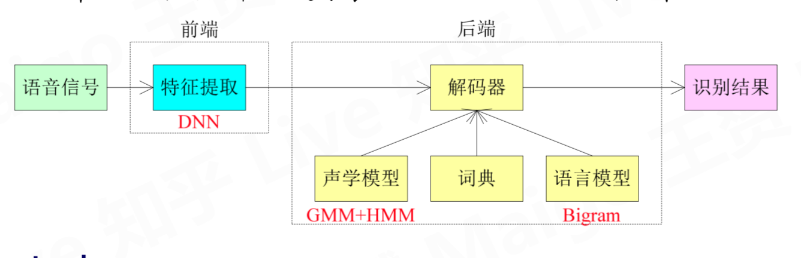
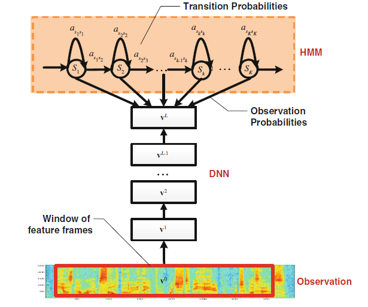
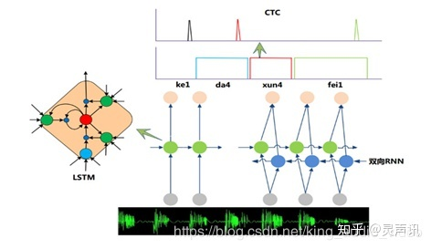
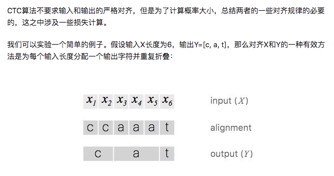
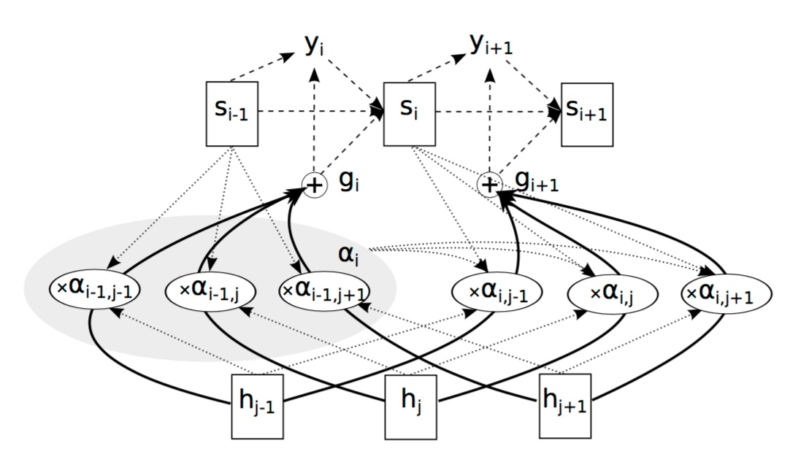
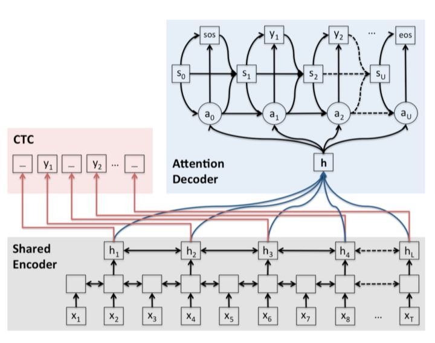

# 语音识别技术简述

## 语音识别概念
语音识别技术就是让智能设备听懂人类的语音。它是一门涉及数字信号处理、人工智能、语言学、数理统计学、声学、情感学及心理学等多学科交叉的科学。这项技术可以提供比如自动客服、自动语音翻译、命令控制、语音验证码等多项应用。近年来，随着人工智能的兴起，语音识别技术在理论和应用方面都取得大突破，开始从实验室走向市场，已逐渐走进我们的日常生活。现在语音识别己用于许多领域，主要包括语音识别听写器、语音寻呼和答疑平台、自主广告平台，智能客服等。

## 传统语音识别技术
语音识别的本质是一种基于语音特征参数的模式识别，即通过学习，系统能够把输入的语音按一定模式进行分类，进而依据判定准则找出最佳匹配结果。传统的模式识别包括预处理，特征提取，模式匹配等基本模块。如图所示首先对输入语音进行预处理，其中预处理包括分帧，加窗，预加重等。其次是特征提取，因此选择合适的特征参数尤为重要。常用的特征参数包括：基音周期，共振峰、梅尔倒谱系数（MFCC）等时域和频域特征。

### [特征提取 MFCC](https://blog.harryfyodor.xyz/2017/10/17/make-mfcc/)
MFCC是语音的一个特征, 在语音识别里面有重要的作用。下面讲解其中一种形式。
可以直观理解：每一小帧的声音信号提取出一个39维的向量。
39 = (12 + 1) * 3。这就是MFCC特征的组成，下文会讲解这一条分解的式子的来源。提取MFCC特征流程如下：

* 分帧
* 预加重
* 加窗
* 转换到频域
* 求能量谱
* 通过 Mel 滤波器
* 离散余弦变换
* 差分

### [GMM-HMM模型](https://blog.csdn.net/qq_37385726/article/details/89220703)
GMM-HMM是一个比较有历史的模型，效果比起现在的DNN-HMM等肯定是差了不少。但是，这一个模型的实现将语音识别这一复杂过程进行拆解，并定义了语言识别中的3个步骤，为后续优化提供的方向。这三个步骤分别是：第一步，把帧识别成状态（难点）。第二步，把状态组合成音素。第三步，把音素组合成单词。第一步可以当做GMM做的，后面都是HMM做的。

结合实际语音输入讲讲整个[过程](https://www.jianshu.com/p/16fc3712fdf6)：

* 首先我们在训练阶段，我们是知道这段语音所表示的句子吧。我们通过句子，然后分词，然后分成每个音素，在隐马尔科夫（HMM）模型中一般用3-5个上述的单元表示一个音素。简单的理解就是我们每个音素的均值和方差矩阵知道，通过我们的句子我们也知道每个音素间的转移概率矩阵。当然，这些是HMM里的事情。提取特征后的第一步就完成了，简单的说就是为了拟合多维高斯函数。
* 生成各个音素的hmm。这个可以根据发音字典和原始的hmm来生成。
* 最后，我们根据训练数据来训练音素级的hmm。这里用到hmm的三大问题。通过训练，我们会得到三个参数：初始状态概率分布π、隐含状态序列的转移矩阵A（就是某个状态转移到另一个状态的概率观察序列中的这个均值或者方差的概率）和某个隐含状态下输出观察值的概率分布B（也就是某个隐含状态下对应于）

## 深度学习时代
当前诸如ANN，BP等多数分类的学习方法都是浅层结构算法，与深层算法相比存在局限。尤其当样本数据有限时，它们表征复杂函数的能力明显不足。深度学习可通过学习深层非线性网络结构，实现复杂函数逼近，表征输入数据分布式，并展现从少数样本集中学习本质特征的强大能力。

### 深度神经网络-Tandem结构

如上图所示，在GMM-HMM之前加了一层DNN来对原始的MFCC等特征进行进一步的特征提取，该结构被称为串型结构。早年，大部分工作都集中在该结构模型和瓶颈特征方法上。该模型中的DNN部分训练是用DNN来对帧进行分类，不过并不使用DNN的输出，而是拿出DNN中间比较窄的一层（称为bottleneck层）的值作为特征，再使用传统的GMM + HMM来建模。

### 深度神经网络—[Hybrid结构](https://www.microsoft.com/en-us/research/wp-content/uploads/2016/02/HintonDengYuEtAl-SPM2012.pdf)
相比传统的基于GMM-HMM的语音识别系统，其最大的改变是采用深度神经网络替换GMM模型对语音的观察概率进行建模。最初主流的深度神经网络是最简单的前馈型深度神经网络（Feedforward Deep Neural Network，FDNN）。DNN相比GMM的优势在于：1. 使用DNN估计HMM的状态的后验概率分布不需要对语音数据分布进行假设；2. DNN的输入特征可以是多种特征的融合，包括离散或者连续的；3. DNN可以利用相邻的语音帧所包含的结构信息。基于DNN-HMM识别系统的模型如图2所示。

### [LSTM+CTC](https://distill.pub/2017/ctc/)
考虑到语音信号的长时相关性，一个自然而然的想法是选用具有更强长时建模能力的神经网络模型。于是，循环神经网络（Recurrent Neural Network，RNN）近年来逐渐替代传统的DNN成为主流的语音识别建模方案。长短时记忆模块 (Long-Short Term Memory，LSTM) 的引入解决了传统简单RNN梯度消失等问题，使得RNN框架可以在语音识别领域实用化并获得了超越DNN的效果，目前已经使用在业界一些比较先进的语音系统中。除此之外，研究人员还在RNN的基础上做了进一步改进工作，如图4是当前语音识别中的主流RNN声学模型框架，主要包含两部分：深层双向RNN和序列短时分类（Connectionist Temporal Classification，CTC）输出层。其中双向RNN对当前语音帧进行判断时，不仅可以利用历史的语音信息，还可以利用未来的语音信息，从而进行更加准确的决策；CTC使得训练过程无需帧级别的标注，实现有效的“端对端”训练。

### [Attention](https://zhuanlan.zhihu.com/p/28462545)
首先要确定的是Attention是一种权重向量或矩阵，其往往用在Encoder-Decoder架构中，其权重越大，表示的context对输出越重要。计算方式有很多变种，但是核心都是通过神经网络学习而得到对应的权重。2015年6月Jan Chorowski 的[Attention-Based Models for Speech Recognition](http://papers.nips.cc/paper/5847-attention-based-models-for-speech-recognition.pdf)，这篇文章对Attention的架构图比较清楚，其Encoder端是一个BiRNN结构，Decoder中第i步的输出Yi与Attention的权重和hj相关，架构如下图所示：

### CTC + Attention
近期,Suyoun Kim等人在2016年9月的文章[9]提出了Attention与CTC进行结合对语音声学模型建模，其架构如下所示：其共用一个Encoder，Decoder分为2个，一个是CTC，一个是Attention，并通过权重λ来给定不同的权重比，CTC做为辅助，使得Attention尽快收敛。

## 识别技术的发展方向
* 鸡尾酒会问题（远场识别）。这个问题在近场麦克风并不明显，这是因为人声的能量对比噪声非常大，而在远场识别系统上，信噪比下降得很厉害，所以这个问题就变得非常突出，成为了一个非常关键、比较难解决的问题。鸡尾酒会问题的主要困难在于标签置换（Label Permutation），目前较好的解决方案有二，一是深度聚类（Deep Clustering）；二是置换不变训练（Permutation invariant Training）。
* 持续预测与自适应模型。能否建造一个持续做预测并自适应的系统。它需要的特点一个是能够非常快地做自适应并优化接下来的期望识别率。另一个是能发现频度高的规律并把这些变成模型默认的一部分，不需要再做训练。
* 前后端联合优化。前端注重音频质量提升，后端注重识别性能和效率提升。

## 参考文献
* [语音识别之GMM-HMM模型（三）：GMM-HMM模型应用于语音识别任务原理详解](https://blog.csdn.net/qq_37385726/article/details/89220703)
* [GMM+HMM 理论篇](https://blog.harryfyodor.xyz/2017/11/05/gmm-hmm-model/)
* [CTC](ftp://ftp.idsia.ch/pub/juergen/icml2006.pdf)
* [CRNN+CTC](https://zhuanlan.zhihu.com/p/43534801)
* https://zhuanlan.zhihu.com/p/62171354
* 《解析深度学习：语音识别实践》-------俞栋，邓力著
* 《实用语音识别基础》-------王炳锡，屈丹， 彭煊著
* 《语音信号处理》--------赵力著
* [Attention based model for 语音识别](https://zhuanlan.zhihu.com/p/28462545)

