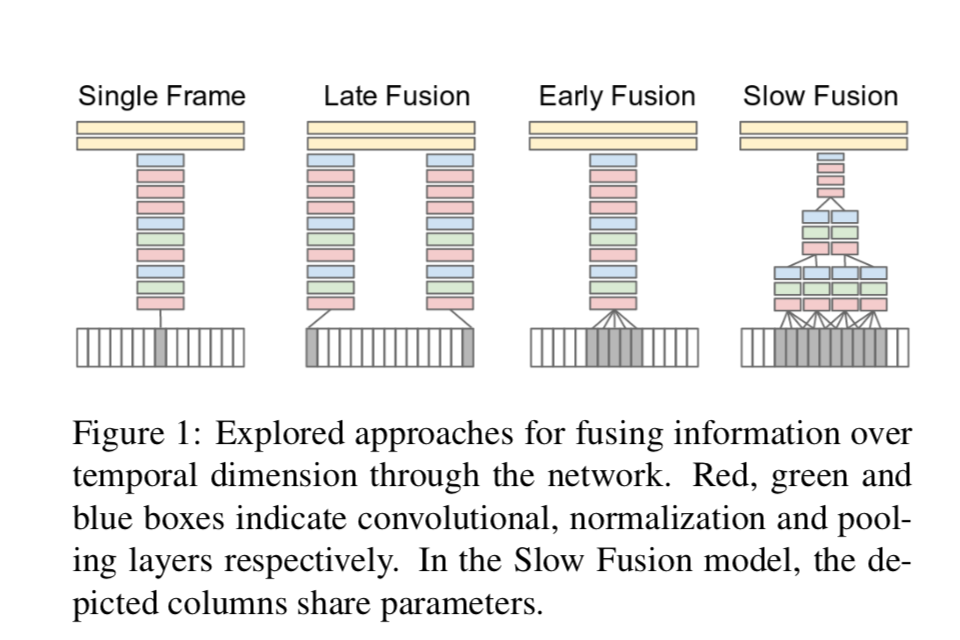
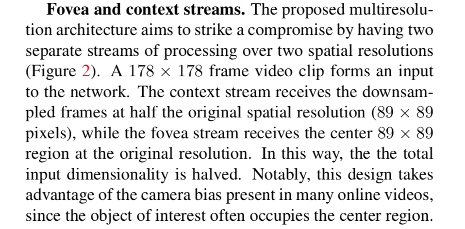
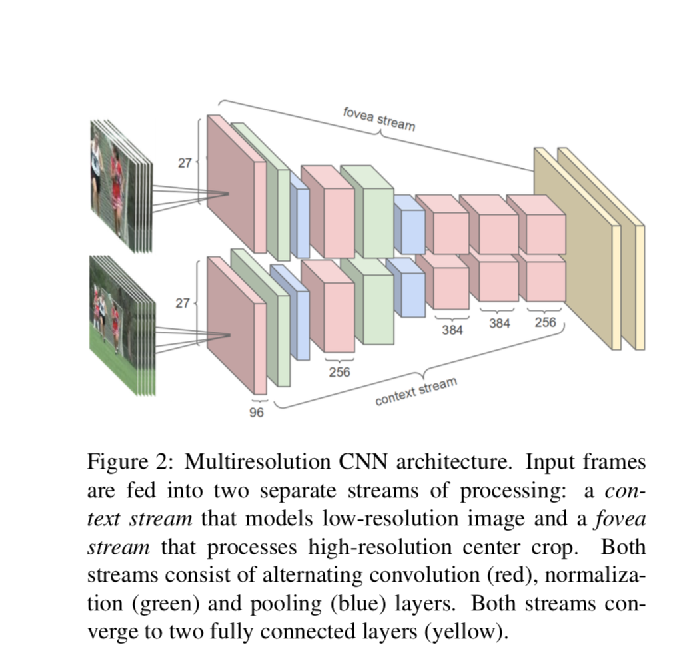
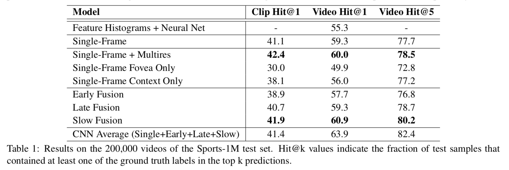
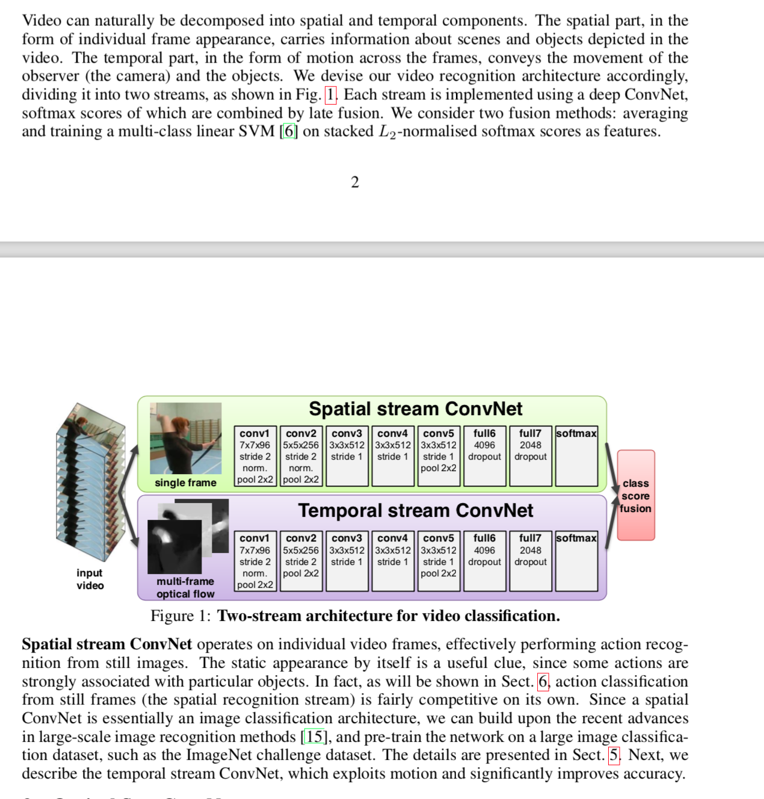
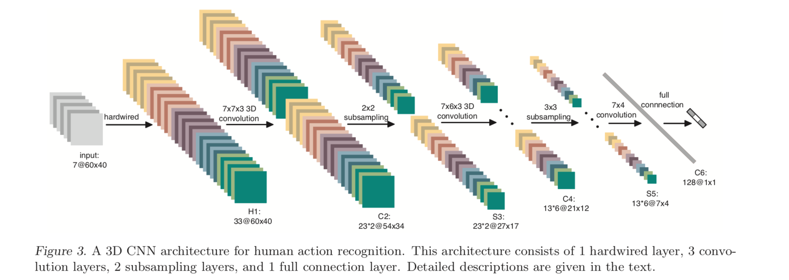

# 视频处理综述

## 概述
近年来，短视频发展迅速，每分钟都有大量的视频产生，而且短视频的拍摄和分享技术也越来越成熟，因此视频的理解、分类、推荐、搜索等应用也变得非常重要。目前，在计算机视觉领域，图像的理解和分类在ImageNet数据集上达到了3.57%的top-5error，已经优于人类的水平。相对图片而已，视频除了作为图像帧的集合，还蕴含了复杂的时序信息，也为视频的理解变得非常困难。

经过几年的发展，视频处理有以下几种解决方案：

方案一：2014年，Karparthy等人提出用CNN网络提取固定大小的图像帧特征，然后将它们简单的叠加，从而得到整个视频的特征，见[1]
方案二：2014年，Simonyan等人用双流的方式对上诉方法做了优化，见[2]
方案三：2016年/2017年，Yu-Gang Jiang和Wangjiang Zhu两个团队否使用了LSTM+CNN的方式对视频(图片帧流)进行分析，见[3, 4]
方案四：2017年，C3D(2013)、P3D(2017)、I3D(2017)等算法对视频进行分析 [5, 6, 7]

## 方案一
参考论文： Large-scale Video Classification with Convolutional Neural Networks.

数据集UCF101，后来又用了youTube的视频做视频分类，分为487类。用的模型是ImageNet2012年的CNN模型。

论文对比了首帧、收尾帧、中间部分帧等方式对视频帧进行分类，并进行结果对比，如下图：

另外提出了Multiresolution CNN方案

部分结果：

## 方案二

参考文献：Two-Stream Convolutional Networks for Action Recognition in Videos.

将时域和空域简单结合

## 方案三

参考论文：Exploiting Feature and Class Relationships in Video Categorization with RegularizedDeep Neural Networks 和 A key volume mining deep framework for action recognition.

Exploiting Feature and Class Relationships in Video Categorization with RegularizedDeep Neural Networks的模型：

## 方案四
参考论文：Learning Spatio-Temporal Representation with Pseudo-3D Residual Networks. P3D

* 普通的C3D模型做法：给定一个c*l*h*w大小的视频片段，其中c，l，h，w分别表示通道数，帧数，帧的高度以及宽度，提取视频特征最自然的方式就是利用3D卷积，如13年的模型，

* P3D：是一种假的3D模型，其实是空间信息建模过程中，同时提取帧与帧之间的时序信息。 简单起见，我们可以将3D卷积核描述成d* k *k, 这里的d表示卷积核的时序长度，而k表示卷积核的空间大小。因此，假设我们有一个3*3*3的卷积核，它可以很自然地被分解成空间域1*3*3的2维卷积核以及时间域上3*1*1的1维卷积核。 这样将三维卷积分解的方式可以在很大程度上降低模型的大小，同时可以利用在ImageNet上预训练过的模型参数做初始化。

## 参考文献
1. [Karpathy. Large-scale Video Classification with Convolutional Neural Networks](https://www.cv-foundation.org/openaccess/content_cvpr_2014/papers/Karpathy_Large-scale_Video_Classification_2014_CVPR_paper.pdf)
2. [Simonyan. Two-Stream Convolutional Networks for Action Recognition in Videos](https://www.robots.ox.ac.uk/~vgg/publications/2014/Simonyan14b/simonyan14b.pdf)
3. [Yu-Gang Jiang. Exploiting Feature and Class Relationships
in Video Categorization with Regularized
Deep Neural Networks](https://arxiv.org/pdf/1502.07209.pdf)
4. [Wangjiang Zhu. A key volume mining deep framework for action recognition](https://www.cv-foundation.org/openaccess/content_cvpr_2016/papers/Zhu_A_Key_Volume_CVPR_2016_paper.pdf) 
5. [Shuiwang Ji. 3D convolutional neural networks for human action recognition](http://citeseerx.ist.psu.edu/viewdoc/download?doi=10.1.1.442.8617&rep=rep1&type=pdf)
6. [Zhaofan Qiu Learning Spatio-Temporal Representation with Pseudo-3D Residual Networks](https://arxiv.org/pdf/1711.10305.pdf)
7. [Joao Carreira. Quo Vadis, Action Recognition? A New Model and the Kinetics Dataset](https://arxiv.org/abs/1705.07750)

## 源码和模型

1. [P3D源码，内含模型](https://github.com/ZhaofanQiu/pseudo-3d-residual-networks)
