# 计算机视觉综述

本文主要介绍深度学习在计算机视觉的前沿进展

## 引言
在今年的神经网络顶级会议NIPS2016上，深度学习三大牛之一的Yann Lecun教授给出了一个关于机器学习中的有监督学习、无监督学习和增强学习的一个有趣的比喻，他说：如果把智能（Intelligence）比作一个蛋糕，那么无监督学习就是蛋糕本体，增强学习是蛋糕上的樱桃，那么监督学习，仅仅能算作蛋糕上的糖霜（图1）。

## 1. 深度有监督学习在计算机视觉领域的进展
### 1.1 图像分类 Image Classification
自从Alex和他的导师Hinton（深度学习鼻祖）在2012年的ImageNet大规模图像识别竞赛（ILSVRC2012）中以超过第二名10个百分点的成绩(83.6%的Top5精度)碾压第二名（74.2%，使用传统的计算机视觉方法）后，深度学习真正开始火热，卷积神经网络（CNN）开始成为家喻户晓的名字，从12年的AlexNet（83.6%），到2013年ImageNet 大规模图像识别竞赛冠军的88.8%，再到2014年VGG的92.7%和同年的GoogLeNet的93.3%，终于，到了2015年，在1000类的图像识别中，微软提出的残差网（ResNet）以96.43%的Top5正确率，达到了超过人类的水平（人类的正确率也只有94.9%）. 
Top5精度是指在给出一张图片，模型给出5个最有可能的标签，只要在预测的5个结果中包含正确标签，即为正确

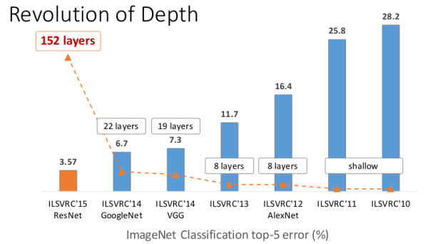

### 1.2 图像检测 Image Dection
伴随着图像分类任务，还有另外一个更加有挑战的任务–图像检测，图像检测是指在分类图像的同时把物体用矩形框给圈起来。从14年到16年，先后涌现出R-CNN,Fast R-CNN, Faster R-CNN, YOLO, SSD等知名框架，其检测平均精度（mAP），在计算机视觉一个知名数据集上PASCAL VOC上的检测平均精度（mAP），也从R-CNN的53.3%，到Fast RCNN的68.4%，再到Faster R-CNN的75.9%，最新实验显示，Faster RCNN结合残差网（Resnet-101），其检测精度可以达到83.8%。深度学习检测速度也越来越快，从最初的RCNN模型，处理一张图片要用2秒多，到Faster RCNN的198毫秒/张，再到YOLO的155帧/秒（其缺陷是精度较低，只有52.7%），最后出来了精度和速度都较高的SSD，精度75.1%，速度23帧/秒。 

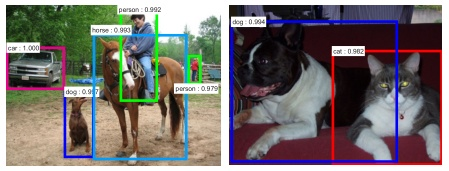

### 1.3 图像分割 Semantic Segmentation
图像分割也是一项有意思的研究领域，它的目的是把图像中各种不同物体给用不同颜色分割出来，如下图所示，其平均精度（mIoU，即预测区域和实际区域交集除以预测区域和实际区域的并集），也从最开始的FCN模型（图像语义分割全连接网络，该论文获得计算机视觉顶会CVPR2015的最佳论文荣誉奖）的62.2%，到DeepLab框架的72.7%，再到牛津大学的CRF as RNN的74.7%。该领域是一个仍在进展的领域，仍旧有很大的进步空间。 

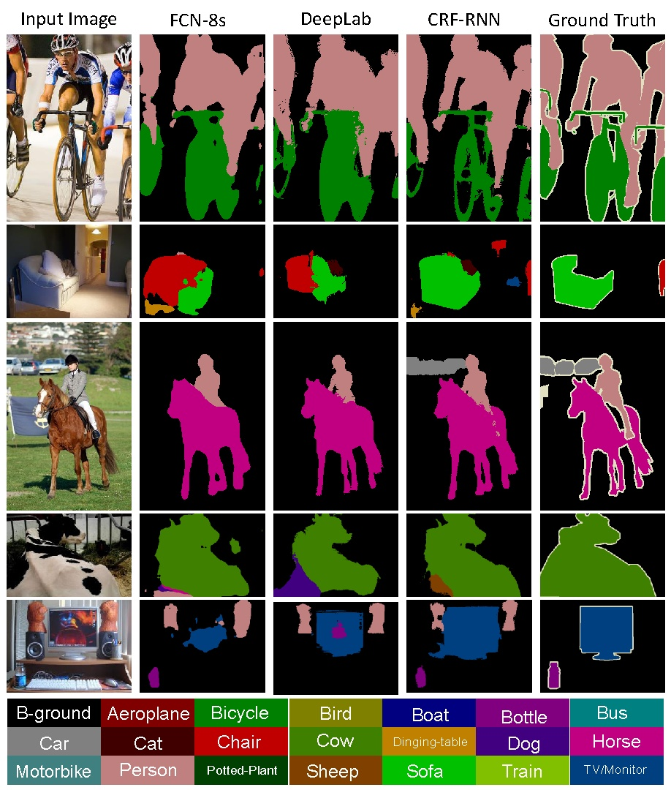

### 1.4 看图说话 Image Captioning
图像标注是一项引人注目的研究领域，它的研究目的是给出一张图片，你给我用一段文字描述它，如图中所示，图片中第一个图，程序自动给出的描述是“一个人在尘土飞扬的土路上骑摩托车”，第二个图片是“两只狗在草地上玩耍”。由于该研究巨大的商业价值（例如图片搜索），近几年，工业界的百度，谷歌和微软 以及学术界的加大伯克利，深度学习研究重地多伦多大学都在做相应的研究。

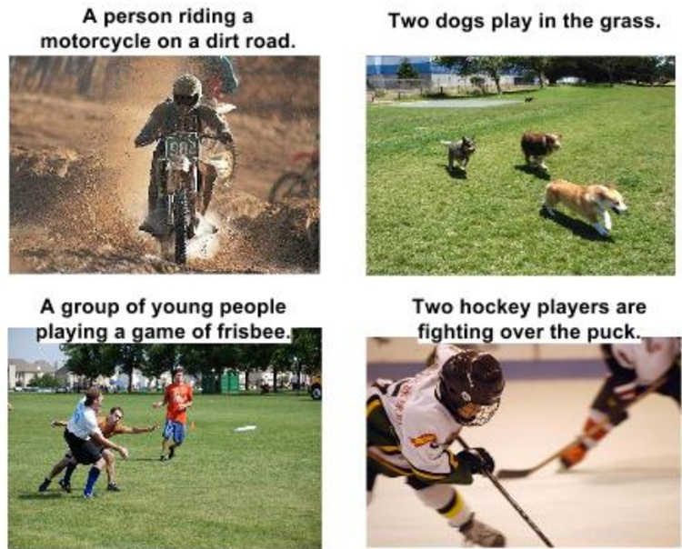

### 1.5 图像生成-文字转图像 Image Generator
图片标注任务本来是一个半圆，既然我们可以从图片产生描述文字，那么我们也能从文字来生成图片。如图6所示，第一列“一架大客机在蓝天飞翔”，模型自动根据文字生成了16张图片，第三列比较有意思，“一群大象在干燥草地行走”（这个有点违背常识，因为大象一般在雨林，不会在干燥草地上行走），模型也相应的生成了对应图片，虽然生成的质量还不算太好，但也已经中规中矩。

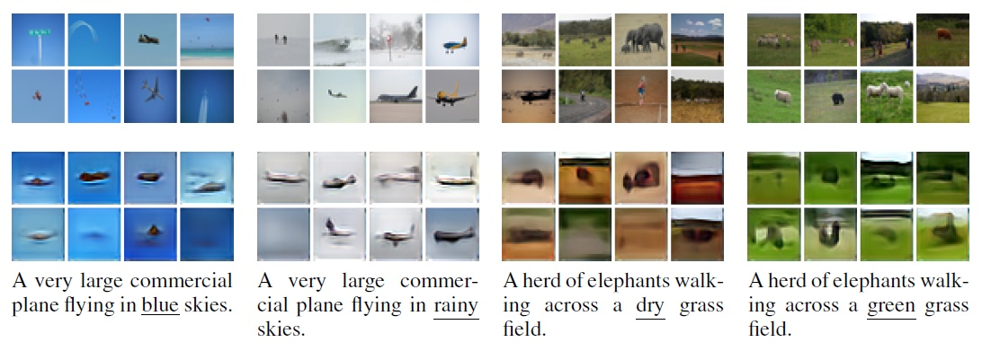

## 2. 强化学习 Reinforcement Learning
在监督学习任务中，我们都是给定样本一个固定标签，然后去训练模型，可是，在真实环境中，我们很难给出所有样本的标签，这时候，强化学习就派上了用场。简单来说，我们给定一些奖励或惩罚，强化学习就是让模型自己去试错，模型自己去优化怎么才能得到更多的分数。2016年大火的AlphaGo就是利用了强化学习去训练，它在不断的自我试错和博弈中掌握了最优的策略。利用强化学习去玩flyppy bird，已经能够玩到几万分了。 

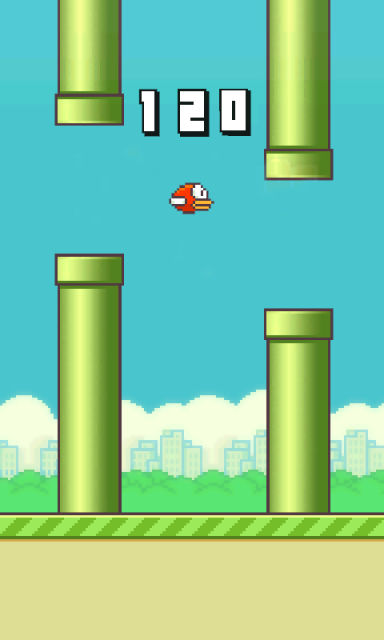

谷歌DeepMind发表的使用增强学习来玩Atari游戏，其中一个经典的游戏是打砖块（breakout），DeepMind提出的模型仅仅使用像素作为输入，没有任何其他先验知识，换句话说，模型并不认识球是什么，它玩的是什么，令人惊讶的是，在经过240分钟的训练后，它不光学会了正确的接球，击打砖块，它甚至学会了持续击打同一个位置，游戏就胜利的越快（它的奖励也越高）。视频链接:Youtbe(需翻墙),优酷

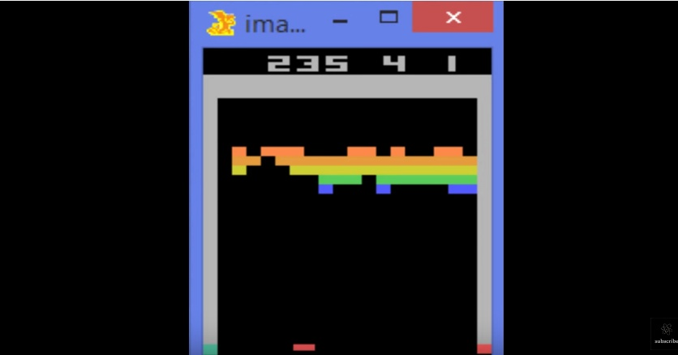

强化学习在机器人领域和自动驾驶领域有极大的应用价值，当前arxiv上基本上每隔几天就会有相应的论文出现。机器人去学习试错来学习最优的表现，这或许是人工智能进化的最优途径，估计也是通向强人工智能的必经之路。

## 3. 深度无监督学习-预测学习 Deep Unsupervised Learning
相比有限的监督学习数据，自然界有无穷无尽的未标注数据。试想，如果人工智能可以从庞大的自然界自动去学习，那岂不是开启了一个新纪元？当前，最有前景的研究领域或许应属无监督学习，这也正是Yann Lecun教授把无监督学习比喻成人工智能大蛋糕的原因吧。
深度学习牛人Ian Goodfellow在2014年提出生成对抗网络后，该领域越来越火，成为16年研究最火热的一个领域之一。大牛Yann LeCun曾说：“对抗网络是切片面包发明以来最令人激动的事情。”大牛这句话足以说明生成对抗网络有多重要。 
生成对抗网络的一个简单解释如下：假设有两个模型，一个是生成模型（Generative Model，下文简写为G），一个是判别模型（Discriminative Model，下文简写为D），判别模型(D)的任务就是判断一个实例是真实的还是由模型生成的，生成模型(G)的任务是生成一个实例来骗过判别模型（D），两个模型互相对抗，发展下去就会达到一个平衡，生成模型生成的实例与真实的没有区别，判别模型无法区分自然的还是模型生成的。以赝品商人为例，赝品商人（生成模型）制作出假的毕加索画作来欺骗行家（判别模型D），赝品商人一直提升他的高仿水平来区分行家，行家也一直学习真的假的毕加索画作来提升自己的辨识能力，两个人一直博弈，最后赝品商人高仿的毕加索画作达到了以假乱真的水平，行家最后也很难区分正品和赝品了。下图是Goodfellow在发表生成对抗网络论文中的一些生成图片，可以看出，模型生成的模型与真实的还是有大差别，但这是14年的论文了，16年这个领域进展非常快，相继出现了条件生成对抗网络（Conditional Generative Adversarial Nets）和信息生成对抗网络（InfoGAN），深度卷积生成对抗网络（Deep Convolutional Generative Adversarial Network, DCGAN），更重要的是，当前生成对抗网络把触角伸到了视频预测领域，众所周知，人类主要是靠视频序列来理解自然界的，图片只占非常小的一部分，当人工智能学会理解视频后，它也真正开始显现出威力了

这里推荐一篇2017年初Ian GoodFellow结合他在NIPS2016的演讲写出的综述性论文NIPS 2016 Tutorial: Generative Adversarial Networks
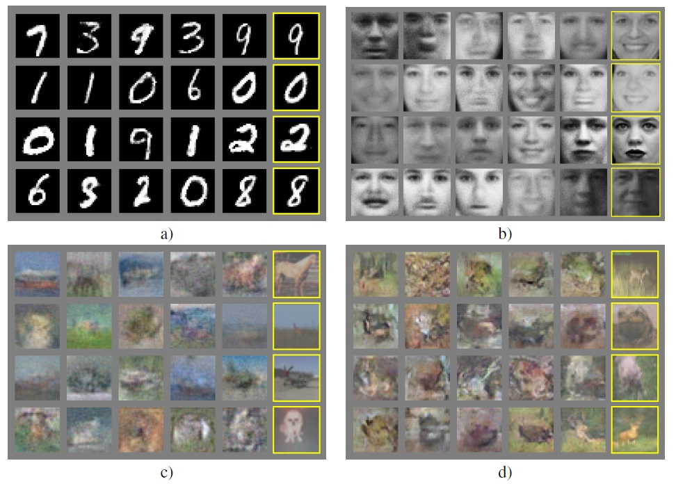

### 3.1条件生成对抗网络 Conditional Generative Adversarial Nets，CGAN
生成对抗网络一般是根据随机噪声来生成特定类型的图像等实例，条件生成对抗网络则是根据一定的输入来限定输出，例如根据几个描述名词来生成特定的实例，这有点类似1.5节介绍的由文字生成图像，下图是Conditioanal Generative Adversarial Nets论文中的一张图片，根据特定的名词描述来生成图片。（注意：左边的一列图片的描述文字是训练集中不存在的，也就是说是模型根据没有见过的描述来生成的图片，右边的一列图片的描述是训练集中存在的）

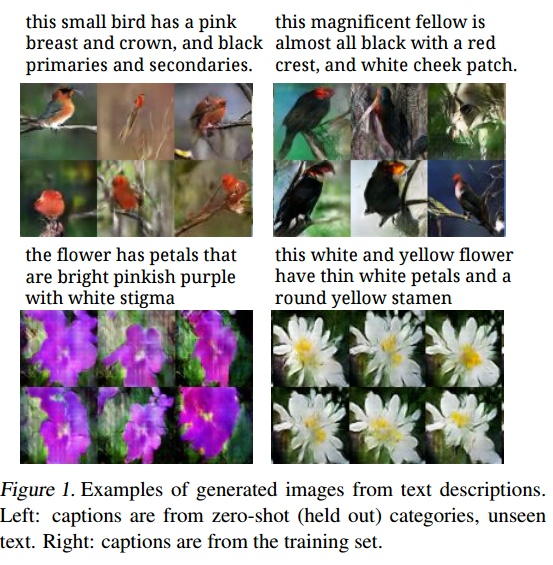

条件生成对抗网络的另一篇有意思的论文是图像到图像的翻译，该论文提出的模型能够根据一张输入图片，然后给出模型生成的图片，下图是论文中的一张图，其中左上角第一对非常有意思，模型输入图像分割的结果，给出了生成的真实场景的结果，这类似于图像分割的反向工程。 
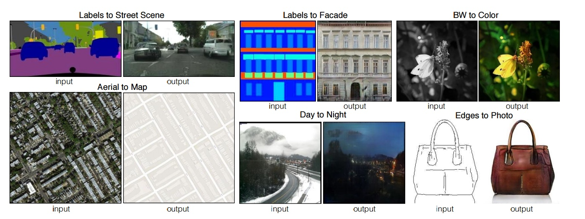

生成对抗网络也用在了图像超分辨率上，2016年有人提出SRGAN模型，它把原高清图下采样后，试图用生成对抗网络模型来还原图片来生成更为自然的，更逼近原图像的图像。下图中最右边是原图，把他降采样后采用三次差值（Bicubic Interpolation）得到的图像比较模糊，采用残差网络的版本（SRResNet）已经干净了很多，我们可以看到SRGAN生成的图片更为真实一些。
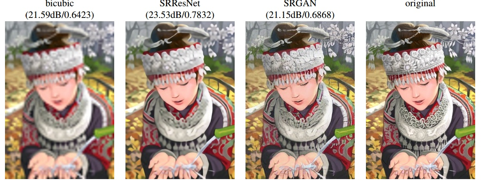

生成对抗网络的另一篇有影响力的论文是深度卷积生成对抗网络DCGAN,作者把卷积神经网络和生成对抗网络结合起来，作者指出该框架可以很好的学习事物的特征，论文在图像生成和图像操作上给出了很有意思的结果，例如图13，带眼睛的男人-不戴眼镜的男人+不带眼睛的女人=带眼睛的女人,该模型给出了图片的类似向量化操作。 
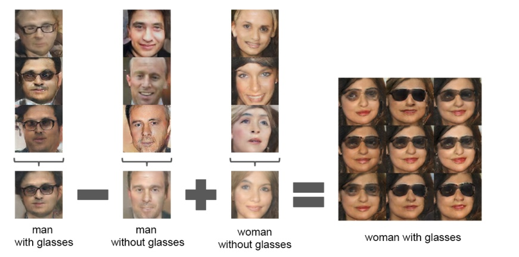

生成对抗网络的发展是在是太火爆，一篇文章难以罗列完全，对此感兴趣的朋友们可以自己在网络搜素相关论文来研究
openAI的一篇描述生成对抗网络的博客非常棒，因为Ian Goodfellow就在OpenAI工作，所以这篇博客的质量还是相当有保障的。链接为：[Open AI 生成对抗网络博客](https://openai.com/blog/generative-models/)

### 3.2 视频预测
“用预测学习来替代无监督学习”,预测学习通过观察和理解这个世界是如何运作的，然后对世界的变化做出预测，机器学会了感知世界的变化，然后对世界的状态进行了推断。 
2017年的NIPS上，MIT的学者Vondrick等人发表了一篇名为Generating Videos with Scene Dynamics的论文,该论文提出了基于一幅静态的图片，模型自动推测接下来的场景，例如给出一张人站在沙滩的图片，模型自动给出一段接下来的海浪涌动的小视频。该模型是以无监督的方式，在大量的视频上训练而来的。该模型表明它可以自动学习到视频中有用的特征。下图是作者的官方主页上给出的图，是动态图，如果无法正常查看，请转入官方网站
视频生成例子，下图的视频是模型自动生成的，我们可以看到图片不太完美，但已经能相当好的表示一个场景了。 详见[Generating Videos with Scene Dynamics](http://www.cs.columbia.edu/~vondrick/tinyvideo/)

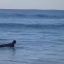
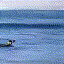

MIT的CSAIL实验室也放出了一篇博客，题目是《教会机器去预测未来》,该模型在youtube视频和电视剧上（例如The Office和《绝望主妇》）训练，训练好以后，如果你给该模型一个亲吻之前的图片，该模型能自动推测出加下来拥抱亲吻的动作，具体的例子见下图。 
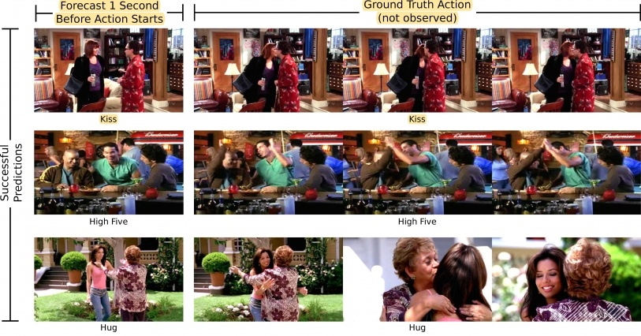

哈佛大学的Lotter等人提出了PredNet，该模型也是在KITTI数据集上训练,然后该模型就可以根据前面的视频，预测行车记录仪接下来几帧的图像，模型是用长短期记忆神经网络（LSTM）训练得到的。具体例子见下图,给出行车记录仪前几张的图片，自动预测接下来的五帧场景，模型输入几帧图像后，预测接下来的5帧，由图可知，越往后，模型预测的越是模糊,但模型已经可以给出有参加价值的预测结果了。图片是动图，如果无法正常查看，请访问论文作者的博客
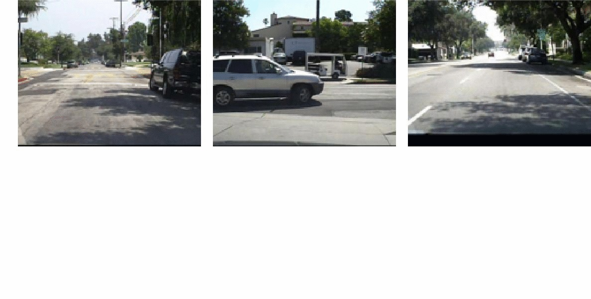

## 总结
生成对抗网络，无监督学习视频预测的论文实在是太多，本人精力实在有限，对此感兴趣的读者可以每天刷一下arxiv的计算机视觉版块的计算机视觉和模型识别，神经网络和进化计算和人工智能等相应版块，基本上每天都有这方面新论文出现。图像检测和分割，增强学习，生成对抗网络，预测学习都是人工智能发展火热的方向，希望对深度学习感兴趣的我们在这方面能做出来点成果。

## 参考文献

* [深度学习在计算机视觉领域的前沿进展](https://zhuanlan.zhihu.com/p/24699780)
* 图像分类，超过人类的计算机识别水平。[Delving Deep into Rectifiers: Surpassing Human-Level Performance on ImageNet Classification](https://arxiv.org/abs/1502.01852)
* 图像检测 [Faster R-CNN: Towards Real-Time Object Detection with Region Proposal Networks](https://arxiv.org/abs/1506.01497)
* 图像分割 [Conditional Random Fields as Recurrent Neural Networks](http://www.robots.ox.ac.uk/~szheng/CRFasRNN.html)
* 图像标注，看图说话 [Show and Tell: A Neural Image Caption Generator](https://arxiv.org/abs/1411.4555)
* 文字生成图像 [Generative Adversarial Text to Image Synthesis](https://arxiv.org/abs/1605.05396)
* 强化学习玩[flyppy bird Using Deep Q-Network to Learn How To Play Flappy Bird](https://github.com/yenchenlin/DeepLearningFlappyBird)
* 强化学习玩Atari游戏 [Playing Atari with Deep Reinforcement Learning](https://arxiv.org/abs/1312.5602)
* 生成对抗网络 [Generative Adversarial Networks](https://arxiv.org/abs/1406.2661)
* 条件生成对抗网络[Conditional Generative Adversarial Nets](https://arxiv.org/abs/1411.1784)
* 生成对抗网络做图像超分辨率[Photo-Realistic Single Image Super-Resolution Using a Generative Adversarial Network](https://arxiv.org/abs/1609.04802)
* 深度卷积生成对抗网络 [Unsupervised Representation Learning with Deep Convolutional Generative Adversarial Networks](https://arxiv.org/abs/1511.06434)
* 由图片推演视频[Generating Videos with Scene Dynamics](http://www.cs.columbia.edu/~vondrick/tinyvideo/)
* 视频预测和无监督学习Deep [Predictive Coding Networks for Video Prediction and Unsupervised Learning](https://coxlab.github.io/prednet/)