# 文本分类之TextCNN

## 总览
如果你有使用deep learning做过图像方面的工作，比如图像分类、目标检测、分割等，一定都使用过ImageNet初始化你的CNN网络，然后做Fine-tune。这种使用预训练模型的方式，可以使得你的优化更好的进行。

那么，对于文本分类，我们能不能用CNN来做，用某种模型初始化，进而做fine-tune呢？答案是肯定的。下面我就从理论和实战的角度简单介绍一下用于文本分析的CNN—TextCNN。

## 模型一
先看一下这篇经典的文章[《Convolutional Neural Networks for Sentence Classification》](https://arxiv.org/abs/1408.5882)

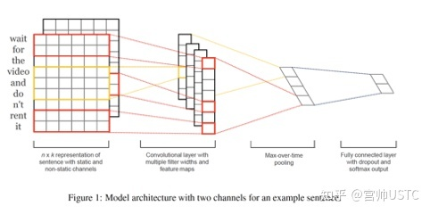

### Embedding layer
上图的输入是一个用预训练好的词向量（Word2Vector或者glove）方法得到的一个Embedding layer。每一个词向量都是通过无监督的方法训练得到的。词向量的维度是固定的，相对于原来的One-Hot编码要小，同时在新的词向量空间语义上相近或者语法相近的单词会更加接近。所以你可以看到这里的词向量有wait、for、the等，把这些词向量拼接起来就得到一个Embedding layer。两个维度，0轴是单词、1轴是词向量的维度（固定的）。当然实际的Embedding layer维度要比这里图像表示的大的多。至于细节，看后面代码。

到此，我们已经得到了一张二维的图（矩阵）了，利用我们用CNN处理图像的思想，后面就可以用卷积池化那一套CNN的套路来搞定了，实际上也确实这样，但是这里还有有些区别的，下面我们就看看有哪些不一样的地方。

### 卷积
相比于一般CNN中的卷积核，这里的卷积核的宽度一般需要跟词向量的维度一样，图上的维度是6 。卷积核的高度则是一个超参数可以设置，比如设置为2、3等如图。然后剩下的就是正常的卷积过程了。

### pooling
这里的池化操作是max-overtime-pooling，其实就是在对应的feature map求一个最大值。最后把得到的值做concate。

### 优化、正则化
池化层后面加上全连接层和SoftMax层做分类任务，同时防止过拟合，一般会添加L2和Dropout正则化方法。最后整体使用梯度法进行参数的更新模型的优化。

### 模型扩展
文章[《Convolutional Neural Networks for Sentence Classification》](https://arxiv.org/abs/1408.5882)中给出了几种模型其实这里基本都是针对Embedding layer做的变化。

#### CNN-rand
作为一个基础模型，Embedding layer所有words被随机初始化，然后模型整体进行训练。

#### CNN-static
模型使用预训练的word2vec初始化Embedding layer，对于那些在预训练的word2vec没有的单词，随机初始化。然后固定Embedding layer，fine-tune整个网络。

#### CNN-non-static
同（2），只是训练的时候，Embedding layer跟随整个网络一起训练。

#### CNN-multichannel
Embedding layer有两个channel，一个channel为static，一个为non-static。然后整个网络fine-tune时只有一个channel更新参数。两个channel都是使用预训练的word2vec初始化的。

### 实验和结论
这里作者在多种数据集上进行了实验。

#### 数据集

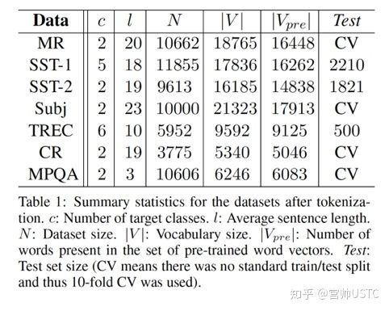

#### 结论

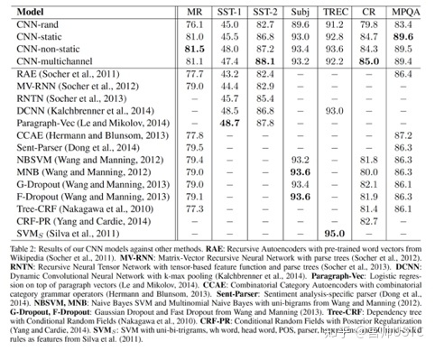

可以看出除了随机初始化Embedding layer的外，使用预训练的word2vec初始化的效果都更加好。非静态的比静态的效果好一些。总的来看，使用预训练的word2vec初始化的TextCNN，效果更好。另外文章也简单讨论了一下Multichannel vs. Single Channel Models、Static vs. Non-static Representations、Dropout等，不过这里不讨论了。因为另外一篇文章专门做了各种控制变量的实验对比。下面就看一下TextCNN经典的另外一篇文章。

## 模型二
下面简单看一下TextCNN相关的另外一篇经典论文：[《A Sensitivity Analysis of (and Practitioners’ Guide to) Convolutional Neural Networks for Sentence Classification》](https://arxiv.org/abs/1408.5882)

文章使用一层卷积层的TextCNN网络（和上一篇文章一样），通过改变自身的元素（卷积核大小、个数、池化方式、Embedding layer、正则化方式、优化器等），以及和Support Vector Machine (SVMs) 、 logistic regression两种baseline方法对比。

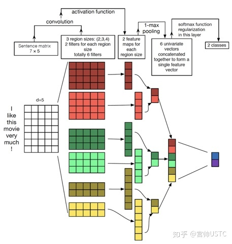

### 输入单词向量
使用不同预训练的单词向量初始化CNN。word2vec 、GloVe[6]、One-hot

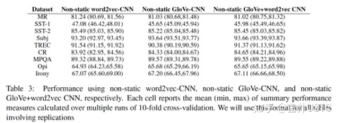

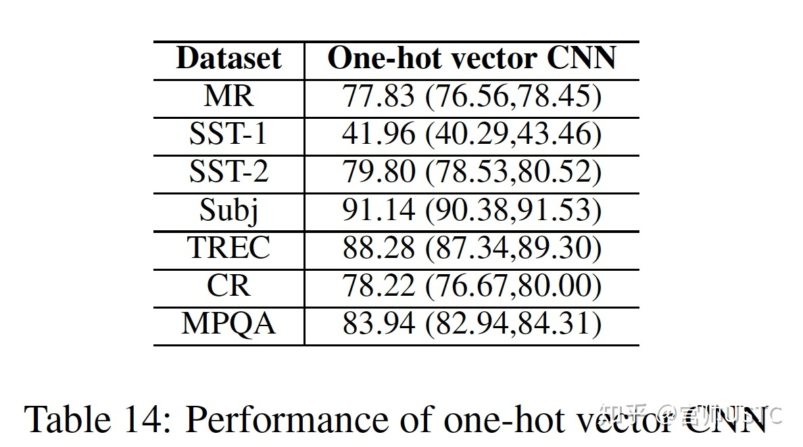

### 卷积核
#### 不同大小的卷积核
卷积核的大小，上面第一部分以及介绍。

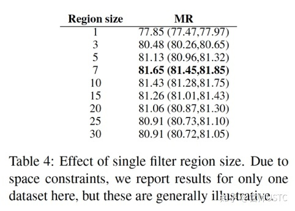

#### 同一种大小的卷积核，控制数量不同

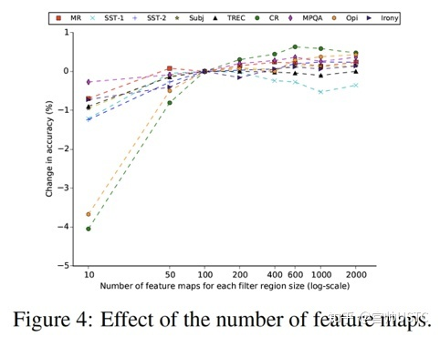

#### 保持feature map数量相同，结合多种大小的卷积核

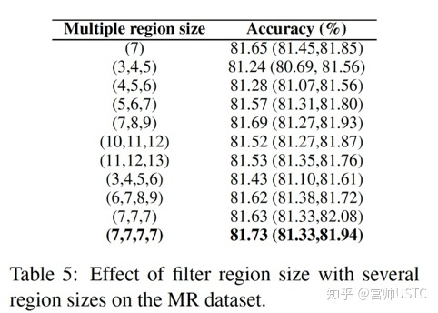

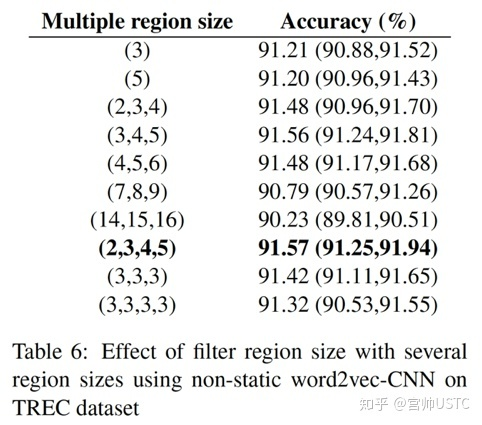

### 激活函数
ReLU、tanh、Sigmoid、SoftPlus、Cube function、tanh cube function

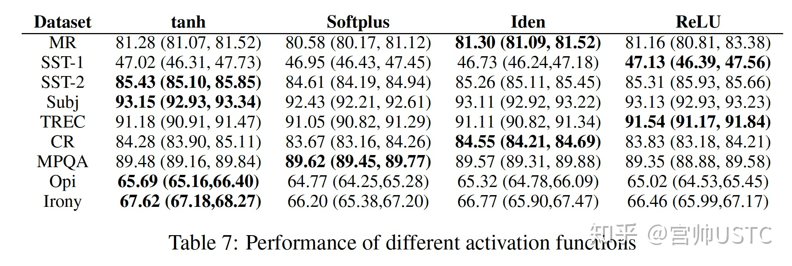

### 池化
k-max pooling

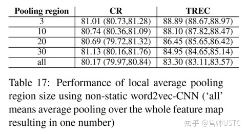

### 正则化
dropout 和 l2

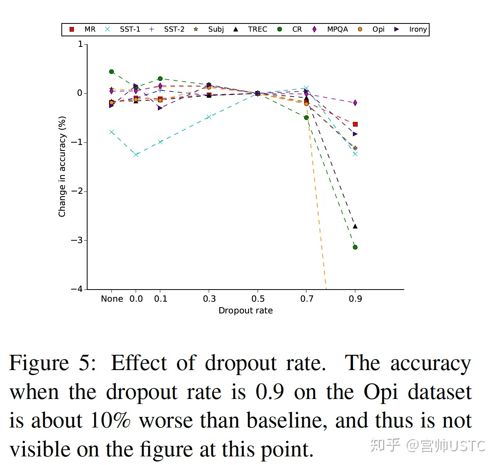
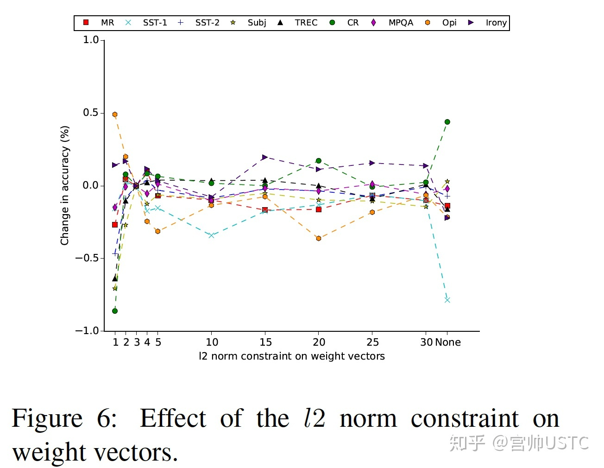
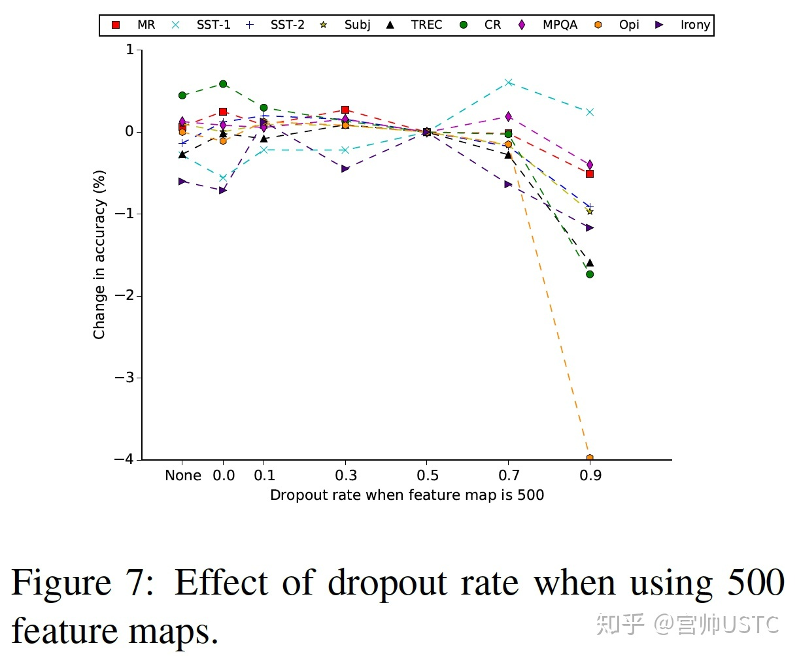
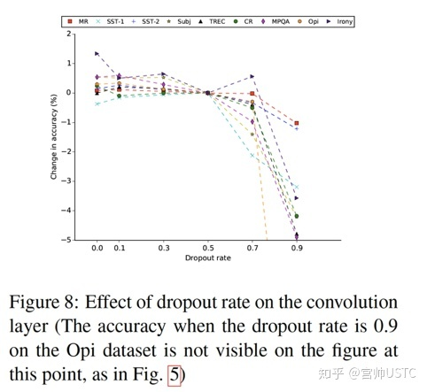

## 结论
（1）使用预训练的word2vec 、 GloVe初始化效果会更好。一般不直接使用One-hot。

（2）卷积核的大小影响较大，一般取1~10，对于句子较长的文本，则应选择大一些。

（3）卷积核的数量也有较大的影响，一般取100~600 ，同时一般使用Dropout（0~0.5）。

（4）激活函数一般选用ReLU 和 tanh。

（5）池化使用1-max pooling。

（6）随着feature map数量增加，性能减少时，试着尝试大于0.5的Dropout。

（7）评估模型性能时，记得使用交叉验证。

## 参考
1. [《Convolutional Neural Networks for Sentence Classification》](https://arxiv.org/abs/1408.5882)
2. [《A Sensitivity Analysis of (and Practitioners’ Guide to) Convolutional Neural Networks for Sentence Classification》](https://arxiv.org/abs/1408.5882)
3. http://www.52nlp.cn/tag/textcnn
4. https://zhuanlan.zhihu.com/p/40276005