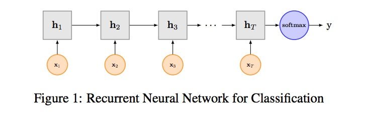
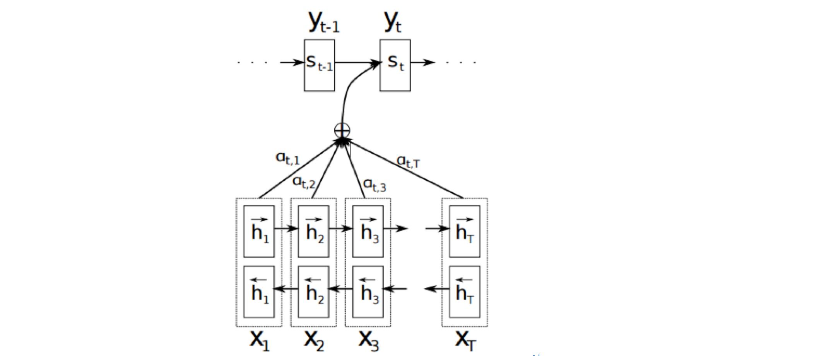
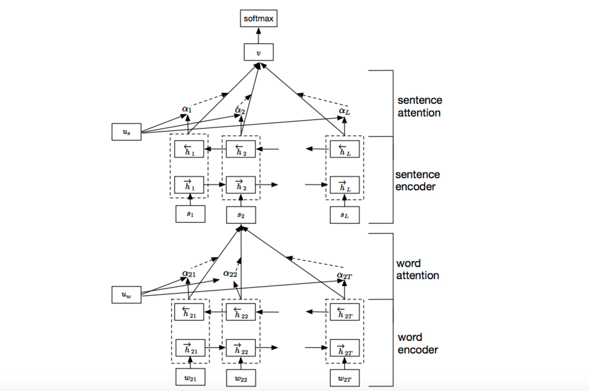
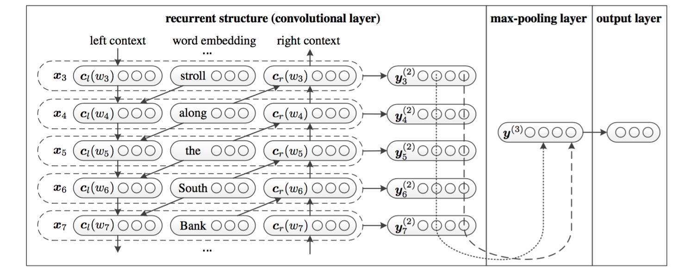
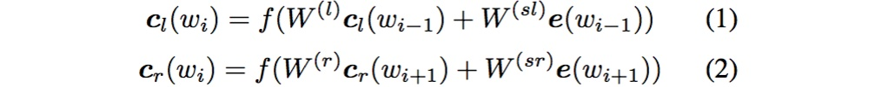
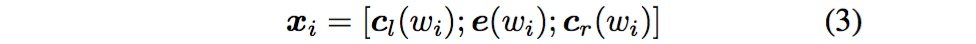

# 文本分类之TextRNN + Attention
尽管TextCNN能够在很多任务里面能有不错的表现，但CNN有个最大问题是固定 filter_size 的视野，一方面无法建模更长的序列信息，另一方面 filter_size 的超参调节也很繁琐。CNN本质是做文本的特征表达工作，而自然语言处理中更常用的是递归神经网络（RNN, Recurrent Neural Network），能够更好的表达上下文信息。具体在文本分类任务中，Bi-directional RNN（实际使用的是双向LSTM）从某种意义上可以理解为可以捕获变长且双向的的 "n-gram" 信息。

## TextRNN

RNN算是在自然语言处理领域非常一个标配网络了，在序列标注/命名体识别/seq2seq模型等很多场景都有应用，[Recurrent Neural Network for Text Classification with Multi-Task Learning](https://www.ijcai.org/Proceedings/16/Papers/408.pdf)文中介绍了RNN用于分类问题的设计，下图LSTM用于网络结构原理示意图，示例中的是利用最后一个词的结果直接接全连接层softmax输出了。

## TextRNN + Attention
CNN和RNN用在文本分类任务中尽管效果显著，但都有一个不足的地方就是不够直观，可解释性不好，特别是在分析badcase时候感受尤其深刻。而注意力（Attention）机制是自然语言处理领域一个常用的建模长时间记忆机制，能够很直观的给出每个词对结果的贡献，基本成了Seq2Seq模型的标配了。实际上文本分类从某种意义上也可以理解为一种特殊的Seq2Seq，所以考虑把Attention机制引入近来，研究了下学术界果然有类似做法。

### Attention
详细介绍Attention恐怕需要一小篇文章的篇幅，感兴趣的可参考14年这篇paper [NEURAL MACHINE TRANSLATION BY JOINTLY LEARNING TO ALIGN AND TRANSLATE](https://arxiv.org/pdf/1409.0473v7.pdf)。

以机器翻译为例简单介绍下，下图中 $x_{t}$ 是源语言的一个词，$y_{t}$ 是目标语言的一个词，机器翻译的任务就是给定源序列得到目标序列。翻译 $y_{t}$ 的过程产生取决于上一个词 $y_{t-1}$ 和源语言的词的表示 $h_{j}$（$x_{j}$ 的 bi-RNN 模型的表示），而每个词所占的权重是不一样的。比如源语言是中文 “我 / 是 / 中国人” 目标语言 “i / am / Chinese”，翻译出“Chinese”时候显然取决于“中国人”，而与“我 / 是”基本无关。下图公式, $\alpha _{ij}$ 则是翻译英文第 i 个词时，中文第 j 个词的贡献，也就是注意力。显然在翻译“Chinese”时，“中国人”的注意力值非常大。

Attention的核心point是在翻译每个目标词（或 预测商品标题文本所属类别）所用的上下文是不同的，这样的考虑显然是更合理的。

### TextRNN + Attention 模型
我们参考了这篇文章 [Hierarchical Attention Networks for Document Classification](https://www.cs.cmu.edu/~diyiy/docs/naacl16.pdf)，下图是模型的网络结构图，它一方面用层次化的结构保留了文档的结构，另一方面在word-level和sentence-level。淘宝标题场景只需要 word-level 这一层的 Attention 即可。

加入Attention之后最大的好处自然是能够直观的解释各个句子和词对分类类别的重要性。

## TextRCNN（TextRNN + CNN）
我们参考的是中科院15年发表在AAAI上的这篇文章 Recurrent Convolutional Neural Networks for Text Classification 的结构：

利用前向和后向RNN得到每个词的前向和后向上下文的表示：

这样词的表示就变成词向量和前向后向上下文向量concat起来的形式了，即：

最后再接跟TextCNN相同卷积层，pooling层即可，唯一不同的是卷积层 filter\_size = 1就可以了，不再需要更大 filter_size 获得更大视野，这里词的表示也可以只用双向RNN输出。
