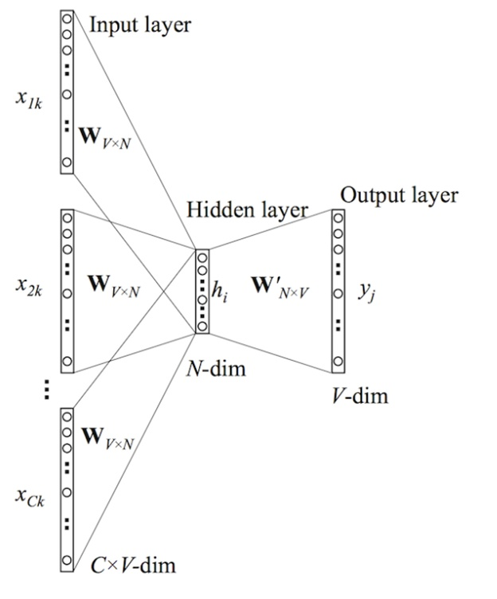
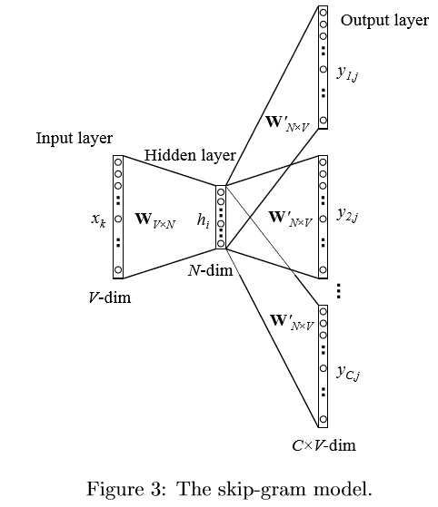
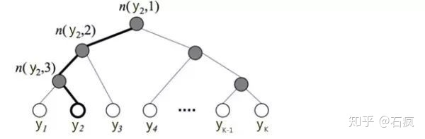
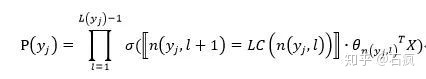
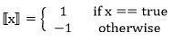
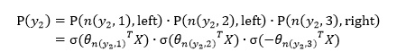
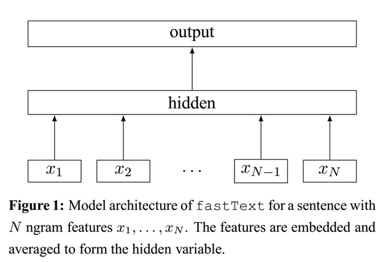

# 文本分类之Word2Vec、FastText
文章介绍了两种基本模型：CBOW和Skip-Gram模型的原理和求导的细节，之后介绍了优化模型的方法：分层softmax和负采样技术。是理解word2vec的非常好的资料。

## 连续词袋模型(CBOW)
CBOW模型的基本思路是：用上下文预测目标词汇。架构图如下所示：

输入层由目标词汇y的上下文单词 $\left\{ x_{1},...,x_{c} \right\}$ 组成， $x_{i}$ 是被onehot编码过的V维向量，其中V是词汇量；隐含层是N维向量h；输出层是被onehot编码过的目标词y。输入向量通过 $V*N$ 维的权重矩阵W连接到隐含层；隐含层通过 $N*V$ 维的权重矩阵 $W'$ 连接到输出层。因为词库V往往非常大，使用标准的softmax计算相当耗时，于是CBOW的输出层采用的正是上文提到过的分层Softmax。

## Skip-Gram Model
Skip-gram模型是由Mikolov等人提出的。下图展示了skip-gram模型的过程。该模型可以看做是CBOW模型的逆过程。CBOW模型的目标单词在该模型中作为输入，上下文则作为输出。

## 模型的优化
以上我们讨论的模型（二元模型，CBOW和skip-gram）都是他们的原始形式，没有加入任何优化技巧。

对于这些模型，每个单词存在两类向量表达：输入向量$v_{w}$，输出向量$v_{w}^{'}$（这也是为什么word2vec的名称由来：1个单词对应2个向量表示）。学习得到输入向量比较简单；但要学习输出向量是很困难的。为了更新$v_{w}^{'}$，在每次训练中，我们必须遍历词汇表中的每个单词$w_{j}^{}$，从而计算得到 $u_{j}^{}$，预测概率$y_{j}^{}$（skip-gram为$y_{c,j}^{}$，它们的预测误差$e_{j}^{}$，（skip-gram为$EI_{j}^{}）$，然后再用误测误差来更新输出向量$v_{j}^{'}$。

对每个训练过程做如此庞大的计算是非常昂贵的，使得它难以扩展到词汇表或者训练样本很大的任务中去。为了解决这个问题，我们直观的想法就是限制每次必须更新的输出向量的数量。一种有效的手段就是采用分层softmax；另一种可行的方法是通过负采样。这两种技巧都只针对输出向量更新的优化。在我们的推导过程中，我们关心三种值：（1）E，新的目标函数；（2）$ \partial E/\partial v_{w}^{'}$ ，新的输出向量的更新公式；（3）$\partial E/\partial h_{}^{}$，反向传播中用于更新输入向量的预测误差的加权和。

### 分层softmax 构造huffman树
标准的Softmax回归中，要计算y=j时的Softmax概率：，我们需要对所有的K个概率做归一化，这在|y|很大时非常耗时。于是，分层Softmax诞生了，它的基本思想是使用树的层级结构替代扁平化的标准Softmax，使得在计算时，只需计算一条路径上的所有节点的概率值，无需在意其它的节点。下图是一个分层Softmax示例：

树的结构是根据类标的频数构造的霍夫曼树。K个不同的类标组成所有的叶子节点，K-1个内部节点作为内部参数，从根节点到某个叶子节点经过的节点和边形成一条路径，路径长度被表示为。于是，就可以被写成：

其中：
$\sigma(·)$ 表示sigmoid函数；
$LC(n)$ 表示n节点的左孩子；
$x$ 是一个特殊的函数，被定义为：

$\theta_{n(y_{j},l)}$ 是中间节点 $n(y_{j},l)$ 的参数；

X是Softmax层的输入

上图中，高亮的节点和边是从根节点到 $y_{2}$ 的路径，路径长度 $L(y_{2})=4,P(y_{2})$ 可以被表示为：

于是，从根节点走到叶子节点 y_{2} ，实际上是在做了3次二分类的逻辑回归。通过分层的Softmax，计算复杂度一下从|K|降低到log|K|。

缺点：使用霍夫曼树来代替传统的神经网络，可以提高模型训练的效率。但是如果我们的训练样本里的中心词w是一个很生僻的词，那么就得在霍夫曼树中辛苦的向下走很久了。

### 负采样技术
既然名字叫Negative Sampling（负采样），那么肯定使用了采样的方法。采样的方法有很多种，比如大名鼎鼎的MCMC。我们这里的Negative Sampling采样方法并没有MCMC那么复杂。比如我们有一个训练样本，中心词是w,它周围上下文共有2c个词，记为context(w)。由于这个中心词w,的确和context(w)相关存在，因此它是一个真实的正例。通过Negative Sampling采样，我们得到neg个和w不同的中心词wi,i=1,2,..neg，这样context(w)和wi就组成了neg个并不真实存在的负例。利用这一个正例和neg个负例，我们进行二元逻辑回归，得到负采样对应每个词wi对应的模型参数θi，和每个词的词向量。

从上面的描述可以看出，Negative Sampling由于没有采用霍夫曼树，每次只是通过采样neg个不同的中心词做负例，就可以训练模型，因此整个过程要比Hierarchical Softmax简单。不过有两个问题还需要弄明白：1）如果通过一个正例和neg个负例进行二元逻辑回归呢？ 2） 如何进行负采样呢？

#### 二元逻辑回归
Negative Sampling也是采用了二元逻辑回归来求解模型参数，通过负采样，我们得到了neg个负例$(context(w),wi)i=1,2,..neg$。为了统一描述，我们将正例定义为$w0$。

在逻辑回归中，我们的正例应该期望满足：
$P(context(w_0), w_i) = \sigma(x_{w_0}^T\theta^{w_i}) ,y_i=1, i=0$
　　　　我们的负例期望满足：
$P(context(w_0), w_i) =1-  \sigma(x_{w_0}^T\theta^{w_i}), y_i = 0, i=1,2,..neg$

### 如何进行负采样
现在我们来看看如何进行负采样，得到neg个负例。word2vec采样的方法并不复杂，如果词汇表的大小为V,那么我们就将一段长度为1的线段分成V份，每份对应词汇表中的一个词。当然每个词对应的线段长度是不一样的，高频词对应的线段长，低频词对应的线段短。在采样前，我们将这段长度为1的线段划分成M等份，这里M>>V，这样可以保证每个词对应的线段都会划分成对应的小块。而M份中的每一份都会落在某一个词对应的线段上。在采样的时候，我们只需要从M个位置中采样出neg个位置就行，此时采样到的每一个位置对应到的线段所属的词就是我们的负例词。

在word2vec中，M取值默认为$10^8$。

## FastText
fasttext是Facebook于2016年开源的一个词向量计算和文本分类工具，在学术上并没有太大创新。但是它的优点也非常明显，在文本分类任务中，fastText（浅层网络）往往能取得和深度网络相媲美的精度，却在训练时间上比深度网络快许多数量级。

### n-gram特征
在文本特征提取中，常常能看到n-gram的身影。它是一种基于语言模型的算法，基本思想是将文本内容按照字节顺序进行大小为N的滑动窗口操作，最终形成长度为N的字节片段序列。看下面的例子：

我来到达观数据参观

相应的bigram特征为：我来 来到 到达 达观 观数 数据 据参 参观

相应的trigram特征为：我来到 来到达 到达观 达观数 观数据 数据参 据参观

注意一点：n-gram中的gram根据粒度不同，有不同的含义。它可以是字粒度，也可以是词粒度的。上面所举的例子属于字粒度的n-gram，词粒度的n-gram看下面例子：

我 来到 达观数据 参观

相应的bigram特征为：我/来到 来到/达观数据 达观数据/参观

相应的trigram特征为：我/来到/达观数据 来到/达观数据/参观

n-gram产生的特征只是作为文本特征的候选集，你后面可能会采用信息熵、卡方统计、IDF等文本特征选择方式筛选出比较重要特征。

### 字符级别的n-gram
word2vec把语料库中的每个单词当成原子的，它会为每个单词生成一个向量。这忽略了单词内部的形态特征，比如：“apple” 和“apples”，“达观数据”和“达观”，这两个例子中，两个单词都有较多公共字符，即它们的内部形态类似，但是在传统的word2vec中，这种单词内部形态信息因为它们被转换成不同的id丢失了。

为了克服这个问题，fastText使用了字符级别的n-grams来表示一个单词。对于单词“apple”，假设n的取值为3，则它的trigram有

“<ap”, “app”, “ppl”, “ple”, “le>”

其中，<表示前缀，>表示后缀。于是，我们可以用这些trigram来表示“apple”这个单词，进一步，我们可以用这5个trigram的向量叠加来表示“apple”的词向量。

这带来两点好处：

1. 对于低频词生成的词向量效果会更好。因为它们的n-gram可以和其它词共享。

2. 对于训练词库之外的单词，仍然可以构建它们的词向量。我们可以叠加它们的字符级n-gram向量。

### 模型结构
之前提到过，fastText模型架构和word2vec的CBOW模型架构非常相似。下面是fastText模型架构图：

注意：此架构图没有展示词向量的训练过程。可以看到，和CBOW一样，fastText模型也只有三层：输入层、隐含层、输出层（Hierarchical Softmax），输入都是多个经向量表示的单词，输出都是一个特定的target，隐含层都是对多个词向量的叠加平均。不同的是，CBOW的输入是目标单词的上下文，fastText的输入是多个单词及其n-gram特征，这些特征用来表示单个文档；CBOW的输入单词被onehot编码过，fastText的输入特征是被embedding过；CBOW的输出是目标词汇，fastText的输出是文档对应的类标。

值得注意的是，fastText在输入时，将单词的字符级别的n-gram向量作为额外的特征；在输出时，fastText采用了分层Softmax，大大降低了模型训练时间。这两个知识点在前文中已经讲过，这里不再赘述。

fastText相关公式的推导和CBOW非常类似，这里也不展开了。

### 核心思想
现在抛开那些不是很讨人喜欢的公式推导，来想一想fastText文本分类的核心思想是什么？

仔细观察模型的后半部分，即从隐含层输出到输出层输出，会发现它就是一个softmax线性多类别分类器，分类器的输入是一个用来表征当前文档的向量；模型的前半部分，即从输入层输入到隐含层输出部分，主要在做一件事情：生成用来表征文档的向量。那么它是如何做的呢？叠加构成这篇文档的所有词及n-gram的词向量，然后取平均。叠加词向量背后的思想就是传统的词袋法，即将文档看成一个由词构成的集合。

于是fastText的核心思想就是：将整篇文档的词及n-gram向量叠加平均得到文档向量，然后使用文档向量做softmax多分类。这中间涉及到两个技巧：字符级n-gram特征的引入以及分层Softmax分类。

## 参考文献
1. https://zhuanlan.zhihu.com/p/53425736
2. https://www.cnblogs.com/pinard/p/7249903.html
3. https://zhuanlan.zhihu.com/p/32965521