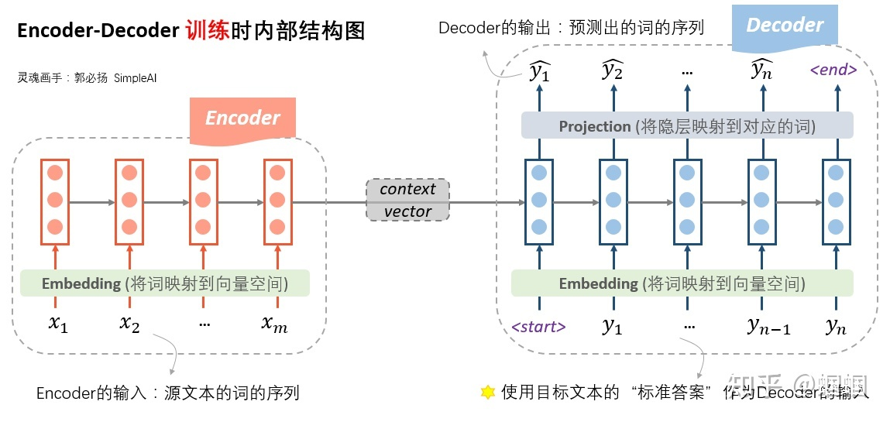
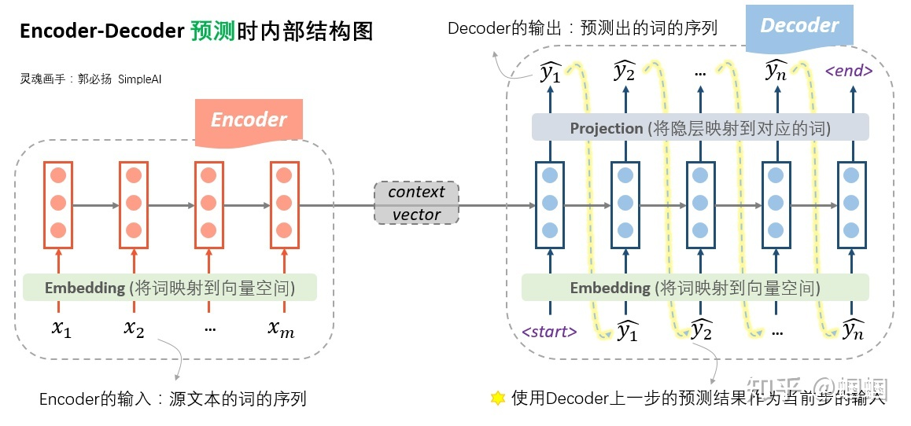
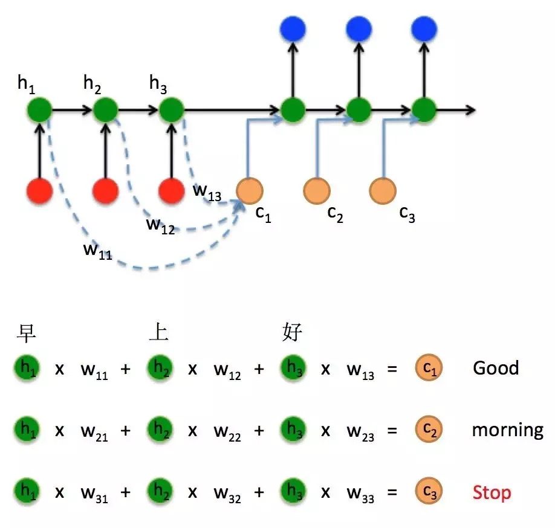
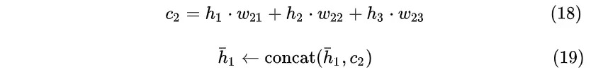
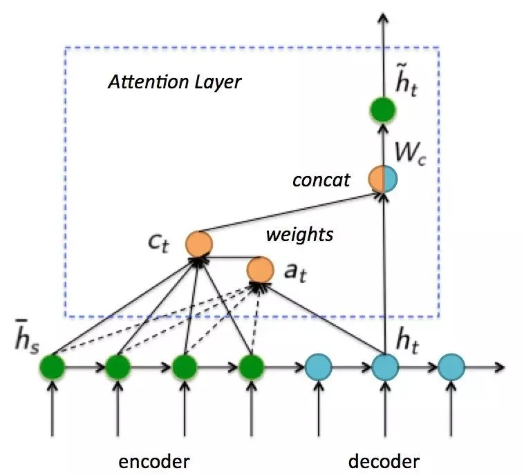

# 机器翻译和seq2seq

## seq2seq结构详解
我们把前面那张抽象图展开，可以看到内部的结构是这样的：

这张图，展示了在「训练时」，seq2seq内部的详细结构。

在Encoder端，我们将source文本的词序列先经过embedding层转化成向量，然后输入到一个RNN结构（可以是普通RNN，LSTM，GRU等等）中。另外，这里的RNN也可以是多层、双向的。经过了RNN的一系列计算，最终隐层的输入，就作为源文本整体的一个表示向量，称为「context vector」。

Decoder端的操作就稍微复杂一些了。首先，Decoder的输入是什么呢？Decoder的输入，训练和测试时是不一样的！ 「在训练时，我们使用真实的目标文本，即“标准答案”作为输入」（注意第一步使用一个特殊的<start>字符，表示句子的开头）。每一步根据当前正确的输出词、上一步的隐状态来预测下一步的输出词。

下图则展示了在「预测时」，seq2seq的内部结构：

预测时，Encoder端没什么变化，在Decoder端，由于此时没有所谓的“真实输出”或“标准答案”了，所以只能「自产自销：每一步的预测结果，都送给下一步作为输入」，直至输出<end>就结束。如果你对我之前写的笔记很熟悉的话，会发现，「这时的Decoder就是一个语言模型」。由于这个语言模型是根据context vector来进行文本的生成的，因此这种类型的语言模型，被称为“条件语言模型”：Conditional LM。正因为如此，在训练过程中，我们可以使用一些预训练好的语言模型来对Decoder的参数进行初始化，从而加快迭代过程。

## Seq2Seq 训练过程

Seq2Seq 模型主要分为两部分，左边有一个 Encoder 编码器，右边还有一个 Decoder 解码器。

Encoder 是 LSTM 或者其他 RNN 及其变体，用来从输入的法语句子中提取特征，Encoder 的输出是 LSTM 最后时刻的状态向量 h 和细胞状态 c ，其他时刻的输出都没有用到，所以图中没有显示。

Decoder 也是 LSTM 或者其他 RNN 及其变体，用来将法语翻译成英语，它和上篇文章中所讲到的文本生成原理基本相同，唯一不同的地方就是上篇文章中的文本生成的初始状态是全 0 向量，但是 Decoder 的初始状态是 Encoder 的最后时刻输出的状态向量 h 。解码的过程如下：
a）Decoder 通过拿到 Encoder 输出的最后时刻的状态向量 h 可以知道输入的文本内容。
b）开始输入第一个单词开始训练，Decoder 的第一个输入必须是起始符号，设置 Decoder 的起始符号为 “<START>” （任意其他不存在于当前字典的字符串都可以）表示开始翻译，此时 Decoder 有了初始向量）h 和当前时刻的输入 “<START>”，Decoder 会输出一个预测单词概率分布，由于我们已知了下一时刻的输入为 “the”，所以用下一时刻的输入作为标签，我们要训练模型使当前时刻的 Decoder 输出与标签的损失值越小越好。
c）有了损失函数，我们就可以反向传播梯度，梯度会从损失函数传递到 Decoder ，然后从 Decoder 传递到 Encoder ，然后用梯度下降来更新 Encoder 和 Decoder 的参数。
d）然后输入第二个单词开始训练，此时的输入为已有的两个单词 “<START>” 和 “the” ，Decoder 会输出对第二个单词的预测的单词概率分布，我们已知下一个时刻的单词为 “poor” ，用它来做标签，所以我们要使当前时刻的 Decoder 的输出与标签的损失值越小越好。
e）继续反向传播，更新 Encoder 和 Decoder 的参数。
f）然后输入第三个单词开始训练，与上面的类似，此时的输入为已有的三个单词 “<START>” 、 “the” 和 “poor” ，Decoder 会输出对第三个单词的预测的单词概率分布，我们已知下一个时刻的单词为 “don‘t” ，用它来做标签，所以我们要使当前时刻的 Decoder 的输出与标签的损失值越小越好。
g）继续反向传播，更新 Encoder 和 Decoder 的参数。
h）重复以上过程，直到最后一个时刻，此时将整句“ the poor don't have any money”作为当前时刻的输入，此时我们已经没有了下一时刻的内容，所以我们定义现在已经翻译结束，用“<END>” 作为标签，所以我们要使当前时刻的 Decoder 的输出与标签的损失值越小越好。
i）继续反向传播，更新 Encoder 和 Decoder 的参数。
j）使用大量的法语和英语的二元组合数据来训练这个模型

## 引入Attention

接下来了解一下attention注意力机制基本思路(Luong Attention)

考虑这样一个问题：由于Encoder的隐藏层状态代表对不同时刻输入 的编码结果：
即Encoder状态， ， 对应编码器对“早”，“上”，“好”三个中文字符的编码结果。那幺在Decoder时刻 通过3个权重 ， 计算出一个向量 ：然后将这个向量与前一个状态拼接在一起形成一个新的向量输入到隐藏层计算结果：

## 参考文献

* https://zhuanlan.zhihu.com/p/147310766
* https://juejin.cn/post/6973930281728213006