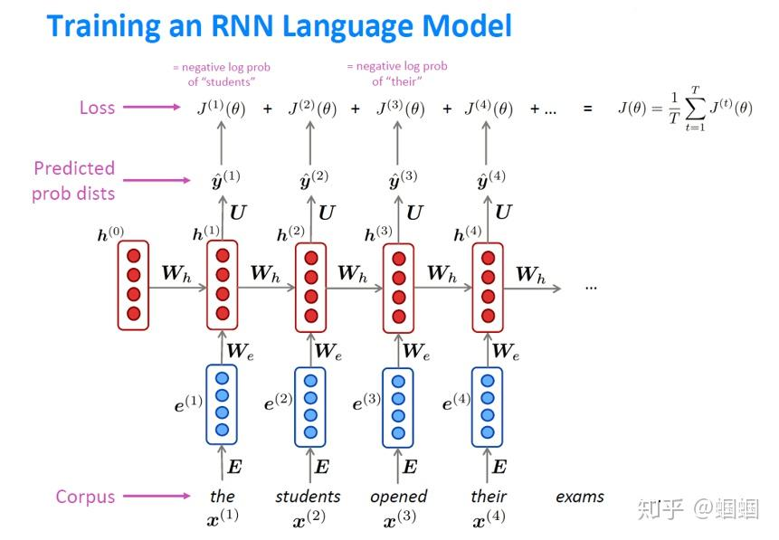

# 语言模型（LM）和循环神经网络（RNNs）

如何训练一个基于RNN的LM呢？
首先，我们收集一大批语料，这些语料是由很多个序列（句子、短语等等）组成的。 我们把序列作为输入，输入到RNN网络中，每一步都可以得到一个输出，这个输出即为当前步的下一个词的概率分布。我们使用这个概率分布可以和真实的概率分布（其实就是一个one-hot向量）计算一个损失。明确了损失函数，我们就很容易去训练了。CS224N中的一张图描绘地很清晰：

## 参考文献

* https://zhuanlan.zhihu.com/p/147322049