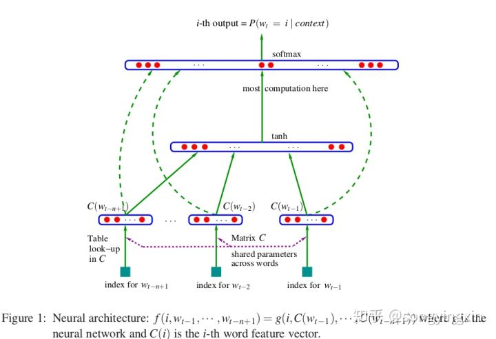
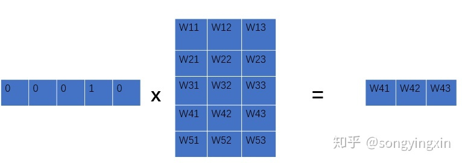
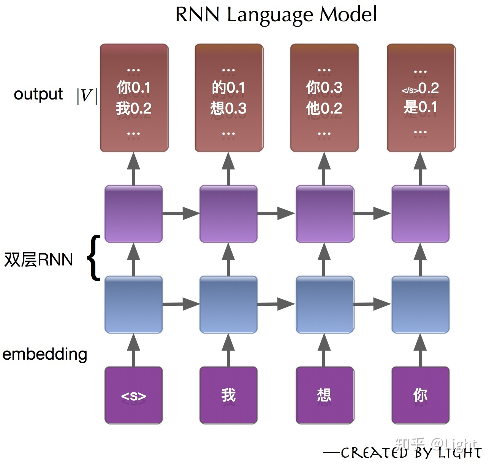

# 语言模型之综述(一)

## 什么是语言模型
一个语言模型可以简单理解为一个句子 s 在所有句子中出现的概率分布 P(s)。举个简单的例子：

如果一个人所说的话语中每100个句子里大约有一句是Okay，则可以认为p(Okay) ≈ 0.01。而对于句子“An apple ate the chicken”我们可以认为其概率为0，因为几乎没有人会说这样的句子。

我们再举个简单的例子（引用自《数学之美》）：

美联储主席本 $\cdot$ 伯南克昨天告诉媒体7000亿美元的救助资金将借给上百家银行，保险公司和汽车公司。

这句话很容易理解，因为它的句子很通顺，读起来就像是人说的。我们来更改部分词的顺序：

本 $\cdot$ 伯南克美联储主席昨天7000亿美元的救助资金告诉媒体将借给银行，保险公司和汽车公司上百家。

这句话是不是就比较费劲了，读起来我们也能理解，但是感觉就不太像是人说的。我们再改一改，如下：

联主美储席本 $\cdot$ 伯诉南将借天的救克告媒咋助资金70元亿00美给上百败百家银保行，汽车险公司公司和

ok，这句话你还能看懂吗，我觉得你很难看懂，这句话看起来就不像是人说的。

那么我们就引出了语言模型这个概念：

语言模型就是一个句子 s 在所有句子中出现的概率分布，假设第一个句子出现在该语言模型中的概率为 $10^{-20}$ ，第二个句子出现的概率为 $10^{-25}$ ，第三个句子出现的概率是 $10^{-70}$ 。那么第一句话是人话的概率要比第三句话的可能性大得多。

注意一点：语言模型与句子是否合乎语法是没有关系的，即使一个句子完全合乎语法逻辑，我们仍然可以认为它出现的概率接近为 0。

## 语言模型中的概率是怎么产生的？
我们先假设 S 表示某一个有意义的句子，S 是由一连串特定顺序排列的词 $w_1, w_2, \cdots , w_n$ 组成，这里n是句子的长度，那么我们怎么获取句子 S 在一个语言模型中的概率 $P(S)$ ?

最简单的方法是建立一个无比庞大的语料库，该语料库中包含了人类成百上千年间可能讲过的所有的话，那么我们不就可以算出这句话出现的概率了吗，可惜，傻子都知道这种方法不可能行得通。

这里就体现出数学的精妙之处了，我们要计算的是P(S)， 而 S 是一个序列 $w_1, w_2 , \cdots ,w_n$ ，那么根据概率论的相关知识我们可以得出：  $P(S) = P(w_)1, w_2, \cdots, w_n)$  再展开我们可以得到：

$P(w_1, w_2, \cdots, w_n) = P(w_1) \cdot P(w_2|w_1) \cdot P(w_3|w_1,w_2) \cdots P(w_n|w_1, w_2, \cdots, w_{n-1}) $

我们观察上式，会发现， $P(w_1)$ 比较好算， $P(w_2|w_1)$  也还ok， $P(w_3|w_1,w_2)$ 就比较有难度了，随着n的增大，计算会越来越难， $P(w_n|w_1, w_2, \cdots, w_{n-1})$ 几乎根本不可能估算出来。怎么办？

## 马尔可夫假设
数学家马尔可夫针对无法计算 $P(w_n|w_1, w_2, \cdots, w_{n-1})$ 这种情况，提出了一种偷懒且高效的方法：每当遇到这种情况时，就假设任意一个词 $w_i$ 出现的概率只同它前面的词 $w_{i-1}$ 有关，这就是很有名的马尔可夫假设。基于此思想，n-gram model诞生了。

### n-gram model（n元模型）
n元模型的思想就是：出现在第 $i$ 位上的词 $w_i$ 仅与它前面的（n-1）个历史词有关。通常情况下，n的取值不能太大，实际中， n=3是最常见的情况。n过小，产生的概率不够准确，n过大，计算量太大。

### 一元模型
当n=1时,即出现在第i位上的词 $w_i$ 独立，一元文法被记作unigram,或uni-gram,或monogram。

$ P(S) = \prod_{i=1}^{l} P(w_i) $

其余比如二元模型， 三元模型就不举例了， 比较简单，大同小异。

### n 元模型的缺陷
1. 无法建模更远的关系，语料的不足使得无法训练更高阶的语言模型。
2. 无法建模出词之间的相似度。
3. 训练语料里面有些 n 元组没有出现过,其对应的条件概率就是 0,导致计算一整句话的概率为 0。解决这个问题有两种常用方法： 平滑法和回退法。

## 神经网络语言模型（NNLM）
第一篇提出神经网络语言模型的论文是Bengio大神在2003年发表的《A Neural Probabilistic Language Model》。我个人建议这篇文章是必读的， 因为模型最简单， 便于理解， 下面我来分析一下这个模型， 建议参照论文饮用更佳：

观察上图，假设有一组词序列： $w_1, w_2, \cdots, w_t$ ，其中 $w_i \in V$ ， $V$ 是所有单词的集合。我们的输入是一个词序列，而我们的输出是一个概率值，表示根据context预测出下一个词是 $i$ 的概率。用数学来表示，我们最终是要训练一个模型：

$ f(w_t, w_{t-1}, \cdots, w_{t-n+1}) = P(w_t = i | context) = P(w_t | w_1^{t-1}) $

其中有：$w_t$ 表示这个词序列中的第 $t$ 个单词， $w_{t-n+1}$ 表示输入长度为n的词序列中的第一个单词；$w_1^{t-1}$ 表示从第1个单词到第 $t-1$ 个单词组成的子序列。

我们发现， 这个过程与上面提到的其实是一样的， 其实就是求： $p(w_n|w_1, \cdots, w_{n-1})$

该模型需要满足两个约束条件：

$ f(w_t, w_{t-1}, \cdots, w_{t-n+2}, w_{t-n+1}) > 0 \\ \sum_{i=1}^{|V|} f(i, w_{t-1}, \cdots, w_{t-n+2}, w_{t-n+1}) = 1 $

其中 $|V|$ 表示词表的大小。

### 模型的前向传播
该模型结构分为三层，分别是输入层，一层隐层，输出层。下面我分别来介绍。

#### 输入层： 从One-hot到distribution representation
对于输入层，我们先将输入词序列 $w_1, \cdots, w_n$ 映射到词表中，如词 $w_i$ 是词表中是第i个元素，编码为one-hot embedding；然后我们再将这个元素映射到实向量 $C(i)$ 中，其中 $C(i) \in R^m$ ，它表示的是词表中第i个词的distributed representation。 $C$实际上就是一个 $|V| × m$  的自由参数矩阵， $|V|$ 表示词表的大小， $m$ 表示每个词的维度。

$x(k) \leftarrow C(w_{t-k}) \qquad x(k) 是m维的向量 \\ x = (x(1), x(2), \cdots, x(n-1)) \qquad x 是 (n-1) × m 维的矩阵 $

其中，词的映射过程用图表示如下：

#### 隐层
$ o \leftarrow d + Hx; \qquad o是长度为h的向量 \\ a \leftarrow tanh(o) \qquad a是长度为h的向量 $

#### 输出层
在输出层中，同时受到隐层输出 a 和 输入层输出 x 的影响，公式如下：

在输出层中，同时受到隐层输出 a 和 输入层输出 x 的影响，公式如下：

$ y = b + Wx + Utanh(d + Hx) \\ p(w_t|w_{t-1}, \cdots, w_{t-n+1}) = \frac{e^{y_{w_t}}}{\sum_i e^{y_i}} $

最后，一目了然， $x$ 是输入， $P(w_t| w_{t-1, \cdots, w_{t-n+1}})$ 是输出，需要更新的参数包括： $\theta=(b,d,W,U,H,C)$ 。也就是说这里我们已经求出在 $w_{t-n+1 }$ 到 $w_{t - 1}$ 出现的概率， 接下来训练的时候， 我们就能够通过计算优化出 $P(s)$ ，来完成整个语言模型的训练。

#### 模型的训练
损失函数为：
$ L = \dfrac{1}{T}\sum_t \log \hat{P}(w_t|w_{t-1},\dots,w_{t-n+1})+R(\theta) $

具体的训练过程我就不赘述了，除非复现模型，否则这些训练细节你是没有必要细究的。

### 结论
利用神经网络去建模当前词出现的概率与其前 n-1 个词之间的约束关系。很显然这种方式相比 n-gram 具有更好的泛化能力，只要词表征足够好。从而很大程度地降低了数据稀疏带来的问题。但是这个结构的明显缺点是仅包含了有限的前文信息。

## 基于循环神经网络的模型
为了解决定长信息的问题，Mikolov 于2010年发表的论文 Recurrent neural network based language model 正式揭开了循环神经网络(RNN)在语言模型中的强大历程。插一句，注意力机制(attention mechanism)应用在 seq2seq 中也是为了克服 encoder 对任意句子只能给出一个固定size的表征，而这个表征在遇到长句时则显得包含信息量不够。

以序列“我想你”为例介绍RNN语言模型的建模过程：

在统计语言模型中，介绍过需要给序列添加起始符和结束符，神经网络语言模型也不例外。网络的输入层是$"<s>我想你"$，输出层可以看作是分别计算条件概率 $P(w|<s>)、P(w|<s>我)、P(w|<s>我想)、P(w|<s>我想你)$ 在整个词表|V|中值。而我们的目标就是使期望词对应的条件概率尽可能大。

相比单纯的前馈神经网络，隐状态的传递性使得RNN语言模型原则上可以捕捉前向序列的所有信息(虽然可能比较弱)。通过在整个训练集上优化交叉熵来训练模型，使得网络能够尽可能建模出自然语言序列与后续词之间的内在联系。

## 神经网络语言模型小结
神经网络语言模型(NNLM)通过构建神经网络的方式来探索和建模自然语言内在的依赖关系。尽管与统计语言模型的直观性相比，神经网络的黑盒子特性决定了NNLM的可解释性较差，但这并不妨碍其成为一种非常好的概率分布建模方式。

优点：(1) 长距离依赖，具有更强的约束性；(2) 避免了数据稀疏所带来的OOV问题；(3) 好的词表征能够提高模型泛化能力。

缺点：(1) 模型训练时间长；(2) 神经网络黑盒子，可解释性较差。

## 语言模型的评价指标
上面介绍了两大类对语言模型建模的方式，细心的同学已经可能已经考虑到了：既然大家都是对自然语言的概率建模，那么怎么知道谁效果更好呢，谁的模型更加接近真实分布呢？信息论中常采用相对熵(relative entropy)来衡量两个分布之间的相近程度。

对于离散随机变量X，熵、交叉熵以及相对熵的定义分别如下：

$H(p) =-\sum_i p(x_i)\text{log}p(x_i) $
$H(p,q)=-\sum_i p(x_i)\text{log}q(x_i) $
$D(p||q)=H(p,q)-H(p)=\sum_i p(x_i)\text{log}$$p(x_i)/q(x_i) $

其中， $p(x)$ 和 $q(x)$ 都是对随机变量概率分布的建模。

假定 $p$ 是样本的真实分布，$q$ 是对其的建模。因为真实分布的熵 $H(p)$ 值是确定的，因此优化相对熵 $D(p||q)$ 等价于优化交叉熵 $H(p,q)$ 。这里有个小细节是 $H(p,q)\geq H(p)$ 恒成立，感兴趣的同学可在这里找到具体证明过程。

对于自然语言序列 $W=w_1,w_2,...,w_N$，可以推导得到对每个词的平均交叉熵为：

$H(W)=-\frac{1}{N}\text{log}P(w_1,w_2,...,w_N)$

显然，交叉熵越小，则建模的概率分布越接近真实分布。交叉熵描述的是样本的平均编码长度，虽然物理意义很明确，但是不够直观。因此，在此基础上，我们定义困惑度(perplexity) $\begin{align} \text{Preplexity}(W)&=2^{H(W)}\\ &=\sqrt[N]{\frac{1}{P(w_1,...,w_N)}} \end{align}$

困惑度在语言模型中的物理意义可以描述为对于任意给定序列，下一个候选词的可选范围大小。同样的，困惑度越小，说明所建模的语言模型越精确。

谷歌找了下资料，发现英文数据集PTB上最新的困惑度结果可以达到47.69，细思极恐，详见论文。中文目前还没找到最新的结果，但可以肯定的是基于神经网络的语言模型在困惑度指标上要明显优于传统n-gram语言模型。

## 总结
从特性上可以将 n-gram 语言模型看作是基于词与词共现频次的统计，而神经网络语言模型则是给每个词分别赋予分布式向量表征，探索它们在高维连续空间中的依赖关系。实验证明，神经网络的分布式表征以及非线性映射更加适合对自然语言进行建模。

## 参考文献
1. https://zhuanlan.zhihu.com/p/52061158
2. https://www.jiqizhixin.com/articles/2018-10-22-3
3. [A Neural Probabilistic Language Model](http://www.jmlr.org/papers/volume3/bengio03a/bengio03a.pdf)
4. [Recurrent neural network based language model](https://www.isca-speech.org/archive/archive_papers/interspeech_2010/i10_1045.pdf)