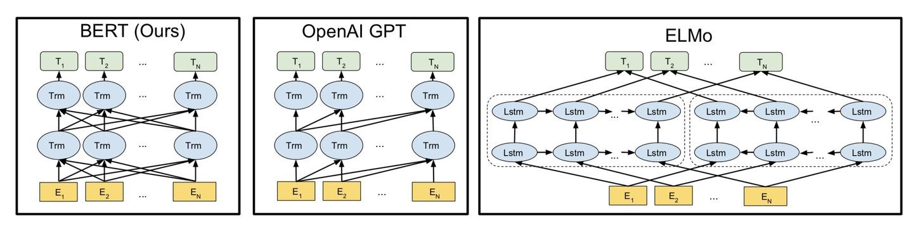

# 浅谈ELMO，GPT，BERT模型

## ELMO

ELMO是基于双向RNN的语言模型，将同一个词的前向隐层状态和后向隐层状态拼接在一起，可以作为该单词的Contextualized word embedding（综合上下文语境的词嵌入）。

RNN可以堆叠多层，因此我们可以获得多个拼接后的隐层状态。那么我们应该选用哪一层的隐层状态作为最终的动态词向量，进而应用到下游任务呢？
ELMO的做法是全部都要，即对h1和h2...进行一个归一化的weighed sum。这个加权和的系数是在具体任务中具体学习的。

## BERT

BERT模型与OpenAI GPT的区别就在于采用了Transformer Encoder，也就是每个时刻的Attention计算都能够得到全部时刻的输入，而OpenAI GPT采用了Transformer Decoder，每个时刻的Attention计算只能依赖于该时刻前的所有时刻的输入，因为OpenAI GPT是采用了单向语言模型。

BERT基于两种任务进行预训练：Masked Language Model和Next Sentence Prediction.

BERT几种应用：*需要注意，BERT可以用作特征抽取，将新的embedding应用到下游任务。也可以基于BERT进行微调，对于特定任务进行一个整体的训练。

* 1 文本分类
* 2 单词分类，比如命名实体识别。
* 3 问答匹配

(详见：https://zhuanlan.zhihu.com/p/264989685)

## GPT

GPT是基于Transformer的Decoder构建的。这就导致GPT类似于传统的语言模型，即一次只输出一个单词进行序列预测，也就是下一词预测。因为Decoder部分与RNN思想还是比较类似的，尤其是其中Masked attention部分，能够屏蔽来自未来的信息，因此GPT是单向的模型，无法考虑语境的下文。

## 参考文献

* https://zhuanlan.zhihu.com/p/264989685
* https://zhuanlan.zhihu.com/p/146719974