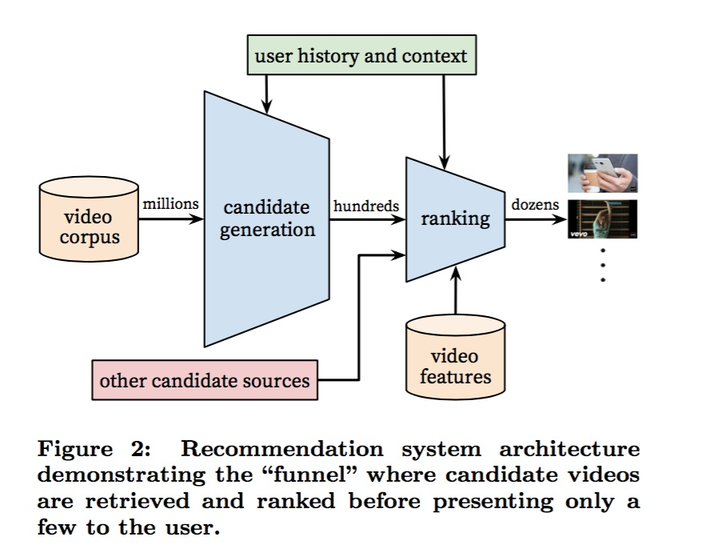
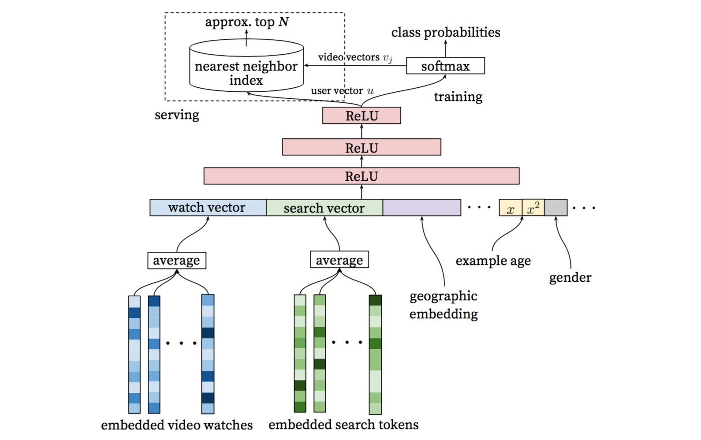
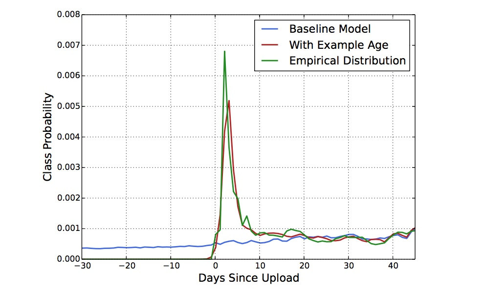
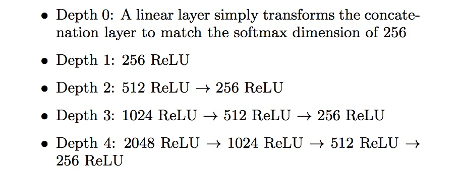
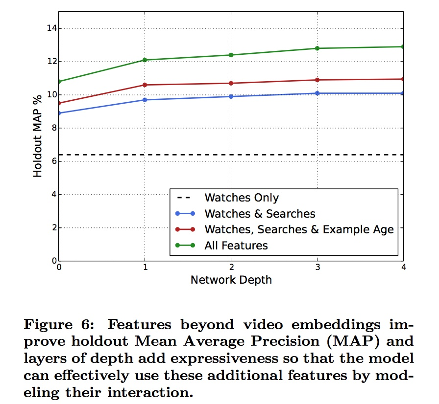
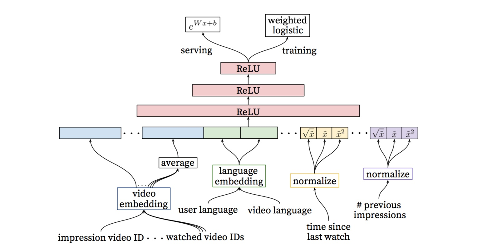
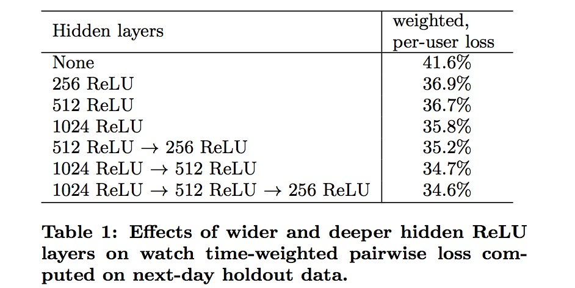

# Deep Neural Network for YouTube Recommendation (Youtube 2016)
## 引言
在推荐系统领域，特别是YouTube的所在视频推荐领域，主要面临三个挑战：

规模大：用户和视频的数量都很大，只能适应小规模数据集的算法就不考虑了。
更新快：youtube视频更新频率很高，每秒有小时级别的视频上传，需要在新发布视频和已有存量视频间进行balance。更新快（实时性）的另一方面的体现是用户实时行为切换很快，模型需要很好的追踪用户的实时行为。
噪音：噪音主要体现在用户的历史行为往往是稀疏的并且是不完整的，并且没有一个明确的ground truth的满意度signal，我们面对的都是noisy implicit feedback signals。噪音另一个方面就是视频本身很多数据都是非结构化的。这两点对算法的鲁棒性提出了很高的挑战。
之所以要在推荐系统中应用DNN解决问题，一个重要原因是google内部在机器学习问题上的通用solution的趋势正转移到Deep learning，系统实际部署在基于tensorflow的Google
Brain上。

## 系统概览
在工业界工作的同学对下图的系统划分并不陌生。整个推荐系统分为candidate generation（淘宝称为Matching，后面用Matching代替）和Ranking两个阶段。Matching阶段通过i2i/u2i/u2u/user profile等方式“粗糙”的召回候选商品，Matching阶段视频的数量是百级别了；Ranking阶段对Matching后的视频采用更精细的特征计算user-item之间的排序分，作为最终输出推荐结果的依据。



之所以把推荐系统划分成Matching和Ranking两个阶段，主要是从性能方面考虑的。Matching阶段面临的是百万级视频，单个视频的性能开销必须很小；而Ranking阶段的算法则非常消耗资源，不可能对所有视频都算一遍，实际上即便资源充足也完全没有必要，因为往往来说通不过Matching粗选的视频，大部分在Ranking阶段排名也很低。接下来分别从Matching和Ranking阶段展开介绍。

## Matching

### 问题建模
我们把推荐问题建模成一个“超大规模多分类”问题。即在时刻t，为用户U（上下文信息C）在视频库V中精准的预测出视频i的类别（每个具体的视频视为一个类别，i即为一个类别），用数学公式表达如下：


很显然上式为一个softmax多分类器的形式。而这种超大规模分类问题上，至少要有几百万个类别，实际训练采用的是Negative Sampe，类似于word2vec的Skip-Gram方法。

### 模型架构


整个模型架构是包含三个隐层的DNN结构。输入是用户浏览历史、搜索历史、人口统计学信息和其余上下文信息concat成的输入向量；输出分线上和离线训练两个部分。

离线训练阶段输出层为softmax层，输出2.1公式表达的概率。而线上则直接利用user向量查询相关商品，最重要问题是在性能。我们利用类似局部敏感哈希（Locality Sensitive Hashing，不展开介绍了，感兴趣的同学可以读读这篇论文 An Investigation of Practical Approximate Nearest Neighbor Algorithms）的算法为用户提供最相关的N个视频。

### 主要特征
类似于word2vec的做法，每个视频都会被embedding到固定维度的向量中。用户的观看视频历史则是通过变长的视频序列表达，最终通过加权平均（可根据重要性和时间进行加权）得到固定维度的watch vector作为DNN的输入。

除历史观看视频外的其他signal：

其实熟悉Skip-Gram方法的同学很容易看出来，2.1把推荐问题定义为“超大规模多分类”问题的数学公式和word2vec的Skip-Gram方法的公式基本相同，所不同的是user_vec是通过DNN学习到的，而引入DNN的好处则是任意的连续特征和离散特征可以很容易添加到模型当中。同样的，推荐系统常用的矩阵分解方法虽然也能得到user_vec和item_vec，但同样是不能嵌入更多feature。

主要特征：

* 历史搜索query：把历史搜索的query分词后的token的embedding向量进行加权平均，能够反映用户的整体搜索历史状态
* 人口统计学信息：性别、年龄、地域等
* 其他上下文信息：设备、登录状态等
* “Example Age” （视频上传时间）特征

视频网络的时效性是很重要的，每秒YouTube上都有大量新视频被上传，而对用户来讲，哪怕牺牲相关性代价，用户还是更倾向于更新的视频。当然我们不会单纯的因为一个视频新就直接推荐给用户。

因为机器学习系统在训练阶段都是利用过去的行为预估未来，因此通常对过去的行为有个隐式的bias。视频网站视频的分布是高度非静态（non-stationary）的，但我们的推荐系统产生的视频集合在视频的分布，基本上反映的是训练所取时间段的平均的观看喜好的视频。因此我们我们把样本的 “age” 作为一个feature加入模型训练中。从下图可以很清楚的看出，加入“example age” feature后和经验分布更为match。



### 不同网络深度和特征的实验
简单介绍下我们的网络构建过程，采用的经典的“tower”模式搭建网络，基本同2.2所示的网络架构，所有的视频和search token都embedded到256维的向量中，开始input层直接全连接到256维的softmax层，依次增加网络深度（+512-->+1024-->+2048--> ...）。



下图反映了不同网络深度（横坐标）下不同特征组合情况下的holdout-MAP（纵坐标）。可以很明显看出，增加了观看历史之外的特征很明显的提升了预测得准确率；从网络深度看，随着网络深度加大，预测准确率在提升，但继续增加第四层网络已经收益不大了。



## Ranking
Ranking阶段的最重要任务就是精准的预估用户对视频的喜好程度。不同于Matching阶段面临的是百万级的候选视频集，Ranking阶段面对的只是百级别的商品集，因此我们可以使用更多更精细的feature来刻画视频（item）以及用户与视频（user-item）的关系。比如用户可能很喜欢某个视频，但如果list页的用的“缩略图”选择不当，用户也许不会点击，等等。

此外，Matching阶段的来源往往很多，没法直接比较。Ranking阶段另一个关键的作用是能够把不同来源的数据进行有效的ensemble。

在目标的设定方面，单纯CTR指标是有迷惑性的，有些靠关键词吸引用户高点击的视频未必能够被播放。因此设定的目标基本与期望的观看时长相关，具体的目标调整则根据线上的A/B进行调整。

### 模型架构
Ranking阶段的模型和Matching基本相似，不同的是training最后一层是一个weighted LR层，而serving阶段激励函数用的是ex，具体在3.3阐述。



### 特征表达

1. Feature Engineering
```
尽管深度学习在图像、语音和NLP等场景都能实现end-to-end的训练，没有了人工特征工程工作。然而在搜索和推荐场景，我们的很难吧原始数据直接作为FNN的输入，特征工程仍然很重要。而特征工程中最难的是如何建模用户时序行为（temporal sequence of user actions），并且关联这些行为和要rank的item。

我们发现最重要的Signal是描述用户与商品本身或相似商品之间交互的Signal，这与Facebook在14年提出LR+GBDT模型的paper（Practical Lessons from Predicting Clicks on Ads at Facebook）中得到的结论是一致的。比如我们要度量用户对视频的喜欢，可以考虑用户与视频所在频道间的关系：

数量特征：浏览该频道的次数？
时间特征：比如最近一次浏览该频道距离现在的时间？
这两个连续特征的最大好处是具备非常强的泛化能力。另外除了这两个偏正向的特征，用户对于视频所在频道的一些PV但不点击的行为，即负反馈Signal同样非常重要。

另外，我们还发现，把Matching阶段的信息传播到Ranking阶段同样能很好的提升效果，比如推荐来源和所在来源的分数。
```

2. Embedding Categorical Features
```
NN更适合处理连续特征，因此稀疏的特别是高基数空间的离散特征需要embedding到稠密的向量中。每个维度（比如query/user_id）都有独立的embedding空间，一般来说空间的维度基本与log(去重后值得数量)相当。实际并非为所有的id进行embedding，比如视频id，只需要按照点击排序，选择top N视频进行embedding，其余置为0向量。而对于像“过去点击的视频”这种multivalent特征，与Matching阶段的处理相同，进行加权平均即可。

另外一个值得注意的是，同维度不同feature采用的相同ID的embedding是共享的（比如“过去浏览的视频id” “seed视频id”），这样可以大大加速训练，但显然输入层仍要分别填充。
```

3. Normalizing Continuous Features
```
众所周知，NN对输入特征的尺度和分布都是非常敏感的，实际上基本上除了Tree-Based的模型（比如GBDT/RF），机器学习的大多算法都如此。我们发现归一化方法对收敛很关键，推荐一种排序分位归一到[0,1]区间的方法，即[公式]，累计分位点。

除此之外，我们还把归一化后的[公式]的根号[公式]和平方[公式]作为网络输入，以期能使网络能够更容易得到特征的次线性（sub-linear）和（super-linear）超线性函数。
```

### 建模期望观看时长
我们的目标是预测期望观看时长。有点击的为正样本，有PV无点击的为负样本，正样本需要根据观看时长进行加权。因此，我们训练阶段网络最后一层用的是 weighted logistic regression。

正样本的权重为观看时长Ti，负样本权重为1。这样的话，LR学到的odds为：


其中N是总的样本数量，k是正样本数量，Ti是第i正样本的观看时长。一般来说，k相对N比较小，因此上式的odds可以转换成E[T]/(1+P)，其中P是点击率，点击率一般很小，这样odds接近于E[T]，即期望观看时长。因此在线上serving的inference阶段，我们采用ex作为激励函数，就是近似的估计期望的观看时长。

### 不同隐层的实验
下图的table1是离线利用hold-out一天数据在不同NN网络结构下的结果。如果用户对模型预估高分的反而没有观看，我们认为是预测错误的观看时长。weighted, per-user loss就是预测错误观看时长占总观看时长的比例。

我们对网络结构中隐层的宽度和深度方面都做了测试，从下图结果看增加隐层网络宽度和深度都能提升模型效果。而对于1024-->512-->256这个网络，测试的不包含归一化后根号和方式的版本，loss增加了0.2%。而如果把weighted LR替换成LR，效果下降达到4.1%。



## 参考资料
* [Deep Neural Networks for YouTube Recommendations](https://static.googleusercontent.com/media/research.google.com/en//pubs/archive/45530.pdf)
* [重读Youtube深度学习推荐系统论文，字字珠玑，惊为神文](https://zhuanlan.zhihu.com/p/52169807)
* [YouTube深度学习推荐系统的十大工程问题](https://zhuanlan.zhihu.com/p/52504407)
* [Deep Neural Network for YouTube Recommendation论文精读](https://zhuanlan.zhihu.com/p/25343518)
