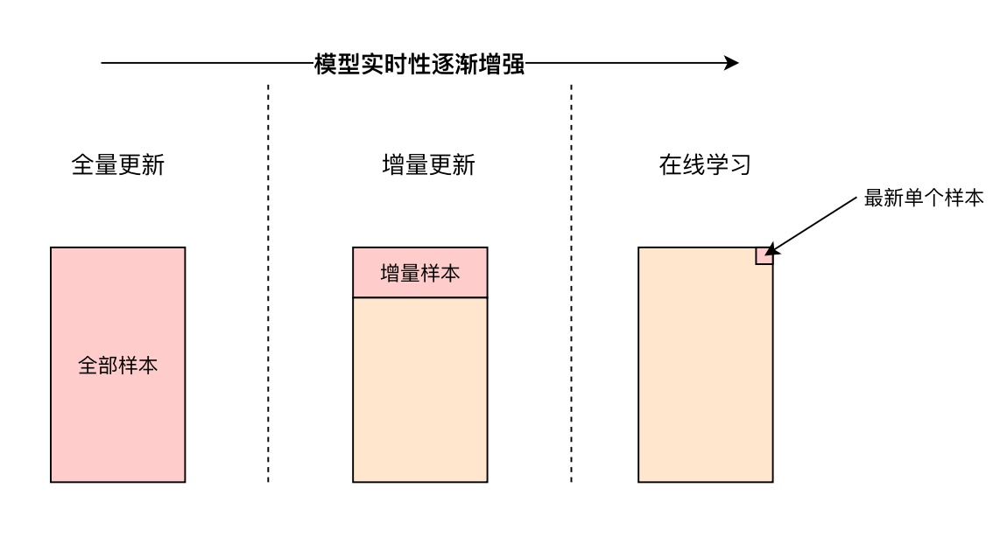
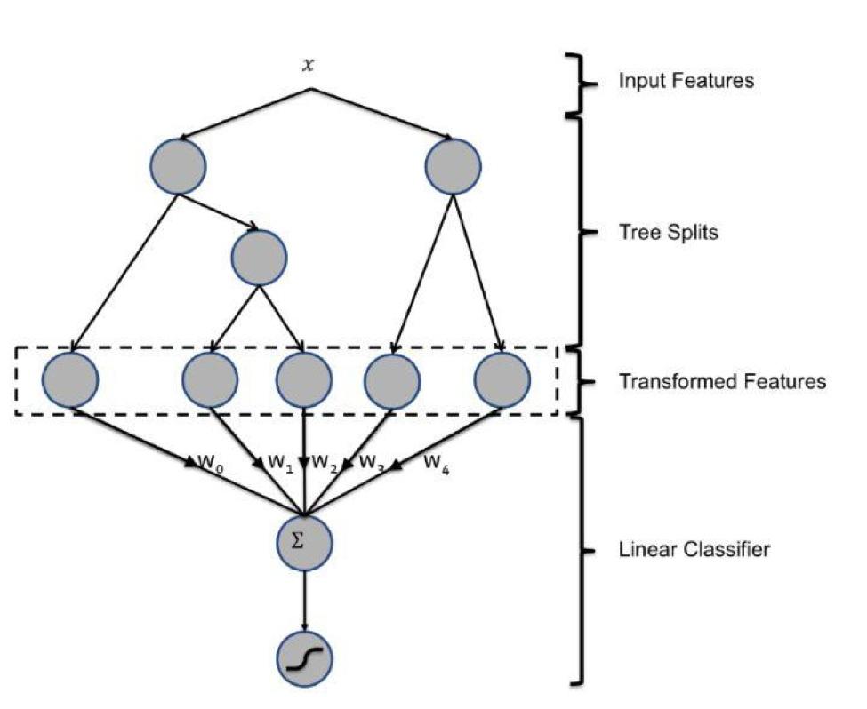
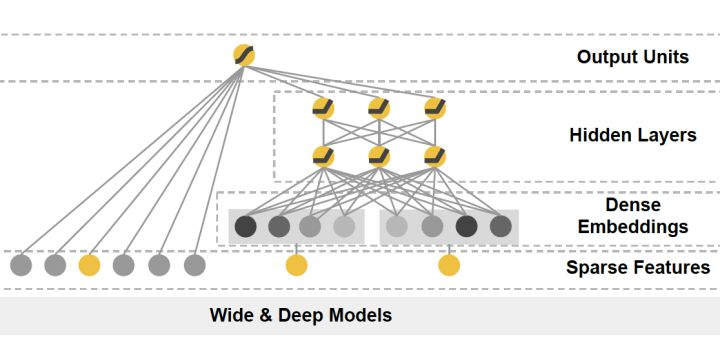

# 如何增强推荐系统模型更新的实时性

## 推荐系统“模型”的实时性
与“特征”的实时性相比，推荐系统模型的实时性往往是从更全局的角度考虑问题。特征的实时性力图用更准确的特征描述一个人，从而让推荐系统给出更符合这个人的推荐结果。而模型的实时性则是希望更快的抓住全局层面的新的数据模式，发现新的趋势和相关性。
```
举例来说，拿某电商网站双十一的大量促销活动来说。特征的实时性会根据用户最近的行为更快的发现用户可能感兴趣的商品，但绝对不会发现用户相似人群最新的偏好，商品之间最新的相关性信息，新活动的趋势信息等。
```
要发现这类全局性的数据变化，就需要更快地更新模型。而影响模型的实时性最重要的因素就是模型的训练方式（如图1）。



## 全量更新
模型训练最常用的方式就是全量更新。模型会利用某时间段内的所有训练样本进行重新训练，再用训练好的新模型替代“过时”的模型。

但全量更新需要训练的样本量大，因此所需训练时间较长；而且全量更新往往在离线的大数据平台上进行，如spark+tensorflow，因此数据的延迟也较长，这都导致了全量更新是“实时性”最差的模型更新方式。

事实上，对于已经训练好的模型，可以仅对新加入的增量样本进行学习就可以了，这就是所谓的增量更新。

## 增量更新（Incremental Learning）
增量更新仅将新加入的样本喂入模型进行增量学习。从技术上来说，深度学习模型往往采用随机梯度下降（SGD）以及其变种进行学习，模型对增量样本的学习相当于在原有样本的基础上继续输入增量样本进行梯度下降。因此在深度学习模型的基础上，由全量更新改为增量更新的难度并不大。

但工程上的任何事情都是tradeoff，永远不存在完美的解决方案，增量更新也不例外。由于仅利用增量样本进行学习，因此模型在多个epoch之后也是收敛到新样本的最优点，而很难收敛到 原所有样本+增量样本 的全局最优点。

因此在实际的推荐系统中，往往采用增量更新与全局更新相结合的方式，在进行几轮增量更新后，在业务量较小的时间窗口进行全局更新，纠正模型在增量更新过程后中积累的误差。在“实时性”和“全局最优”中间进行取舍和权衡。

## 在线学习（online learning）
“在线学习“是“增量更新”的进一步改进，“增量更新”是在获得一批新样本时进行增量更新，而在线学习是在每次获得一个新样本的时候就实时更新模型。在线学习在技术上也可以通过SGD类的方式实现。但如果使用general的SGD方法，在线学习会导致一个很严重的问题，就是模型的稀疏性很差，打开过多“碎片化”的不重要特征。

我们关注模型的“稀疏性”某种意义上也是工程上的考虑，比如在一个输入向量达到几百万维的模型中，如果模型的稀疏性好的话，可以在模型效果不受影响的前提下，仅让极小一部分维度的输入向量的对应权重非零，也就是说在模型上线的时候，模型的体积是很小的，这无疑有利于整个模型serving的过程。无论是存储模型所需的内存空间，以及线上inference的速度都会因为模型的稀疏性收益。

如果使用SGD的方式进行模型更新，相比batch的方式，容易产生大量小权重的特征，这就增大了模型部署和更新的难度。那么为了在在线学习过程中兼顾训练效果和模型稀疏性，有大量相关的研究，最著名的包括微软的RDA，google的FOBOS和最著名的FTRL等(详见本文另一篇文章)。

## 模型局部更新
提高模型实时性的另外一个改进方向是进行模型的局部更新，大致的思路是降低训练效率低的部分的更新频率，提高训练效率高的部分的更新频率。这种方式比较有代表性的是facebook的GBDT+LR模型。



GBDT+LR的模型结构，模型利用GBDT进行自动化的特征工程，利用LR拟合优化目标。由于GBDT是串行的依次训练每一颗树，因此训练效率不高，更新的周期较长，如果每次都同时训练GBDT+LR整个模型，那么GBDT的低效问题将拖慢LR的更新速度。因此为了兼顾GBDT的特征处理能力和LR快速拟合优化目标的能力，Facebook采取的部署方法时每天训练一次GBDT模型，固定GBDT模型后，准实时的训练LR模型以快速捕捉数据整体的变化。那么通过模型的局部更新，做到了GBDT和LR能力的权衡。

模型局部更新的做法也较多采用在Embedding层+神经网络的深度学习模型（例如图3的W&D模型）中，因为Embedding层负责将高维稀疏输入向量转换为稠密embedding向量，因此Embedding层一层的参数往往占深度学习模型90%以上。因此Embedding层的更新会拖累模型整体的更新速度，因此业界也往往采用embedding层单独训练甚至预训练，embedding层以上的模型部分高频更新的策略。



## 客户端模型实时更新
在上篇文章中介绍“特征”实时性的部分，提到了客户端“实时特征”的方法。既然客户端是最接近用户的部分，实时性最强，那么能否在客户端就根据当前用户的行为历史更新模型呢？

客户端模型实时更新在业界也是仍处于探索阶段的方法。难点在于分布在每个客户端模型的更新与服务器端模型的更新的协同问题。也许可以采用类似parameter server架构的模型更新策略，但本质上，模型的更新不会对用户的推荐产生十分显著的影响，采用客户端模型实时更新的必要性也不是非常大。这里想介绍的其实是一种简化的客户端模型更新策略，用户embedding的实时更新。

user embedding实时更新的逻辑和动机是，在深度学习推荐系统中，模型往往要接受用户embedding和物品embedding两个关键的特征向量。对于物品embedding的更新来说，往往需要全局的数据，因此只能在服务器端进行整体的更新；而对用户embedding来说，则更多依赖于用户自身的数据。那么把用户embedding的更新过程移植到客户端来做，就能够实时地把用户最近的行为数据反应到用户的embedding中来，从而通过实时改变用户embedding的方式完成实时推荐。

```
这里用一个最简单的例子来说明该过程。例如用户embedding由用户点击过的物品embedding进行平均得到，那么客户端是最先得到用户最新点击物品信息的，那么就可以实时更新用户embedding，在下次推荐时，将更新后的用户embedding传给服务器端，让服务器端根据最新的用户embedding返回实时推荐内容。
```

当然，用户embedding的生成过程可以使用更复杂的网络和embedding方法进行生成，如果能与整个网络解耦合，并单独部署到客户端，同样可以进行实时更新。

至此，推荐系统实时性相关的文章就更新完了，希望对大家有帮助，对上一部分特征实时性感兴趣的同学可以在专栏的上一篇文章中找到，或者在我的公众号 王喆的机器学习笔记 中回复“特征实时性”查看。

## 参考资料
* [如何增强推荐系统模型更新的「实时性」？](https://zhuanlan.zhihu.com/p/75597761)


