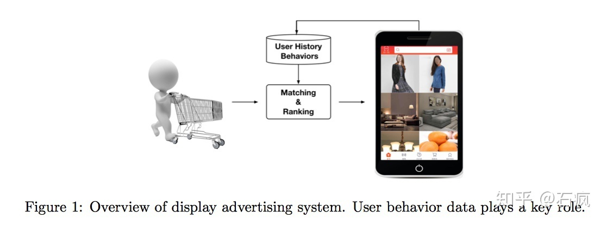
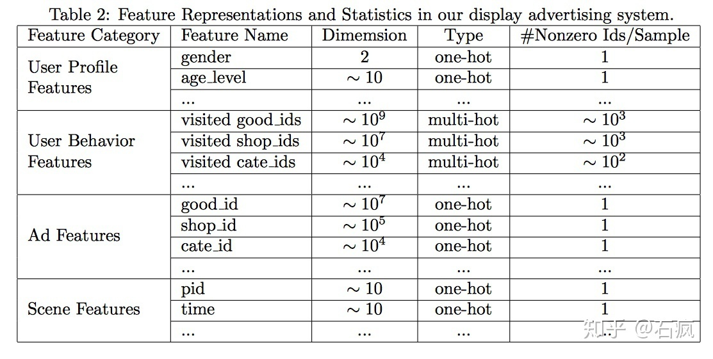
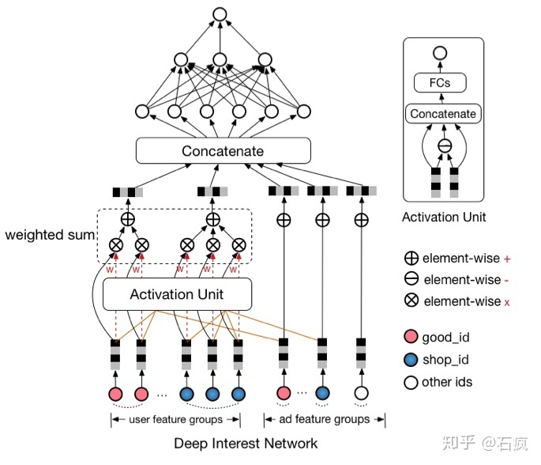
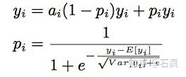

## Deep Interest NetWork

## 背景

Deep Interest Network(DIN)是盖坤大神领导的阿里妈妈的精准定向检索及基础算法团队，在2017年6月提出的。它针对电子商务领域(e-commerce industry)的CTR预估，重点在于充分利用/挖掘用户历史行为数据中的信息。

1. 使用用户兴趣分布来表示用户多种多样的兴趣爱好
2. 使用Attention机制来实现Local Activation
3. 针对模型训练，提出了Dice激活函数，自适应正则，显著提升了模型性能与收敛速度

### 名词解释
这两个词在论文中通篇出现，先把其表示的意思说清楚。

Diversity：
用户在访问电商网站时会对多种商品都感兴趣。也就是用户的兴趣非常的广泛。

Local Activation：
用户是否会点击推荐给他的商品，仅仅取决于历史行为数据中的一小部分，而不是全部。


* Diversity：一个年轻的母亲，从他的历史行为中，我们可以看到她的兴趣非常广泛：羊毛衫、手提袋、耳环、童装、运动装等等。
* Local Activation：一个爱游泳的人，他之前购买过travel book、ice cream、potato chips、swimming cap。当前给他推荐的商品(或者说是广告Ad)是goggle(护目镜)。那么他是否会点击这次广告，跟他之前是否购买过薯片、书籍、冰激凌一丁点关系也没有！而是与他之前购买过游泳帽有关系。也就是说在这一次CTR预估中，部分历史数据(swimming cap)起了决定作用，而其他的基本都没啥用。

### 相关工作
CTR预估是一个比较窄的研究领域，但是模型性能一点点的提升，在实际应用中都非常关键，真金白银毫不含糊。随着深度学习在CV、NLP等领域取得突破性进展，一些研究也开始尝试将DNN应用于CTR预估，比如：Wide&Deep, DeepFM等。
```
这些做法一般分为两部分：
1. 在输入上面加一层embeding层，把最原始高维度、稀疏的数据转换为低维度的实值表示上(dense vector)。
2. 增加多个全连接层，学习特征之间的非线性关系。
Sparse Features -> Embedding Vector -> MLPs -> Output
```

这些方法的优点在于：相比于原来的Logistic Regression方法，大大减少了人工特征工程的工作量。

缺点：在电子商务领域中，用户的历史行为数据(User Behavior Data)中包含大量的用户兴趣信息，之前的研究并没有针对Behavior data**特殊的结构(Diversity + Local Activation)**进行建模。

这就是DIN要改进的地方! DIN同时对Diversity和Local Activation进行建模。

针对Diversity：
针对用户广泛的兴趣，DIN用an interest distribution去表示。

针对Local Activation：
DIN借鉴机器翻译中的Attention机制，设计了一种attention-like network structure， 针对当前候选Ad，去局部的激活(Local Activate)相关的历史兴趣信息。和当前候选Ad相关性越高的历史行为，会获得更高的attention score，从而会主导这一次预测。

当DNN深度比较深(参数非常多)，输入又非常稀疏的时候，很容易过拟合。DIN提出Adaptive regularizaion来防止过拟合，效果显著。

论文还提出，DIN方法也可以应用于其他有丰富用户行为数据的场景，比如：

* 电子商务中的个性化推荐
* 社交网络中的信息推流排序(feeds ranking)

## 系统纵览



阿里推荐系统工作流程就像上图所示：

1. 检查用户历史行为数据
2. 使用matching module产生候选ads
3. 通过ranking module得到候选ads的点击概率，并根据概率排序得到推荐列表
4. 记录下用户在当前展示广告下的反应(点击与否)

这是一个闭环的系统，对于用户行为数据(User Behavior Data)，系统自己生产并消费。

### 训练数据
前面提到，电子商务领域，充分利用User Behavior Data非常关键，而它又有着非常显著的特点：

* Diversity. 兴趣爱好非常广泛
* Local Activation. 历史行为中部分数据主导是否会点击候选广告

还有的特点，就是CTR中输入普遍存在的特点：

* 高纬度
* 非常稀疏

CTR中一旦涉及到用户行为数据，还有一个特点：

* 特征往往都是multi-hot的稀疏ids。

也就是：多值离散特征。比如：用户在YouTube上看的视频和搜索过的视频。无论是看过的还是搜索过的，都不止一个，但是相对于所有的视频来说，看过和搜索过的数量都太小了(非常稀疏)。
在电子商务上的例子就是：用户购买过的good_id有多个，购买过的shop_id也有多个，而这也直接导致了每个用户的历史行为id长度是不同的。

为了得到一个固定长度的Embedding Vector表示，原来的做法是在Embedding Layer后面增加一个Pooling Layer。Pooling可以用sum或average。最终得到一个固定长度的Embedding Vector，是用户兴趣的一个抽象表示，常被称作User Representation。缺点是会损失一些信息。

DIN使用Attention机制来解决这个问题。Attention机制来源于Neural Machine Translation(NMT)。DIN使用Attention机制去更好的建模局部激活。在DIN场景中，针对不同的候选广告需要自适应地调整User Representation。也就是说：在Embedding Layer -> Pooling Layer得到用户兴趣表示的时候，赋予不同的历史行为不同的权重，实现局部激活。从最终反向训练的角度来看，就是根据当前的候选广告，来反向的激活用户历史的兴趣爱好，赋予不同历史行为不同的权重。

### 特征处理
参考论文Learning piece-wise linear models from large scale data for ad click prediction中common feature trick，目的是降低空间开销和计算开销。大体的思想是：同一个用户多条样本，它们之间很多信息重复，比如用户统计信息，昨天之前的统计信息等。针对这些重复信息只存储一次，并建立索引。

另外，论文中作者把特征分为四大类，并没有进行特征组合/交叉特征。而是通过DNN去学习特征间的交互信息。特征如下：



可以看到特征主要包括：用户特征、用户行为特征、广告特征、上下文特征。
其中，只有用户行为特征中会出现multi-hot，原因就是一个用户会购买多个good_id,也会访问多个shop_id，另一个表现就是这样导致了每个用户的样本长度都是不同的。还记得我们是怎么解决这个问题的吗？

### 评价指标
评价标准是阿里自己提出的GAUC。并且实践证明了GAUC相比于AUC更加稳定、可靠。

AUC表示正样本得分比负样本得分高的概率。在CTR实际应用场景中，CTR预测常被用于对每个用户候选广告的排序。但是不同用户之间存在差异：有些用户天生就是点击率高。以往的评价指标对样本不区分用户地进行AUC的计算。论文采用的GAUC实现了用户级别的AUC计算，在单个用户AUC的基础上，按照点击次数或展示次数进行加权平均，消除了用户偏差对模型的影响，更准确的描述了模型的表现效果：


其中权重w既可以是展示次数(impression)也可以是点击次数(clicks)。n是用户数量。

## 原理
用户访问阿里巴巴的电商网站，看到推荐的广告时，大部分人都是没有一个明确的目标的，他自己也不知道要买什么。所以，用一个高效的方法从用户丰富的历史行为数据中获取用户的兴趣信息并进行推荐，就非常关键了。

### Base Model


如上图所示，Base Model主要由两部分组成：

1. 把稀疏的输入(id特征)转换成embedding vector
2. 增加MLPs得到最终的输出

对于一个用户，之前购买过的good_ids组成了一个user behavior sequence ids。针对不同的用户，这个序列的长度是不同的(不同用户购买的物品数量不同). 所以在Embedding Layer和MLPs中间，增加了一个Pooling Layer，使用的是sum operation，把这些goods或shops的embedding vector相加，得到一个固定长度的向量作为MLPs的输入。

这里对multi-hot多值离散特征进行Pooling操作，就是对Diversity的建模。Base Model中还没有引入Attention机制。

Base Model上线后表现很好，现在也在承担着阿里线上广告展示系统的大部分流量。（论文发表时）

### DIN Design
但是，仔细的研究下Base Model中Pooling Layer就会发现，Pooling操作损失了很多信息，所以有了后面DIN的完整模型。

这个图太重要了，一定要仔细研究：



先给出结论：

* Activation Unit实现Attention机制，对Local Activation建模
* Pooling(weighted sum)对Diversity建模

我们模型的目标：基于用户历史行为，充分挖掘用户兴趣和候选广告之间的关系。用户是否点击某个广告往往是基于他之前的部分兴趣，这是应用Attention机制的基础。Attention机制简单的理解就是对于不同的特征有不同的权重，这样某些特征就会主导这一次的预测，就好像模型对某些特征pay attention。但是，DIN中并不能直接用attention机制。因为对于不同的候选广告，用户兴趣表示(embedding vector)应该是不同的。也就是说用户针对不同的广告表现出不同的兴趣表示，即时历史兴趣行为相同，但是各个行为的权重不同。这不就是Local Activation的含义吗?

这该怎么理解那？下面我们给出两种解释，从两个角度来解释：

1.核心是: 到Embedding后的空间中思考。
```
无论是用户兴趣行为，还是候选广告都会被映射到Embedding空间中。他们两者的关系，是在Embedding空间中学习的。

现在有用户U和两个候选广告 A,B。在Embedding空间中，U和A，U和B的相关性都比较高。假设我们使用内积来计算用户和广告之间的相关性。广告A和B嵌入后的向量分别为Va, Vb，那么就要求对于Va Vb终点连线上的任何一个广告，用户U都要有很高的相关性。
这样的限制使得模型非常难学习到有效的用户和广告的embedidng表示。当然，如果增大embedding的大小，也许能行。但是会极大的增加模型参数数量。
```

2.用户的兴趣分布是一个多峰的函数，随着候选广告的变化而变化，表现出局部激活的特性
```
用户Embedding Vector的维度为k，它最多表示k个相互独立的兴趣爱好。但是用户的兴趣爱好远远不止k个，怎么办？DIN给出的方案是：用户兴趣不再是一个点，而是一个一个分布，一个多峰的函数。这样即使在低维空间，也可以获得几乎无限强的表达能力。

用户的兴趣不是一个点，而是一个多峰的函数。一个峰就表示一个兴趣，峰值的大小表示兴趣强度。那么针对不同的候选广告，用户的兴趣强度是不同的，也就是说随着候选广告的变化，用户的兴趣强度不断在变化。
换句话说：假定用户兴趣表示的Embedding Vector是Vu，候选广告的是Va，那么Vu是Va的函数。 也就是说，同意用户针对不同的广告有不同的用户兴趣表示(嵌入向量不同)。
```
公式如下：


其中，Vi表示behavior id i的嵌入向量，比如good_id,shop_id等。Vu是所有behavior ids的加权和，表示的是用户兴趣。候选广告影响着每个behavior id的权重，也就是Local Activation。权重表示的是：每一个behavior id针对当前的候选广告Va，对总的用户兴趣表示的Embedding Vector的贡献大小。在实际实现中，权重用激活函数Dice的输出来表示，输入是Vi和Va。

### Dice: Data Dependent Activation Function
PReLU其实是ReLU的改良版，ReLU可以看作是x*Max(x,0)，相当于输出x经过了一个在0点的阶跃整流器。由于ReLU在x小于0的时候，梯度为0，可能导致网络停止更新，PReLU对整流器的左半部分形式进行了修改，使得x小于0时输出不为0。
研究表明，PReLU能提高准确率但是也稍微增加了过拟合的风险。PReLU形式如下：


无论是ReLU还是PReLU突变点都在0，论文里认为，对于所有输入不应该都选择0点为突变点而是应该依赖于数据的。于是提出了一种data dependent的方法：Dice激活函数。形式如下：



可以看出，pi是一个概率值，这个概率值决定着输出是取yi或者是alpha_i * yi，pi也起到了一个整流器的作用。
pi的计算分为两步

1. 首先，对x进行均值归一化处理，这使得整流点是在数据的均值处，实现了data dependent的想法；
2. 其次，经过一个sigmoid函数的计算，得到了一个0到1的概率值。巧合的是最近google提出的Swish函数形式为x*sigmoid(x) 在多个实验上证明了比ReLU函数x*Max(x,0)表现更优。

另外，期望和方差使用每次训练的mini batch data直接计算，并类似于Momentum使用了指数加权平均：


alpha是一个超参数，推荐值为0.99

### Adaptive Regularization
由于深度模型比较复杂，输入又非常稀疏，导致参数非常多，不出意外的过拟合了。

CTR中输入稀疏而且维度高，已有的L1 L2 Dropout防止过拟合的办法，论文中尝试后效果都不是很好。用户数据符合 长尾定律long-tail law，也就是说很多的feature id只出现了几次，而一小部分feature id出现很多次。这在训练过程中增加了很多噪声，并且加重了过拟合。

对于这个问题一个简单的处理办法就是：人工的去掉出现次数比较少的feature id。缺点是：损失的信息不好评估；阈值的设定非常的粗糙。

DIN给出的解决方案是：
1. 针对feature id出现的频率，来自适应的调整他们正则化的强度；
2. 对于出现频率高的，给与较小的正则化强度；
3. 对于出现频率低的，给予较大的正则化强度。


B是mini batch样本，大小为b；ni是出现频率；Ii表示我们考虑特征非零的样本。

这样做的原因是，作者实践发现出现频率高的物品无论是在模型评估还是线上收入中都有较大影响。

我个人的感觉是：
这仅仅是由于出现频率高的商品更符合大众的兴趣，而现有的模型还不能实现真正的千人千面推荐，所以使得热度高的商品重要性依旧非常大，不这样做的话模型性能就下降。
这就好比最简单的推荐系统：给所有人都推荐最热的商品。当技术还不够成熟，模型效果没那么好的时候，我们增加对热点商品的权重(极端就是给所有人都推荐热点商品)，从最终的指标来看多半能提升模型效果，毕竟这符合大多数人兴趣爱好。但是这并不是我们想要的千人千面的推荐。

## 总结
1. 用户有多个兴趣爱好，访问了多个good_id，shop_id。为了降低纬度并使得商品店铺间的算术运算有意义，我们先对其进行Embedding嵌入。那么我们如何对用户多种多样的兴趣建模那？使用Pooling对Embedding Vector求和或者求平均。同时这也解决了不同用户输入长度不同的问题，得到了一个固定长度的向量。这个向量就是用户表示，是用户兴趣的代表。
2. 但是，直接求sum或average损失了很多信息。所以稍加改进，针对不同的behavior id赋予不同的权重，这个权重是由当前behavior id和候选广告共同决定的。这就是Attention机制，实现了Local Activation。
3. DIN使用activation unit来捕获local activation的特征，使用weighted sum pooling来捕获diversity结构。
4. 在模型学习优化上，DIN提出了Dice激活函数、自适应正则 ，显著的提升了模型性能与收敛速度。


## 参考资料
* [Deep Interest Network for Click-Through Rate Prediction](https://arxiv.org/pdf/1706.06978.pdf)
* [CTR预估--阿里Deep Interest Network](https://zhuanlan.zhihu.com/p/39439947)
* [Deep Interest Evolution Network for Click-Through Rate Prediction](https://arxiv.org/abs/1809.03672v1)
* [详解阿里之Deep Interest Evolution Network(AAAI 2019)](https://zhuanlan.zhihu.com/p/50758485)
