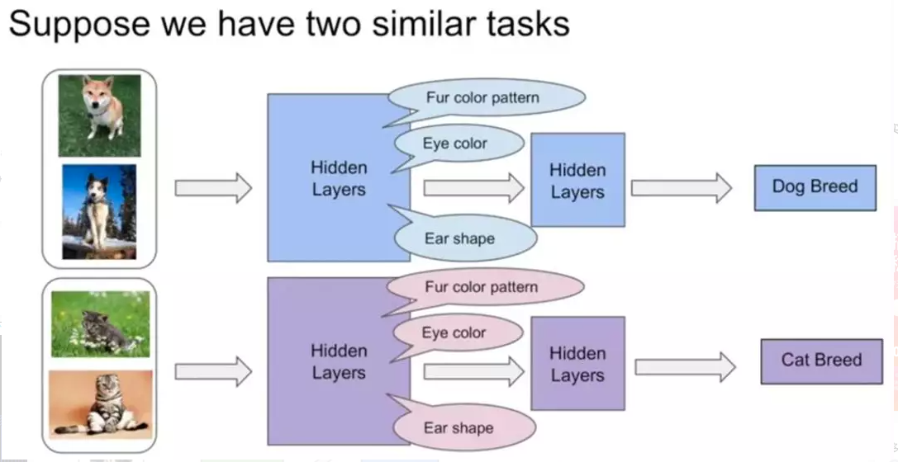
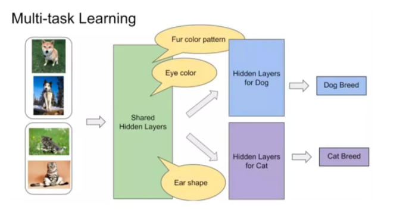
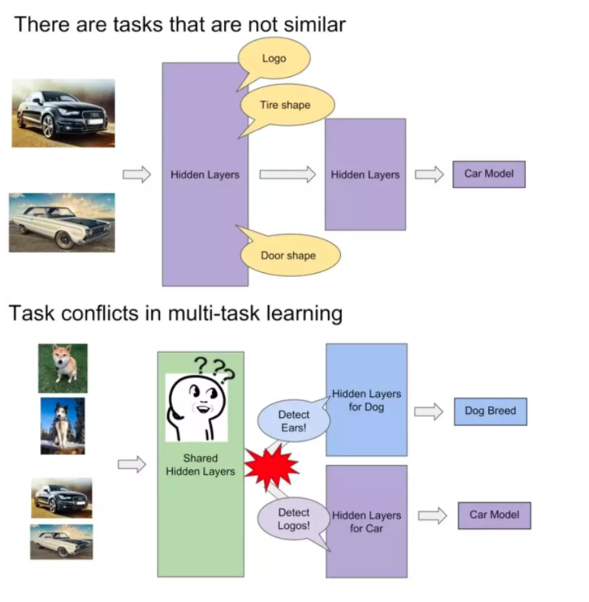
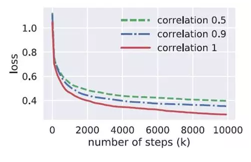
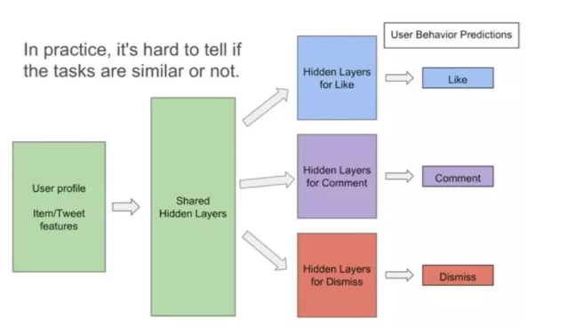
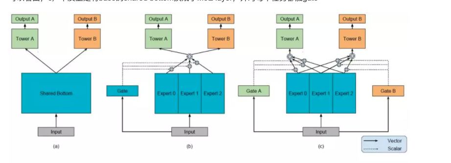
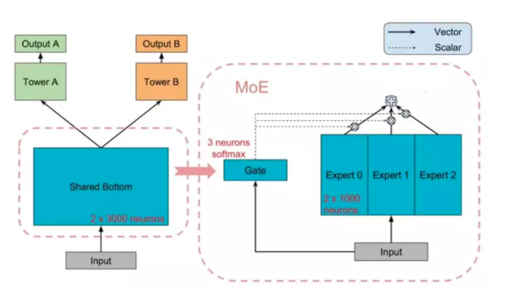
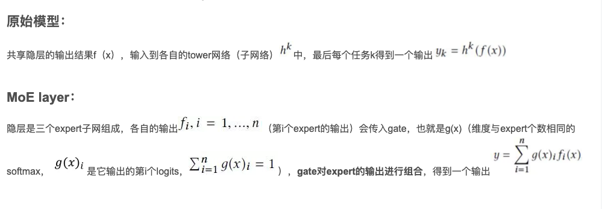
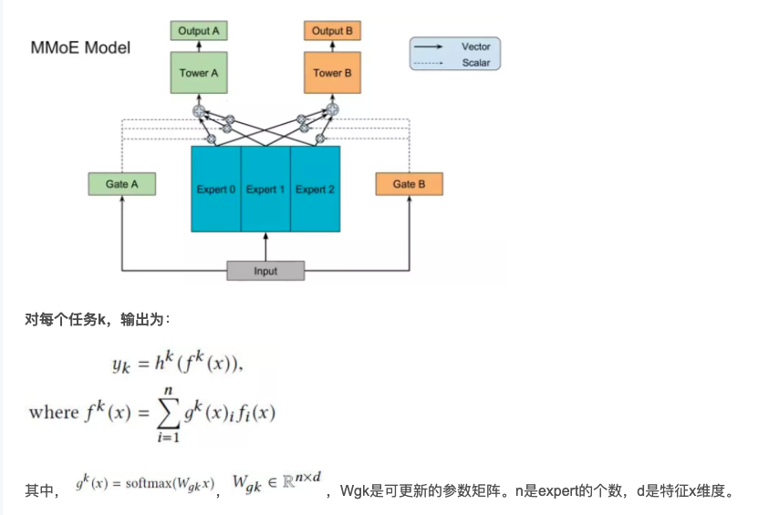

# Multi-gate Mixture-of-Experts 多任务学习模型

Modeling Task Relationships in Multi-task Learning with Multi-gate Mixture-of-Experts
视频简介的youtube地址：
https://www.youtube.com/watch?v=Dweg47Tswxw
一个用keras框架实现的开源地址：
https://github.com/drawbridge/keras-mmoe

##  challenge in MTL
在多任务学习时，同时学习多个相关任务，具有明显优势。

如下图所示，假如有这样两个相似的任务：狗的分类模型和猫的分类模型。在单任务学习中，他们都拥有比较接近的底层特征，比如皮毛颜色啦、眼睛颜色啦、耳朵形状啦等等。

由于多任务学习本质上是共享表示层，任务之间互相影响。那么在多任务学习中，他们就可以很好地进行底层特征共享。

但是对于不相似的任务来说，如下图，汽车的识别和狗的识别，他们的底层表示差异很大，共享表示层可能就没那么有效果了。进行参数共享时很有可能会互相冲突或噪声太多，对多任务学习而言非常不友好。

文章在他们自己生成的数据相关性不同的数据集上（数据生成过程就不介绍了，感兴趣的同学可以去看原文，在原论文3.2节）进行了模型训练效果与相关性之间的实验，这里的correlation是相关性系数：Pearson系数，当它为1时说明两组数据间是完全正相关的，越接近0则相关性越低。在这里进行训练的模型是多任务学习中最基本的shared bottom multi task model（下一节中介绍）。

这张结果图验证了任务相关性越强则训练效果越好。

由于multi task在不相关的任务上表现不佳，同时，在实际应用中，你很难判断任务在数据层面是否是相似的。

所以多任务学习如何在相关性不高的任务上获得好效果是一件很有挑战性也很有实际意义的事。

之前有一些工作有尝试解决这一问题，但是额外参数太多。

基于以上这些原因，这篇文章就被提出来啦。

## MMoE框架&details
关于共享隐层方面，MMoE和一般多任务学习模型的区别：
* 一般多任务学习模型：接近输入层的隐层作为一个整体被共享
* MMoE：将共享的底层表示层分为多个expert，同时设置了gate，使得不同的任务可以多样化的使用共享层

如图，a）是最原始的多任务学习模型，也就是base，b）是加入单门（one gate）的MoE layer的多任务学习模型，c）是文章提出的模型。

可以看出，c）本质上是将base的shared bottom换成了MoE layer，并对每个任务都加gate

接下来介绍组成了MMoE的原始模型和MoE layer

### Shared-bottom Multi-task Model & MoE layer

如上图所示，左边是原始模型，右边是MoE layer。

### MMoE框架&参数更新细节
MMoE实际上就是原始模型+多个门的MoE layer，模型结构如下所示：

然后在这里可能是因为结构图的原因，会有一点不太理解的地方，比如三个expert是怎么切分的？只是对共享隐层的输出进行简单粗暴的切分，还是说各自更新？expert和输入层又是怎么连接的呢，是每个子网络都会和输入全连接，还是说输入也会被分片？

实际上，网络中export是切分的子网络，实现的时候其实可以看做是三维tensor，形状为：

dim of input feature * number of units per expert * number of experts
更新时是对这个三维tensor进行更新。

gate的形状则为：

dim of input feature * number of experts * number of tasks
然后一点网络中的小小小details，贴在这里可以参考一下，帮助理解：

f_{i}(x) = activation(W_{i} * x + b), where activation is ReLU according to the paper
g^{k}(x) = activation(W_{gk} * x + b), where activation is softmax according to the paper
f^{k}(x) = sum_{i=1}^{n}(g^{k}(x)_{i} * f_{i}(x))

## 实验结果
这里贴上文章在三个数据集上的实验结果对比，数据集的具体介绍就不讲了。总而言之就是效果比其他方法好，gate和expert机制在总神经元和其他模型差不多的情况下，是很有效的。

## 参考资料
* [Modeling Task Relationships in Multi-task Learning with Multi-gate Mixture-of-Experts](https://dl.acm.org/citation.cfm?id=3220007)
* [多任务学习模型详解：Multi-gate Mixture-of-Experts（MMoE ，Google，KDD2018）](https://mp.weixin.qq.com/s/EuJ2BOdMqR0zyRtUcdn0kA)
