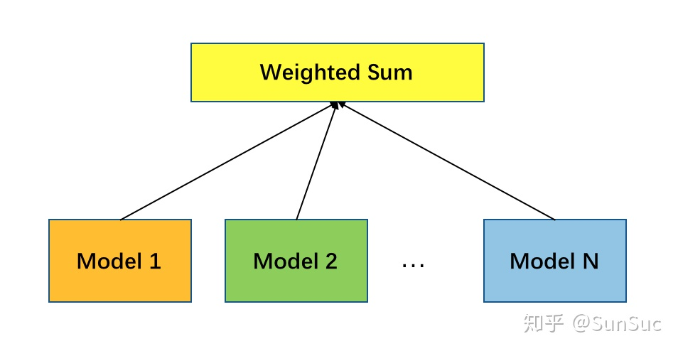
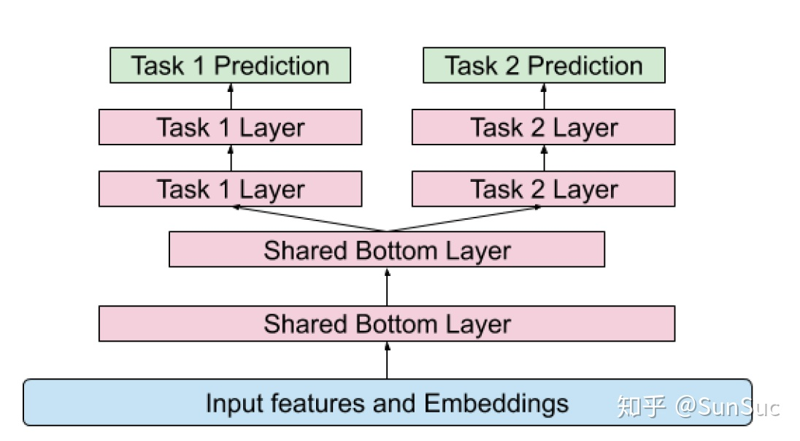
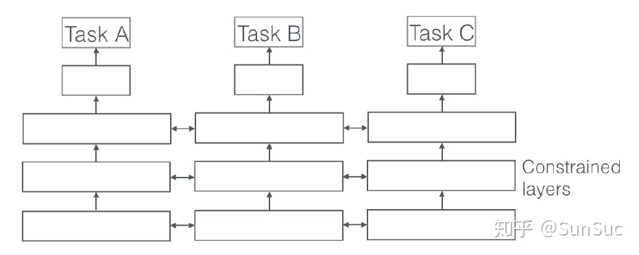
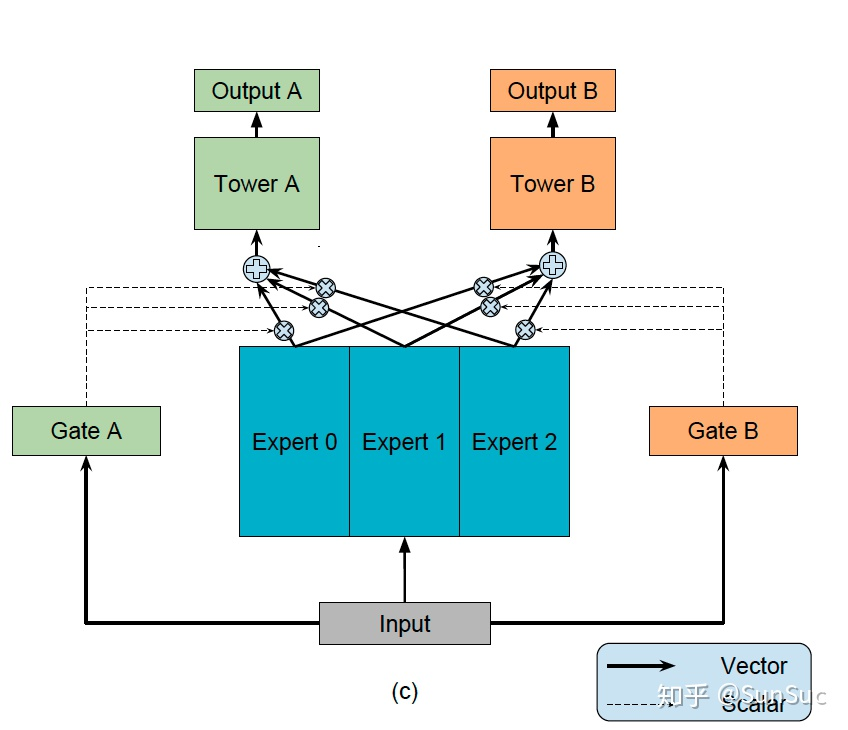
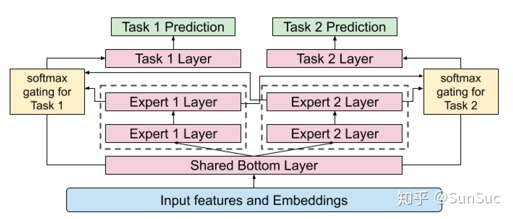

# 推荐系统中如何做多目标优化
在做推荐系统的过程中，我们希望同时优化多个业务目标。比如电商场景中，希望能够在优化GMV的基础上提高点击率，从而提高用户的粘性；在信息流场景中，希望提高用户点击率的基础上提高用户关注，点赞，评论等行为，营造更好的社区氛围从而提高留存。因此推荐系统做到后期，往往会向多目标方向演化，承担起更多的业务目标。下面就介绍几种多目标相关的算法。其中有些是笔者实践过取得了线上的收益，有些是最新的论文中提出的新的解决方案，文章没有公式，易于理解，拿出来和大家一起讨论。

## A 通过sample weight进行多目标优化
该方法是多目标的0.1版本，是rank主模型上的微调，以实现多目标。这里以信息流场景为例，我们的主目标是feed的点击率，用户在feed上的任何点击行为都被认为是正反馈。与此同时，在feed中的点赞功能是我们希望boost的功能。此时点击和点赞都是正样本（点赞本身也是一种点击行为），但是点赞的样本可以设置更高的sample weight。模型训练在计算梯度更新参数时，梯度要乘以权重，对sample weight大的样本给予更大的权重。直观理解，对于sample weight大的样本，如果预测错误就会带来更大的损失。通过这种方法能够在优化某个目标（点击率）的基础上，优化其他目标（点赞率）。实际AB测试会发现，这样的方法，目标A会受到一定的损失换取目标B的增长。通过线上AB测试和sample weight调整的联动，可以保证在可接受的A目标损失下，优化目标B，实现初级的多目标优化。

* 优点:
    * 模型简单，仅在训练时通过梯度上乘sample weight实现对某些目标的boost或者decay
    * 带有sample weight的模型和线上的base模型完全相同，不需要架构的额外支持，可以作为多目标的第一个模型尝试。
* 缺点：
    * 本质上并不是对多目标的建模，而是将不同的目标折算成同一个目标。相关的折算可能需要多次AB测试才能确定。此处有点难理解，设置sample weight，本质上是用base样本去度量其他样本。比如认为一个点赞算两次点击。比如在视频中停留了5min是等价于2次对视频的点击行为等。
    * 从原理上讲无法达到最优，多目标问题本质上是一个帕累托寻找有效解的过程。有很多文章给出多目标的数学建模，如[1]。我们后续从这些文章中给出更详细的证明。
## B 多个模型 stacking
这个思路是也是很直接的。我们有多个优化的目标，每个优化的目标都有一个独立的模型来优化。可以根据优化目标的不同，采用更匹配的模型。如视频信息流场景中，我们用分类模型优化点击率，用回归模型优化停留时长。不同的模型得到预测的score之后，通过一个函数将多个目标融合在一起。

最常见的是weighted sum融合多个目标，给不同的目标分配不同的权重。当然，融合的函数可以有很多，比如连乘或者指数相关的函数，这里和业务场景和目标的含义强相关，可以根据自己的实际场景探索。

* 优点:
    * 模型简单
* 缺点：
    * 线上serving部分需要有额外的时间开销，通常我们采用并行的方式请求两个模型进行融合。
    * 多个模型之间相互独立，不能互相利用各自训练的部分作为先验，容易过拟合。
    
## C Shared bottom NN model
多个模型stacking会带来更多的训练参数，导致模型的规模变大。这种情况在NN模型中更为常见，从而带来过拟合的风险。因此在基于深度学习的推荐模型中，引入了shared bottom layer来加强参数共享。多个目标的模型可以联合训练，减小模型的参数规模，防止模型过拟合。具体模型结果如下：

但是问题也显而易见，由于不同的任务最终预测的目标不同。而共享参数一定程度上限制了不同目标的特异性，最终训练的效果就会打折扣。因此Shared bottom NN model能够成功的前提，是预测的目标之间的相关性比较高。这样参数共享层不会带来太大的损失。在[2]中有相关的实验证明，当任务的相关性越高，模型的loss会下降，模型的准确度才会更高。所以，在文献[3]的中，也提出了一些任务之间相关性衡量的方法，以及如何在众多任务中选择合适的任务子集做多目标学习。

在参数共享中，还有一类方法是soft parameter sharing的方法。

在这个NN的场景中，通过给模型参数之间距离加正则化，鼓励参数趋于一致，从而减小过拟合的风险，同时也为训练样本少的模型提供一些先验信息。但是在实际的推荐系统多目标优化中，没有看到类似的模型结构，可能是因为线上serving的时候计算量显著高于shared bottom NN model，且效果也不一定好。

## MMoE 
MMoE是Google的研究人员提出的一种NN模型中多目标优化的模型结构[2]。在Recsys 2019中，我们也发现，Google已经将MMoE用在Youtube中进行视频相关推荐[4]。MMoE为每一个模型目标设置一个gate，所有的目标共享多个expert，每个expert通常是数层规模比较小的全连接层。gate用来选择每个expert的信号占比。每个expert都有其擅长的预测方向，最后共同作用于上面的多个目标。

此处我们可以将每一个gate认为是weighted sum pooling操作。如果我们选择将gate换成max操作。x为输入，g(x)中分量最大值对应的expert被唯一选中，向上传递信号。如果g(x)与input无关，则模型退化成多个独立的NN模型stacking，这样就便于我们更方便理解模型的进化关系。Recsys 2019 Google的文章，是在shared bottom layer上面增加MMoE层。这样做是为了减少模型的复杂度，降低训练的参数数量。只不过此处的shared bottom layer层数很少，推荐系统中特征的输入非常稀疏，input对应的参数维度很大，因此先作用于浅层的shared bottom layer，有利于减小上层MMoE的模型复杂度，也减少线上serving的开销。

先介绍这些多目标相关的优化算法，这些算法中A，C是经过业务验证可行的算法，大家可以优先尝试。欢迎大家留言讨论。

## 参考资料
* [推荐系统中如何做多目标优化](https://zhuanlan.zhihu.com/p/96796043)
* Lin X, Chen H, Pei C, et al. A pareto-efficient algorithm for multiple objective optimization in e-commerce recommendation[C]//Proceedings of the 13th ACM Conference on Recommender Systems. ACM, 2019: 20-28.
* Ma J, Zhao Z, Yi X, et al. Modeling task relationships in multi-task learning with multi-gate mixture-of-experts[C]//Proceedings of the 24th ACM SIGKDD International Conference on Knowledge Discovery & Data Mining. ACM, 2018: 1930-1939.
* Ruder S. An overview of multi-task learning in deep neural networks[J]. arXiv preprint arXiv:1706.05098, 2017.
* Zhao Z, Hong L, Wei L, et al. Recommending what video to watch next: A multitask ranking system[C]//Proceedings of the 13th ACM Conference on Recommender Systems. ACM, 2019: 43-51.

