# MFCC,搜索-解码,嵌入式训练
讲完声学模型的建立,现在我们就来讲讲它的输入和输出应该怎么处理.

## 梅尔频率倒谱系数(MFCC)
在一个ASR系统中,第一步要做的就是特征提取.从前面的计算音系学部分可知,声音的音高等信息能体现一个人的语音特性.一个人的语音特性可以体现在声道的形状上,如果可以准确知道这个形状,那么我们就可以对产生的音素进行准确的描述.

声道的形状在语音短时功率谱的包络中显示出来.而MFCCs就是一种准确描述这个包络的一种特征.下面讲解MFCC的获取流程.

### MFCC获取流程
1) 首先我们有一个声谱,它长成下面这个样子.它的横轴代表时间,纵轴代表振幅.很常见.

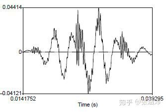

2) 我们知道ASR系统的实现是基于帧的,每帧大概10ms或者20ms.这样声音就变成了一个一个离散的片段.因为防止分帧时信息的丢失,因此帧与帧之间是有交叉的.

3)有了帧后,我们对其进行短时快速傅里叶变换(短时FFT)就得到了频谱.频谱表示频率与能量的关系.在实际应用中,频谱大体分为线性振幅谱,对数振幅谱和自功率谱.对于对数振幅谱由于振幅进行了对数计算,因此从坐标为分贝.

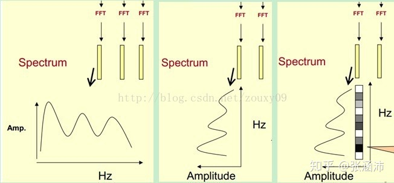

有时为了将时间信息加进来,我们把这些幅度映射到一个灰度级表示,幅度越大则颜色越深.如下图所示:

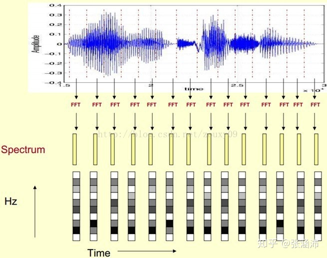

此时的声谱就很有用啦~首先通过声谱我们可以观察出音素的属性,另外通过共振幅和它的转变可以很好的识别声音.同事还可以直观的评估TTS系统.

4) 准备提取包络啦,上面我们说到在语音的频谱图中,峰值表示语音的主要频率成分(共振峰),它携带了声音的辨识属性.同时我们也要获得峰值的变化情况,总结起来我们就是要获取这个频谱的包络...

下图给出一个常见的频谱图,其中红色部分就是我们想要的包络.

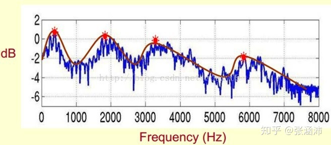

为了获取它我们先对频谱做FFT,由于是在频谱上做,所以相当于逆傅里叶变换(IFFT),需要注意的是我们是在频谱的对数域上处理的,此时在对数频谱上做IFFT就相当于在一个伪频率坐标轴上描述信号.

下图给出结果,可以看到,包络主要由在伪频率坐标轴上的低频部分描述,而细节部分则主要由高频部分描述.因此我们将频谱 $log x[K]$ 处理得到$x[k]$加一个低通滤波器就可以得到包络了.

上述六成总结如下图所示:

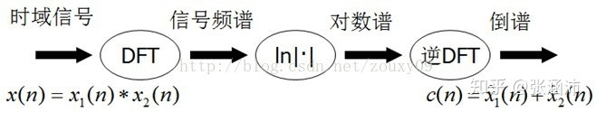

5) 我们上面获得了倒谱,那什么是梅尔倒谱呢?

想了解它就要首先说一说梅尔频率,实验发现,人耳就像一个滤波器一样,在低频部分(1000Hz以下)性能超级好,但高频部分感觉就没那么灵敏了.因此人耳是一个非线性系统,梅尔频率就是基于该想法,它将不统一的频率转回统一的频率,在梅尔频域内,人对音调的感知度为线性关系.

将普通频率转化为梅尔频率的公式为:

$mel(f) = 2565 \times log_{10}(1+f/700)$

用图表示为:

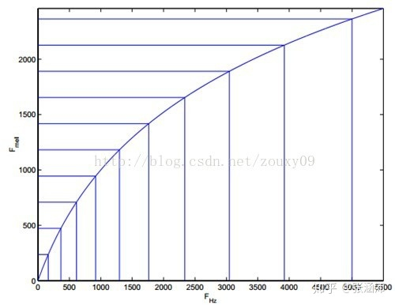

梅尔频谱上面获得的倒谱系数就成为梅尔频率倒谱系数,简称MFCC.

### 小结
* 先对语音进行预加重、分帧和加窗；（加强语音信号性能（信噪比，处理精度等）的一些预处理）
* 对每一个短时分析窗，通过FFT得到对应的频谱；（获得分布在时间轴上不同时间窗内的频谱）
* 将上面的频谱通过Mel滤波器组得到Mel频谱；（通过Mel频谱，将线形的自然频谱转换为体现人类听觉特性的Mel频谱）
* 在Mel频谱上面进行倒谱分析（取对数，做逆变换，实际逆变换一般是通过DCT离散余弦变换来实现，取DCT后的第2个到第13个系数作为MFCC系数），获得Mel频率倒谱系数MFCC，这个MFCC就是这帧语音的特征；（倒谱分析，获得MFCC作为语音特征）

这样就可以通过这些倒谱向量对语音分类器进行训练和识别了。

## 解码
解码就是在此处指的是给定声学观察量的情况下,我们怎样选取最高先验概率的文本.这里我们采用维特比算法对其进行解码.任务就选用数字识别任务,因为它比较简单,词汇量也小.

首先我们明确一下HMM模型的基本组分:

$Q = q_{1}q_{2}\ldots q_{N}~~ $表示一系列子音素状态.

$A = a_{01}a_{02}\ldots a_{n1}\ldots a_{nm}~~ $表示转移矩阵A,一个状态可以转移到下一个状态也可以转回自身.

$B= b_{i}(o_{t})~~ $可观察量的似然值,也叫发射概率:由子音素态i产生倒谱特征向量 $o_{t}$ 的概率.

明确以上变量后,我们需要知道HMM的结构,对于数字识别任务来说它可以来自于词典和发音词典.这样对于每个数字的HMM结构,我们讲发音词典中的音素分为三个子音素,并把他们连接起来.为了更符合实际,我们还在每个音素之间加上静音状态.将他们连在一起就形成如下图所示的状态.

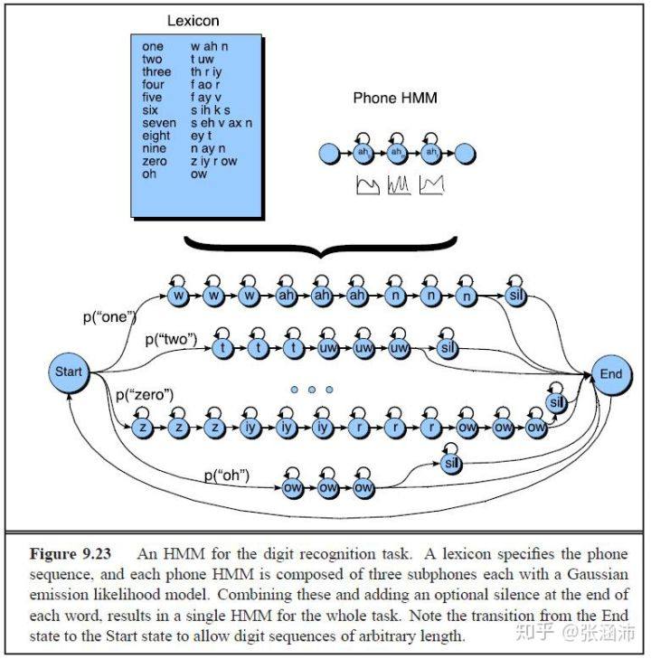

好了,准备工作结束,可以用维特比算法了.

每维特比算子 $v_{t}(j)$ 表示在HMM的状态j时,它通过了最可能的状态序列 $q_{1}q_{2}\ldots q_{t-1}$ 并生成了可观察状态 $o_{1}o_{2}\ldots o_{t}$ 的概率.公式表达为:

$v_{t}(j) = \max\limits_{i=1}^{N}v_{t-1}(i)a_{ij}b_{j}(o_{t})$

其中:

$v_{t-1}(i)~~$ 是时间t-1的维特比算子;

$a_{ij}~~$ 是状态 $q_{i}$ 转移到 $q_{j}$ 的概率;

$b_{j}(o_{t})~~$ 表示发射概率;

给定了以上状态后,我们就可以使用前面介绍的维特比算法进行计算了.下面给出维特比算法的流程以便回忆.

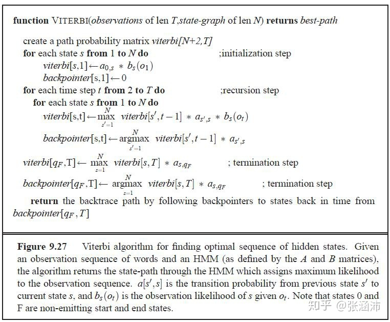

好了,上面对数字识别任务的解码做了简要概述,但实际应用中可不是每个词的开始和结束都那么明显,往往都是一个词直接连着下一个词,对于这种情况我们需建立对应的HMM结构,下图给出一个2-gram的HMM结构.

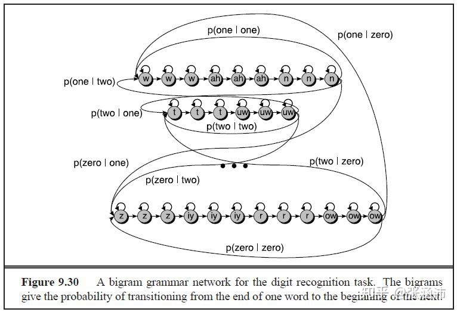

此时一个词的结尾子音素直接转移到下一个词的开始子音素,当然这种转移我们可以借助 P(W) 来帮助我们解决.下图给出此时的维特比格点图:

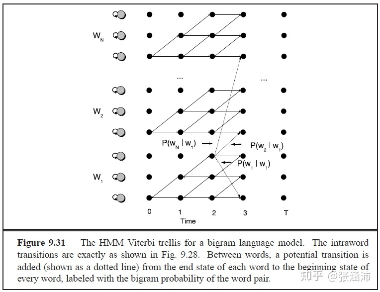

## 嵌入式训练
在之前的部分,我们完成了声学特征向量提取,声学模型的建立,HMM的解码等部分,现在我们来介绍训练部分.

最理想的情况是使用手动标记的标签数据集,其中每个声音中的词都被手动分开标记,并且其中的音素也都被很好的标记.我们只需要简单的对其进行统计学习得到转移矩阵A和发射概率B即可.但现实是人工对每帧进行标记工作量太大了甚至不可能完成,因此语音标记系统会在整个句子上对每个音素进行嵌入式训练,它将在训练步骤中自动完成词汇切分,音素对齐的工作.下面以简单数字语音识别系统来作为例子介绍.

数字识别任务中的每个波形文件包含一串数字,同事该数据集还提供了发音词典和音素集等同来定义HMM的状态(未训练).这样,对于每个句子,我们就可以建立一系列的HMM状态了,如下图所示.

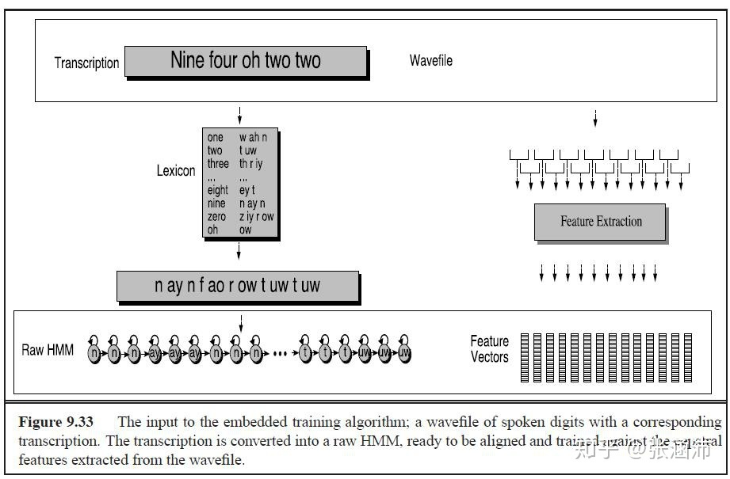

现在我们可以使用Baum-Welch算法来对其进行训练得到转移矩阵A和发射概率B.其中A的初始化可以设置为0.5或0.B的初始化概率可以通过设置高斯函数的均值和方差等于全体训练数据集的均值和方差.

除了上面的Baum-Welch算法外,我们还有另一个更高效的训练方法-Viterbi 训练.它不是采用BW算法的那种累加所有可能路径的方式,而是只计算最优的概率路径.这种在训练数据集上跑Viterbi算法的方法叫维特比对齐或强制对齐(forced alignment),

在维特比训练中,我们知道哪个词对应的观察量,所以我们可以通过设定合适的转移概率强制使维特比算法通过确定的词.因此强制维特比算法就被简化成了通常的维特比解码问题,即只需要指出正确的音素状态序列而不需要考虑词序列.因此强制对齐的结果就是一条对应于训练可观察序列的最佳路径.我们就可以用这种对齐 的HMM状态到可观察态上来重新计算HMM的参数.重复这个过程知道HMM的参数收敛即可.

## 多通道解码
介绍了基于Viterbi算法的解码方案。但在实际中的应用，它有两个主要的限制。第一个是因为Viterbi算法算法返回的实际上不是最大概率的单词序列，而是计算与这样的单词序列的近似。这就带来了与实际最大值间的差别，在大多数情况下这种差别并不重要，但对于解码问题来说，有时概率醉倒的音子序列并不对应于概率最大的单词序列。如一个单词具有多个发音时，由于概率归一的影响，通过它的分支概率就会较小，这样算法就会倾向于选择概率较大的分支较少的词，从而带来错误。

另一个限制是它不能用于所有的语言模型。这个限制来自于Viterbi算法的既有事实，即破坏了动态规划恒定的假定。简单来说就是该假定要求一个最佳路径一定包含一直到状态 $q_{i}$ 之前和 $q_{i}$ 本身在内的最佳路径。但三元语法显然有可能会破坏这点。

因为这两个限制的存在，人们给出两种解决方案：

### 修改Viterbi算法
修改Viterbi解码算法，让它返回多个潜在的语段。然后再使用其他更复杂的语言模型或发音模型算法，重新给多个输出排序。一般来说，这种多遍解码方法在计算上是有效的，但若先使用二元语法这种不太复杂的模型来进行第一遍粗解码，然后在使用更复杂但速度较慢的解码算法继续工作就可以减少搜索空间。

例如Wchwartz提出的一种类似于Viterbi的算法，称为N-best Viterbi算法。对于给定的语音输入，这种算法返回N个最佳的句子，每个句子带有它们的似然度打分。然后使用三元语法给每个句子指派一个新语言模型的先验概率。这些先验概率与每个句子的声学模型似然度结合，生成每个句子的后验概率。然后使用这种更复杂的概率重新给句子打分。下图给出该方法的示例图：

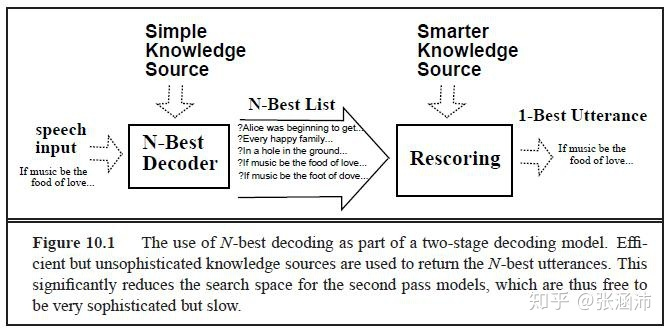

还有另一种方案也是用N-best的办法来提升Viterbi算法，但返回的不是一个句子表，而是一个单词格。单词格是单词的有向图，单词之间用单词格连接之后就可以对大量的句子进行紧致的编码。在格中的每个单词使用它们的观察似然度来扩充，这样通过格的任何路径肚皮可以与更复杂的语言模型中推到的先验概率结合起来进行改进。

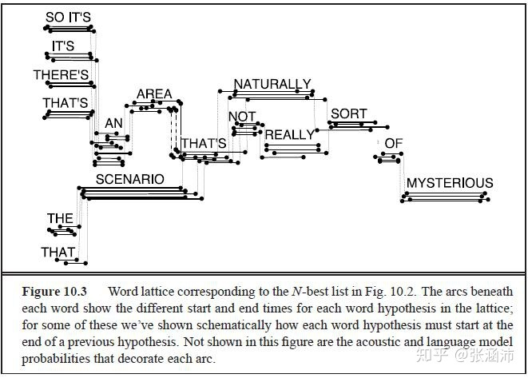

使用 $A^{*}$ 算法
Placeholder

## 三音子模型
之前我们讨论的都是单音素模型，但我们知道发声是会收到前后文影响的。因此提出三音子模型(Triphone Model).一个三音子模型表示在左右文本限定情况下的音素模型。举例来说，一个三音子  $[y-eh+l]$ 表示 $[eh]$ 的前面是 $[y]$ ，后面跟着 $[l]$ 。当凑不齐三个时，也可以使用其中的两个来表示，如 $[y-eh]$ 表示 $[eh]$ 前面是 $[y]$ ， $[eh+l]$ 表示 $[eh]$ 后面是 $[l]$ 。

虽然三音子的引入能够帮助我们捕捉声音中的变化，但也同时带来了稀疏性问题。假设我们有50个单音素，那组合起来就是 $50^{3} = 125, 000$ 个三音子，而且其中很大部分是不常见甚至不存在的。为了减少三音子的数量，Young提出了子音素绑定的方法。其主要思想为将那些相似的音素归为一类(Cluster)。如 $[m-eh+d]$ 和 $[n-eh+d]$ 这两个三音子，将它们归为一类后就可以采用一个高斯模型来训练它们。

那怎么判断哪些音素该被归为一类呢？最常用的方法是决策树。从根节点开始，如 $/ih/$ ，在每个节点都问一些问题并对其分类，直到最终类别为止。下图给出一个决策树分类的例子。这个决策树的训练也和正常的决策树训练类似，对于每个节点，它会考虑新分支将会给训练数据的声学模型似然度带来的影响并选择似然度最大那个节点和问题。如此反复进行迭代制止到达叶子节点。

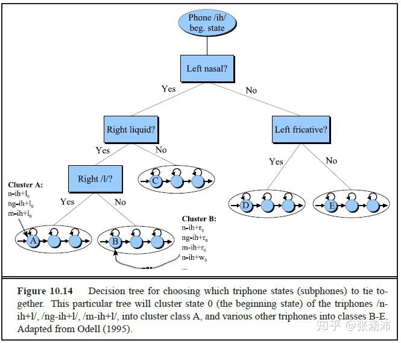

下图给出一个完整的给予上下文的GMM三音子模型的建立，其中采用的是 two cloning-and-retraining 流程，具体这里就不展开介绍了。

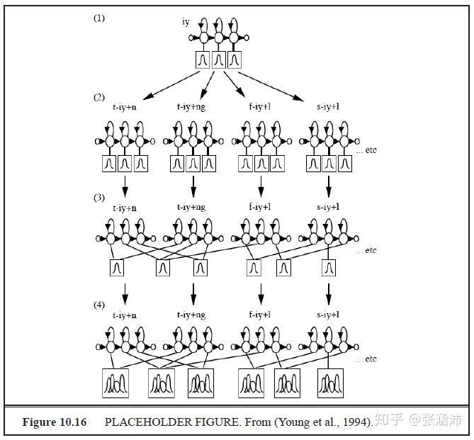

## 参考文献

1. [1] Speech and Language Processing 2nd; ch10
2. https://zhuanlan.zhihu.com/p/39394336
3. https://zhuanlan.zhihu.com/p/39393033

