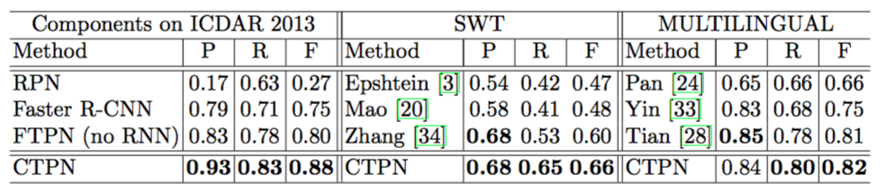

# OCR识别之CTPN
本论文翻译，摘抄自[CRNN论文翻译——中文版](http://noahsnail.com/2018/02/02/2018-02-02-Detecting%20Text%20in%20Natural%20Image%20with%20Connectionist%20Text%20Proposal%20Network%E8%AE%BA%E6%96%87%E7%BF%BB%E8%AF%91%E2%80%94%E2%80%94%E4%B8%AD%E6%96%87%E7%89%88/)

## 摘要
我们提出了一种新颖的连接文本提议网络（CTPN），它能够准确定位自然图像中的文本行。CTPN直接在卷积特征映射中的一系列细粒度文本提议中检测文本行。我们开发了一个垂直锚点机制，联合预测每个固定宽度提议的位置和文本/非文本分数，大大提高了定位精度。序列提议通过循环神经网络自然地连接起来，该网络无缝地结合到卷积网络中，从而形成端到端的可训练模型。这使得CTPN可以探索丰富的图像上下文信息，使其能够检测极其模糊的文本。CTPN在多尺度和多语言文本上可靠地工作，而不需要进一步的后处理，脱离了以前的自底向上需要多步后过滤的方法。它在ICDAR 2013和2015的基准数据集上达到了0.88和0.61的F-measure，大大超过了最近的结果[8，35]。通过使用非常深的VGG16模型[27]，CTPN的计算效率为0.14s每张图像。在线演示获取地址：http://textdet.com/。

## 引言
在自然图像中阅读文本最近在计算机视觉中引起越来越多的关注[8，14，15，10，35，11，9，1，28，32]。这是由于它的许多实际应用，如图像OCR，多语言翻译，图像检索等。它包括两个子任务：文本检测和识别。这项工作的重点是检测任务[14，1，28，32]，这是比在一个良好的裁剪字图像[15，9]进行的识别任务更具有挑战性。文本模式的大变化和高度杂乱的背景构成了精确文本定位的主要挑战。

目前的文本检测方法大多采用自下而上的流程[28，1，14，32，33]。它们通常从低级别字符或笔画检测开始，后面通常会跟随一些后续步骤：非文本组件过滤，文本行构建和文本行验证。这些自底向上的多步骤方法通常复杂，鲁棒性和可靠性较差。它们的性能很大程度上依赖于字符检测的结果，并且已经提出了连接组件方法或滑动窗口方法。这些方法通常探索低级特征（例如，基于SWT[3，13]，MSER[14，33，23]或HoG[28]）来区分候选文本和背景。但是，如果没有上下文信息，他们不能鲁棒的单独识别各个笔划或字符。例如，相比单个字符人们更信任一个字符序列，特别是当一个字符非常模糊时。这些限制在字符检测中通常会导致大量非文本组件，在后续步骤中的主要困难是处理它们。此外，正如[28]所指出的，这些误检很容易在自下而上的过程中连续累积。为了解决这些问题，我们利用强大的深度特征直接在卷积映射中检测文本信息。我们开发的文本锚点机制能在细粒度上精确预测文本位置。然后，我们提出了一种网内循环架构，用于按顺序连接这些细粒度的文本提议，从而允许它们编码丰富的上下文信息。

深度卷积神经网络（CNN）最近已经基本实现了一般物体检测[25，5，6]。最先进的方法是Faster Region-CNN（R-CNN）系统[25]，其中提出了区域提议网络（RPN）直接从卷积特征映射中生成高质量类别不可知的目标提议。然后将RPN提议输入Faster R-CNN[5]模型进行进一步的分类和微调，从而实现通用目标检测的最新性能。然而，很难将这些通用目标检测系统直接应用于场景文本检测，这通常需要更高的定位精度。在通用目标检测中，每个目标都有一个明确的封闭边界[2]，而在文本中可能不存在这样一个明确定义的边界，因为文本行或单词是由许多单独的字符或笔划组成的。对于目标检测，典型的正确检测是松散定义的，例如，检测到的边界框与其实际边界框（例如，PASCAL标准[4]）之间的重叠>0.5，因为人们可以容易地从目标的主要部分识别它。相比之下，综合阅读文本是一个细粒度的识别任务，需要正确的检测，覆盖文本行或字的整个区域。因此，文本检测通常需要更准确的定义，导致不同的评估标准，例如文本基准中常用的Wolf标准[19，21]。

在这项工作中，我们通过将RPN架构[25]扩展到准确的文本行定义来填补这个空白。我们提出了几种技术发展，针对我们的问题可以优雅地调整通用目标检测模型。我们通过提出一种网络内循环机制争取更进一步，使我们的模型能够直接在卷积映射中检测文本序列，避免通过额外昂贵的CNN检测模型进行进一步的后处理。

### 贡献
我们提出了一种新颖的连接文本提议网络（CTPN），它可以直接定位卷积层中的文本序列。这克服了以前的建立在字符检测基础上的自下而上方法带来的一些主要限制。我们利用强深度卷积特性和共享计算机制的优点，提出了如图1所示的CTPN架构。主要贡献如下：

图1：（a）连接文本提议网络（CTPN）的架构。我们通过VGG16模型[27]的最后一个卷积映射（conv5）密集地滑动3×3空间窗口。每行的序列窗口通过双向LSTM（BLSTM）[7]循环连接，其中每个窗口的卷积特征（3×3×C）被用作256维的BLSTM（包括两个128维的LSTM）的输入。RNN层连接到512维的全连接层，接着是输出层，联合预测k个锚点的文本/非文本分数，y轴坐标和边缘调整偏移。（b）CTPN输出连续的固定宽度细粒度文本提议。每个框的颜色表示文本/非文本分数。只显示文本框正例的分数。

首先，我们将文本检测的问题转化为一系列细粒度的文本提议。我们开发了一个锚点回归机制，可以联合预测每个文本提议的垂直位置和文本/非文本分数，从而获得出色的定位精度。这背离了整个目标的RPN预测，RPN预测难以提供令人满意的定位精度。

其次，我们提出了一种在卷积特征映射中优雅连接序列文本提议的网络内循环机制。通过这种连接，我们的检测器可以探索文本行有意义的上下文信息，使其能够可靠地检测极具挑战性的文本。

第三，两种方法无缝集成，以符合文本序列的性质，从而形成统一的端到端可训练模型。我们的方法能够在单个过程中处理多尺度和多语言的文本，避免进一步的后过滤或细化。

第四，我们的方法在许多基准数据集上达到了新的最先进成果，显著改善了最近的结果（例如，0.88的F-measure超过了2013年ICDAR的[8]中的0.83，而0.64的F-measure超过了ICDAR2015上[35]中的0.54 ）。此外，通过使用非常深的VGG16模型[27]，这在计算上是高效的，导致了每张图像0.14s的运行时间（在ICDAR 2013上）。

## 相关工作
首先，我们将文本检测的问题转化为一系列细粒度的文本提议。我们开发了一个锚点回归机制，可以联合预测每个文本提议的垂直位置和文本/非文本分数，从而获得出色的定位精度。这背离了整个目标的RPN预测，RPN预测难以提供令人满意的定位精度。

其次，我们提出了一种在卷积特征映射中优雅连接序列文本提议的网络内循环机制。通过这种连接，我们的检测器可以探索文本行有意义的上下文信息，使其能够可靠地检测极具挑战性的文本。

第三，两种方法无缝集成，以符合文本序列的性质，从而形成统一的端到端可训练模型。我们的方法能够在单个过程中处理多尺度和多语言的文本，避免进一步的后过滤或细化。

第四，我们的方法在许多基准数据集上达到了新的最先进成果，显著改善了最近的结果（例如，0.88的F-measure超过了2013年ICDAR的[8]中的0.83，而0.64的F-measure超过了ICDAR2015上[35]中的0.54 ）。此外，通过使用非常深的VGG16模型[27]，这在计算上是高效的，导致了每张图像0.14s的运行时间（在ICDAR 2013上）。

## 网络结构
本节介绍连接文本提议网络（CTPN）的细节。它包括三个关键的贡献，使文本定位可靠和准确：检测细粒度提议中的文本，循环连接文本提议和边缘细化。

### 在细粒度提议中检测文本
类似于区域提议网络（RPN）[25]，CTPN本质上是一个全卷积网络，允许任意大小的输入图像。它通过在卷积特征映射中密集地滑动小窗口来检测文本行，并且输出一系列细粒度的（例如，宽度为固定的16个像素）文本提议，如图1（b）所示。

我们以非常深的16层vggNet（VGG16）[27]为例来描述我们的方法，该方法很容易应用于其他深度模型。CTPN的架构如图1（a）所示。我们使用一个小的空间窗口3×3来滑动最后的卷积层特征映射（例如，VGG16的conv5）。conv5特征映射的大小由输入图像的大小决定，而总步长和感受野分别固定为16个和228个像素。网络架构决定总步长和感受野。在卷积层中使用滑动窗口允许它共享卷积计算，这是减少昂贵的基于滑动窗口的方法的计算量的关键。

通常，滑动窗口方法采用多尺度窗口来检测不同尺寸的目标，其中一个窗口尺度被固定到与目标的尺寸相似。在[25]中，Ren等人提出了一种有效的锚点回归机制，允许RPN使用单尺度窗口检测多尺度目标。关键的洞察力是单个窗口能够通过使用多个灵活的锚点来预测各种尺度和长宽比的目标。我们希望将这种有效的锚点机制扩展到我们的文本任务。然而，实质上文本与普通目标不同，它们通常具有明确的封闭边界和中心，可以从它的一部分推断整个目标[2]。文本是一个没有明显封闭边界的序列。它可能包含多层次的组件，如笔划，字符，单词，文本行和文本区域等，这些组件之间没有明确区分。文本检测是在单词或文本行级别中定义的，因此通过将其定义为单个目标（例如检测单词的一部分）可能很容易进行错误的检测。因此，直接预测文本行或单词的位置可能很难或不可靠，因此很难获得令人满意的准确性。一个例子如图2所示，其中RPN直接被训练用于定位图像中的文本行。

图2：左：RPN提议。右：细粒度的文本提议。

我们寻找文本的独特属性，能够很好地概括各个层次的文本组件。我们观察到由RPN进行的单词检测很难准确预测单词的水平边，因为单词中的每个字符都是孤立的或分离的，这使得查找单词的开始和结束位置很混乱。显然，文本行是一个序列，它是文本和通用目标之间的主要区别。将文本行视为一系列细粒度的文本提议是很自然的，其中每个提议通常代表文本行的一小部分，例如宽度为16个像素的文本块。每个提议可能包含单个或多个笔划，字符的一部分，单个或多个字符等。我们认为，通过固定每个提议的水平位置来预测其垂直位置会更准确，水平位置更难预测。与预测目标4个坐标的RPN相比，这减少了搜索空间。我们开发了垂直锚点机制，可以同时预测每个细粒度提议的文本/非文本分数和y轴的位置。检测一般固定宽度的文本提议比识别分隔的字符更可靠，分隔字符容易与字符或多个字符的一部分混淆。此外，检测一系列固定宽度文本提议中的文本行也可以在多个尺度和多个长宽比的文本上可靠地工作。

为此，我们设计如下的细粒度文本提议。我们的检测器密集地调查了conv5中的每个空间位置。文本提议被定义为具有16个像素的固定宽度（在输入图像中）。这相当于在conv5的映射上密集地移动检测器，其中总步长恰好为16个像素。然后，我们设计k个垂直锚点来预测每个提议的y坐标。k个锚点具有相同的水平位置，固定宽度为16个像素，但其垂直位置在k个不同的高度变化。在我们的实验中，我们对每个提议使用十个锚点，k=10，其高度在输入图像中从11个像素变化到273个像素（每次÷0.7）。明确的垂直坐标是通过提议边界框的高度和y轴中心来度量的。我们计算相对于锚点的边界框位置的相对预测的垂直坐标（v），如下所示：
$ v_c=(c_y-c_y^a)/h^a, \qquad v_h=\log (h/h^a) \tag{1} $
$ v^*_c=(c^*_y-c_y^a)/h^a, \qquad v^*_h=\log (h^*/h^a)\tag{2} $

其中$\textbf{v}=\lbrace v_c,v_h \rbrace$ 和 $\textbf{v}^*=\lbrace v^*_c,v^*_h\rbrace$ 分别是相对于预测坐标和实际坐标。$c_y^a$和$h^a$是锚盒的中心（y轴）和高度，可以从输入图像预先计算。$c_y$和h是输入图像中预测的y轴坐标，而$c^*_y$和$y^*$是实际坐标。因此，如图1（b）和图2（右）所示，每个预测文本提议都有一个大小为h×16的边界框（在输入图像中）。一般来说，文本提议在很大程度上要比它的有效感受野228×228要小。

检测处理总结如下。给定输入图像，我们有W×H×C conv5特征映射（通过使用VGG16模型），其中C是特征映射或通道的数目，并且W×H是空间布置。当我们的检测器通过conv5密集地滑动3×3窗口时，每个滑动窗口使用3×3×C的卷积特征来产生预测。对于每个预测，水平位置（x轴坐标）和k个锚点位置是固定的，可以通过将conv5中的空间窗口位置映射到输入图像上来预先计算。我们的检测器在每个窗口位置输出k个锚点的文本/非文本分数和预测的y轴坐标（v）。检测到的文本提议是从具有>0.7（具有非极大值抑制）的文本/非文本分数的锚点生成的。通过设计的垂直锚点和细粒度的检测策略，我们的检测器能够通过使用单尺度图像处理各种尺度和长宽比的文本行。这进一步减少了计算量，同时预测了文本行的准确位置。与RPN或Faster R-CNN系统[25]相比，我们的细粒度检测提供更详细的监督信息，自然会导致更精确的检测。

### 循环连接文本提议
为了提高定位精度，我们将文本行分成一系列细粒度的文本提议，并分别预测每个文本提议。显然，将每个孤立的提议独立考虑并不鲁棒。这可能会导致对与文本模式类似的非文本目标的误检，如窗口，砖块，树叶等（在文献[13]中称为类文本异常值）。还可以丢弃一些含有弱文本信息的模糊模式。图3给出了几个例子（上）。文本具有强大的序列特征，序列上下文信息对做出可靠决策至关重要。最近的工作已经证实了这一点[9]，其中应用递归神经网络（RNN）来编码用于文本识别的上下文信息。他们的结果表明，序列上下文信息极大地促进了对裁剪的单词图像的识别任务。

图3：上：没有RNN的CTPN。下：有RNN连接的CTPN。

受到这项工作的启发，我们认为这种上下文信息对于我们的检测任务也很重要。我们的检测器应该能够探索这些重要的上下文信息，以便在每个单独的提议中都可以做出更可靠的决策。此外，我们的目标是直接在卷积层中编码这些信息，从而实现细粒度文本提议优雅无缝的网内连接。RNN提供了一种自然选择，使用其隐藏层对这些信息进行循环编码。为此，我们提出在conv5上设计一个RNN层，它将每个窗口的卷积特征作为序列输入，并在隐藏层中循环更新其内部状态：$H_t $
 $H_{t}=\varphi(H_{t-1}, X_t),  \qquad t=1,2,…,W \tag{3}$

其中$X_t \in R^{3\times 3 \times C}$ 是第t个滑动窗口(3×3)的输入conv5特征。滑动窗口从左向右密集移动，导致每行的$t=1,2,…,W$序列特征。$W$是conv5的宽度。$H_t$是从当前输入($X_t$)和以$H_{t-1}$编码的先前状态联合计算的循环内部状态。递归是通过使用非线性函数$φ$来计算的。它定义了循环模型的确切形式。我们利用长短时记忆（LSTM）架构[12]作为我们的RNN层。通过引入三个附加乘法门：输入门，忘记门和输出门，专门提出了LSTM以解决梯度消失问题。细节可以在[12]中找到。因此，RNN隐藏层中的内部状态可以访问所有先前窗口通过循环连接扫描的序列上下文信息。我们通过使用双向LSTM来进一步扩展RNN层，这使得它能够在两个方向上对递归上下文进行编码，以便连接感受野能够覆盖整个图像宽度，例如228×width。我们对每个LSTM使用一个128维的隐藏层，从而产生256维的RNN隐藏层$H_t \in R^{256}$。

$H_t$中的内部状态被映射到后面的FC层，并且输出层用于计算第t个提议的预测。因此，我们与RNN层的集成非常优雅，从而形成了一种高效的模型，可以在无需额外成本的情况下进行端到端的训练。RNN连接的功效如图3所示。显然，它大大减少了错误检测，同时还能够恢复很多包含非常弱的文本信息的遗漏文本提议。

### 边缘细化
我们的CTPN能够准确可靠地检测细粒度的文本提议。通过连接其文本/非文本分数为>0.7的连续文本提议，文本行的构建非常简单。文本行构建如下。首先，我们为提议$B_i$定义一个配对邻居（$B_j$）作为$B_j->B_i$，当（i）$B_j$是最接近$B_i$的水平距离，(ii)该距离小于50像素，并且（iii）它们的垂直重叠是>0.7时。其次，如果$B_j->B_i$和$B_i->B_j$，则将两个提议分组为一对。然后通过顺序连接具有相同提议的对来构建文本行。

细粒度的检测和RNN连接可以预测垂直方向的精确位置。在水平方向上，图像被分成一系列相等的宽度为16个像素的提议。如图4所示，当两个水平边的文本提议没有完全被实际文本行区域覆盖，或者某些边的提议被丢弃（例如文本得分较低）时，这可能会导致不准确的定位。这种不准确性在通用目标检测中可能并不重要，但在文本检测中不应忽视，特别是对于那些小型文本行或文字。为了解决这个问题，我们提出了一种边缘细化的方法，可以精确地估计左右两侧水平方向上的每个锚点/提议的偏移量（称为边缘锚点或边缘提议）。与y坐标预测类似，我们计算相对偏移为：$o=(x_{side}-c_x^a)/w^a, \quad o^*=(x^*_{side}-c_x^a)/w^a$，其中$x_{side}$是最接近水平边（例如，左边或右边）到当前锚点的预测的x坐标。$x_{side}^*$是$x$轴的实际（GT）边缘坐标，它是从实际边界框和锚点位置预先计算的。$c_x^a$是$x$轴的锚点的中心。$w^a$是固定的锚点宽度，$w^a=16$。当我们将一系列检测到的细粒度文本提议连接到文本行中时，这些提议被定义为开始和结束提议。我们只使用边缘提议的偏移量来优化最终的文本行边界框。通过边缘细化改进的几个检测示例如图4所示。边缘细化进一步提高了定位精度，从而使SWT和Multi-Lingual数据集上的性能提高了约2%。请注意，我们的模型同时预测了边缘细化的偏移量，如图1所示。它不是通过额外的后处理步骤计算的。

图4：CTPN检测有（红色框）和没有（黄色虚线框）边缘细化。细粒度提议边界框的颜色表示文本/非文本分数。

### 模型输出与损失函数
提出的CTPN有三个输出共同连接到最后的FC层，如图1（a）所示。这三个输出同时预测公式（2）中的文本/非文本分数($textbfs$)，垂直坐标（$\textbf{v}=\lbrace v_c, v_h\rbrace$）和边缘细化偏移（o）。我们将探索k个锚点来预测它们在conv5中的每个空间位置，从而在输出层分别得到2k，2k和k个参数。

我们采用多任务学习来联合优化模型参数。我们引入了三种损失函数：$L_x^{cl}$，$L_v^{re}$和$l_a^{re}$，其分别计算文本/非文本分数，坐标和边缘细化。考虑到这些因素，我们遵循[5，25]中应用的多任务损失，并最小化图像的总体目标函数（L）最小化：

$L(\textbf{s}_i, \textbf{v}_j, \textbf{o}_k) =\frac1{N_{s}}\sum_iL^{cl}_{s}(\textbf{s}_i, \textbf{s}_i^*) +\frac{\lambda_1}{N_v}\sum_j L^{re}_v(\textbf{v}_j, \textbf{v}_j^*) +\frac{\lambda_2}{N_o}\sum_k L^{re}_o(\textbf{o}_k, \textbf{o}_k^*)$

，其中每个锚点都是一个训练样本，i是一个小批量数据中一个锚点的索引。si是预测的锚点i作为实际文本的预测概率。$\textbf{s}_i^*=\lbrace 0,1\rbrace$是真实值。j是y坐标回归中有效锚点集合中锚点的索引，定义如下。有效的锚点是定义的正锚点($\textbf{s}_j^*=1$，如下所述)，或者与实际文本提议重叠的交并比（IoU）$>0.5$。$v_j$和$v_j^*$是与第j个锚点关联的预测的和真实的y坐标。k是边缘锚点的索引，其被定义为在实际文本行边界框的左侧或右侧水平距离（例如32个像素）内的一组锚点。$o_k$和$o_k^*$是与第k个锚点关联的x轴的预测和实际偏移量。$L_s^{cl}$是我们使用Softmax损失区分文本和非文本的分类损失。$L_v^{re}$和$L_o^re$是回归损失。我们遵循以前的工作，使用平滑$L_1$函数来计算它们[5，25]。$λ_1$和$λ_2$是损失权重，用来平衡不同的任务，将它们经验地设置为1.0和2.0。$N_sN_v$和$N_o$是标准化参数，表示$L_s^{cl}$，$L_v^{re}$，$L_o^{re}$分别使用的锚点总数。

### 训练和实现细节
通过使用标准的反向传播和随机梯度下降（SGD），可以对CTPN进行端对端训练。与RPN[25]类似，训练样本是锚点，其位置可以在输入图像中预先计算，以便可以从相应的实际边界框中计算每个锚点的训练标签。

训练标签。对于文本/非文本分类，二值标签分配给每个正（文本）锚点或负（非文本）锚点。它通过计算与实际边界框的IoU重叠（除以锚点位置）来定义。正锚点被定义为：（i）与任何实际边界框具有>0.7的IoU重叠；或者（ii）与实际边界框具有最高IoU重叠。通过条件（ii），即使是非常小的文本模式也可以分为正锚点。这对于检测小规模文本模式至关重要，这是CTPN的主要优势之一。这不同于通用目标检测，通用目标检测中条件（ii）的影响可能不显著。负锚点定义为与所有实际边界框具有<0.5的IoU重叠。y坐标回归（$v^∗$）和偏移回归（$o^∗$）的训练标签分别按公式（2）和（4）计算。

训练数据。在训练过程中，每个小批量样本从单张图像中随机收集。每个小批量数据的锚点数量固定为Ns=128，正负样本的比例为1：1。如果正样本的数量少于64，则会用小图像块填充负样本。我们的模型在3000张自然图像上训练，其中包括来自ICDAR 2013训练集的229张图像。我们自己收集了其他图像，并用文本行边界框进行了手工标注。在所有基准测试集中，所有自我收集的训练图像都不与任何测试图像重叠。为了训练，将输入图像的短边设置为600来调整输入图像的大小，同时保持其原始长宽比。

实现细节。我们遵循标准实践，并在ImageNet数据[26]上探索预先训练的非常深的VGG16模型[27]。我们通过使用具有0均值和0.01标准差的高斯分布的随机权重来初始化新层（例如，RNN和输出层）。该模型通过固定前两个卷积层中的参数进行端对端的训练。我们使用0.9的动量和0.0005的重量衰减。在前16K次迭代中，学习率被设置为0.001，随后以0.0001的学习率再进行4K次迭代。我们的模型在Caffe框架[17]中实现。

## 实验结果和讨论
我们在五个文本检测基准数据集上评估CTPN，即ICDAR 2011[21]，ICDAR 2013[19]，ICDAR 2015[18]，SWT[3]和Multilingual[24]数据集。在我们的实验中，我们首先单独验证每个提议组件的效率，例如细粒度文本提议检测或网内循环连接。ICDAR 2013用于该组件的评估。

### 基准数据集和评估标准
ICDAR 2011数据集[21]由229张训练图像和255张测试图像组成，图像以字级别标记。ICDAR 2013[19]与ICDAR 2011类似，共有462张图像，其中包括229张训练图像和233张测试图像。ICDAR 2015年（Incidental Scene Text —— Challenge 4）[18]包括使用Google Glass收集的1500张图像。训练集有1000张图像，剩余的500张图像用于测试。这个数据集比以前的数据集更具挑战性，包括任意方向，非常小的尺度和低分辨率的文本。Multilingual场景文本数据集由[24]收集。它包含248张训练图像和239张测试图像。图像包含多种语言的文字，并且真实值以文本行级别标注。Epshtein等[3]引入了包含307张图像的SWT数据集，其中包含许多极小尺度的文本。

我们遵循以前的工作，使用由数据集创建者或竞赛组织者提供的标准评估协议。对于ICDAR 2011，我们使用[30]提出的标准协议，对ICDAR 2013的评估遵循[19]中的标准。对于ICDAR 2015，我们使用了由组织者提供的在线评估系统[18]。SWT和Multilingual数据集的评估分别遵循[3]和[24]中定义的协议。

### 具有Faster R-CNN的细粒度文本提议网络
我们首先讨论我们关于RPN和Faster R-CNN系统[25]的细粒度检测策略。如表1（左）所示，通过产生大量的错误检测（低精度），单独的RPN难以执行准确的文本定位。通过使用Fast R-CNN检测模型[5]完善RPN提议，Faster R-CNN系统显著提高了定位精度，其F-measure为0.75。一个观察结果是Faster R-CNN也增加了原始RPN的召回率。这可能受益于Fast R-CNN的联合边界框回归机制，其提高了预测边界框的准确性。RPN提议可以粗略定位文本行或文字的主要部分，但根据ICDAR 2013的标准这不够准确。显然，所提出的细粒度文本提议网络（FTPN）在精确度和召回率方面都显著改进了Faster R-CNN，表明通过预测一系列细粒度文本提议而不是整体文本行，FTPN更精确可靠。

表1：ICDAR 2013的组件评估以及在SWT和MULTILENGUAL数据集上的最新成果。

### 循环连接文本提议
我们讨论循环连接对CTPN的影响。如图3所示，上下文信息对于减少误检非常有用，例如类似文本的异常值。对于恢复高度模糊的文本（例如极小的文本）来说，这非常重要，这是我们CTPN的主要优势之一，如图6所示。这些吸引人的属性可显著提升性能。如表1（左）所示，使用我们的循环连接，CTPN大幅度改善了FTPN，将F-measure从0.80的提高到0.88。

图6：在极小尺度的情况下（红色框内）CTPN检测结果，其中一些真实边界框被遗漏。黄色边界箱是真实值。

运行时间。通过使用单个GPU，我们的CTPN（用于整个检测处理）的执行时间为每张图像大约0.14s，固定短边为600。没有RNN连接的CTPN每张图像GPU时间大约需要0.13s。因此，所提出的网内循环机制稍微增加了模型计算，并获得了相当大的性能增益。

### 与最新结果的比较
我们在几个具有挑战性的图像上的检测结果如图5所示。可以发现，CTPN在这些具有挑战性的情况上可以完美的工作，其中一些对于许多以前的方法来说是困难的。它能够有效地处理多尺度和多语言（例如中文和韩文）。

图5：CTPN在几个具有挑战性的图像上的检测结果，包括多尺度和多语言文本行。黄色边界框是真实值。

全面评估是在五个基准数据集上进行的。图像分辨率在不同的数据集中显著不同。我们为SWT和ICDAR 2015设置图像短边为2000，其他三个的短边为600。我们将我们的性能与最近公布的结果[1,28,34]进行了比较。如表1和表2所示，我们的CTPN在所有的五个数据集上都实现了最佳性能。在SWT上，我们的改进对于召回和F-measure都非常重要，并在精确度上取得了很小的收益。我们的检测器在Multilingual上比TextFlow表现更好，表明我们的方法能很好地泛化到各种语言。在ICDAR 2013上，它的性能优于最近的TextFlow[28]和FASText[1]，将F-measure从0.80提高到了0.88。精确度和召回率都有显著提高，改进分别超过+5%和+7%。此外，我们进一步与[8,11,35]比较了我们的方法，它们是在我们的首次提交后发布的。它始终在F-measure和召回率方面取得重大进展。这可能是由于CTPN在非常具有挑战性的文本上具有很强的检测能力，例如非常小的文本，其中一些甚至对人来说都很难。如图6所示，我们的检测器可以正确地检测到那些具有挑战性的图像，但有些甚至会被真实标签遗漏，这可能会降低我们的评估精度。

表2：ICDAR 2011，2013和2015上的最新结果。

我们进一步调查了各种方法的运行时间，在表2中进行了比较。FASText[1]达到0.15s每张图像的CPU时间。我们的方法比它快一点，取得了0.14s每张图像，但是在GPU时间上。尽管直接比较它们是不公平的，但GPU计算已经成为主流，最近在目标检测方面的深度学习方法[25,5,6]上取得了很大成功。无论运行时间如何，我们的方法都大大优于FASText，F-measure的性能提高了11。我们的时间可以通过使用较小的图像尺度来缩短。在ICDAR 2013中，使用450的缩放比例时间降低到0.09s每张图像，同时获得0.92/0.77/0.84的P/R/F，与Gupta等人的方法[8]相比，GPU时间为0.07s每张图像，我们的方法是具有竞争力的。

## 结论
我们提出了连接文本提议网络（CTPN）—— 一种可端到端训练的高效文本检测器。CTPN直接在卷积映射的一系列细粒度文本提议中检测文本行。我们开发了垂直锚点机制，联合预测每个提议的精确位置和文本/非文本分数，这是实现文本准确定位的关键。我们提出了一个网内RNN层，可以优雅地连接顺序文本提议，使其能够探索有意义的上下文信息。这些关键技术的发展带来了检测极具挑战性的文本的强大能力，同时减少了误检。通过在五个基准数据集测试中实现了最佳性能，每张图像运行时间为0.14s，CTPN是有效的。

## References
1. Busta, M., Neumann, L., Matas, J.: Fastext: Efficient unconstrained scene text detector (2015), in IEEE International Conference on Computer Vision (ICCV)
2. Cheng, M., Zhang, Z., Lin, W., Torr, P.: Bing: Binarized normed gradients for objectness estimation at 300fps (2014), in IEEE Computer Vision and Pattern Recognition (CVPR)
3. Epshtein, B., Ofek, E., Wexler, Y.: Detecting text in natural scenes with stroke width transform (2010), in IEEE Computer Vision and Pattern Recognition (CVPR)
4. Everingham, M., Gool, L.V., Williams, C.K.I., Winn, J., Zisserman, A.: The pascal visual object classes (voc) challenge. International Journal of Computer Vision (IJCV) 88(2), 303–338 (2010)
[5] Girshick, R.: Fast r-cnn (2015), in IEEE International Conference on Computer Vision (ICCV)
[6] Girshick, R., Donahue, J., Darrell, T., Malik, J.: Rich feature hierarchies for accurate object detection and semantic segmentation (2014), in IEEE Computer Vision and Pattern Recognition (CVPR)
[7] Graves, A., Schmidhuber, J.: Framewise phoneme classification with bidirectional lstm and other neural network architectures. Neural Networks 18(5), 602–610 (2005)
[8] Gupta, A., Vedaldi, A., Zisserman, A.: Synthetic data for text localisation in natural images (2016), in IEEE Conference on Computer Vision and Pattern Recognition (CVPR)
[9] He,P.,Huang,W.,Qiao,Y.,Loy,C.C.,Tang,X.:Readingscenetextindeepconvo- lutional sequences (2016), in The 30th AAAI Conference on Artificial Intelligence (AAAI-16)
[10] He, T., Huang, W., Qiao, Y., Yao, J.: Accurate text localization in natural image with cascaded convolutional text network (2016), arXiv:1603.09423
[11] He, T., Huang, W., Qiao, Y., Yao, J.: Text-attentional convolutional neural net- works for scene text detection. IEEE Trans. Image Processing (TIP) 25, 2529–2541 (2016)
[12] Hochreiter, S., Schmidhuber, J.: Long short-term memory. Neural Networks 9(8), 1735–1780 (1997)
[13] Huang, W., Lin, Z., Yang, J., Wang, J.: Text localization in natural images using stroke feature transform and text covariance descriptors (2013), in IEEE International Conference on Computer Vision (ICCV)
[14] Huang, W., Qiao, Y., Tang, X.: Robust scene text detection with convolutional neural networks induced mser trees (2014), in European Conference on Computer Vision (ECCV)
[15] Jaderberg, M., Simonyan, K., Vedaldi, A., Zisserman, A.: Reading text in the wild with convolutional neural networks. International Journal of Computer Vision (IJCV) (2016)
[16] Jaderberg, M., Vedaldi, A., Zisserman, A.: Deep features for text spotting (2014), in European Conference on Computer Vision (ECCV)
[17] Jia, Y., Shelhamer, E., Donahue, J., Karayev, S., Long, J., Girshick, R., Guadarrama, S., Darrell, T.: Caffe: Convolutional architecture for fast feature embedding (2014), in ACM International Conference on Multimedia (ACM MM)
[18] Karatzas,D.,Gomez-Bigorda,L.,Nicolaou,A.,Ghosh,S.,Bagdanov,A.,Iwamura, M., Matas, J., Neumann, L., Chandrasekhar, V.R., Lu, S., Shafait, F., Uchida, S.,Valveny, E.: Icdar 2015 competition on robust reading (2015), in International Conference on Document Analysis and Recognition (ICDAR)
[19] Karatzas, D., Shafait, F., Uchida, S., Iwamura, M., i Bigorda, L.G., Mestre, S.R., Mas, J., Mota, D.F., Almazan, J.A., de las Heras., L.P.: Icdar 2013 robust reading competition (2013), in International Conference on Document Analysis and Recognition (ICDAR)
[20] Mao, J., Li, H., Zhou, W., Yan, S., Tian, Q.: Scale based region growing for scene text detection (2013), in ACM International Conference on Multimedia (ACM MM)
[21] Minetto, R., Thome, N., Cord, M., Fabrizio, J., Marcotegui, B.: Snoopertext: A multiresolution system for text detection in complex visual scenes (2010), in IEEE International Conference on Pattern Recognition (ICIP)
[22] Neumann, L., Matas, J.: Efficient scene text localization and recognition with local character refinement (2015), in International Conference on Document Analysis and Recognition (ICDAR)
[23] Neumann, L., Matas, J.: Real-time lexicon-free scene text localization and recognition. In IEEE Trans. Pattern Analysis and Machine Intelligence (TPAMI) (2015)
[24] Pan, Y., Hou, X., Liu, C.: Hybrid approach to detect and localize texts in natural scene images. IEEE Trans. Image Processing (TIP) 20, 800–813 (2011)
[25] Ren, S., He, K., Girshick, R., Sun, J.: Faster R-CNN: Towards real-time object detection with region proposal networks (2015), in Neural Information Processing Systems (NIPS)
[26] Russakovsky, O., Deng, J., Su, H., Krause, J., Satheesh, S., Ma, S., Huang, Z., Karpathy, A., Khosla, A., Bernstein, M., Berg, A.C., Li, F.: Imagenet large scale visual recognition challenge. International Journal of Computer Vision (IJCV) 115(3), 211–252 (2015)
[27] Simonyan, K., Zisserman, A.: Very deep convolutional networks for large-scale image recognition (2015), in International Conference on Learning Representation (ICLR)
[28] Tian, S., Pan, Y., Huang, C., Lu, S., Yu, K., Tan, C.L.: Text flow: A unified text detection system in natural scene images (2015), in IEEE International Conference on Computer Vision (ICCV)
[29] Wang, K., Babenko, B., Belongie, S.: End-to-end scene text recognition (2011), in IEEE International Conference on Computer Vision (ICCV)
[30] Wolf, C., Jolion, J.: Object count / area graphs for the evaluation of object detection and segmentation algorithms. International Journal of Document Analysis 8, 280–296 (2006)
[31] Yao, C., Bai, X., Liu, W.: A unified framework for multioriented text detection and recognition. IEEE Trans. Image Processing (TIP) 23(11), 4737–4749 (2014)
[32] Yin, X.C., Pei, W.Y., Zhang, J., Hao, H.W.: Multi-orientation scene text detection with adaptive clustering. IEEE Trans. Pattern Analysis and Machine Intelligence (TPAMI) 37, 1930–1937 (2015)
[33] Yin, X.C., Yin, X., Huang, K., Hao, H.W.: Robust text detection in natural scene images. IEEE Trans. Pattern Analysis and Machine Intelligence (TPAMI) 36, 970–983 (2014)
[34] Zhang, Z., Shen, W., Yao, C., Bai, X.: Symmetry-based text line detection in natural scenes (2015), in IEEE Computer Vision and Pattern Recognition (CVPR)
[35] Zhang, Z., Zhang, C., Shen, W., Yao, C., Liu, W., Bai, X.: Multi-oriented text detection with fully convolutional networks (2016), in IEEE Conference on Computer Vision and Pattern Recognition (CVPR)