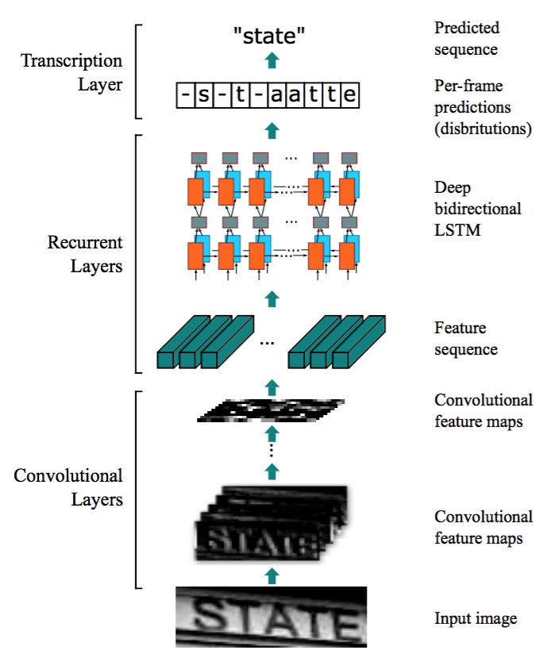
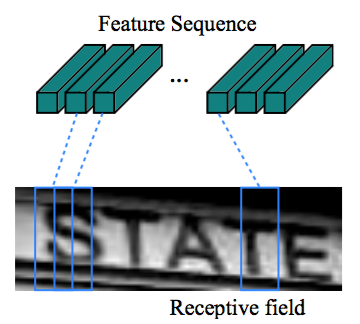
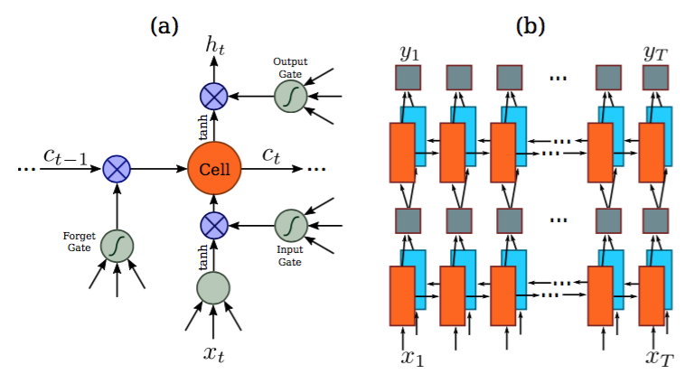
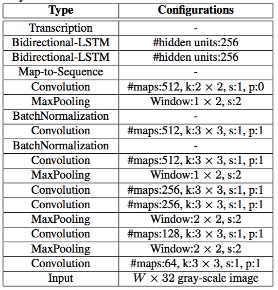
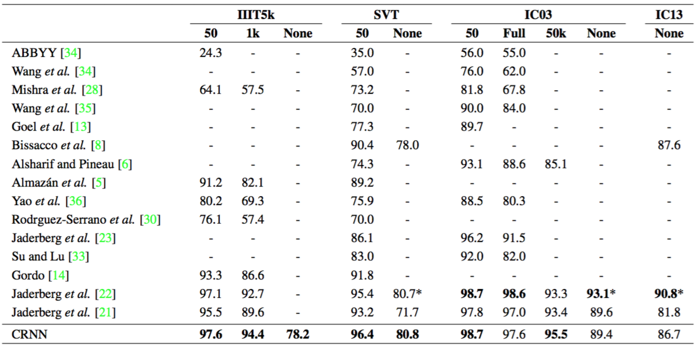
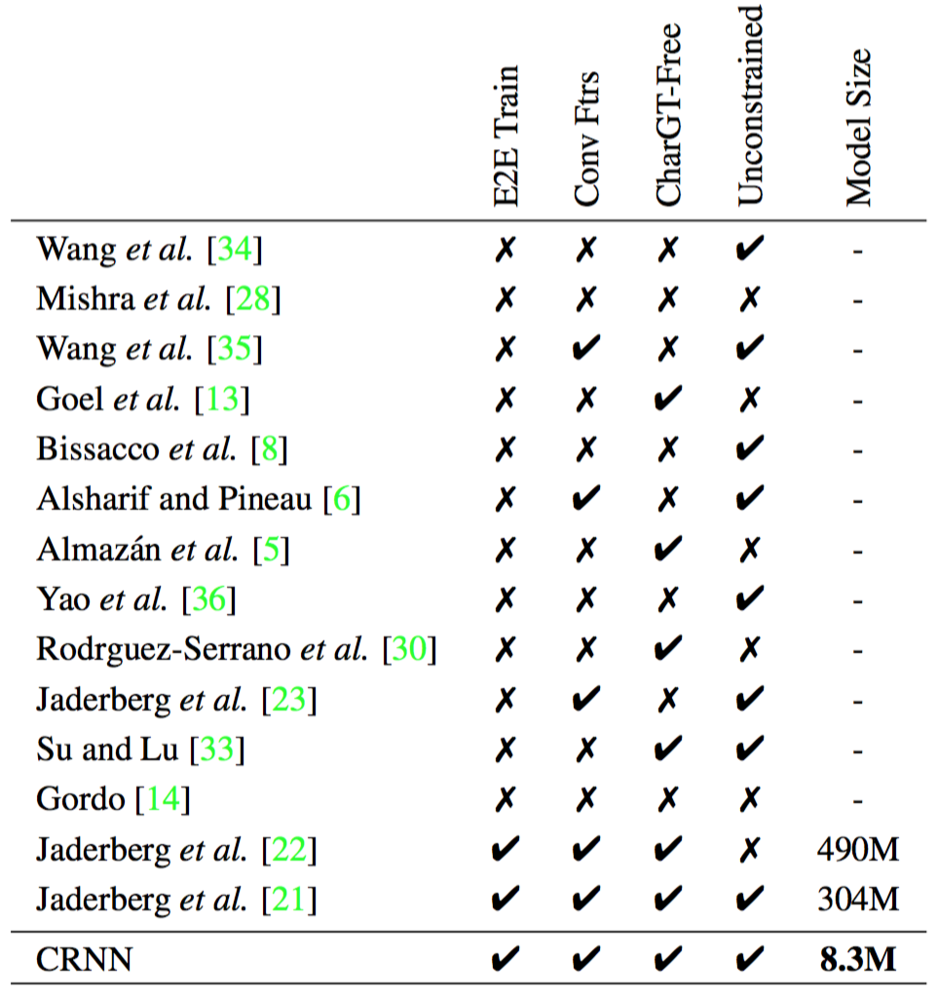

# OCR识别之RCNN
本论文翻译，摘抄自[CRNN论文翻译——中文版](http://noahsnail.com/2017/08/21/2017-08-21-CRNN%E8%AE%BA%E6%96%87%E7%BF%BB%E8%AF%91%E2%80%94%E2%80%94%E4%B8%AD%E6%96%87%E7%89%88/)

## 摘要
基于图像的序列识别一直是计算机视觉中长期存在的研究课题。在本文中，我们研究了场景文本识别的问题，这是基于图像的序列识别中最重要和最具挑战性的任务之一。提出了一种将特征提取，序列建模和转录整合到统一框架中的新型神经网络架构。与以前的场景文本识别系统相比，所提出的架构具有四个不同的特性：（1）与大多数现有的组件需要单独训练和协调的算法相比，它是端对端训练的。（2）它自然地处理任意长度的序列，不涉及字符分割或水平尺度归一化。（3）它不仅限于任何预定义的词汇，并且在无词典和基于词典的场景文本识别任务中都取得了显著的表现。（4）它产生了一个有效而小得多的模型，这对于现实世界的应用场景更为实用。在包括IIIT-5K，Street View Text和ICDAR数据集在内的标准基准数据集上的实验证明了提出的算法比现有技术的更有优势。此外，提出的算法在基于图像的音乐得分识别任务中表现良好，这显然证实了它的泛化性。

## 引言
最近，社区已经看到神经网络的强大复兴，这主要受到深度神经网络模型，特别是深度卷积神经网络（DCNN）在各种视觉任务中的巨大成功的推动。然而，最近大多数与深度神经网络相关的工作主要致力于检测或分类对象类别[12,25]。在本文中，我们关注计算机视觉中的一个经典问题：基于图像的序列识别。在现实世界中，稳定的视觉对象，如场景文字，手写字符和乐谱，往往以序列的形式出现，而不是孤立地出现。与一般的对象识别不同，识别这样的类序列对象通常需要系统预测一系列对象标签，而不是单个标签。因此，可以自然地将这样的对象的识别作为序列识别问题。类序列对象的另一个独特之处在于它们的长度可能会有很大变化。例如，英文单词可以由2个字符组成，如“OK”，或由15个字符组成，如“congratulations”。因此，最流行的深度模型像DCNN[25,26]不能直接应用于序列预测，因为DCNN模型通常对具有固定维度的输入和输出进行操作，因此不能产生可变长度的标签序列。

已经针对特定的类似序列的对象（例如场景文本）进行了一些尝试来解决该问题。例如，[35,8]中的算法首先检测单个字符，然后用DCNN模型识别这些检测到的字符，并使用标注的字符图像进行训练。这些方法通常需要训练强字符检测器，以便从原始单词图像中准确地检测和裁剪每个字符。一些其他方法（如[22]）将场景文本识别视为图像分类问题，并为每个英文单词（总共9万个词）分配一个类标签。结果是一个大的训练模型中有很多类，这很难泛化到其它类型的类序列对象，如中文文本，音乐配乐等，因为这种序列的基本组合数目可能大于100万。总之，目前基于DCNN的系统不能直接用于基于图像的序列识别。

循环神经网络（RNN）模型是深度神经网络家族中的另一个重要分支，主要是设计来处理序列。RNN的优点之一是在训练和测试中不需要序列目标图像中每个元素的位置。然而，将输入目标图像转换成图像特征序列的预处理步骤通常是必需的。例如，Graves等[16]从手写文本中提取一系列几何或图像特征，而Su和Lu[33]将字符图像转换为序列HOG特征。预处理步骤独立于流程中的后续组件，因此基于RNN的现有系统不能以端到端的方式进行训练和优化。

一些不是基于神经网络的传统场景文本识别方法也为这一领域带来了有见地的想法和新颖的表现。例如，Almaza`n等人[5]和Rodriguez-Serrano等人[30]提出将单词图像和文本字符串嵌入到公共向量子空间中，并将词识别转换为检索问题。Yao等人[36]和Gordo等人[14]使用中层特征进行场景文本识别。虽然在标准基准数据集上取得了有效的性能，但是前面的基于神经网络的算法[8,22]以及本文提出的方法通常都优于这些方法。

本文的主要贡献是一种新颖的神经网络模型，其网络架构设计专门用于识别图像中的类序列对象。所提出的神经网络模型被称为卷积循环神经网络（CRNN），因为它是DCNN和RNN的组合。对于类序列对象，CRNN与传统神经网络模型相比具有一些独特的优点：1）可以直接从序列标签（例如单词）学习，不需要详细的标注（例如字符）；2）直接从图像数据学习信息表示时具有与DCNN相同的性质，既不需要手工特征也不需要预处理步骤，包括二值化/分割，组件定位等；3）具有与RNN相同的性质，能够产生一系列标签；4）对类序列对象的长度无约束，只需要在训练阶段和测试阶段对高度进行归一化；5）与现有技术相比，它在场景文本（字识别）上获得更好或更具竞争力的表现[23,8]。6）它比标准DCNN模型包含的参数要少得多，占用更少的存储空间。

## 模型结构
如图1所示，CRNN的网络架构由三部分组成，包括卷积层，循环层和转录层，从底向上。

图1。网络架构。架构包括三部分：1) 卷积层，从输入图像中提取特征序列；2) 循环层，预测每一帧的标签分布；3) 转录层，将每一帧的预测变为最终的标签序列。

在CRNN的底部，卷积层自动从每个输入图像中提取特征序列。在卷积网络之上，构建了一个循环网络，用于对卷积层输出的特征序列的每一帧进行预测。采用CRNN顶部的转录层将循环层的每帧预测转化为标签序列。虽然CRNN由不同类型的网络架构（如CNN和RNN）组成，但可以通过一个损失函数进行联合训练。

### 特征序列提取
在CRNN模型中，通过采用标准CNN模型（去除全连接层）中的卷积层和最大池化层来构造卷积层的组件。这样的组件用于从输入图像中提取序列特征表示。在进入网络之前，所有的图像需要缩放到相同的高度。然后从卷积层组件产生的特征图中提取特征向量序列，这些特征向量序列作为循环层的输入。具体地，特征序列的每一个特征向量在特征图上按列从左到右生成。这意味着第i个特征向量是所有特征图第i列的连接。在我们的设置中每列的宽度固定为单个像素。

由于卷积层，最大池化层和元素激活函数在局部区域上执行，因此它们是平移不变的。因此，特征图的每列对应于原始图像的一个矩形区域（称为感受野），并且这些矩形区域与特征图上从左到右的相应列具有相同的顺序。如图2所示，特征序列中的每个向量关联一个感受野，并且可以被认为是该区域的图像描述符。

图2。感受野。提取的特征序列中的每一个向量关联输入图像的一个感受野，可认为是该区域的特征向量。

### 序列标注
一个深度双向循环神经网络是建立在卷积层的顶部，作为循环层。循环层预测特征序列x=x1,…,xT中每一帧xt的标签分布yt。循环层的优点是三重的。首先，RNN具有很强的捕获序列内上下文信息的能力。对于基于图像的序列识别使用上下文提示比独立处理每个符号更稳定且更有帮助。以场景文本识别为例，宽字符可能需要一些连续的帧来完全描述（参见图2）。此外，一些模糊的字符在观察其上下文时更容易区分，例如，通过对比字符高度更容易识别“il”而不是分别识别它们中的每一个。其次，RNN可以将误差差值反向传播到其输入，即卷积层，从而允许我们在统一的网络中共同训练循环层和卷积层。第三，RNN能够从头到尾对任意长度的序列进行操作。

传统的RNN单元在其输入和输出层之间具有自连接的隐藏层。每次接收到序列中的帧xt时，它将使用非线性函数来更新其内部状态ht，该非线性函数同时接收当前输入xt和过去状态ht−1作为其输入：ht=g(xt,ht−1)。那么预测yt是基于ht的。以这种方式，过去的上下文{{xt′}t′<t被捕获并用于预测。然而，传统的RNN单元有梯度消失的问题[7]，这限制了其可以存储的上下文范围，并给训练过程增加了负担。长短时记忆[18,11]（LSTM）是一种专门设计用于解决这个问题的RNN单元。LSTM（图3所示）由一个存储单元和三个多重门组成，即输入，输出和遗忘门。在概念上，存储单元存储过去的上下文，并且输入和输出门允许单元长时间地存储上下文。同时，单元中的存储可以被遗忘门清除。LSTM的特殊设计允许它捕获长距离依赖，这经常发生在基于图像的序列中。

图3。(a) 基本的LSTM单元的结构。LSTM包括单元模块和三个门，即输入门，输出门和遗忘门。（b）我们论文中使用的深度双向LSTM结构。合并前向（从左到右）和后向（从右到左）LSTM的结果到双向LSTM中。在深度双向LSTM中堆叠多个双向LSTM结果。

LSTM是定向的，它只使用过去的上下文。然而，在基于图像的序列中，两个方向的上下文是相互有用且互补的。因此，我们遵循[17]，将两个LSTM，一个向前和一个向后组合到一个双向LSTM中。此外，可以堆叠多个双向LSTM，得到如图3.b所示的深双向LSTM。深层结构允许比浅层抽象更高层次的抽象，并且在语音识别任务中取得了显著的性能改进[17]。

在循环层中，误差在图3.b所示箭头的相反方向传播，即反向传播时间（BPTT）。在循环层的底部，传播差异的序列被连接成映射，将特征映射转换为特征序列的操作进行反转并反馈到卷积层。实际上，我们创建一个称为“Map-to-Sequence”的自定义网络层，作为卷积层和循环层之间的桥梁。

### 转录
转录是将RNN所做的每帧预测转换成标签序列的过程。数学上，转录是根据每帧预测找到具有最高概率的标签序列。在实践中，存在两种转录模式，即无词典转录和基于词典的转录。词典是一组标签序列，预测受拼写检查字典约束。在无词典模式中，预测时没有任何词典。在基于词典的模式中，通过选择具有最高概率的标签序列进行预测。

#### 标签序列的概率
我们采用Graves等人[15]提出的联接时间分类（CTC）层中定义的条件概率。按照每帧预测y=y1,…,yT对标签序列l定义概率，并忽略l中每个标签所在的位置。因此，当我们使用这种概率的负对数似然作为训练网络的目标函数时，我们只需要图像及其相应的标签序列，避免了标注单个字符位置的劳动。

条件概率的公式简要描述如下：输入是序列y=y1,…,yT，其中T是序列长度。这里，每个yt∈ℜ|′|是在集合′=∪上的概率分布，其中包含了任务中的所有标签（例如，所有英文字符），以及由-表示的“空白”标签。序列到序列的映射函数定义在序列π∈′T上，其中T是长度。将π映射到l上，首先删除重复的标签，然后删除blank。例如，将“–hh-e-l-ll-oo–”（-表示blank）映射到“hello”。然后，条件概率被定义为由映射到l上的所有π的概率之和：
\begin{equation} p(\mathbf{l}|\mathbf{y})=\sum_{{\pi}:{\cal B}(\boldsymbol{\pi})=\mathbf{l}}p(\boldsymbol{\pi}|\mathbf{y}),\tag{1} \end{equation}

π的概率定义为\begin{equation} p(\mathbf{\pi}|\mathbf{y})=\prod\_{t=1}^{T}y\_{\pi\_{t}}^{t} \end{equation}是时刻t时有标签πt的概率。由于存在指数级数量的求和项，直接计算方程1在计算上是不可行的。然而，使用[15]中描述的前向算法可以有效计算方程1。

#### 无字典转录
在这种模式下，将具有方程1中定义的最高概率的序列l∗作为预测。由于不存在用于精确找到解的可行方法，我们采用[15]中的策略。序列l∗通过 $ \mathbf{l}^{*}\approx{\cal B}(\arg\max_{\boldsymbol{\pi}}p(\boldsymbol{\pi}|\mathbf{y})) $s 近似发现，即在每个时间戳t采用最大概率的标签πt，并将结果序列映射到l∗。

#### 基于词典的转录
在基于字典的模式中，每个测试采样与词典相关联。基本上，通过选择词典中具有方程1中定义的最高条件概率的序列来识别标签序列，即 $ \mathbf{l}^{*}=\arg\max\_{\mathbf{l}\in{\cal D}}p(\mathbf{l}|\mathbf{ys}) $。然而，对于大型词典，例如5万个词的Hunspell拼写检查词典[1]，对词典进行详尽的搜索是非常耗时的，即对词典中的所有序列计算方程1，并选择概率最高的一个。为了解决这个问题，我们观察到，2.3.2中描述的通过无词典转录预测的标签序列通常在编辑距离度量下接近于实际结果。这表示我们可以将搜索限制在最近邻候选目标 ${\cal N}_{\delta}(\mathbf{l}’)$,其中δ是最大编辑距离，l′是在无词典模式下从y转录的序列：
\begin{equation} \mathbf{l}^{*}=\arg\max\_{\mathbf{l}\in{\cal N}\_{\delta}(\mathbf{l}’)}p(\mathbf{l}|\mathbf{y}).\tag{2} \end{equation}

可以使用BK树数据结构[9]有效地找到候选目标${\cal N}_{\delta}(\mathbf{l}’)$，这是一种专门适用于离散度量空间的度量树。BK树的搜索时间复杂度为 $O(\log|{\cal D}|)$，其中 $|{\cal D}|$是词典大小。因此，这个方案很容易扩展到非常大的词典。在我们的方法中，一个词典离线构造一个BK树。然后，我们使用树执行快速在线搜索，通过查找具有小于或等于δ编辑距离来查询序列。

### 网络训练
${\cal X}= \lbrace I_i,\mathbf{l}_i \rbrace _i$表示训练集，Ii是训练图像，li是真实的标签序列。目标是最小化真实条件概率的负对数似然：
\begin{equation} {\cal O}=-\sum\_{I\_{i},\mathbf{l}\_{i}\in{\cal X}}\log p(\mathbf{l}\_{i}|\mathbf{y}\_{i}),\tag{3} \end{equation}
yi是循环层和卷积层从Ii生成的序列。目标函数直接从图像和它的真实标签序列计算代价值。因此，网络可以在成对的图像和序列上进行端对端训练，去除了在训练图像中手动标记所有单独组件的过程。

网络使用随机梯度下降（SGD）进行训练。梯度由反向传播算法计算。特别地，在转录层中，如[15]所述，误差使用前向算法进行反向传播。在循环层中，应用随时间反向传播（BPTT）来计算误差。

为了优化，我们使用ADADELTA[37]自动计算每维的学习率。与传统的动量[31]方法相比，ADADELTA不需要手动设置学习率。更重要的是，我们发现使用ADADELTA的优化收敛速度比动量方法快。

## 实验
为了评估提出的CRNN模型的有效性，我们在场景文本识别和乐谱识别的标准基准数据集上进行了实验，这些都是具有挑战性的视觉任务。数据集和训练测试的设置见3.1小节，场景文本图像中CRNN的详细设置见3.2小节，综合比较的结果在3.3小节报告。为了进一步证明CRNN的泛化性，在3.4小节我们在乐谱识别任务上验证了提出的算法。

### 数据集
对于场景文本识别的所有实验，我们使用Jaderberg等人[20]发布的合成数据集（Synth）作为训练数据。数据集包含8百万训练图像及其对应的实际单词。这样的图像由合成文本引擎生成并且是非常现实的。我们的网络在合成数据上进行了一次训练，并在所有其它现实世界的测试数据集上进行了测试，而没有在其训练数据上进行任何微调。即使CRNN模型是在纯合成文本数据上训练，但它在标准文本识别基准数据集的真实图像上工作良好。

有四个流行的基准数据集用于场景文本识别的性能评估，即ICDAR 2003（IC03），ICDAR 2013（IC13），IIIT 5k-word（IIIT5k）和Street View Text (SVT)。

IC03[27]测试数据集包含251个具有标记文本边界框的场景图像。王等人[34]，我们忽略包含非字母数字字符或少于三个字符的图像，并获得具有860个裁剪的文本图像的测试集。每张测试图像与由Wang等人[34]定义的50词的词典相关联。通过组合所有的每张图像词汇构建完整的词典。此外，我们使用由Hunspell拼写检查字典[1]中的单词组成的5万个词的词典。

IC13[24]测试数据集继承了IC03中的大部分数据。它包含1015个实际的裁剪单词图像。

IIIT5k[28]包含从互联网收集的3000张裁剪的词测试图像。每张图像关联一个50词的词典和一个1000词的词典。

SVT[34]测试数据集由从Google街景视图收集的249张街景图像组成。从它们中裁剪出了647张词图像。每张单词图像都有一个由Wang等人[34]定义的50个词的词典。

### 实现细节
在实验中我们使用的网络配置总结在表1中。卷积层的架构是基于VGG-VeryDeep的架构[32]。为了使其适用于识别英文文本，对其进行了调整。在第3和第4个最大池化层中，我们采用1×2大小的矩形池化窗口而不是传统的平方形。这种调整产生宽度较大的特征图，因此具有更长的特征序列。例如，包含10个字符的图像通常为大小为100×32，可以从其生成25帧的特征序列。这个长度超过了大多数英文单词的长度。最重要的是，矩形池窗口产生矩形感受野（如图2所示），这有助于识别一些具有窄形状的字符，例如i和l。表1。网络配置总结。第一行是顶层。k，s，p分别表示核大小，步长和填充大小。

网络不仅有深度卷积层，而且还有循环层。众所周知两者都难以训练。我们发现批归一化[19]技术对于训练这种深度网络非常有用。分别在第5和第6卷积层之后插入两个批归一化层。使用批归一化层训练过程大大加快。

我们在Torch7[10]框架内实现了网络，使用定制实现的LSTM单元（Torch7/CUDA），转录层（C++）和BK树数据结构（C++）。实验在具有2.50 GHz Intel（R）Xeon E5-2609 CPU，64GB RAM和NVIDIA（R）Tesla(TM) K40 GPU的工作站上进行。网络用ADADELTA训练，将参数ρ设置为0.9。在训练期间，所有图像都被缩放为100×32，以加快训练过程。训练过程大约需要50个小时才能达到收敛。测试图像缩放的高度为32。宽度与高度成比例地缩放，但至少为100像素。平均测试时间为0.16s/样本，在IC03上测得的，没有词典。近似词典搜索应用于IC03的50k词典，参数δ设置为3。测试每个样本平均花费0.53s。

### 比较评估
提出的CRNN模型在上述四个公共数据集上获得的所有识别精度以及最近的最新技术，包括基于深度模型[23,22,21]的方法如表2所示。
表2。四个数据集上识别准确率(%)。在第二行，“50”，“1k”，“50k”和“Full”表示使用的字典，“None”表示识别没有字典。*[22]严格意义上讲不是无字典的，因为它的输出限制在90K的字典。

在有约束词典的情况中，我们的方法始终优于大多数最新的方法，并且平均打败了[22]中提出的最佳文本阅读器。具体来说，与[22]相比，我们在IIIT5k和SVT上获得了卓越的性能，仅在IC03上通过“Full”词典实现了较低性能。请注意，[22]中的模型是在特定字典上训练的，即每个单词都与一个类标签相关联。与[22]不同，CRNN不限于识别已知字典中的单词，并且能够处理随机字符串（例如电话号码），句子或其他诸如中文单词的脚本。 因此，CRNN的结果在所有测试数据集上都具有竞争力。

在无约束词典的情况下，我们的方法在SVT上仍取得了最佳性能，但在IC03和IC13上仍然落后于一些方法[8,22]。注意，表2的“none”列中的空白表示这种方法不能应用于没有词典的识别，或者在无约束的情况下不能报告识别精度。我们的方法只使用具有单词级标签的合成文本作为训练数据，与PhotoOCR[8]非常不同，后者使用790万个具有字符级标注的真实单词图像进行训练。[22]中报告的最佳性能是在无约束词典的情况下，受益于它的大字典，然而，它不是前面提到的严格的无约束词典模型。在这个意义上，我们在无限制词典表中的结果仍然是有前途的。

为了进一步了解与其它文本识别方法相比，所提出算法的优点，我们提供了在一些特性上的综合比较，这些特性名称为E2E Train，Conv Ftrs，CharGT-Free，Unconstrained和Model Size，如表3所示。

表3。各种方法的对比。比较的属性包括：1)端到端训练(E2E Train)；2)从图像中直接学习卷积特征而不是使用手动设计的特征(Conv Ftrs)；3)训练期间不需要字符的实际边界框(CharGT-Free)；4)不受限于预定义字典(Unconstrained)；5)模型大小（如果使用端到端模型），通过模型参数数量来衡量(Model Size, M表示百万)。

E2E Train：这一列是为了显示某种文字阅读模型是否可以进行端到端的训练，无需任何预处理或经过几个分离的步骤，这表明这种方法对于训练是优雅且干净的。从表3可以看出，只有基于深度神经网络的模型，包括[22,21]以及CRNN具有这种性质。

Conv Ftrs：这一列表明一个方法是否使用从训练图像直接学习到的卷积特征或手动特征作为基本的表示。

CharGT-Free：这一列用来表明字符级标注对于训练模型是否是必要的。由于CRNN的输入和输出标签是序列，因此字符级标注是不必要的。

Unconstrained：这一列用来表明训练模型是否受限于一个特定的字典，是否不能处理字典之外的单词或随机序列。注意尽管最近通过标签嵌入[5, 14]和增强学习[22]学习到的模型取得了非常有竞争力的性能，但它们受限于一个特定的字典。

Model Size：这一列报告了学习模型的存储空间。在CRNN中，所有的层有权重共享连接，不需要全连接层。因此，CRNN的参数数量远小于CNN变体[22,21]所得到的模型，导致与[22,21]相比，模型要小得多。我们的模型有830万个参数，只有33MB RAM（每个参数使用4字节单精度浮点数），因此可以轻松地移植到移动设备上。

表3详细列出了不同方法之间的差异，充分展示了CRNN与其它竞争方法的优势。

另外，为了测试参数δ的影响，我们在方程2中实验了δ的不同值。在图4中，我们将识别精度绘制为δ的函数。更大的δ导致更多的候选目标，从而基于词典的转录更准确。另一方面，由于更长的BK树搜索时间，以及更大数量的候选序列用于测试，计算成本随着δ的增大而增加。实际上，我们选择δ=3作为精度和速度之间的折衷。

图4。蓝线图：识别准确率作为δ的函数。红条：每个样本的词典搜索时间。在IC03数据集上使用50k词典进行的测试。

## 结论
在本文中，我们提出了一种新颖的神经网络架构，称为卷积循环神经网络（CRNN），其集成了卷积神经网络（CNN）和循环神经网络（RNN）的优点。CRNN能够获取不同尺寸的输入图像，并产生不同长度的预测。它直接在粗粒度的标签（例如单词）上运行，在训练阶段不需要详细标注每一个单独的元素（例如字符）。此外，由于CRNN放弃了传统神经网络中使用的全连接层，因此得到了更加紧凑和高效的模型。所有这些属性使得CRNN成为一种基于图像序列识别的极好方法。

在场景文本识别基准数据集上的实验表明，与传统方法以及其它基于CNN和RNN的算法相比，CRNN实现了优异或极具竞争力的性能。这证实了所提出的算法的优点。此外，CRNN在光学音乐识别（OMR）的基准数据集上显著优于其它的竞争者，这验证了CRNN的泛化性。

实际上，CRNN是一个通用框架，因此可以应用于其它的涉及图像序列预测的领域和问题（如汉字识别）。进一步加快CRNN，使其在现实应用中更加实用，是未来值得探索的另一个方向。

