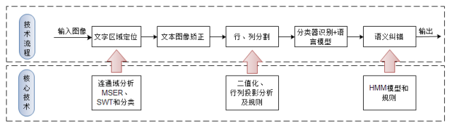
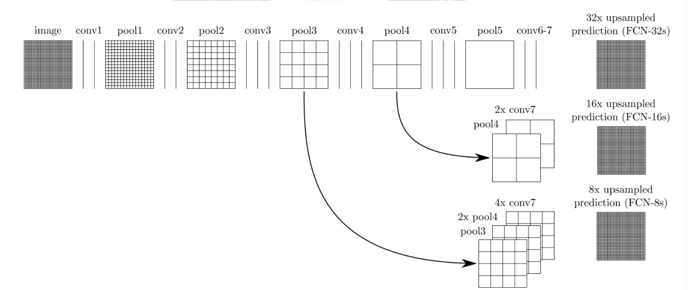
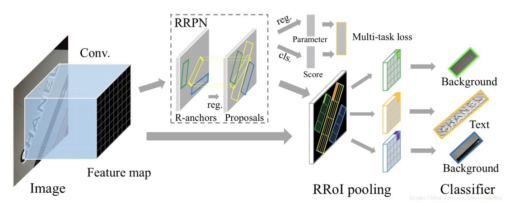
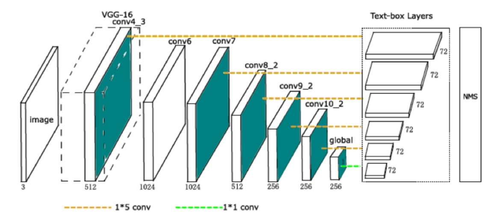
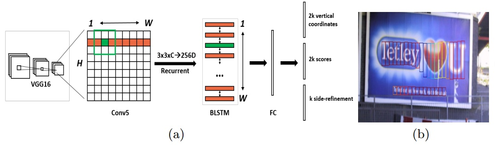
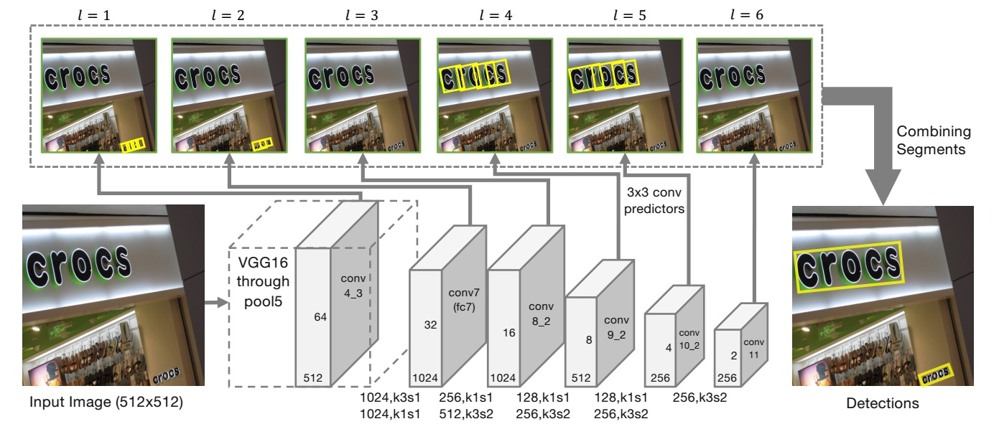
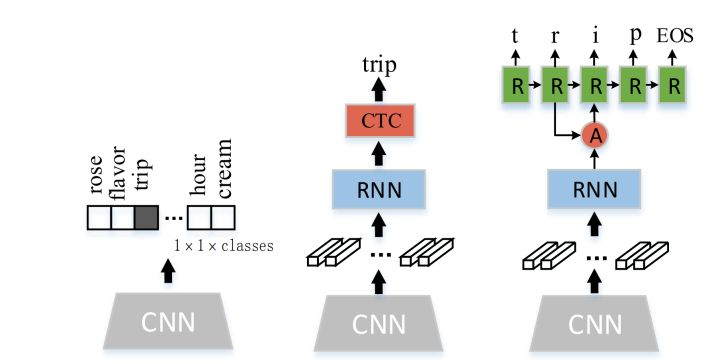
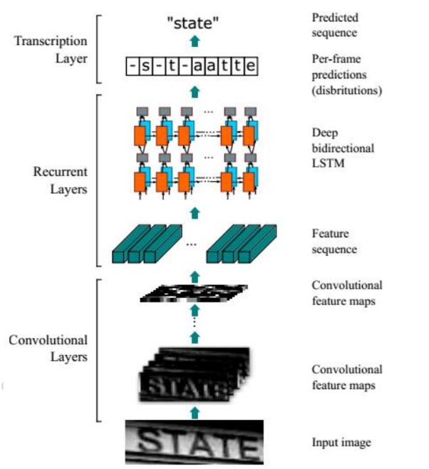
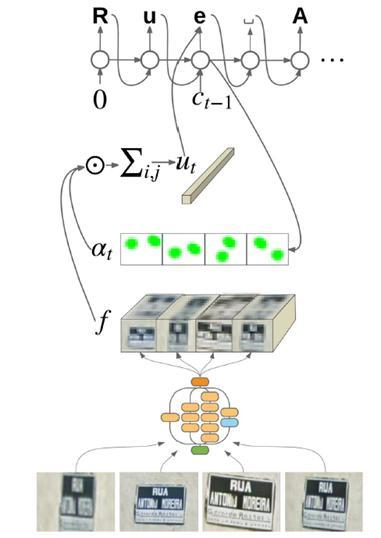

# OCR识别之综述
OCR（Optical Character Recognition，光学字符识别）的概念早于1920年代便被提出，一直是模式识别领域中重要的研究方向。近年来，随着移动设备的快速更新迭代，以及移动互联网的快速发展，使得OCR有更为广泛的应用场景，从以往的扫描文件的字符识别，到现在应用到自然场景中图片文字的识别，如识别身份证、银行卡、门牌、票据及各类网络图片中的文字。

以深度学习兴起的时间为分割点，直至近五年之前，业界最为广泛使用的仍然是传统的OCR识别技术框架，而随着深度学习的崛起，基于这一技术的OCR识别框架以另外一种新的思路迅速突破了原有的技术瓶颈（如文字定位、二值化和文字分割等），并已在工业界得到广泛应用。

## 传统OCR技术框架

如上图所示，传统的OCR技术框架主要分为五个步骤：

1. 文本定位：主要思想是利用文字颜色、亮度、边缘信息进行聚类的方式来快速分离文字区域与非文字区域，较为流行的两个算法分别是：最大极值稳定区域(MSER)算法及笔画宽度变换(SWT)算法，而在自然场景中因受到光照强度、图片拍摄质量和类文字背景的干扰，使得检测结果中包含非常多的非文字区域，而目前从候选区域区分出真正文字区域主要两种方法，用规则判断或轻量级的神经网络模型进行区分；
2. 倾斜文本矫正：主要基于旋转变换和仿射变换；
3. 分割出单字：主要利用文字在行列间存在间隙的特征，通过二值化并在投影后找出行列分割点，当在文字与背景的区分度较好时，效果很好，而拍摄的图片中光照、摄像质量的影响，并且文字背景难以区分时，常造成错误分割的情况；
4. 特征提取和降维：采用HoG进行特征提取。特征是用来识别文字的关键信息，每个不同的文字都能通过特征来和其他文字进行区分。对于数字和英文字母来说，这个特征提取是比较容易的，因为数字只有10个，英文字母只有52个，都是小字符集。对于汉字来说，特征提取比较困难，因为首先汉字是大字符集，国标中光是最常用的第一级汉字就有3755个；第二个汉字结构复杂，形近字多。在确定了使用何种特征后，视情况而定，还有可能要进行特征降维，这种情况就是如果特征的维数太高（特征一般用一个向量表示，维数即该向量的分量数），分类器的效率会受到很大的影响，为了提高识别速率，往往就要进行降维，这个过程也很重要，既要降低维数，又得使得减少维数后的特征向量还保留了足够的信息量（以区分不同的文字）；
5. 单字识别：分类器是用来进行识别的，就是对于上一步，你对一个文字图像，提取出特征给，丢给分类器，分类器就对其进行分类，告诉你这个特征该识别成哪个文字。在进行实际识别前，往往还要对分类器进行训练，这是一个监督学习的案例。成熟的分类器也很多，比如svm，knn，神经网络等；
6. 基于统计模型的语义纠错：是用来对分类结果进行优化的，第一个，分类器的分类有时候不一定是完全正确的（实际上也做不到完全正确），比如对汉字的识别，由于汉字中形近字的存在，很容易将一个字识别成其形近字。后处理中可以去解决这个问题，比如通过语言模型来进行校正——如果分类器将“在哪里”识别成“存哪里”，通过语言模型会发现“存哪里”是错误的，然后进行校正。第二个，OCR的识别图像往往是有大量文字的，而且这些文字存在排版、字体大小等复杂情况，后处理中可以尝试去对识别结果进行格式化，比如按照图像中的排版排列什么的，比如，一张图像，其左半部分的文字和右半部分的文字毫无关系，而在字符切分过程中，往往是按行切分的，那么识别结果中左半部分的第一行后面会跟着右半部分的第一行诸如此类。

## 基于深度学习的OCR识别之图像预处理
传统方法上采用HoG对图像进行特征提取，然而HoG对于图像模糊、扭曲等问题鲁棒性很差，对于复杂场景泛化能力不佳。由于深度学习的飞速发展，现在普遍使用基于CNN的神经网络作为特征提取手段。得益于CNN强大的学习能力，配合大量的数据可以增强特征提取的鲁棒性，面临模糊、扭曲、畸变、复杂背景和光线不清等图像问题均可以表现良好的鲁棒性。对于文字检测任务，很自然地可以想到套用图像检测的方法来框选出图像中的文本区域。常见的一些物体检测方法如下。

### Faster RCNN
Faster R-CNN采用辅助生成样本的RPN（Region Proposal Networks）网络，将算法结构分为两个部分，先由RPN 网络判断候选框是否为目标，再经分类定位的多任务损失判断目标类型，整个网络流程都能共享卷积神经网络提取的的特征信息，节约计算成本，且解决Fast R-CNN 算法生成正负样本候选框速度慢的问题，同时避免候选框提取过多导致算法准确率下降。对于受限场景的文字检测，Faster R-CNN的表现较为出色。可以通过多次检测确定不同粒度的文本区域。

### FCN
FCN 相较于Faster R-CNN 算法只能计算ROI pooling 层之前的卷积网络特征参数，R-FCN 算法提出一种位置敏感分布的卷积网络代替ROI pooling 层之后的全连接网络，解决了Faster R-CNN 由于ROI Pooling 层后面的结构需要对每一个样本区域跑一次而耗时比较大的问题，使得特征共享在整个网络内得以实现，解决物体分类要求有平移不变性和物体检测要求有平移变化的矛盾，但是没有考虑到候选区域的全局信息和语义信息。[3]所以当面对自然场景的通用OCR，适于多尺度检测的FCN较之Faster R-CNN有着更好的表现。当采用FCN时，输出的掩膜可以作为前景文字的二值图像进行输出。

但是与其他日常场景的物体检测所不同的是，文字图像的分布更接近于均匀分布而非正态分布，即文字总体的均值图像并不能体现文字这一抽象概念的特征。除此之外，文字的长宽比与物体的长宽比不同，导致候选锚定框不适用；文字的方向仍然不能确定，对非垂直的文字方向表现佳；自然场景中常出现一些结构与文字非常接近，导致假阳性率升高。因此需要对现有模型进行调整。一种常见的做法是调整候选锚定框，例如RRPN (Rotation Region Proposal Networks)在faster R-CNN的基础上，将垂直的候选锚定框进行旋转满足非垂直文本的检测，这样一来就可以满足非垂直文字的检测需求。

### TextBoxes
TextBoxes是基于SSD改进的一个算法。调整了锚定框的长宽比，以适应文字的高长宽比。输出层也利用了利用非标准的卷积核。更适应文字细长的宽高比这一特点。

### DMPNet
(Deep Matching Prior Network)采用非矩形四边形的候选锚定框进行检测。通过Monte-Carlo方法计算标注区域与矩形候选框和旋转候选框的重合度后重新计算顶点坐标，得到非矩形四边形的顶点坐标。

### CTPN
CTPN(Connectionist Text Proposal Network)是目前应用最广的文本检测模型之一。其基本假设是单个字符相较于异质化程度更高的文本行更容易被检测，因此先对单个字符进行类似R-CNN的检测。之后又在检测网络中加入了双向LSTM，使检测结果形成序列提供了文本的上下文特征，便可以将多个字符进行合并得到文本行。

### SegLink
SegLink则是在SSD的启发下得出的。采用临近连接的方法对上下文进行连接。并且通过将连接参数的学习整合进了神经网络的学习过程，使得模型更容易训练。

### 其他
有一些研究引入了注意力机制，如下图模型采用Dense Attention模型来对图像的权重进行评估。这样有利于将前景图像和背景图像分离，对于文本内容较之背景图像有着更高的注意力，使检测结果更准确。

## 基于深度学习的OCR识别之文字识别
文本识别在传统技术中采用模板匹配的方式进行分类。但是对于文字行，只能通过识别出每一个字符来确定最终文字行从内容。因此可以对文字行进行字符切分，以得到单个文字。这种方式中，过分割-动态规划是最常见的切分方法。由于单个字符可能会由于切分位置的原因产生多个识别结果，例如“如”字在切分不当时会被切分成“女_口”，因此需要对候选字符进行过分割，使其足够破碎，之后通过动态规划合并分割碎片，得到最优组合，这一过程需要人工设计损失函数。还有另一种方法是通过滑动窗口对每一个可能的字符进行匹配，这种方法的准确率依赖于滑动窗口的滑动窗尺寸，如果滑动窗尺寸过大会造成信息丢失，而太小则会使计算力需求大幅增加。

以上的传统方法通过识别每个单字符以实现全文的识别，这一过程导致了上下文信息的丢失，对于单个字符有较高的识别正确率，其条目识别正确率也难以保证。以身份证识别为例，识别18位的身份号的场景下，即使单字符识别正确率高达99%，其条目正确率只能到0.9918=83%，如果切分也存在1%的损失（即正确率99%），条目正确率则只有(0.99*0.99)18=70%。因此引入上下文的信息，成为了提升条目准确率的关键。从深度学习的角度出发，要引入上下文这样的序列信息，RNN和LSTM等依赖于时序关系的神经网络是最理想的选择。

CNN+Softmax CNN+RNN+CTC CNN+RNN+Attention机制

## CRNN
常见的一种做法是利用CRNN模型。以CNN特征作为输入，双向LSTM进行序列处理使得文字识别的效率大幅提升，也提升了模型的泛化能力。先由分类方法得到特征图，之后通过CTC对结果进行翻译得到输出结果。

## Attention
另一种方法是引入注意力机制。以CNN特征作为输入，通过注意力模型对RNN的状态和上一状态的注意力权重计算出新一状态的注意力权重。之后将CNN特征和权重输入RNN，通过编码和解码得到结果。

## 基于深度学习的OCR识别的端到端的OCR
与检测-识别的多阶段OCR不同，深度学习使端到端的OCR成为可能，将文本的检测和识别统一到同一个工作流中。目前比较受到瞩目的一种端到端框架叫做FOTS(Fast Oriented Text Spotting)。FOTS的检测任务和识别任务共享卷积特征图。一方面利用卷积特征进行检测，另一方面引入了RoIRotate，一种用于提取定向文本区域的算符。得到文本候选特征后，将其输入到RNN编码器和CTC解码器中进行识别。同时，由于所有算符都是可微的，因此端到端的网络训练成为可能。由于简化了工作流，网络可以在极低运算开销下进行验证，达到实时速度。

## 总结
尽管基于深度学习的OCR表现相较于传统方法更为出色，但是深度学习技术仍需要在OCR领域进行特化，而其中的关键正式传统OCR方法的精髓。因此我们仍需要从传统方法中汲取经验，使其与深度学习有机结合进一步提升OCR的性能表现。另一方面，作为深度学习的推动力，数据起到了至关重要的作用，因此收集广泛而优质的数据也是现阶段OCR性能的重要举措之一。

## 参考文献
1. https://zhuanlan.zhihu.com/p/45376274
2. Lécun Y, Bottou L, Bengio Y, et al. Gradient-based learning applied to document recognition[J]. Proceedings of the IEEE, 1998,86(11):2278-2324.
3. 	Ren S, Girshick R, Girshick R, et al. Faster R-CNN: Towards Real-Time Object Detection with Region Proposal Networks[J]. IEEE Trans Pattern Anal Mach Intell, 2015,39(6):1137-1149.
4. Lin T Y, Dollar P, Girshick R, et al. Feature Pyramid Networks for Object Detection[J]. 2016:936-944.
5. 	Ma J, Shao W, Ye H, et al. Arbitrary-Oriented Scene Text Detection via Rotation Proposals[J]. IEEE Transactions on Multimedia, 2017,PP(99):1.
6. 	Liao M, Shi B, Bai X, et al. TextBoxes: A Fast Text Detector with a Single Deep Neural Network[J]. 2016.
7. 	Liu Y, Jin L. Deep Matching Prior Network: Toward Tighter Multi-oriented Text Detection[C]//: IEEE Conference on Computer Vision and Pattern Recognition, 2017.
8. 	Tian Z, Huang W, He T, et al. Detecting Text in Natural Image with Connectionist Text Proposal Network[C]//: European Conference on Computer Vision, 2016.
9. 	Shi B, Bai X, Belongie S. Detecting Oriented Text in Natural Images by Linking Segments[J]. 2017:3482-3490.
10. Gao Y, Chen Y, Wang J, et al. Reading Scene Text with Attention Convolutional Sequence Modeling[J]. 2017.
11. Shi B, Bai X, Yao C. An End-to-End Trainable Neural Network for Image-based Sequence Recognition and Its Application to Scene Text Recognition[J]. IEEE Transactions on Pattern Analysis & Machine Intelligence, 2016,39(11):2298-2304.
12. Wojna Z, Gorban A N, Lee D S, et al. Attention-Based Extraction of Structured Information from Street View Imagery[J]. 2017:844-850.
13. Liu X, Liang D, Yan S, et al. FOTS: Fast Oriented Text Spotting with a Unified Network[J]. 2018.

