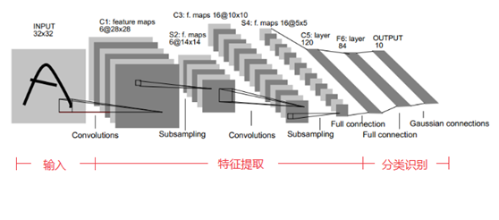

# 卷积神经网络之LeNet

LeNet5发表于1998年，是最早的卷积神经网络之一， 由Yann LeCun完成，推动了深度学习领域的发展。在那时候，没有GPU帮助训练模型，甚至CPU的速度也很慢，因此，LeNet5通过巧妙的设计，利用卷积、参数共享、池化等操作提取特征，避免了大量的计算成本，最后再使用全连接神经网络进行分类识别，这个网络也是最近大量神经网络架构的起点，给这个领域带来了许多灵感。

LeNet5的网络结构示意图如上所示，LeNet5由7层CNN(不包含输出层)组成，由3层卷积层(Ci表示)、2层子采样层(Si表示，亦称为pooling层或池化层)、2层全连接层(Fi表示)。下面逐层介绍其作用。

* C1: 卷积层，6\*28\*28。
	* 特征图大小：该层使用了6个卷积核，每个卷积核的大小为5*5，这样就得到了6个feature map大小为(32-5+1)\*(32-5+1) = 28\*28
	* 参数个数：(5\*5+1)\*6 = 156
	* 连接数： (5\*5+1)\*6\*28\*28 = 122304
* S2: 子采样层，6\*14\*14
	* 特征图大小：该层为池化层，池化单元为2\*2，因此6个特征图大小从28\*28变化为14\*14
	* 参数个数：(1+1)\*6 = 12
	* 连接数： (2\*2+1)\*6\*14\*14 = 5880
* C3: 卷积层，16\*10\*10
	* 特征图大小：该层使用了16个卷积核，每个卷积核的大小为5*5，这样就得到了16个feature map大小为(14-5+1)\*(14-5+1) = 10\*10
	* 参数个数：需要注意的是，C3与S2并不是全连接而是部分连接，有些是C3连接到S2三层、有些四层、甚至达到6层，通过这种方式提取更多特征，连接的规则如下表所示，因此最后的参数数量为：(5\*5\*3+1)\*6 + (5\*5\*4+1)\*9 + 5\*5\*6+1 = 1516
图2 [LeNet5_2]
	* 连接数：卷积后的特征图大小为10×10，参数数量为1516，因此连接数为1516×10×10= 151600
* S4: 卷积层，16\*5\*5
	* 特征图大小：与S2的分析类似，池化单元大小为2×2，因此，该层与C3一样共有16个特征图，每个特征图的大小为5×5
	* 参数个数：(1+1)\*16 = 32
	* 连接数： (2\*2+1)\*16\*5\*5 = 2000
* C5: 卷积层，120
	* 特征图大小：该层有120个卷积核，每个卷积核的大小仍为5×5，因此有120个特征图。由于S4层的大小为5×5，而该层的卷积核大小也是5×5，因此特征图大小为（5-5+1）×（5-5+1）= 1×1。这样该层就刚好变成了全连接，这只是巧合，如果原始输入的图像比较大，则该层就不是全连接了
	* 参数个数：本层的参数数目为120×（5×5×16+1） = 48120
	* 连接数：该层的特征图大小刚好为1×1，因此连接数为48120×1×1=48120
* F6层（全连接层）：84
	* 特征图大小：F6层有84个单元，之所以选这个数字的原因是来自于输出层的设计，对应于一个7×12的比特图，如下图所示，-1表示白色，1表示黑色，这样每个符号的比特图的黑白色就对应于一个编码。该层有84个特征图，特征图大小与C5一样都是1×1，与C5层全连接
	* 参数个数：由于是全连接，参数数量为（120+1）×84=10164。跟经典神经网络一样，F6层计算输入向量和权重向量之间的点积，再加上一个偏置，然后将其传递给sigmoid函数得出结果
	* 连接数：由于是全连接，连接数与参数数量一样，也是10164
* 输出层：10，共有10个节点，分别代表数字0到9
	* 特征图大小：该层采用径向基函数（RBF）的网络连接方式，假设x是上一层的输入，y是RBF的输出
	* 参数个数：全连接，参数个数为84×10=840
	* 连接数：全连接，连接数与参数个数一样，也是840

以上内容来自于Ann LeCun在1998那年发表的关于LeNet的经典论文《Gradient-Based Learning Applied to Document Recognition》,里面有更详细的介绍，建议可以进一步阅读此论文。
	

