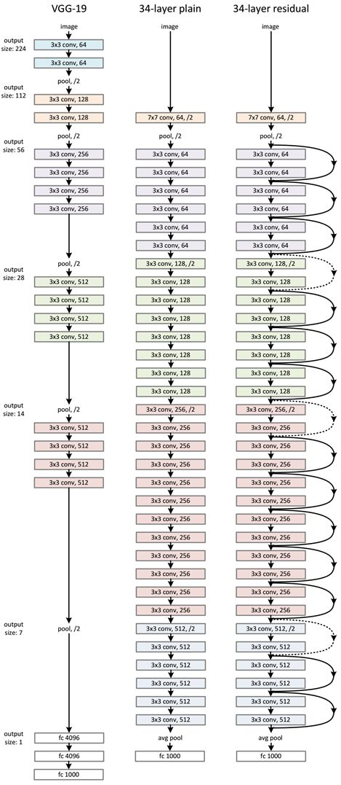
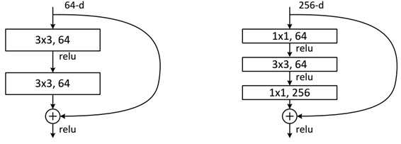

# 卷积神经网络之RESNet
RESNet，由何凯明博士(也是一位大牛，当年的高考状元，毕业于清华大学，后任职于微软亚研院和FaceBook AI Research部门)在2015年提出，并通过该模型取得了2015年的ImageNNet比赛中classification中的第一名，并且何凯明也因此摘得了CVVPR最佳论文奖。对比之前的AlexNet、VGGNet、GoogLeNet，这些早期的模型深度最深的也不过是23层神经网络，而RESNet动则50层，甚至后续发展到1000层的神经网络，两者完全不在同一量级上。那么，为什么早期的网络模型不能构建如此深的网络，而RESNet又是如何做到的呢，下面我们详细介绍一下RESNet的原理。

## 深度网络的退化问题
从经验上看，网络的深度对模型的准确度有着决定性的因素，当网络层数增加后，模型就可以进行更复杂的特征模式提取，所以模型更深时效果应该可以更好。但是在实验中发现，在网络增加后，从那个20来层网络之后，到56层网络，网络深度增加，但并没有使得模型效果提高，反而网络准确度出现饱和现象，甚至出现下降。这并非过拟合问题造成的，因为56层网络的训练误差同样高。因此我们知道了深度网络存在着梯度消失或者梯度爆炸问题，这使得深度学习模型很难训练，不过也有一些技术手段如BatchNorm可以缓解这个问题。但是出现深度网络的退化问题是非常令人诧异和沮丧的事情。

## 残差学习
深度网络的退化问题至少说明深度网络不容易训练。但是我们考虑这样一个事实：现在你有一个浅层网络，你想通过向上堆积新层来建立深层网络，一个极端情况是这些增加的层什么也不学习，仅仅复制浅层网络的特征，即这样新层是恒等映射（Identity mapping）。在这种情况下，深层网络应该至少和浅层网络性能一样，也不应该出现退化现象。好吧，你不得不承认肯定是目前的训练方法有问题，才使得深层网络很难去找到一个好的参数。

这个有趣的假设让何博士灵感爆发，他提出了残差学习来解决退化问题。对于一个堆积层结构（几层堆积而成）当输入为 x 时其学习到的特征记为 H(x) ，现在我们希望其可以学习到残差 F(x)=H(x)-x ，这样其实原始的学习特征是 F(x)+x 。之所以这样是因为残差学习相比原始特征直接学习更容易。当残差为0时，此时堆积层仅仅做了恒等映射，至少网络性能不会下降，实际上残差不会为0，这也会使得堆积层在输入特征基础上学习到新的特征，从而拥有更好的性能。残差学习的结构如图4所示。这有点类似与电路中的“短路”，所以是一种短路连接（shortcut connection）。

为什么残差学习相对更容易，从直观上看残差学习需要学习的内容少，因为残差一般会比较小，学习难度小点。不过我们可以从数学的角度来分析这个问题，首先残差单元可以表示为：

其中 x_{l} 和 x_{l+1} 分别表示的是第 l 个残差单元的输入和输出，注意每个残差单元一般包含多层结构。 F 是残差函数，表示学习到的残差，而 h(x_{l})=x_{l} 表示恒等映射， f 是ReLU激活函数。基于上式，我们求得从浅层 l 到深层 L 的学习特征为：

利用链式规则，可以求得反向过程的梯度：

小括号中的1表明短路机制可以无损地传播梯度，而另外一项残差梯度则需要经过带有weights的层，梯度不是直接传递过来的。残差梯度不会那么巧全为-1，而且就算其比较小，有1的存在也不会导致梯度消失。所以残差学习会更容易。要注意上面的推导并不是严格的证明。

## RESNet的网络结构
ResNet网络是参考了VGG19网络，在其基础上进行了修改，并通过短路机制加入了残差单元，如下图所示。变化主要体现在ResNet直接使用stride=2的卷积做下采样，并且用global average pool层替换了全连接层。ResNet的一个重要设计原则是：当feature map大小降低一半时，feature map的数量增加一倍，这保持了网络层的复杂度。从图6中可以看到，ResNet相比普通网络每两层间增加了短路机制，这就形成了残差学习，其中虚线表示feature map数量发生了改变。下图展示的34-layer的ResNet，还可以构建更深的网络如下表所示。从表中可以看到，对于18-layer和34-layer的ResNet，其进行的两层间的残差学习，当网络更深时，其进行的是三层间的残差学习，三层卷积核分别是1x1，3x3和1x1，一个值得注意的是隐含层的feature map数量是比较小的，并且是输出feature map数量的1/4。

下面我们再分析一下残差单元，ResNet使用两种残差单元，如图6所示。左图对应的是浅层网络，而右图对应的是深层网络。对于短路连接，当输入和输出维度一致时，可以直接将输入加到输出上。但是当维度不一致时（对应的是维度增加一倍），这就不能直接相加。有两种策略：（1）采用zero-padding增加维度，此时一般要先做一个downsamp，可以采用strde=2的pooling，这样不会增加参数；（2）采用新的映射（projection shortcut），一般采用1x1的卷积，这样会增加参数，也会增加计算量。短路连接除了直接使用恒等映射，当然都可以采用projection shortcut。

作者对比18-layer和34-layer的网络效果，如图7所示。可以看到普通的网络出现退化现象，但是ResNet很好的解决了退化问题。

最后展示一下ResNet网络与其他网络在ImageNet上的对比结果，如表2所示。可以看到ResNet-152其误差降到了4.49%，当采用集成模型后，误差可以降到3.57%。

说一点关于残差单元题外话，上面我们说到了短路连接的几种处理方式，其实作者在文献[2]中又对不同的残差单元做了细致的分析与实验，这里我们直接抛出最优的残差结构，如图8所示。改进前后一个明显的变化是采用pre-activation，BN和ReLU都提前了。而且作者推荐短路连接采用恒等变换，这样保证短路连接不会有阻碍。感兴趣的可以去读读这篇文章。

## 参考文献
1. Deep Residual Learning for Image Recognition.
2. Identity Mappings in Deep Residual Networks.
3. https://zhuanlan.zhihu.com/p/31852747

