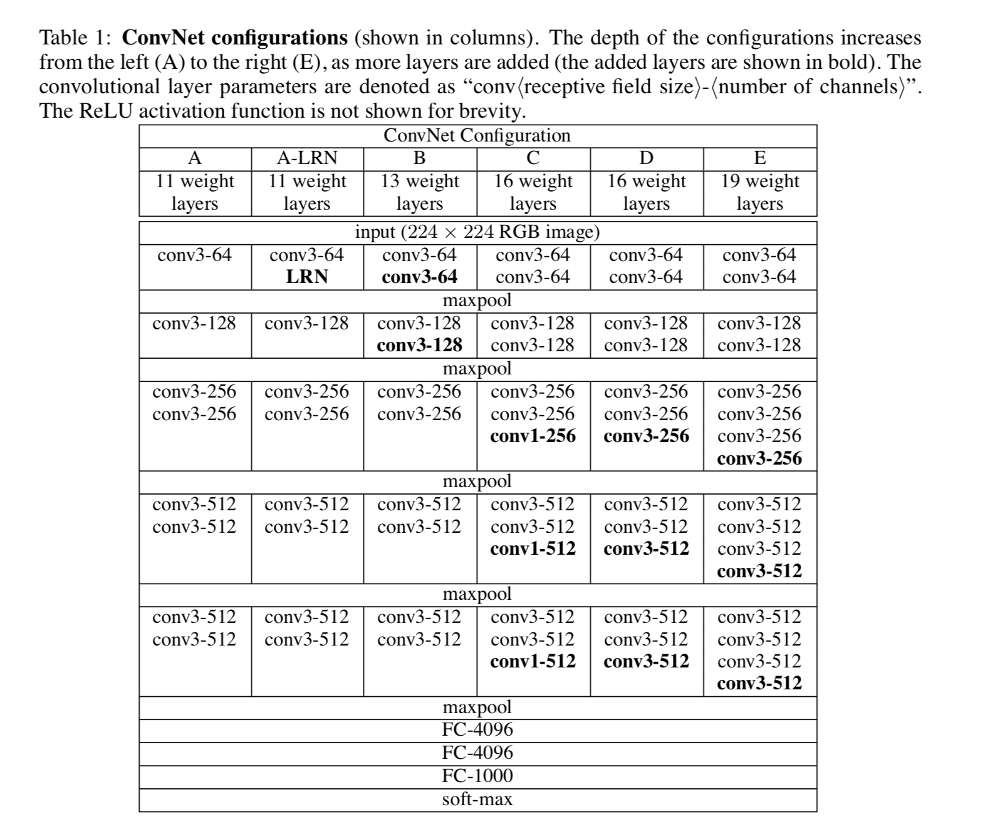

# 卷积神经网络之VGGNet

VGGNet，由牛津大学计算机组(Visual Geometry Group)和Google DeepMind公司的研究员于2014年提出，并通过该模型取得了ILSVRC2014比赛分类项目的第二名(第一名是GoogLeNet，也是同年提出)和定位项目的第一名。与之前的LeNet和AlexNet不同的是，VGGNet探索了卷积神经网络的深度与其性能之间的关系，成功构建了16-19层深度的卷积神经网络，证明了增加网络的深度能够成功的使得错误率大幅度降低，且其拓展性和泛化能力非常强。到目前为止，仍有很多公司用VGG或者其变种来做图像特征提取。

## 网络结构

VGGNet结构图如上所示，该模型可以堪称是AlexNet的加深版，结构简介，全部由卷积层和全连接层两大部分构成。该处以VGG16(共有16层参数学习层)为例对VGGNet进行详细介绍：

* C1：卷积层，64\*224\*224。由64个3\*3的卷积核+ReLU对输出进行卷积，步长为1，因此输出为64个224\*224的特征图，参数个数为：(3\*3+1)\*64 = 640
* C2：卷积层，64\*224\*224。和C1层相似，由64个3\*3的卷积核+ReLU对输出进行卷积，步长为1，因此输出为64个224\*224的特征图，参数个数为：(3\*3+1)\*64 = 640
* Max Pooling层：池化单元尺寸为2x2（效果为图像尺寸减半），池化后得到64个112\*112的特征图
* C3：卷积层，128\*112\*112。由128个3\*3的卷积核+ReLU对输出进行卷积，步长为1，因此输出为128个112\*112的特征图，参数个数为：(3\*3+1)\*128 = 1280
* C4：卷积层，128\*112\*112。和C3相似，由128个3\*3的卷积核+ReLU对输出进行卷积，步长为1，因此输出为128个112\*112的特征图，参数个数为：(3\*3+1)\*128 = 1280
* Max Pooling层：池化单元尺寸为2x2（效果为图像尺寸减半），池化后得到128个56\*56的特征图
* C5：卷积层，256\*56\*56。由256个3\*3的卷积核+ReLU对输出进行卷积，步长为1，因此输出为256个56\*56的特征图，参数个数为：(3\*3+1)\*256 = 2560
* C6：卷积层，256\*56\*56。和C5相似，由256个3\*3的卷积核+ReLU对输出进行卷积，步长为1，因此输出为256个56\*56的特征图，参数个数为：(3\*3+1)\* 256 = 2560
* C7：卷积层，256\*56\*56。和C5相似，由256个3\*3的卷积核+ReLU对输出进行卷积，步长为1，因此输出为256个56\*56的特征图，参数个数为：(3\*3+1)\* 256 = 2560
* Max Pooling层：池化单元尺寸为2x2（效果为图像尺寸减半），池化后得到256个28\*28的特征图
* C8：卷积层，512\*28\*28。由512个3\*3的卷积核+ReLU对输出进行卷积，步长为1，因此输出为512个28\*28的特征图，参数个数为：(3\*3+1)\*512 = 5120
* C9：卷积层，512\*28\*28。和C8相似，由512个3\*3的卷积核+ReLU对输出进行卷积，步长为1，因此输出为512个28\*28的特征图，参数个数为：(3\*3+1)\*512 = 5120
* C10：卷积层，512\*28\*28。和C8相似，由512个3\*3的卷积核+ReLU对输出进行卷积，步长为1，因此输出为512个28\*28的特征图，参数个数为：(3\*3+1)\*512 = 5120
* Max Pooling层：池化单元尺寸为2x2（效果为图像尺寸减半），池化后得到256个14\*14的特征图
* C11：卷积层，512\*14\*14。由512个3\*3的卷积核+ReLU对输出进行卷积，步长为1，因此输出为512个14\*14的特征图，参数个数为：(3\*3+1)\*512 = 5120
* C12：卷积层，512\*14\*14。和C10相似，由512个3\*3的卷积核+ReLU对输出进行卷积，步长为1，因此输出为512个14\*14的特征图，参数个数为：(3\*3+1)\*512 = 5120
* C13：卷积层，512\*14\*14。和C11相似，由512个3\*3的卷积核+ReLU对输出进行卷积，步长为1，因此输出为512个14\*14的特征图，参数个数为：(3\*3+1)\*512 = 5120
* Max Pooling层：池化单元尺寸为2x2（效果为图像尺寸减半），池化后得到256个7\*7的特征图
* FC14: 卷积层(替换全连接层)，4096。4096个256\*7\*7的卷积核，输出为4096的特征图，参数个数为：256\*7\*7\*4096
* FC15: 卷积层(替换全连接层)，4096。4096个1\*1\*4096的卷积核，输出为4096的特征图，参数个数为：4096\*4096
* FC16: 卷积层(替换全连接层)，1000。1000个1\*1\*4096的卷积核，输出为4096的特征图，参数个数为：1000\*4096

## 网络特性

* 结构简洁：VGG由5层大卷积层(每个大卷积层由2-3层卷积层组成)、3层全连接层、softmax输出层构成，每个大卷积层之后都带有max-pooling，所有隐藏层的激活函数都采用ReLU。
* 小卷积核和多卷积子层：VGG使用多个较小卷积核（3x3）的卷积层代替一个卷积核较大的卷积层，一方面可以减少参数，另一方面相当于进行了更多的非线性映射，可以增加网络的拟合/表达能力。小卷积核是VGG的一个重要特点，虽然VGG是在模仿AlexNet的网络结构，但没有采用AlexNet中比较大的卷积核尺寸（如7x7），而是通过降低卷积核的大小（3x3），增加卷积子层数来达到同样的性能（VGG：从1到4卷积子层，AlexNet：1子层）。VGG的作者认为两个3x3的卷积堆叠获得的感受野大小，相当一个5x5的卷积；而3个3x3卷积的堆叠获取到的感受野相当于一个7x7的卷积(无独有偶，GoogLeNet中的Inception也有此观点)。这样可以增加非线性映射，也能很好地减少参数（例如7x7的参数为49个，而3个3x3的参数为27）。
* 小池化核：相比AlexNet的3x3的池化核，VGG全部采用2x2的池化核。
* 通道数多：VGG网络第一层的通道数为64，后面每层都进行了翻倍，最多到512个通道，通道数的增加，使得更多的信息可以被提取出来。
* 层数更深、特征图更宽：由于卷积核专注于扩大通道数、池化专注于缩小宽和高，使得模型架构上更深更宽的同时，控制了计算量的增加规模。
* 全连接转卷积:这也是VGG的一个特点，在网络测试阶段将训练阶段的三个全连接替换为三个卷积，使得测试得到的全卷积网络因为没有全连接的限制，因而可以接收任意宽或高为的输入，这在测试阶段很重要。例如7x7x512的层要跟4096个神经元的层做全连接，则替换为对7x7x512的层作通道数为4096、卷积核为1x1的卷积。这个“全连接转卷积”的思路是VGG作者参考了OverFeat的工作思路，例如下图是OverFeat将全连接换成卷积后，则可以来处理任意分辨率（在整张图）上计算卷积，这就是无需对原图做重新缩放处理的优势。

## VGGNet的效果

作者根据VGGNet的思想做了6种网络，分别为A、A-LRN、B、C、D、E，这6种网络结构的深度虽然从11层增加至19层，但参数量变化不大，这是由于基本上都是采用了小卷积核（3x3，只有9个参数），这6种结构的参数数量（百万级）并未发生太大变化，这是因为在网络中，参数主要集中在全连接层。这6种网络的错误率结果如图3，从图中可以看出：

* LRN层无性能增益（A-LRN）：VGG作者通过网络A-LRN发现，AlexNet曾经用到的LRN层（local response normalization，局部响应归一化）并没有带来性能的提升，因此在其它组的网络中均没再出现LRN层。
* 随着深度增加，分类性能逐渐提高（A、B、C、D、E）：从11层的A到19层的E，网络深度增加对top1和top5的错误率下降很明显。
* 多个小卷积核比单个大卷积核性能好（B）：VGG作者做了实验用B和自己一个不在实验组里的较浅网络比较，较浅网络用conv5x5来代替B的两个conv3x3，结果显示多个小卷积核比单个大卷积核效果要好。