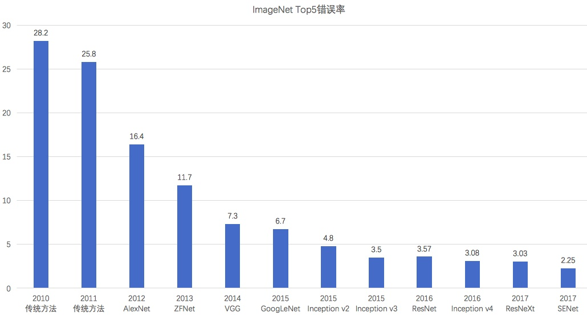

# 卷积神经网络

近几年，卷积神经网络在计算机视觉应用中，取得了非常成功的应用，成为了一种非常通用的深度学习基础网络之一。CNN发展至今，已经有很多变种，其中有几个经典模型在CNN发展历程中有着里程碑的意义，他们那分别是：LeNet、AlexNet、GoogLeNet、VGGNet、ResNet等，在本章中经逐一进行介绍。
这些模型都曾经在ImageNet上大放异彩，如下图所示，因为深度学习的发展，ImageNet上的分类错误率逐年降低，并且已经低于人类的错误率（5.1%）

