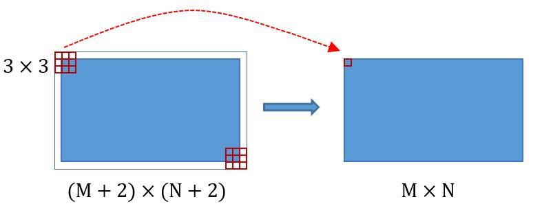
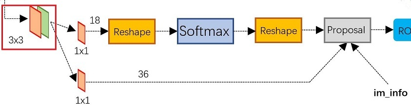
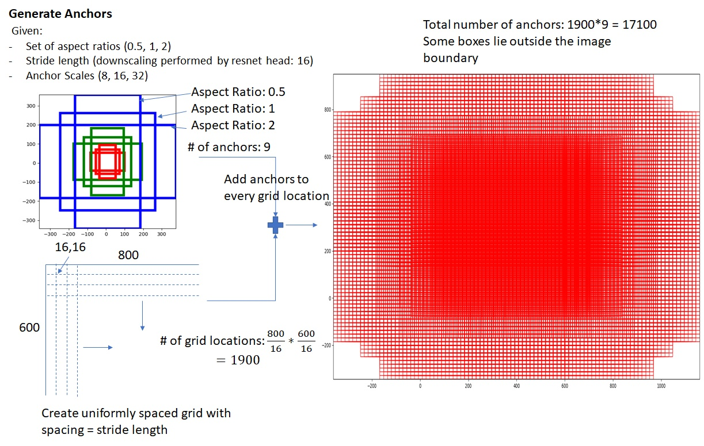
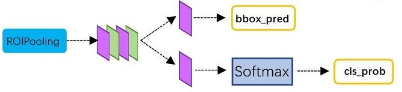
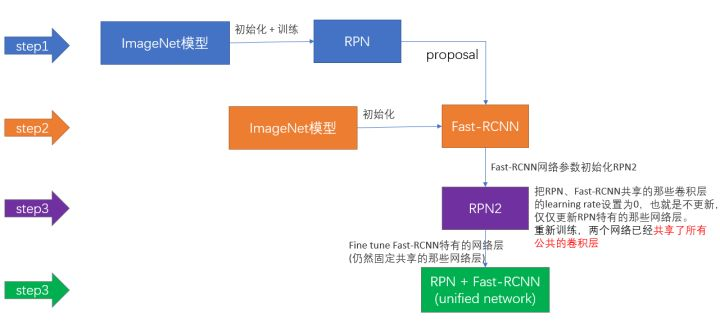
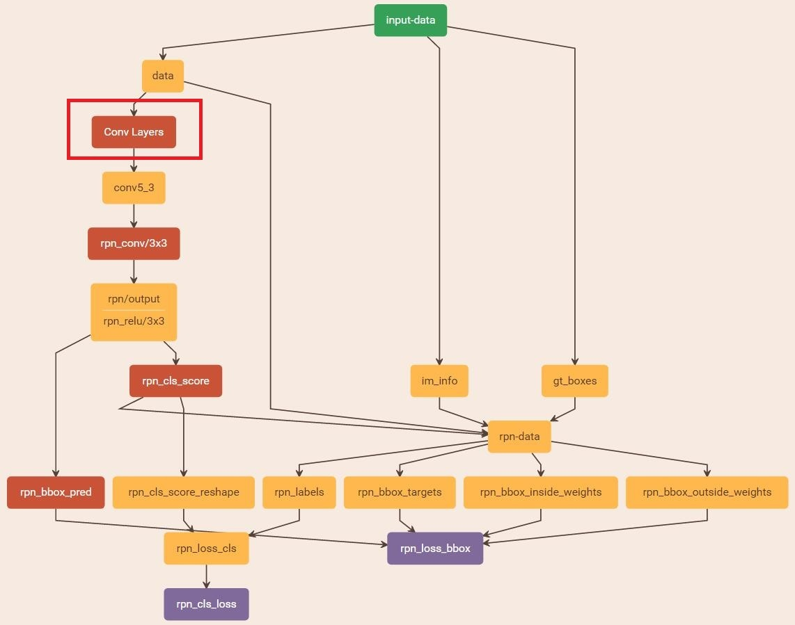
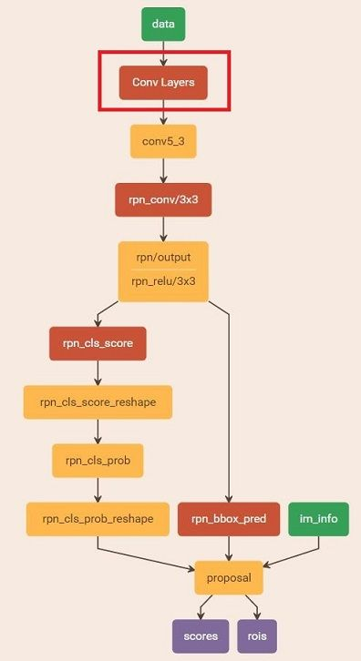
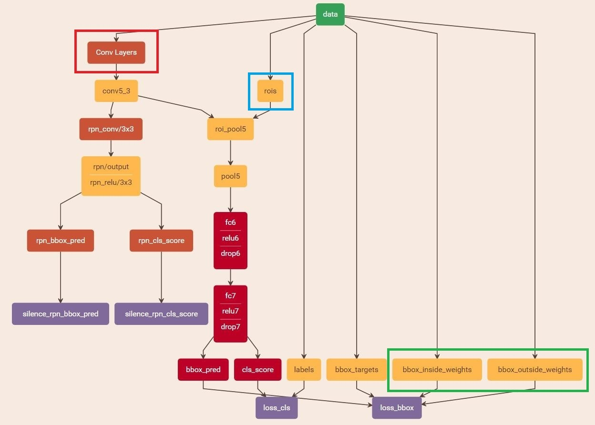

# 目标检测和分类之Faster RCNN
经过R-CNN和Fast RCNN的积淀，Ross B. Girshick在2016年提出了新的Faster RCNN，在结构上，Faster RCNN已经将特征抽取(feature extraction)，proposal提取，bounding box regression(rect refine)，classification都整合在了一个网络中，使得综合性能有较大提高，在检测速度方面尤为明显。针对Fast R-CNN存在的问题：存在瓶颈：选择性搜索，找出所有的候选框，这个也非常耗时。Faster RCNN找到了一个更佳高效的解决方法：加入一个提取边缘的神经网络，也就说找到候选框的工作也交给神经网络来做了。

如图1，Faster RCNN其实可以分为4个主要内容：

1. Conv layers。作为一种CNN网络目标检测方法，Faster RCNN首先使用一组基础的conv+relu+pooling层提取image的feature maps。该feature maps被共享用于后续RPN层和全连接层；
2. Region Proposal Networks。RPN网络用于生成region proposals。该层通过softmax判断anchors属于foreground或者background，再利用bounding box regression修正anchors获得精确的proposals；
3. Roi Pooling。该层收集输入的feature maps和proposals，综合这些信息后提取proposal feature maps，送入后续全连接层判定目标类别；
4. Classification。利用proposal feature maps计算proposal的类别，同时再次bounding box regression获得检测框最终的精确位置。

## Conv Layers
Conv layers包含了conv，pooling，relu三种层。以python版本中的VGG16模型中的faster_rcnn_test.pt的网络结构为例，如图2，Conv layers部分共有13个conv层，13个relu层，4个pooling层。这里有一个非常容易被忽略但是又无比重要的信息，在Conv layers中：

1. 所有的conv层都是：kernel_size=3 ， pad=1，stride=1
2. 所有的pooling层都是：kernel_size=2，pad=0，stride=2

为何重要？在Faster RCNN Conv layers中对所有的卷积都做了扩边处理（ pad=1，即填充一圈0），导致原图变为 (M+2)x(N+2)大小，再做3x3卷积后输出MxN 。正是这种设置，导致Conv layers中的conv层不改变输入和输出矩阵大小。如下图：

类似的是，Conv layers中的pooling层kernel_size=2，stride=2。这样每个经过pooling层的MxN矩阵，都会变为(M/2)x(N/2)大小。综上所述，在整个Conv layers中，conv和relu层不改变输入输出大小，只有pooling层使输出长宽都变为输入的1/2。
那么，一个MxN大小的矩阵经过Conv layers固定变为(M/16)x(N/16)！这样Conv layers生成的featuure map中都可以和原图对应起来。

## Region Proposal Networks(RPN)
经典的检测方法生成检测框都非常耗时，如OpenCV adaboost使用滑动窗口+图像金字塔生成检测框；或如R-CNN使用SS(Selective Search)方法生成检测框。而Faster RCNN则抛弃了传统的滑动窗口和SS方法，直接使用RPN生成检测框，这也是Faster R-CNN的巨大优势，能极大提升检测框的生成速度。

上图展示了RPN网络的具体结构。可以看到RPN网络实际分为2条线，上面一条通过softmax分类anchors获得foreground和background（检测目标是foreground），下面一条用于计算对于anchors的bounding box regression偏移量，以获得精确的proposal。而最后的Proposal层则负责综合foreground anchors和bounding box regression偏移量获取proposals，同时剔除太小和超出边界的proposals。其实整个网络到了Proposal Layer这里，就完成了相当于目标定位的功能。

1. anchors：提到RPN网络，就不能不说anchors。所谓anchors，实际上就是一组由rpn/generate_anchors.py生成的矩形。实际上通过anchors就引入了检测中常用到的多尺度方法。其实RPN最终就是在原图尺度上，设置了密密麻麻的候选Anchor。然后用cnn去判断哪些Anchor是里面有目标的foreground anchor，哪些是没目标的backgroud。所以，仅仅是个二分类而已！

2. softmax判定foreground与background；
3. bounding box regression原理：如图9所示绿色框为飞机的Ground Truth(GT)，红色为提取的foreground anchors，即便红色的框被分类器识别为飞机，但是由于红色的框定位不准，这张图相当于没有正确的检测出飞机。所以我们希望采用一种方法对红色的框进行微调，使得foreground anchors和GT更加接近。
4. 对proposals进行bounding box regression。
5. Proposal Layer：Proposal Layer负责综合所有变换量和foreground anchors，计算出精准的proposal，送入后续RoI Pooling Layer。Proposal Layer forward（caffe layer的前传函数）按照以下顺序依次处理：1. 生成anchors，对所有的anchors做bbox regression回归（这里的anchors生成和训练时完全一致）；2. 按照输入的foreground softmax scores由大到小排序anchors，提取前pre_nms_topN(e.g. 6000)个anchors，即提取修正位置后的foreground anchors；3. 限定超出图像边界的foreground anchors为图像边界（防止后续roi pooling时proposal超出图像边界）；4. 剔除非常小（width<threshold or height<threshold）的foreground anchors；5. 进行nonmaximum suppression；6. 再次按照nms后的foreground softmax scores由大到小排序fg anchors，提取前post_nms_topN(e.g. 300)结果作为proposal输出。

### Rol Pooling
而RoI Pooling层则负责收集proposal，并计算出proposal feature maps，送入后续网络。从图2中可以看到Rol pooling层有2个输入：1. 原始的feature maps；2. RPN输出的proposal boxes（大小各不相同）。如同Fast RCNN。

## Classification
Classification部分利用已经获得的proposal feature maps，通过full connect层与softmax计算每个proposal具体属于那个类别（如人，车，电视等），输出cls_prob概率向量；同时再次利用bounding box regression获得每个proposal的位置偏移量bbox_pred，用于回归更加精确的目标检测框。Classification部分网络结构如下图：

从PoI Pooling获取到7x7=49大小的proposal feature maps后，送入后续网络，可以看到做了如下2件事：1. 通过全连接和softmax对proposals进行分类，这实际上已经是识别的范畴了；2. 再次对proposals进行bounding box regression，获取更高精度的rect box。

## Faster R-CNN训练
Faster R-CNN的训练，是在已经训练好的model（如VGG_CNN_M_1024，VGG，ZF）的基础上继续进行训练。实际中训练过程分为6个步骤：

1. 在已经训练好的model上，训练RPN网络；
2. 利用步骤1中训练好的RPN网络，收集proposals
3. 第一次训练Fast RCNN网络
4. 第二训练RPN网络
5. 再次利用步骤4中训练好的RPN网络，收集proposals
6. 第二次训练Fast RCNN网络

可以看到训练过程类似于一种“迭代”的过程，不过只循环了2次。至于只循环了2次的原因是应为作者提到："A similar alternating training can be run for more iterations, but we have observed negligible improvements"，即循环更多次没有提升了。接下来本章以上述6个步骤讲解训练过程。下面是一张训练过程流程图，应该更加清晰。

简单给出RPN网络训练、proposals收集、Fast RCNN网络训练的过程：

1. 训练RPN网络：在该步骤中，首先读取RBG提供的预训练好的model（本文使用VGG），开始迭代训练，如下图：

2. 通过训练好的RPN网络收集proposals

3. 训练Faster RCNN网络：

