# 目标检测和分类之SSD
本论文翻译，摘抄自[Single Shot MultiBox Detector论文翻译——中文版](http://noahsnail.com/2017/12/11/2017-12-11-Single%20Shot%20MultiBox%20Detector%E8%AE%BA%E6%96%87%E7%BF%BB%E8%AF%91%E2%80%94%E2%80%94%E4%B8%AD%E6%96%87%E7%89%88/)

## 摘要
我们提出了一种使用单个深度神经网络来检测图像中的目标的方法。我们的方法命名为SSD，将边界框的输出空间离散化为不同长宽比的一组默认框和并缩放每个特征映射的位置。在预测时，网络会在每个默认框中为每个目标类别的出现生成分数，并对框进行调整以更好地匹配目标形状。此外，网络还结合了不同分辨率的多个特征映射的预测，自然地处理各种尺寸的目标。相对于需要目标提出的方法，SSD非常简单，因为它完全消除了提出生成和随后的像素或特征重新采样阶段，并将所有计算封装到单个网络中。这使得SSD易于训练和直接集成到需要检测组件的系统中。PASCAL VOC，COCO和ILSVRC数据集上的实验结果证实，SSD对于利用额外的目标提出步骤的方法具有竞争性的准确性，并且速度更快，同时为训练和推断提供了统一的框架。对于300×300的输入，SSD在VOC2007测试中以59FPS的速度在Nvidia Titan X上达到74.3%的mAP，对于512×512的输入，SSD达到了76.9%的mAP，优于参照的最先进的Faster R-CNN模型。与其他单阶段方法相比，即使输入图像尺寸较小，SSD也具有更高的精度。代码获取：https://github.com/weiliu89/caffe/tree/ssd。

## 引言
目前最先进的目标检测系统是以下方法的变种：假设边界框，每个框重采样像素或特征，并应用一个高质量的分类器。自从选择性搜索[1]通过在PASCAL VOC，COCO和ILSVRC上所有基于Faster R-CNN[2]的检测都取得了当前领先的结果（尽管具有更深的特征如[3]），这种流程在检测基准数据上流行开来。尽管这些方法准确，但对于嵌入式系统而言，这些方法的计算量过大，即使是高端硬件，对于实时应用而言也太慢。通常，这些方法的检测速度是以每帧秒（SPF）度量，甚至最快的高精度检测器，Faster R-CNN，仅以每秒7帧（FPS）的速度运行。已经有很多尝试通过处理检测流程中的每个阶段来构建更快的检测器（参见第4节中的相关工作），但是到目前为止，显著提高的速度仅以显著降低的检测精度为代价。

本文提出了第一个基于深度网络的目标检测器，它不对边界框假设的像素或特征进行重采样，并且与其它方法有一样精确度。这对高精度检测在速度上有显著提高（在VOC2007测试中，59FPS和74.3%的mAP，与Faster R-CNN 7FPS和73.2%的mAP或者YOLO 45 FPS和63.4%的mAP相比）。速度的根本改进来自消除边界框提出和随后的像素或特征重采样阶段。我们并不是第一个这样做的人（查阅[4,5]），但是通过增加一系列改进，我们设法比以前的尝试显著提高了准确性。我们的改进包括使用小型卷积滤波器来预测边界框位置中的目标类别和偏移量，使用不同长宽比检测的单独预测器（滤波器），并将这些滤波器应用于网络后期的多个特征映射中，以执行多尺度检测。通过这些修改——特别是使用多层进行不同尺度的预测——我们可以使用相对较低的分辨率输入实现高精度，进一步提高检测速度。虽然这些贡献可能单独看起来很小，但是我们注意到由此产生的系统将PASCAL VOC实时检测的准确度从YOLO的63.4%的mAP提高到我们的SSD的74.3%的mAP。相比于最近备受瞩目的残差网络方面的工作[3]，在检测精度上这是相对更大的提高。而且，显著提高的高质量检测速度可以扩大计算机视觉使用的设置范围。

我们总结我们的贡献如下：

* 我们引入了SSD，这是一种针对多个类别的单次检测器，比先前的先进的单次检测器（YOLO）更快，并且准确得多，事实上，与执行显式区域提出和池化的更慢的技术具有相同的精度（包括Faster R-CNN）。
* SSD的核心是预测固定的一系列默认边界框的类别分数和边界框偏移，使用更小的卷积滤波器应用到特征映射上。
* 为了实现高检测精度，我们根据不同尺度的特征映射生成不同尺度的预测，并通过纵横比明确分开预测。
* 这些设计功能使得即使在低分辨率输入图像上也能实现简单的端到端训练和高精度，从而进一步提高速度与精度之间的权衡。
* 实验包括在PASCAL VOC，COCO和ILSVRC上评估具有不同输入大小的模型的时间和精度分析，并与最近的一系列最新方法进行比较。

## SSD
本节描述我们提出的SSD检测框架和相关的训练方法。之后，将介绍数据集特有的模型细节和实验结果。

### 模型
SSD方法基于前馈卷积网络，该网络产生固定大小的边界框集合，并对这些边界框中存在的目标类别实例进行评分，然后进行非极大值抑制步骤来产生最终的检测结果。早期的网络层基于用于高质量图像分类的标准架构（在任何分类层之前被截断），我们将其称为基础网络。然后，我们将辅助结构添加到网络中以产生具有以下关键特征的检测：

* 用于检测的多尺度特征映射。我们将卷积特征层添加到截取的基础网络的末端。这些层在尺寸上逐渐减小，并允许在多个尺度上对检测结果进行预测。用于预测检测的卷积模型对于每个特征层都是不同的（查阅Overfeat[4]和YOLO[5]在单尺度特征映射上的操作）。
* 用于检测的卷积预测器。每个添加的特征层（或者任选的来自基础网络的现有特征层）可以使用一组卷积滤波器产生固定的检测预测集合。这些在图2中的SSD网络架构的上部指出。对于具有p通道的大小为m×n的特征层，潜在检测的预测参数的基本元素是3×3×p的小核得到某个类别的分数，或者相对于默认框坐标的形状偏移。在应用卷积核的m×n的每个位置，它会产生一个输出值。边界框偏移输出值是相对每个特征映射位置的相对默认框位置来度量的（查阅YOLO[5]的架构，该步骤使用中间全连接层而不是卷积滤波器）。

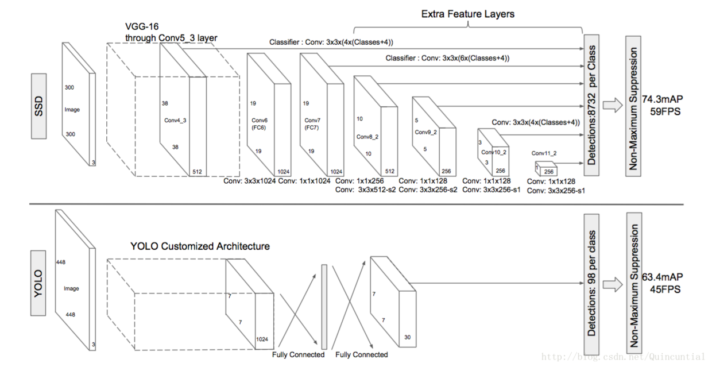
图1：两个单次检测模型的比较：SSD和YOLO[5]。我们的SSD模型在基础网络的末端添加了几个特征层，它预测了不同尺度和长宽比的默认边界框的偏移量及其相关的置信度。300×300输入尺寸的SSD在VOC2007 test上的准确度上明显优于448×448的YOLO的准确度，同时也提高了速度。

* 默认边界框和长宽比。对于网络顶部的多个特征映射，我们将一组默认边界框与每个特征映射单元相关联。默认边界框以卷积的方式平铺特征映射，以便每个边界框相对于其对应单元的位置是固定的。在每个特征映射单元中，我们预测单元中相对于默认边界框形状的偏移量，以及指出每个边界框中存在的每个类别实例的类别分数。具体而言，对于给定位置处的k个边界框中的每一个，我们计算c个类别分数和相对于原始默认边界框形状的4个偏移量。这导致在特征映射中的每个位置周围应用总共(c+4)k个滤波器，对于m×n的特征映射取得(c+4)kmn个输出。有关默认边界框的说明，请参见图1。我们的默认边界框与Faster R-CNN[2]中使用的锚边界框相似，但是我们将它们应用到不同分辨率的几个特征映射上。在几个特征映射中允许不同的默认边界框形状让我们有效地离散可能的输出框形状的空间。

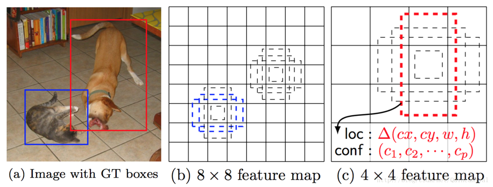
图2：SSD框架。（a）在训练期间，SSD仅需要每个目标的输入图像和真实边界框。以卷积方式，我们评估具有不同尺度（例如（b）和（c）中的8×8和4×4）的几个特征映射中每个位置处不同长宽比的默认框的小集合（例如4个）。对于每个默认边界框，我们预测所有目标类别$(c_1, c_2, \dots, c_p)$的形状偏移量和置信度。在训练时，我们首先将这些默认边界框与实际的边界框进行匹配。例如，我们已经与猫匹配两个默认边界框，与狗匹配了一个，这被视为积极的，其余的是消极的。模型损失是定位损失（例如，Smooth L1[6]）和置信度损失（例如Softmax）之间的加权和。

### 训练
训练SSD和训练使用区域提出的典型检测器之间的关键区别在于，需要将真实信息分配给固定的检测器输出集合中的特定输出。在YOLO[5]的训练中、Faster R-CNN[2]和MultiBox[7]的区域提出阶段，一些版本也需要这样的操作。一旦确定了这个分配，损失函数和反向传播就可以应用端到端了。训练也涉及选择默认边界框集合和缩放进行检测，以及难例挖掘和数据增强策略。

* 匹配策略。在训练过程中，我们需要确定哪些默认边界框对应实际边界框的检测，并相应地训练网络。对于每个实际边界框，我们从默认边界框中选择，这些框会在位置，长宽比和尺度上变化。我们首先将每个实际边界框与具有最好的Jaccard重叠（如MultiBox[7]）的边界框相匹配。与MultiBox不同的是，我们将默认边界框匹配到Jaccard重叠高于阈值（0.5）的任何实际边界框。这简化了学习问题，允许网络为多个重叠的默认边界框预测高分，而不是要求它只挑选具有最大重叠的一个边界框。
* 训练目标函数。SSD训练目标函数来自于MultiBox目标[7,8]，但扩展到处理多个目标类别。设$x_{ij}^p = \lbrace 1,0 \rbrace$是第i个默认边界框匹配到类别p的第j个实际边界框的指示器。在上面的匹配策略中，我们有$\sum_i x_{ij}^p \geq 1$。总体目标损失函数是定位损失（loc）和置信度损失（conf）的加权和： $L(x, c, l, g) = \frac{1}{N}(L_{conf}(x, c) + \alpha L_{loc}(x, l, g)) \tag{1}$其中N是匹配的默认边界框的数量。如果N=0，则将损失设为0。定位损失是预测框(l)与真实框(g)参数之间的Smooth L1损失[6]。类似于Faster R-CNN[2]，我们回归默认边界框(d)的中心偏移量(cx,cy)和其宽度(w)、高度(h)的偏移量。$L_{loc}(x,l,g) = \sum_{i \in Pos}^N \sum_{m \in \lbrace cx, cy, w, h \rbrace} x_{ij}^k \mathtt{smooth}_{L1}(l_{i}^m - \hat{g}_j^m) \\ \hat{g}_j^{cx} = (g_j^{cx} - d_i^{cx}) / d_i^w \quad \quad \hat{g}_j^{cy} = (g_j^{cy} - d_i^{cy}) / d_i^h \\ \hat{g}_j^{w} = \log\Big(\frac{g_j^{w}}{d_i^w}\Big) \quad \quad \hat{g}_j^{h} = \log\Big(\frac{g_j^{h}}{d_i^h}\Big) \tag{2}$置信度损失是在多类别置信度(c)上的softmax损失。$L_{conf}(x, c) = - \sum_{i\in Pos}^N x_{ij}^p log(\hat{c}_i^p) - \sum_{i\in Neg} log(\hat{c}_i^0)\quad \mathtt{where}\quad\hat{c}_i^p = \frac{\exp(c_i^p)}{\sum_p \exp(c_i^p)} \tag{3}$通过交叉验证权重项α设为1。
* 为默认边界框选择尺度和长宽比。为了处理不同的目标尺度，一些方法[4,9]建议处理不同尺寸的图像，然后将结果合并。然而，通过利用单个网络中几个不同层的特征映射进行预测，我们可以模拟相同的效果，同时还可以跨所有目标尺度共享参数。以前的工作[10,11]已经表明，使用低层的特征映射可以提高语义分割的质量，因为低层会捕获输入目标的更多细节。同样，[12]表明，从特征映射上添加全局上下文池化可以有助于平滑分割结果。受这些方法的启发，我们使用较低和较高的特征映射进行检测。图1显示了框架中使用的两个示例性特征映射（8×8和4×4）。在实践中，我们可以使用更多的具有很少计算开支的特征映射。已知网络中不同层的特征映射具有不同的（经验的）感受野大小[13]。幸运的是，在SSD框架内，默认边界框不需要对应于每层的实际感受野。我们设计平铺默认边界框，以便特定的特征映射学习响应目标的特定尺度。假设我们要使用m个特征映射进行预测。每个特征映射默认边界框的尺度计算如下：$s_k = s_\text{min} + \frac{s_\text{max} - s_\text{min}}{m - 1} (k - 1),\quad k\in [1, m]$其中$S_{min}$，$S_{max}$为0.9，意味着最低层具有0.2的尺度，最高层具有0.9的尺度，并且在它们之间的所有层是规则间隔的。我们为默认边界框添加不同的长宽比，并将它们表示为$a_r \in {1, 2, 3, \frac{1}{2}, \frac{1}{3}}$。我们可以计算每个边界框的宽度$w_k^a = s_k\sqrt{a_r}$和高度$h_k^a = s_k / \sqrt{a_r}$。对于长宽比为1，我们还添加了一个默认边界框，其尺度为$s’_k = \sqrt{s_k s_{k+1}}$，在每个特征映射位置得到6个默认边界框。我们将每个默认边界框的中心设置为$(\frac{i+0.5}{|f_k|}, \frac{j+0.5}{|f_k|})$，其中$|f_k|$是第k个平方特征映射的大小，$i, j\in [0, |f_k|)$。在实践中，也可以设计默认边界框的分布以最适合特定的数据集。如何设计最佳平铺也是一个悬而未决的问题。通过将所有默认边界框的预测与许多特征映射所有位置的不同尺度和高宽比相结合，我们有不同的预测集合，涵盖各种输入目标大小和形状。例如，在图1中，狗被匹配到4×4特征映射中的默认边界框，而不是8×8特征映射中的任何默认框。这是因为那些边界框有不同的尺度，不匹配狗的边界框，因此在训练期间被认为是负例。
* 难例挖掘。在匹配步骤之后，大多数默认边界框为负例，尤其是当可能的默认边界框数量较多时。这在正的训练实例和负的训练实例之间引入了显著的不平衡。我们不使用所有负例，而是使用每个默认边界框的最高置信度损失来排序它们，并挑选最高的置信度，以便负例和正例之间的比例至多为3:1。我们发现这会导致更快的优化和更稳定的训练。
* 数据增强。为了使模型对各种输入目标大小和形状更鲁棒，每张训练图像都是通过以下选项之一进行随机采样的：1.使用整个原始输入图像；2.采样一个图像块，使得与目标之间的最小Jaccard重叠为0.1，0.3，0.5，0.7或0.9; 3.随机采样一个图像块。每个采样图像块的大小是原始图像大小的[0.1，1]，长宽比在$\frac {1} {2}$和2之间。如果实际边界框的中心在采用的图像块中，我们保留实际边界框与采样图像块的重叠部分。在上述采样步骤之后，除了应用类似于文献[14]中描述的一些光度变形之外，将每个采样图像块调整到固定尺寸并以0.5的概率进行水平翻转。

## 实验结果
基础网络。我们的实验全部基于VGG16[15]，它是在ILSVRC CLS-LOC数据集[16]上预先训练的。类似于DeepLab-LargeFOV[17]，我们将fc6和fc7转换为卷积层，从fc6和fc7中重采样参数，将pool5从2×2−s2更改为3×3−s1，并使用空洞算法[18]来填补这个“小洞”。我们删除所有的丢弃层和fc8层。我们使用SGD对得到的模型进行微调，初始学习率为$10^{-3}$，动量为0.9，权重衰减为0.0005，批数据大小为32。每个数据集的学习速率衰减策略略有不同，我们将在后面详细描述。完整的训练和测试代码建立在Caffe[19]上并开源：https://github.com/weiliu89/caffe/tree/ssd。

### PASCAL VOC2007
在这个数据集上，我们在VOC2007 test（4952张图像）上比较了Fast R-CNN[6]和FAST R-CNN[2]。所有的方法都在相同的预训练好的VGG16网络上进行微调。

图2显示了SSD300模型的架构细节。我们使用conv4_3，conv7（fc7），conv8_2，conv9_2，conv10_2和conv11_2来预测位置和置信度。我们在conv4_3上设置了尺度为0.1的默认边界框。我们使用“xavier”方法[20]初始化所有新添加的卷积层的参数。对于conv4_3，conv10_2和conv11_2，我们只在每个特征映射位置上关联了4个默认边界框——忽略1/3和3的长宽比。对于所有其它层，我们像2.2节描述的那样放置了6个默认边界框。如[12]所指出的，与其它层相比，由于conv4_3具有不同的特征尺度，所以我们使用[12]中引入的L2正则化技术将特征映射中每个位置的特征标准缩放到20，在反向传播过程中学习尺度。对于40k次迭代，我们使用$10^{−3}$的学习率，然后继续用$10^{−4}$和$10^{−5}$的学习率训练10k迭代。当对VOC2007 𝚝𝚛𝚊𝚒𝚗𝚟𝚊𝚕进行训练时，表1显示了我们的低分辨率SSD300模型已经比Fast R-CNN更准确。当我们用更大的512×512输入图像上训练SSD时，它更加准确，超过了Faster R-CNN 1.7%的mAP。如果我们用更多的（即07+12）数据来训练SSD，我们看到SSD300已经比Faster R-CNN好1.1%，SSD512比Faster R-CNN好3.6%。如果我们将SSD512用3.4节描述的COCO 𝚝𝚛𝚊𝚒𝚗𝚟𝚊𝚕𝟹𝟻𝚔来训练模型并在07+12数据集上进行微调，我们获得了最好的结果：81.6%的mAP。

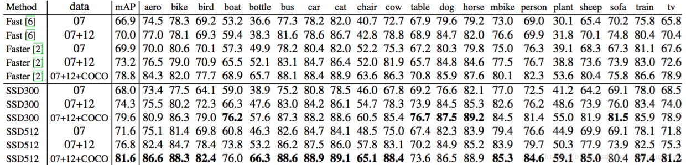

表1：PASCAL VOC2007 test检测结果。Fast和Faster R-CNN都使用最小维度为600的输入图像。两个SSD模型使用完全相同的设置除了它们有不同的输入大小(300×300和512×512)。很明显更大的输入尺寸会导致更好的结果，并且更大的数据同样有帮助。数据：“07”：VOC2007 trainval，“07+12”：VOC2007和VOC2012 trainval的联合。“07+12+COCO”：首先在COCO trainval35k上训练然后在07+12上微调。

为了更详细地了解我们两个SSD模型的性能，我们使用了[21]中的检测分析工具。图3显示了SSD可以检测到高质量（大白色区域）的各种目标类别。它大部分的确信检测是正确的。召回约为85−90%，而“弱”（0.1 Jaccard重叠）标准则要高得多。与R-CNN[22]相比，SSD具有更小的定位误差，表明SSD可以更好地定位目标，因为它直接学习回归目标形状和分类目标类别，而不是使用两个解耦步骤。然而，SSD对类似的目标类别（特别是对于动物）有更多的混淆，部分原因是我们共享多个类别的位置。图4显示SSD对边界框大小非常敏感。换句话说，它在较小目标上比在较大目标上的性能要差得多。这并不奇怪，因为这些小目标甚至可能在顶层没有任何信息。增加输入尺寸（例如从300×300到512×512）可以帮助改进检测小目标，但仍然有很大的改进空间。积极的一面，我们可以清楚地看到SSD在大型目标上的表现非常好。而且对于不同长宽比的目标，它是非常鲁棒的，因为我们使用每个特征映射位置的各种长宽比的默认框。

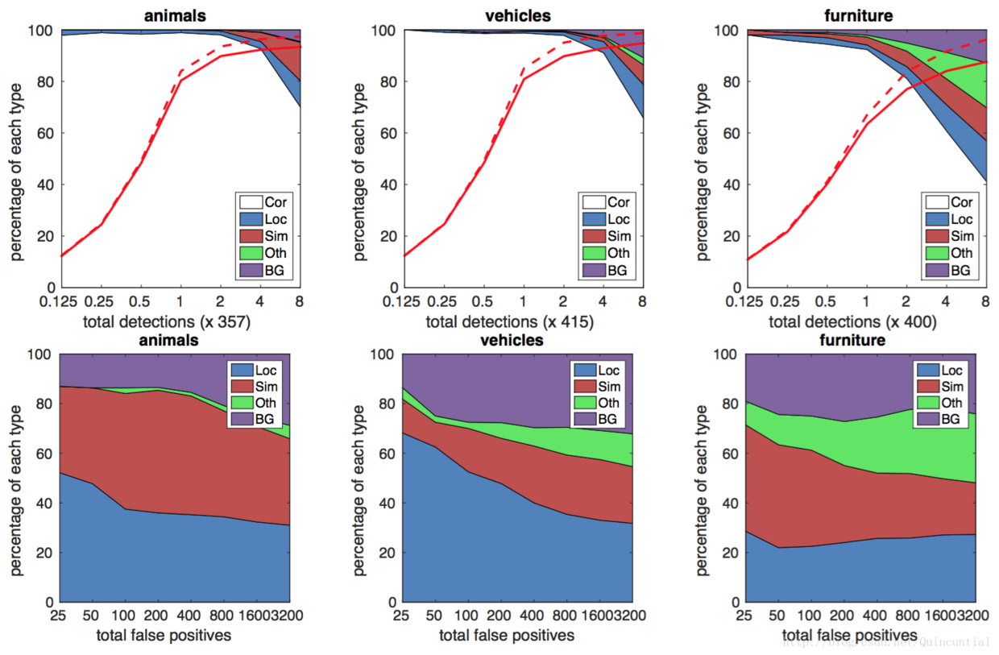
图3：SSD512在VOC2007 test中的动物，车辆和家具上的性能可视化。第一行显示由于定位不佳（Loc），与相似类别（Sim）混淆，与其它（Oth）或背景（BG）相关的正确检测（Cor）或假阳性的累积分数。红色的实线表示随着检测次数的增加，强标准（0.5 Jaccard重叠）下的召回变化。红色虚线是使用弱标准（0.1 Jaccard重叠）。最下面一行显示了排名靠前的假阳性类型的分布。

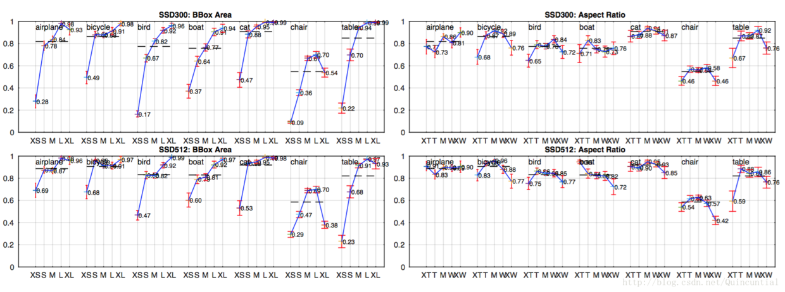
图4：使用[21]在VOC2007 test设置上不同目标特性的灵敏度和影响。左边的图显示了BBox面积对每个类别的影响，右边的图显示了长宽比的影响。关键：BBox区域：XS=超小；S=小；M=中等；L=大；XL=超大。长宽比：XT=超高/窄；T=高；M=中等；W=宽；XW =超宽。

### 模型分析
为了更好地了解SSD，我们进行了控制实验，以检查每个组件如何影响性能。对于所有的实验，我们使用相同的设置和输入大小（300×300），除了指定的设置或组件的更改。

* 数据增强至关重要。Fast和Faster R-CNN使用原始图像和水平翻转来训练。我们使用更广泛的抽样策略，类似于YOLO[5]。从表2可以看出，采样策略可以提高8.8%的mAP。我们不知道我们的采样策略将会使Fast和Faster R-CNN受益多少，但是他们可能从中受益较少，因为他们在分类过程中使用了一个特征池化步骤，这对通过设计的目标变换来说相对鲁棒。

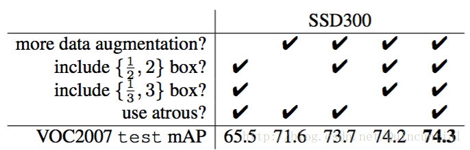
表2：各种设计选择和组件对SSD性能的影响。

* 更多的默认边界框形状会更好。如2.2节所述，默认情况下，我们每个位置使用6个默认边界框。如果我们删除长宽比为1/3和3的边界框，性能下降了0.6%。通过进一步去除12和2长宽比的盒子，性能再下降2.1%。使用各种默认边界框形状似乎使网络预测边界框的任务更容易。
* Atrous更快。如第3节所述，我们根据DeepLab-LargeFOV[17]使用子采样的VGG16的空洞版本。如果我们使用完整的VGG16，保持pool5为2×2-s2，并且不从fc6和fc7中子采样参数，并添加conv5_3进行预测，结果大致相同，而速度慢了大约20%。
* Atrous更快。如第3节所述，我们根据DeepLab-LargeFOV[17]使用子采样的VGG16的空洞版本。如果我们使用完整的VGG16，保持pool5为2×2-s2，并且不从fc6和fc7中子采样参数，并添加conv5_3进行预测，结果大致相同，而速度慢了大约20%。

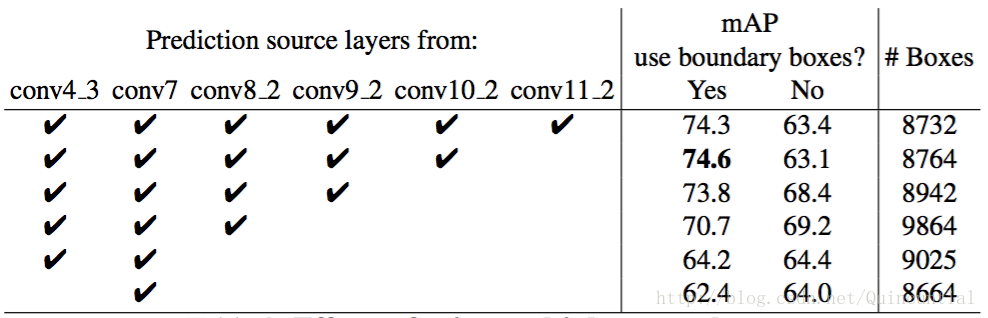
表3：使用多个输出层的影响。

### PASCAL VOC2012
除了我们使用VOC2012 trainval和VOC2007 trainval，test（21503张图像）进行训练，以及在VOC2012 test（10991张图像）上进行测试之外，我们使用与上述基本的VOC2007实验相同的设置。我们用$10^{−3}$的学习率对模型进行60k次的迭代训练，然后使用$10^{−4}$的学习率进行20k次迭代训练。表4显示了我们的SSD300和SSD512模型的结果。我们看到了与我们在VOC2007 test中观察到的相同的性能趋势。我们的SSD300比Fast/Faster R-CNN提高了准确性。通过将训练和测试图像大小增加到512×512，我们比Faster R-CNN的准确率提高了4.5%。与YOLO相比，SSD更精确，可能是由于使用了来自多个特征映射的卷积默认边界框和我们在训练期间的匹配策略。当对从COCO上训练的模型进行微调后，我们的SSD512达到了80.0%的mAP，比Faster R-CNN高了4.1%。

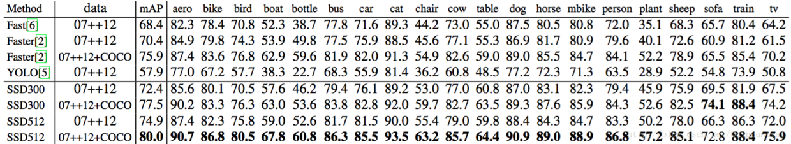
表4： PASCAL VOC2012 test上的检测结果. Fast和Faster R-CNN使用最小维度为600的图像，而YOLO的图像大小为448× 48。数据：“07++12”：VOC2007 trainval，test和VOC2012 trainval。“07++12+COCO”：先在COCO trainval135k上训练然后在07++12上微调。

### COCO
为了进一步验证SSD框架，我们在COCO数据集上对SSD300和SSD512架构进行了训练。由于COCO中的目标往往比PASCAL VOC中的更小，因此我们对所有层使用较小的默认边界框。我们遵循2.2节中提到的策略，但是现在我们最小的默认边界框尺度是0.15而不是0.2，并且conv4_3上的默认边界框尺度是0.07（例如，300×300图像中的21个像素）。

我们使用trainval35k[24]进行训练。我们首先用$10^{−3}$的学习率对模型进行训练，进行160k次迭代，然后继续以$10^{−4}$和$10^{−5}$的学习率各进行40k次迭代。表5显示了test-dev2015的结果。与我们在PASCAL VOC数据集中观察到的结果类似，SSD300在mAP@0.5和mAP@[0.5:0.95]中都优于Fast R-CNN。SSD300与ION 24]和Faster R-CNN[25]具有相似的mAP@0.75，但是mAP@0.5更差。通过将图像尺寸增加到512×512，我们的SSD512在这两个标准中都优于Faster R-CNN[25]。有趣的是，我们观察到SSD512在mAP@0.75中要好5.3%，但是在mAP@0.5中只好1.2%。我们也观察到，对于大型目标，AP（4.8%）和AR（4.6%）的效果要好得多，但对于小目标，AP（1.3%）和AR（2.0%）有相对更少的改进。与ION相比，大型和小型目标的AR改进更为相似（5.4%和3.9%）。我们推测Faster R-CNN在较小的目标上比SSD更具竞争力，因为它在RPN部分和Fast R-CNN部分都执行了两个边界框细化步骤。在图5中，我们展示了SSD512模型在COCO test-dev上的一些检测实例。

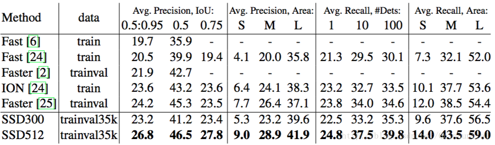
表5：COCO test-dev2015检测结果。

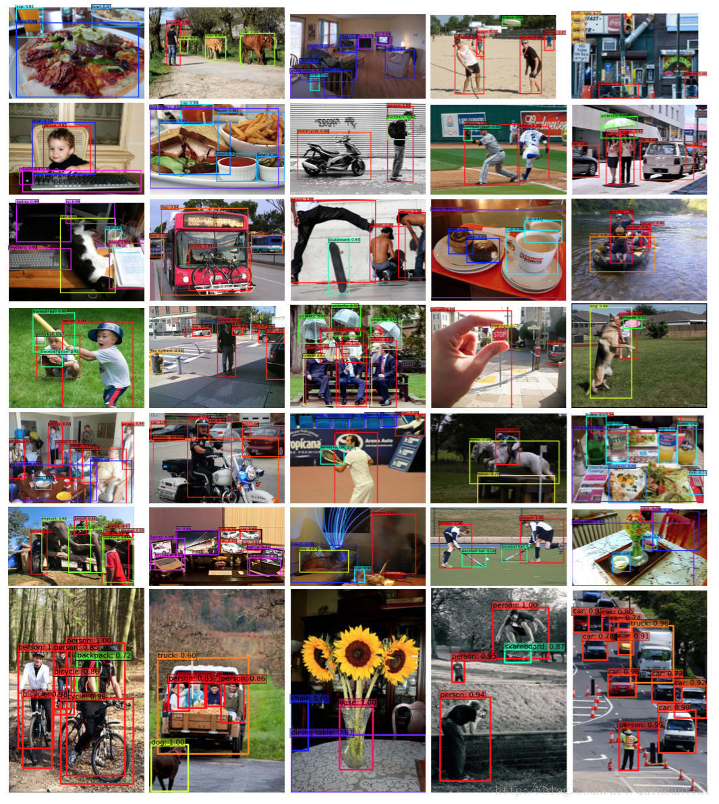
图5：SSD512模型在COCO test-dev上的检测实例。我们展示了分数高于0.6的检测。每种颜色对应一种目标类别。

### 初步的ILSVRC结果
我们将在COCO上应用的相同网络架构应用于ILSVRC DET数据集[16]。我们使用[22]中使用的ILSVRC2014 DETtrain和val1来训练SSD300模型。我们首先用$10^{−3}$的学习率对模型进行训练，进行了320k次的迭代，然后以$10^{−4}$继续迭代80k次，以$10^{−5}$迭代40k次。我们可以在val2数据集上[22]实现43.4 mAP。再一次证明了SSD是用于高质量实时检测的通用框架。

### 为小目标准确率进行数据增强
SSD没有如Faster R-CNN中后续的特征重采样步骤，小目标的分类任务对SSD来说相对困难，正如我们的分析（见图4）所示。2.2描述的数据增强有助于显著提高性能，特别是在PASCAL VOC等小数据集上。策略产生的随机裁剪可以被认为是“放大”操作，并且可以产生许多更大的训练样本。为了实现创建更多小型训练样本的“缩小”操作，我们首先将图像随机放置在填充了平均值的原始图像大小为16x的画布上，然后再进行任意的随机裁剪操作。因为通过引入这个新的“扩展”数据增强技巧，我们有更多的训练图像，所以我们必须将训练迭代次数加倍。我们已经在多个数据集上看到了一致的2%−3%的mAP增长，如表6所示。具体来说，图6显示新的增强技巧显著提高了模型在小目标上的性能。这个结果强调了数据增强策略对最终模型精度的重要性。

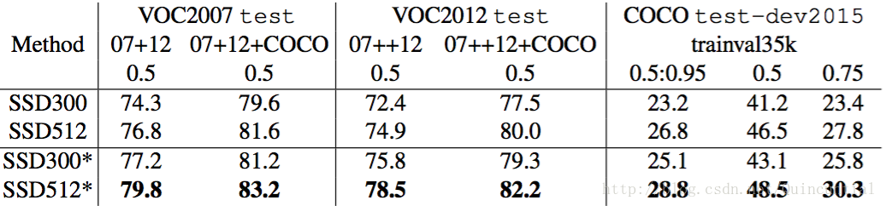
表6：我们使用图像扩展数据增强技巧在多个数据集上的结果。SSD300∗和SSD512∗是用新的数据增强训练的模型。

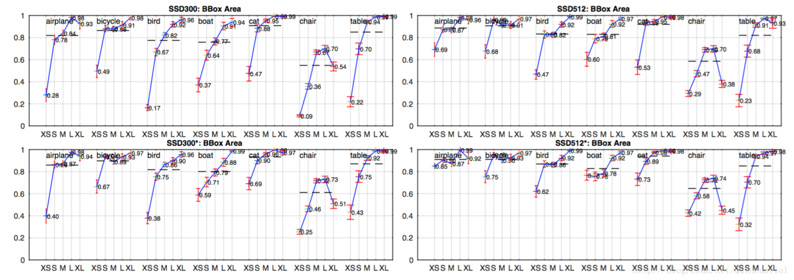
图6：具有新的数据增强的目标尺寸在[21]中使用的VOC2007test数据集上灵敏度及影响。最上一行显示了原始SSD300和SSD512模型上每个类别的BBox面积的影响，最下面一行对应使用新的数据增强训练技巧的SSD300∗和SSD512∗模型。新的数据增强技巧显然有助于显著检测小目标。

改进SSD的另一种方法是设计一个更好的默认边界框平铺，使其位置和尺度与特征映射上每个位置的感受野更好地对齐。我们将这个留给未来工作。

### 推断时间
考虑到我们的方法产生大量边界框，在推断期间执行非最大值抑制（nms）是必要的。通过使用0.01的置信度阈值，我们可以过滤大部分边界框。然后，我们应用nms，每个类别0.45的Jaccard重叠，并保留每张图像的前200个检测。对于SSD300和20个VOC类别，这个步骤每张图像花费大约1.7毫秒，接近在所有新增层上花费的总时间（2.4毫秒）。我们使用Titan X、cuDNN v4、Intel Xeon E5-2667v3@3.20GHz以及批大小为8来测量速度。

表7显示了SSD，Faster R-CNN[2]和YOLO[5]之间的比较。我们的SSD300和SSD512的速度和精度均优于Faster R-CNN。虽然Fast YOLO[5]可以以155FPS的速度运行，但其准确性却降低了近22%的mAP。就我们所知，SSD300是第一个实现70%以上mAP的实时方法。请注意，大约80%前馈时间花费在基础网络上（本例中为VGG16）。因此，使用更快的基础网络可以进一步提高速度，这也可能使SSD512模型达到实时。

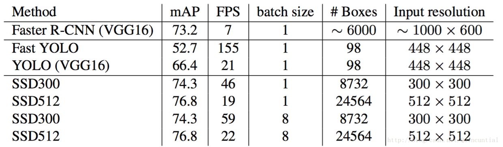
表7：Pascal VOC2007 test上的结果。SSD300是唯一可以取得70%以上mAP的实现检测方法。通过使用更大的输入图像，SSD512在精度上超过了所有方法同时保持近似实时的速度。

## 相关工作
在图像中有两种建立的用于目标检测的方法，一种基于滑动窗口，另一种基于区域提出分类。在卷积神经网络出现之前，这两种方法的最新技术——可变形部件模型（DPM）[26]和选择性搜索[1]——具有相当的性能。然而，在R-CNN[22]结合选择性搜索区域提出和基于后分类的卷积网络带来的显著改进后，区域提出目标检测方法变得流行。

最初的R-CNN方法已经以各种方式进行了改进。第一套方法提高了后分类的质量和速度，因为它需要对成千上万的裁剪图像进行分类，这是昂贵和耗时的。SPPnet[9]显著加快了原有的R-CNN方法。它引入了一个空间金字塔池化层，该层对区域大小和尺度更鲁棒，并允许分类层重用多个图像分辨率下生成的特征映射上计算的特征。Fast R-CNN[6]扩展了SPPnet，使得它可以通过最小化置信度和边界框回归的损失来对所有层进行端到端的微调，最初在MultiBox[7]中引入用于学习目标。

第二套方法使用深度神经网络提高了提出生成的质量。在最近的工作MultiBox[7,8]中，基于低级图像特征的选择性搜索区域提出直接被单独的深度神经网络生成的提出所取代。这进一步提高了检测精度，但是导致了一些复杂的设置，需要训练两个具有依赖关系的神经网络。Faster R-CNN[2]将选择性搜索提出替换为区域提出网络（RPN）学习到的区域提出，并引入了一种方法，通过交替两个网络之间的微调共享卷积层和预测层将RPN和Fast R-CNN结合在一起。通过这种方式，使用区域提出池化中级特征，并且最后的分类步骤比较便宜。我们的SSD与Faster R-CNN中的区域提出网络（RPN）非常相似，因为我们也使用一组固定的（默认）边界框进行预测，类似于RPN中的锚边界框。但是，我们不是使用这些来池化特征并评估另一个分类器，而是为每个目标类别在每个边界框中同时生成一个分数。因此，我们的方法避免了将RPN与Fast R-CNN合并的复杂性，并且更容易训练，更快且更直接地集成到其它任务中。

与我们的方法直接相关的另一组方法，完全跳过提出步骤，直接预测多个类别的边界框和置信度。OverFeat[4]是滑动窗口方法的深度版本，在知道了底层目标类别的置信度之后，直接从最顶层的特征映射的每个位置预测边界框。YOLO[5]使用整个最顶层的特征映射来预测多个类别和边界框（这些类别共享）的置信度。我们的SSD方法属于这一类，因为我们没有提出步骤，但使用默认边界框。然而，我们的方法比现有方法更灵活，因为我们可以在不同尺度的多个特征映射的每个特征位置上使用不同长宽比的默认边界框。如果我们只从最顶层的特征映射的每个位置使用一个默认框，我们的SSD将具有与OverFeat[4]相似的架构；如果我们使用整个最顶层的特征映射，并添加一个全连接层进行预测来代替我们的卷积预测器，并且没有明确地考虑多个长宽比，我们可以近似地再现YOLO[5]。

## 结论
本文介绍了SSD，一种快速的单次多类别目标检测器。我们模型的一个关键特性是使用网络顶部多个特征映射的多尺度卷积边界框输出。这种表示使我们能够高效地建模可能的边界框形状空间。我们通过实验验证，在给定合适训练策略的情况下，大量仔细选择的默认边界框会提高性能。我们构建的SSD模型比现有的方法至少要多一个数量级的边界框预测采样位置，尺度和长宽比[5,7]。我们证明了给定相同的VGG-16基础架构，SSD在准确性和速度方面与其对应的最先进的目标检测器相比毫不逊色。在PASCAL VOC和COCO上，我们的SSD512模型的性能明显优于最先进的Faster R-CNN[2]，而速度提高了3倍。我们的实时SSD300模型运行速度为59FPS，比目前的实时YOLO[5]更快，同时显著提高了检测精度。

除了单独使用之外，我们相信我们的整体和相对简单的SSD模型为采用目标检测组件的大型系统提供了有用的构建模块。一个有前景的未来方向是探索它作为系统的一部分，使用循环神经网络来同时检测和跟踪视频中的目标。

## References
1. Uijlings, J.R., van de Sande, K.E., Gevers, T., Smeulders, A.W.: Selective search for object recognition. IJCV (2013)
2. Ren, S., He, K., Girshick, R., Sun, J.: Faster R-CNN: Towards real-time object detection with region proposal networks. In: NIPS. (2015)
3. He, K., Zhang, X., Ren, S., Sun, J.:Deep residual learning for image recognition. In:CVPR. (2016)
4. Sermanet, P., Eigen, D., Zhang, X., Mathieu, M., Fergus, R., LeCun, Y.: Overfeat:Integrated recognition, localization and detection using convolutional networks. In: ICLR. (2014)
5. Redmon, J., Divvala, S., Girshick, R., Farhadi, A.: You only look once: Unified, real-time object detection. In: CVPR. (2016)
6. Girshick, R.: Fast R-CNN. In: ICCV. (2015)
7. Erhan, D., Szegedy, C., Toshev, A., Anguelov, D.: Scalable object detection using deep neural networks. In: CVPR. (2014)
8. Szegedy, C., Reed, S., Erhan, D., Anguelov, D.: Scalable, high-quality object detection. arXiv preprint arXiv:1412.1441 v3 (2015)
9. He, K., Zhang, X., Ren, S., Sun, J.: Spatial pyramid pooling in deep convolutional networks for visual recognition. In: ECCV. (2014)
10. Long, J., Shelhamer, E., Darrell, T.: Fully convolutional networks for semantic segmentation. In: CVPR. (2015)
11. Hariharan, B., Arbeláez, P., Girshick, R., Malik, J.: Hypercolumns for object segmentation and fine-grained localization. In: CVPR. (2015)
12. Liu, W., Rabinovich, A., Berg, A.C.: ParseNet: Looking wider to see better.In:ILCR.(2016)
13. Zhou, B., Khosla, A., Lapedriza, A., Oliva, A., Torralba, A.: Object detector semerge in deep scene cnns. In: ICLR. (2015)
14. Howard, A.G.: Some improvements on deep convolutional neural network based image classification. arXiv preprint arXiv:1312.5402 (2013)
15. Simonyan, K., Zisserman, A.: Very deep convolutional networks for large-scale image recognition. In: NIPS. (2015)
16. Russakovsky, O., Deng, J., Su, H., Krause, J., Satheesh, S., Ma, S., Huang, Z., Karpathy, A., Khosla, A., Bernstein, M., Berg, A.C., Fei-Fei, L.: Imagenet large scale visual recognition challenge. IJCV (2015)
17. Chen, L.C., Papandreou, G., Kokkinos, I., Murphy, K., Yuille, A.L.: Semantic image segmentation with deep convolutional nets and fully connected crfs. In: ICLR. (2015)
18. Holschneider, M., Kronland-Martinet, R., Morlet, J., Tchamitchian, P.: Areal-time algorithm for signal analysis with the help of the wavelet transform. In: Wavelets. Springer (1990) 286–297
19. Jia, Y., Shelhamer, E., Donahue, J., Karayev, S., Long, J., Girshick, R., Guadarrama, S., Darrell, T.: Caffe: Convolutional architecture for fast feature embedding. In: MM. (2014)
20. Glorot, X., Bengio, Y.: Understanding the difficulty of training deep feedforward neural networks. In: AISTATS. (2010)
21. Hoiem, D., Chodpathumwan, Y., Dai, Q.: Diagnosing error in object detectors. In: ECCV 2012. (2012)
22. Girshick, R., Donahue, J., Darrell, T., Malik, J.: Rich feature hierarchies for accurate object detection and semantic segmentation. In: CVPR. (2014)
23. Zhang, L., Lin, L., Liang, X., He, K.: Is faster r-cnn doing well for pedestrian detection. In: ECCV. (2016)
24. Bell, S., Zitnick, C.L., Bala, K., Girshick, R.: Inside-outside net:Detecting objects in context with skip pooling and recurrent neural networks. In: CVPR. (2016)
25. COCO: Common Objects in Context. http://mscoco.org/dataset/#detections-leaderboard (2016) [Online; accessed 25-July-2016].
26. Felzenszwalb, P., McAllester, D., Ramanan, D.: A discriminatively trained, multiscale, deformable part model. In: CVPR. (2008)

