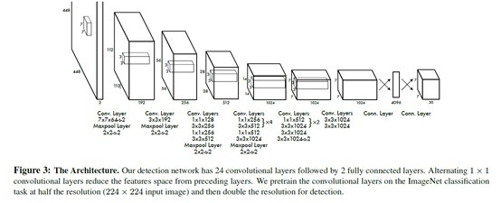
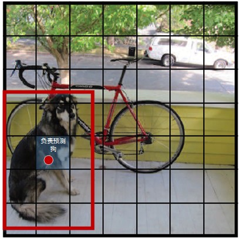
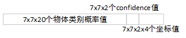
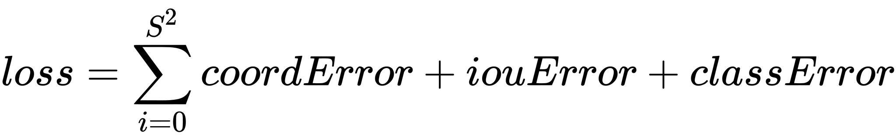
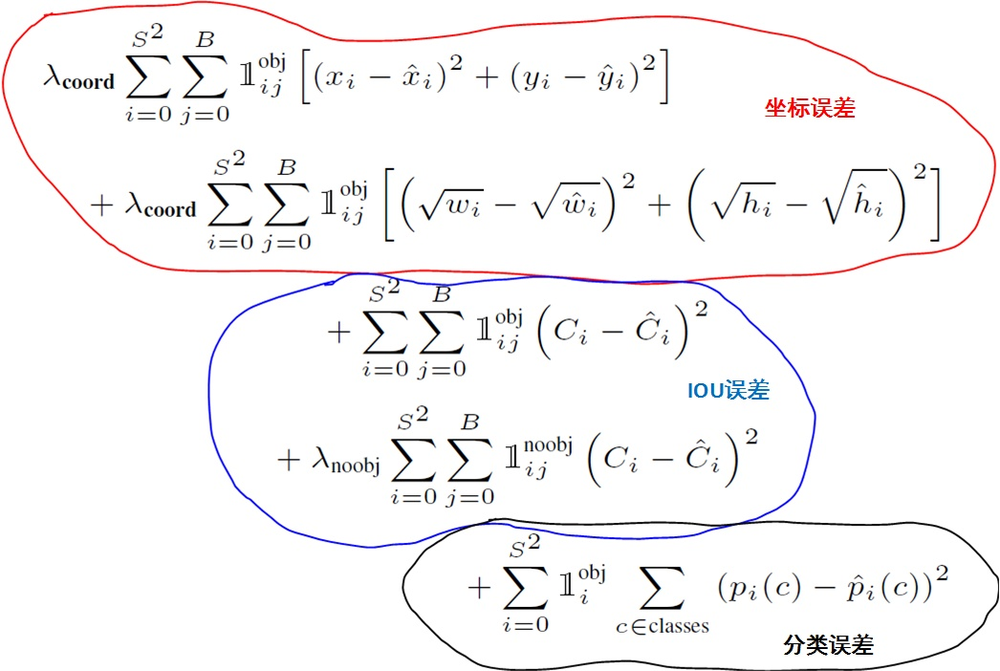
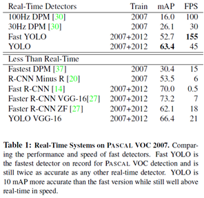
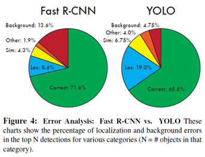

# 目标检测和分类之YOLO
YOLO是目前比较流行的object detection算法，速度快且结构简单，提一下，这里算法部分介绍的是YOLO的第一个版本，而现在YOLO的官网上已经有YOLO v2, v3的实现了，这个后续再介绍。

## 创新
YOLO将物体检测作为回归问题求解。基于一个单独的end-to-end网络，完成从原始图像的输入到物体位置和类别的输出。从网络设计上，YOLO与rcnn、fast rcnn及faster rcnn的区别如下：

1. YOLO训练和检测均是在一个单独网络中进行。YOLO没有显示地求取region proposal的过程。而rcnn/fast rcnn 采用分离的模块（独立于网络之外的selective search方法）求取候选框（可能会包含物体的矩形区域），训练过程因此也是分成多个模块进行。Faster rcnn使用RPN（region proposal network）卷积网络替代rcnn/fast rcnn的selective search模块，将RPN集成到fast rcnn检测网络中，得到一个统一的检测网络。尽管RPN与fast rcnn共享卷积层，但是在模型训练过程中，需要反复训练RPN网络和fast rcnn网络（注意这两个网络核心卷积层是参数共享的）。
2. YOLO将物体检测作为一个回归问题进行求解，输入图像经过一次inference，便能得到图像中所有物体的位置和其所属类别及相应的置信概率。而rcnn/fast rcnn/faster rcnn将检测结果分为两部分求解：物体类别（分类问题），物体位置即bounding box（回归问题）。

## 核心思想
### 网络定义
YOLO检测网络包括24个卷积层和2个全连接层，如下图所示。

其中，卷积层用来提取图像特征，全连接层用来预测图像位置和类别概率值。YOLO网络借鉴了GoogLeNet分类网络结构。不同的是，YOLO未使用inception module，而是使用1x1卷积层（此处1x1卷积层的存在是为了跨通道信息整合+3x3卷积层简单替代。YOLO论文中，作者还给出一个更轻快的检测网络fast YOLO，它只有9个卷积层和2个全连接层。使用titan x GPU，fast YOLO可以达到155fps的检测速度，但是mAP值也从YOLO的63.4%降到了52.7%，但却仍然远高于以往的实时物体检测方法（DPM）的mAP值。

### 输出representation定义
本部分给出YOLO全连接输出层的定义。YOLO将输入图像分成SxS个格子，每个格子负责检测‘落入’该格子的物体。若某个物体的中心位置的坐标落入到某个格子，那么这个格子就负责检测出这个物体。如下图所示，图中物体狗的中心点（红色原点）落入第5行、第2列的格子内，所以这个格子负责预测图像中的物体狗。

每个格子输出B个bounding box（包含物体的矩形区域）信息，以及C个物体属于某种类别的概率信息。Bounding box信息包含5个数据值，分别是x,y,w,h,和confidence。其中x,y是指当前格子预测得到的物体的bounding box的中心位置的坐标。w,h是bounding box的宽度和高度。注意：实际训练过程中，w和h的值使用图像的宽度和高度进行归一化到[0,1]区间内；x，y是bounding box中心位置相对于当前格子位置的偏移值，并且被归一化到[0,1]。

confidence反映当前bounding box是否包含物体以及物体位置的准确性，计算方式：confidence = P(object) \* IOU。其中，若bounding box包含物体，则P(object) = 1；否则P(object) = 0. IOU(intersection over union)为预测bounding
box与物体真实区域的交集面积（以像素为单位，用真实区域的像素面积归一化到[0,1]区间）。因此，YOLO网络最终的全连接层的输出维度是 S\*S\*(B\*5 + C)。YOLO论文中，作者训练采用的输入图像分辨率是448x448，S=7，B=2；采用VOC 20类标注物体作为训练数据，C=20。因此输出向量为7\*7\*(20 + 2\*5)=1470维。作者开源出的YOLO代码中，全连接层输出特征向量各维度对应内容如下：

注：

* 由于输出层为全连接层，因此在检测时，YOLO训练模型只支持与训练图像相同的输入分辨率。
* 虽然每个格子可以预测B个bounding box，但是最终只选择只选择IOU最高的bounding box作为物体检测输出，即每个格子最多只预测出一个物体。当物体占画面比例较小，如图像中包含畜群或鸟群时，每个格子包含多个物体，但却只能检测出其中一个。这是YOLO方法的一个缺陷。

### Loss函数定义
YOLO使用均方和误差作为loss函数来优化模型参数，即网络输出的S\*S\*(B\*5 + C)维向量与真实图像的对应S\*S\*(B\*5 + C)维向量的均方和误差。如下式所示。其中，coordError、iouError和classError分别代表预测数据与标定数据之间的坐标误差、IOU误差和分类误差。

YOLO对上式loss的计算进行了如下修正。

1. 位置相关误差（坐标、IOU）与分类误差对网络loss的贡献值是不同的，因此YOLO在计算loss时，使用 lambda _{coord} =0.5修正coordError。
2. 在计算IOU误差时，包含物体的格子与不包含物体的格子，二者的IOU误差对网络loss的贡献值是不同的。若采用相同的权值，那么不包含物体的格子的confidence值近似为0，变相放大了包含物体的格子的confidence误差在计算网络参数梯度时的影响。为解决这个问题，YOLO 使用 lambda _{noobj} =0.5修正iouError。（注此处的‘包含’是指存在一个物体，它的中心坐标落入到格子内）。
3. 对于相等的误差值，大物体误差对检测的影响应小于小物体误差对检测的影响。这是因为，相同的位置偏差占大物体的比例远小于同等偏差占小物体的比例。YOLO将物体大小的信息项（w和h）进行求平方根来改进这个问题。（注：这个方法并不能完全解决这个问题）。

综上，YOLO在训练过程中Loss计算如下式所示：

其中，x,y,w,C,p为网络预测值，x,y,w,C,p帽 为标注值。
注：

* YOLO方法模型训练依赖于物体识别标注数据，因此，对于非常规的物体形状或比例，YOLO的检测效果并不理想。
* YOLO采用了多个下采样层，网络学到的物体特征并不精细，因此也会影响检测效果。
* YOLO loss函数中，大物体IOU误差和小物体IOU误差对网络训练中loss贡献值接近（虽然采用求平方根方式，但没有根本解决问题）。因此，对于小物体，小的IOU误差也会对网络优化过程造成很大的影响，从而降低了物体检测的定位准确性。

### 训练
YOLO模型训练分为两步：

1. 预训练。使用ImageNet
1000类数据训练YOLO网络的前20个卷积层+1个average池化层+1个全连接层。训练图像分辨率resize到224x224。
2. 用步骤1）得到的前20个卷积层网络参数来初始化YOLO模型前20个卷积层的网络参数，然后用VOC 20类标注数据进行YOLO模型训练。为提高图像精度，在训练检测模型时，将输入图像分辨率resize到448x448。

## 效果
下表给出了YOLO与其他物体检测方法，在检测速度和准确性方面的比较结果（使用VOC 2007数据集）。

论文中，作者还给出了YOLO与Fast RCNN在各方面的识别误差比例，如下图。YOLO对背景内容的误判率（4.75%）比fast rcnn的误判率（13.6%）低很多。但是YOLO的定位准确率较差，占总误差比例的19.0%，而fast rcnn仅为8.6%。

综上，YOLO具有如下优点：

1. 快。YOLO将物体检测作为回归问题进行求解，整个检测网络pipeline简单。在titan x GPU上，在保证检测准确率的前提下（63.4% mAP，VOC 2007 test set），可以达到45fps的检测速度。
2. 背景误检率低。YOLO在训练和推理过程中能‘看到’整张图像的整体信息，而基于region proposal的物体检测方法（如rcnn/fast rcnn），在检测过程中，只‘看到’候选框内的局部图像信息。因此，若当图像背景（非物体）中的部分数据被包含在候选框中送入检测网络进行检测时，容易被误检测成物体。测试证明，YOLO对于背景图像的误检率低于fast rcnn误检率的一半。
3. 通用性强。YOLO对于艺术类作品中的物体检测同样适用。它对非自然图像物体的检测率远远高于DPM和RCNN系列检测方法。

但相比RCNN系列物体检测方法，YOLO具有以下缺点：1. 识别物体位置精准性差。2. 召回率低。

## 改进
为提高物体定位精准性和召回率，YOLO作者提出了YOLO9000，提高训练图像的分辨率，引入了faster rcnn中anchor box的思想，对各网络结构及各层的设计进行了改进，输出层使用卷积层替代YOLO的全连接层，联合使用coco物体检测标注数据和imagenet物体分类标注数据训练物体检测模型。相比YOLO，YOLO9000在识别种类、精度、速度、和定位准确性等方面都有大大提升。（yolo9000详解有空给出）

## 实践
使用YOLO训练自己的物体识别模型也非常方便，只需要将配置文件中的20类，更改为自己要识别的物体种类个数即可。训练时，建议使用YOLO提供的检测模型（使用VOC 20类标注物体训练得到）去除最后的全连接层初始化网络。

## 参考文献：
[1] https://zhuanlan.zhihu.com/p/25236464
[2] https://arxiv.org/pdf/1506.02640.pdf
[3] https://arxiv.org/abs/1612.08242