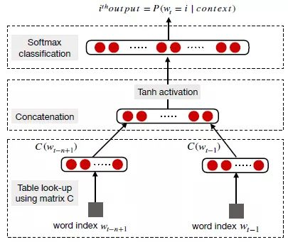
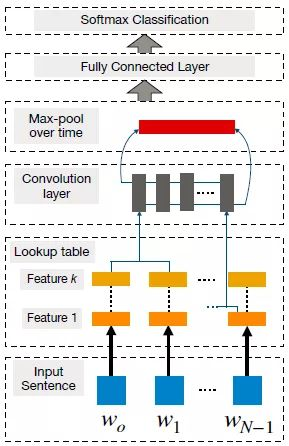
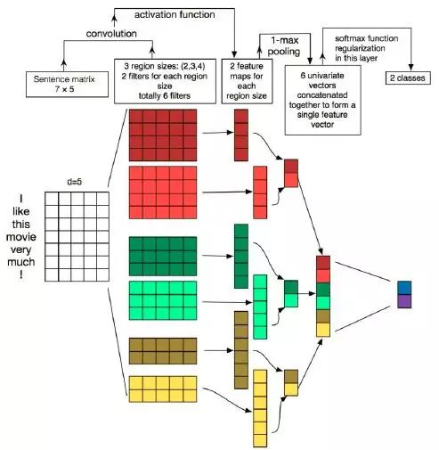
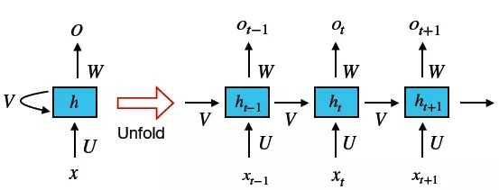
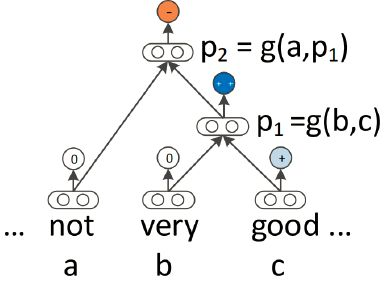
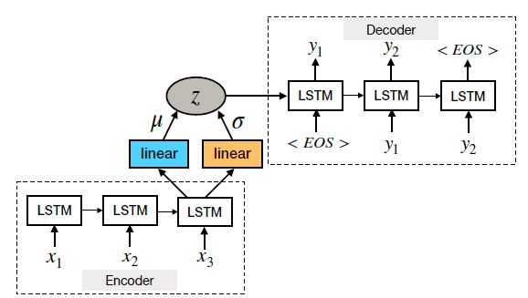

# NLP深度学习之综述

Elvis Saravia是“国立清华大学”（台湾）的博士生，主要研究NLP和情感计算。今年8月，Tom Youn等人更新了去年发表在IEEE杂志上的重磅文章《Recent Trends in Deep Learning Based Natural Language Processing》，总结了到今年为止，基于深度学习的自然语言处理（NLP）系统和应用程序的一些最新趋势。为了方便更多人阅读，Elvis Saravia总结了这篇文章的主要内容，回顾和比较了各类NLP任务中的最新技术。在这篇综述中，读者可以详细了解这一年来学界的一些大动作，它包含以下主题：

* 分布式表征的兴起（例如word2vec）
* 卷积、循环和RNN
* 在强化学习中的应用
* 句子的无监督表征学习的最新进展
* 深度学习模型与记忆增强的结合

## 什么是NLP
自然语言处理是通过构建计算算法自动分析、表征人类自然语言的一个学科领域。如今，基于NLP的系统已经实现广泛应用，比如Google强大的搜索引擎、亚马逊的语音助手Alexa。NLP还可以帮助机器执行和复杂自然语言有关的任务，比如机器翻译和对话生成。

长期以来，研究人员进行NLP研究主要依赖各种机器学习模型，以及手工制作的特征。但这么做带来的隐患是由于语言信息被稀疏表征表示，会出现维度诅咒之类的问题。而随着近年来词嵌入（低维、分布式表征）的普及和成功，和传统机器学习模型（如SVM、logistic回归）相比，基于神经网络的模型在各种语言相关任务上取得了优异的成果。

## 分布式表征
如前所述，手工制作的特征主要用于模拟自然语言任务，它在神经网络被广泛应用于NLP前，一直使研究人员饱受维度诅咒困扰。

### 词嵌入
词嵌入是一种基于分布假设（出现在类似语境中具有相似含义的词）的分布向量，它的作用是把一个维数为所有词的数量的高维空间嵌入到一个维数低得多的连续向量空间中。通常情况下，词嵌入会在任务上进行预训练，用浅层神经网络基于上下文预测单词。下图是Bengio及其同事当年提出的神经语言模型：

词向量倾向于嵌入语法和语义信息，而这种做法在各种NLP任务中（如情感分析）都取得了最先进的成果。

事实上，分布式表征在过去已经被大量用于研究，但正是连续词袋模型（CBOW）和Skip-Gram模型正式进入这个领域后，它才真正流行起来。这也确实是当前一种非常受欢迎的方法，因为它不仅能有效构建高质量的词嵌入，还能被用于语义组合（如’man’+’royal’=’king’）。

### Word2Vec
2013年，Mikolav等人提出CBOW和skip-gram模型，这是Word2Vec模型中的两个主要类别。其中，CBOW模型是一种构建词嵌入的神经方法，它的目标是基于给定上下文和给定窗口大小，预测目标单词（input word）的条件概率。同样的，skip-gram模型也是一种构建词嵌入的神经方法，但不同的是，它的目标是在给定中心目标单词的情况下，预测上下文。

对于这两种模型，词嵌入的维度是由（以无监督的方式）计算预测的准确率确定的。

使用词嵌入的限制之一是当我们想要获得诸如“hot potato”或“Boston Globe”之类短语的向量表示时，我们不能简单地组合单个词的向量表示，因为这些短语不代表单个词的语义组合。因此当短语或句子很长的时候，整个问题会变得很复杂。

Word2vec模型的另一个限制是使用较小的窗口为对比单词产生类似的嵌入，比如 “good”和“bad”，在一些比较重视这类差异的任务中（如情感分析），这种做法并不可取。此外，词嵌入还高度依赖它们的应用场景。为每个新任务重新训练特定的嵌入确实有意义，但这通常意味着高昂的计算成本，而且我们能通过负采样达到一样的效果。

Word2vec模型还存在其他问题，比如没有考虑多义性因素、训练数据中存在偏见等……

### 字符嵌入
对于诸如词性标记（POS）和命名实体识别（NER）之类的任务，查看词汇的词法信息是有用的，尤其是像葡萄牙语、西班牙语和中文这些构词方法十分丰富的语言。我们是在字符级别分析文本，因此对于某些未知词汇，利用这种嵌入方法有助于我们在不引入大型词典的情况下，帮助模型解决问题。

最后需要注意的是，虽然字符级和字级的嵌入已经成功应用于各种NLP任务，但它们在长期内仍将受到质疑。例如，Lucy和Gauthier最近的一项研究发现，一些标准词嵌入无法编码许多显着的常规感知特征，而且这些缺陷和词与词之间的相似性预测误差密切相关。换句话说，如果我们只用分布式语义，它其实是无法理解单词背后的概念的。上个月，Jacob Andreas等人也在自然语言处理系统的背景下就意义表征进行了激烈辩论。

## 卷积神经网络(CNN)
CNN基本上就是一种基于神经的方法，它可以被看作是基于单词或n-gram提取更高级别特征的特征函数。如今，CNN提取的抽象特征已经被有效应用于情感分析、机器翻译和问答系统等任务。 Collobert和Weston是首批将基于CNN的框架应用于NLP任务的研究人员之一。他们的方法的目标是通过查找表将单词转换为向量表示，由此产生原始词嵌入，可以在网络训练期间学习权重（见下图）。

为了用CNN进行句子建模，首先，他们把句子标记成一个个单词，进一步将其转换为d维的词嵌入矩阵；然后，他们在该嵌入层上应用卷积filter，产生所谓的特征映射；之后再进行最大池化操作，对每个filter应用最大操作以获得固定长度输出并减小输出的维数；最后，产生最终的句子表示。

通过向上述基础CNN添加更多的复杂性因素，使其适应执行基于词的预测，我们可以用它研究诸如NER、情感分析和POS等问题。它的重点是需要一种基于窗口的方法，即对于每个词，考察它相邻词汇（子句）的窗口大小。有了这个窗口，我们就能把CNN应用于子句，预测窗口中心单词——这也被称为词级分类。

但CNN的一个缺点是无法建模长距离依赖关系，这对所有NLP任务来说都很重要。为了解决这个问题，现在研究人员已经把CNN和时延神经网络（TDNN）结合在一起，由后者在训练期间实现更大的上下文范围。另外，动态卷积神经网络（DCNN）也已经在不同任务上取得了成功，比如情绪预测和问题分类，它的特殊之处在于池化层，它用了一种动态k-max池化，能让filter在句子建模过程中动态地跨越可变范围，使句子中相隔甚远的两个词之间都能产生语义联系。

CNN还能基于长短不一的文本被用于更复杂的任务，比如目标检测、情感分析、短文本分类和讽刺检测。然而，其中一些研究论文称，当将基于CNN的模型用于分析twitter等微型文本时，我们必须引入外部知识。此外，CNN在query-document matching、语音识别、机器翻译和问答上也有一定的用处，在涉及从低级词汇中提取特征以形成高度语义概括的任务中，DCNN也经常出现。

总体而言，CNN是有用的，因为它们可以在上下文窗口中挖掘语义线索，但它们在包吃连贯性和长距离语义关系时，还有一定欠缺。相较之下，RNN还是个更好的选择。

## 循环神经网络(RNN)
RNN是一种专门处理序列信息的神经网络，它循环往复地把前一步的计算结果作为条件，放进当前的输入中。这些序列通常由固定大小的标记向量表示，按顺序逐个输入循环神经元。下面是RNN的简单图示：

RNN是一种专门处理序列信息的神经网络，它循环往复地把前一步的计算结果作为条件，放进当前的输入中。这些序列通常由固定大小的标记向量表示，按顺序逐个输入循环神经元。下面是RNN的简单图示：

相比CNN，RNN的优势是能把之前处理好的信息并入当前计算，这使它适合在任意长度的序列中对上下文依赖性进行建模。目前，RNN一直是各类NLP研究的常规选择，比如机器翻译、图像字幕和语言建模等。

但这并不意味着RNN相对CNN有绝对的优势，因为它们模拟的是数据完全不同的两个方面，所以两者能发挥多少作用需要看具体应用场景，取决于任务所需的语义。

一般来说，RNN的输入是one-hot编码或词嵌入，但它也能像CNN一样接收抽象表征。简单的RNN容易出现梯度消失，这意味着难以学习和难以调整较早层中的参数。为了解决这个问题，研究人员们陆续提出了LSTM、ResNets和GRU等多种变体。

### RNN的变体
LSTM由三个门（输入、遗忘和输出）构成，它通过三者控制信息流，获取长距离依赖关系。GRU和LSTM很相近，不同的是它只有两个门，更简单，效率也更高。但一项研究也表明，目前我们很难判断RNN的哪些门更重要，它们的选用主要还是取决于可用的算力。现在基于LSTM的模型已经能解决序列到序列的映射（通过编码器-解码器框架），在机器翻译、文本摘要、人工对话建模、回答模型、基于图像的语言生成等任务中都有不错的应用。总的来说，RNN在NLP领域的用处是广泛的：

* 字级分类（例如，NER）
* 语言建模
* 句子级别分类（例如，情感极性）
* 语义匹配（例如，将消息与对话系统中的候选响应相匹配）
* 自然语言生成（例如，机器翻译、视觉QA和图像字幕）

## 注意力机制
从本质上说，注意力机制的作用对象是基于编码器-解码器框架的RNN，它能让解码器利用最后的隐藏状态，以及基于输入隐藏状态序列计算的信息（如上下文向量），这对于需要上下文对齐的任务有奇效。

当前注意力机制已经成功被用于机器翻译、文本摘要、图像字幕、对话生成和情感分析。虽然有研究人员已经提出了各种不同形式和类型的注意力机制，但未来它仍是NLP领域的一大重点研究方向。

## 递归神经网络（Recursive Neural Network）
与RNN类似，递归神经网络是对连续数据建模的一种机制。而语言恰好可以被看成是“递归结构”，其中单词和子短语可以组成句子层次结构中更高级的短语。在这种结构中，非终端节点由其所有子节点的表征来表示，下面是一幅示意图：

基础递归神经网络计算高级别短语的方法是自下而上组合成分，在它变体的MV-RNN中，单词由矩阵和向量表示，这意味着每个成分（单词/短语）被表示为参数矩阵。这种做法的弊端是可能会出现特别大的参数，而为了解决这个问题，研究人员又提出了另一种变体：递归神经张量网络（RNTN）——它通过在输入向量之间添加更多交互，对参数大小进行了限制。目前，递归神经网络比较常见于以下领域：

* 语法分析
* 利用短语级表征来进行情绪分析
* 语义关系分类（例如，主题消息）
* 句子相关性

## 强化学习
强化学习包含传统机器学习方法、训练智能体和设置奖励。近年来它在自然语言生成（NLG）任务中崭露头角，如文本生成，但这个趋势从本质上看是一种“被迫转型”。

和其他NLP任务一样，以往研究人员在研究NLG任务时用的大多也是RNN，但基于RNN的生成器存在一个难以解决的问题，就是它的原理是用模型输出单词代替句子原本单词，这就不可避免地会快速提高错误率。再加上我们不能用其他任务的性能衡量标准来评估语言生成模型，综合影响之下，现在的NLG模型只能生成重复、矛盾、平淡的表达。

为了解决上述问题，学界向强化学习伸出了橄榄枝，它也确实在图像字幕和机器翻译中表现出色。在NLP任务中，强化学习框架由一个智能体（基于RNN的生成模型）组成，它与外部环境（在每个时间步看到的输入词和上下文向量）相互作用。智能体根据策略（参数）选择一个动作，该策略涉及在每个时间步预测序列的下一个单词，每次完成预测后，智能体会更新其内部状态。预测完整个任务后，我们再统计智能体的奖励收集情况，奖励设置因任务而异，在NLG中，它们的奖励可能是信息流。

尽管强化学习给了学界希望，但具体在用它时需要适当地处理动作和状态空间，避免过大空间影响智能体训练、探索。此外，生成对抗也开始被用于训练语言生成模型，这在对话系统中可能有一些用处，可以区分哪些话是人类说的，哪些是机器生成的。

## 无监督学习
无监督句子表征学习涉及以无监督的方式将句子映射为固定大小的向量。它使用的分布式表征经辅助任务训练，能从语言中捕获语义和句法属性。

skip-thoughts模型，和学习词嵌入的算法类似，可以基于中心句预测上一个/下一个相邻句子。该模型采用了当下流行的seq2seq框架，其中解码器负责生成目标序列，编码器可以被看作是通用特征提取器——甚至能在提取过程中学习词嵌入。

## 深度生成模型
现如今NLP领域最流行的深度生成模型有变分自动编码器（VAE）和生成对抗神经网络（GAN），它们能在潜在空间生成逼真的句子，并从中发现丰富的自然语言结构。

众所周知，由于潜在空间没有约束，标准句子自编码器生成的文本通常很“假”。VAE通过在隐藏的潜在空间上施加先验分布，能使生成的句子接近人类自然语言表述。它由编码器和生成器网络两部分构成，执行任务时，编码器和生成器网络先将输入编码到潜在空间中，然后从潜在空间生成样本。它的训练目标是最大化生成器网络中的对数似然的变分下界。

下面是一个基于RNN的VAE：

GAN本身十分灵活，所以它在很多NLP任务上都有用武之地。比如，和标准自编码器相比，一个基于RNN的VAE生成模型可以产生形式更多样化、表述更规整的句子。而其他基于GAN的模型也能把结构化变量（如时态、情绪）结合进来，生成更符合语境的句子。

除此之外，GAN也可以被用来训练模型，使之能生成更贴近人类表述的文本。比如我们可以把LSTM用作生成器，把CNN作为区分真实数据和生成样本的判别器。

但它也有问题，一个是不能反向传播，第二个是这些深度生成模型本质上都是黑盒，它们目前还缺乏标准化的评估工具。

## 记忆增强神经网络
神经网络中可以存储的信息量称为网络容量（network capacity）。一般来讲，利用一组神经元来存储信息的容量和神经元的数量以及网络的复杂度成正比。如果要存储越多的信息，神经元数量就要越多或者网络要越复杂。为了增强网络容量，一种比较简单的方式是引入结构化的记忆模块，将和任务相关的短期记忆保存在记忆中，需要时再进行读取。这种装备外部记忆的神经网络也称为记忆网络（MN）或记忆增强神经网络（MANN）。

目前研究人员在这个方向做出的进展有动态记忆网络，它们在QA、语言建模、POS标记和情感分析等任务上有不错的表现。

## 结论
到目前为止，我们已经探讨了基于神经网络的模型（如CNN和RNN）的优点和局限，介绍了强化学习、无监督学习和深度学习在NLP任务上的可能性，也知道了注意机制和记忆增强网络在提高NLP神经网络模型性能上的能力。通过结合以上所有先进技术，我们已经能以令人信服的方式让机器理解语言的复杂性。

但正如《NAACL研讨会深思：NLP泛化模型背后的虚假和脆弱》这篇文章揭露的，现在的许多NLP模型依然充满脆弱和虚假，未来，我们还需要把研究重心放到引入常识性知识和人类行为建模上。

## 参考文献
1. https://zhuanlan.zhihu.com/p/45294726
2. [Recent Trends in Deep Learning Based Natural Language Processing](https://arxiv.org/abs/1708.02709)

