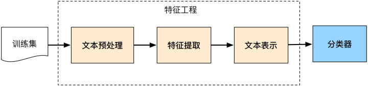
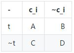
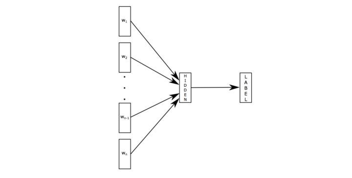
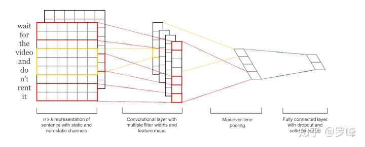
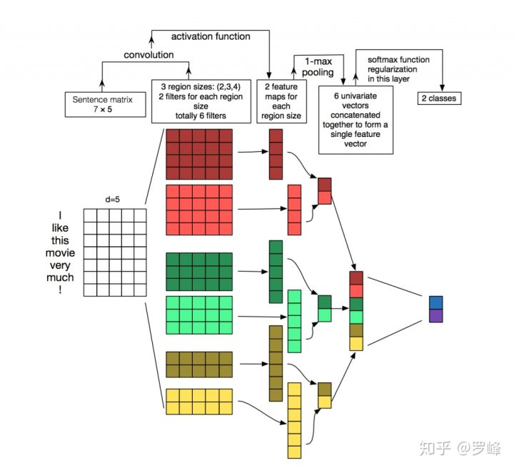
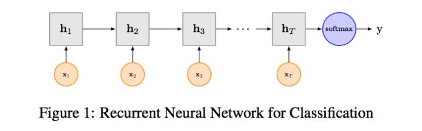
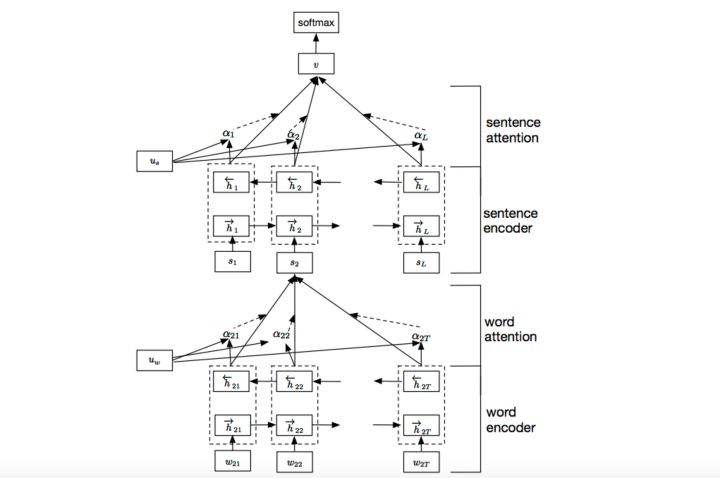
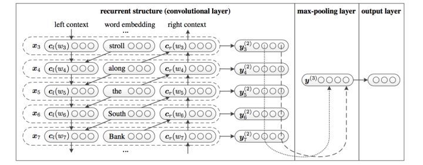

## 基于深度学习的文本分类

## 介绍

### 定义：

* 在给定的分类体系中，将文本分到指定的某个或某几个类别当中
	* 分类对象：短文本（句子/标题/商品评论）、长文本（文章）
* 分类体系一般由人工构造
	* 政治、体育、军事
	* 正能量、负能量
	* 好评、中性、差评
* 分类模式
	* binary：2类问题，属于或不属于
	* multi-class：多类问题
	* multi-label：多标签问题，一个文本可以属于多类

### 应用
* 垃圾邮件的判定
	* 是垃圾邮件、不是垃圾邮件
* 根据标题为图文视频打标签
	* 政治、体育、娱乐、暴力、涉黄……
* 根据用户阅读内容建立画像标签
	* 娱乐、教育、医疗……

## 方法
* 人工方法
	* 基于规则的特征匹配，容易理解（足球、联赛->体育）
	* 依赖专家系统，不同人物需要专门构建特征规则。费时费力
	* 准确率不高
* 机器学习方法
	* 特征工程+算法（Naive Bayes/SVM/LR/KNN……）
* 深度学习方法
	* 词向量+模型（FastText/TextCNN/TextRNN/TextRCNN）

## 传统方法
分类流程：

### 文本预处理
#### 英文
* 数据中非英文部分
	* html、json等格式，提取出文本数据
	* 文本泛化：数字、表情符号、网址……
* 拼写检查更正
* 词干提取（steming）、词形还原（lemmatization）
	* has/had/having->have am/is/are->is isn't->is not
* 大写转小写
* 去停用词
	* a, to, the, according, any...

#### 中文
* 数据中非中文部分
	* html、json等格式，提取出文本数据
	* 文本泛化：数字、英文、网址……
* 中文编码问题
* 中文分词
	* 结巴分词、nltk、SnowNLP……
* 去停用词
	* 啊、哎、哎哟、但是、不如……
* 词语替换
	* 俺->我，俺们->我们，装13->装逼
	* 禾斗匕匕->科比，孬->不好，灰机->飞机
	* CEO->首席执行官，Tencent->腾讯

### 文本表示
将文本转换成计算机可理解的方式。一篇文档表示成向量，整个语料库表示成矩阵

$\begin{pmatrix} a\_{11} & a\_{21} & \cdots & a\_{V1}
\\ a\_{12} & a\_{22} & \cdots & a\_{V2} \\ \vdots & \vdots & \ddots & \vdots \\ a\_{1N} & a\_{2N} & \cdots & a\_{VN} \\ \end{pmatrix}$

* 词袋模型（Bag of Words，unigram）
	* 忽略其词序和语法，句法，将文本仅仅看做是一个词集合。若词集合共有NN个词，每个文本表示为一个NN维向量，元素为0/1，表示该文本是否包含对应的词。( 0, 0, 0, 0, .... , 1, ... 0, 0, 0, 0)
	* 一般来说词库量至少都是百万级别，因此词袋模型有个两个最大的问题：高纬度、高稀疏性
* n-grams 词袋模型（Bag of n-grams）
	* 与词袋模型类似，考虑了局部的顺序信息，但是向量的维度过大，基本不采用。如果词集合大小为NN，则bi-gram的单词总数为N^2N2 向量空间模型
* 向量空间模型（Vector Space Model）
	* 以词袋模型为基础，向量空间模型通过特征选择降低维度，通过特征权重计算增加稠密性。

### 特征权重计算
* 布尔权重：如果出现则为1，没出现则为0。就是词袋模型。

$a\_{ij}=\begin{cases}1,&TF\_{ij}>0\\2,&TF\_{ij}=0\end{cases}$

* TFIDF型权重（Boolean weighting）
TF：词频率

$a\_{ij}=TF\_{ij}$

TF*IDF: 词频率乘以逆文本频率

$a\_{ij}=TF\_{ij}*log(\frac{N}{DF\_i+1})$

TFC: TF*IDF的归一化，使得同一文本中的词语可以相互比较

$a\_{ij}=\frac{TF\_{ij}*log(\frac{N}{DF\_i+1})}{\sqrt{\sum\_k[TF\_{kj}*log(\frac{N}{DF\_k+1})]^2}}$

* 基于熵概念的权重（Entropy weighting）
df的作用是惩罚在语料中出现较多的词语。但是如果某一特征（词语）在同类文档中大量出现时，应该赋予较高的权重。 

$a_{ij}=log(TF_{ij}+1)*(E_i)=log(TF_{ij}+1)*(1+\frac{1}{logN}[\frac{TF_{ij}}{DF_i}log(\frac{TF_{ij}}{DF_i})])$

### 特征选择
特征选择是根据某个评价指标独立的对原始特征项（词项）进行评分排序，从中选择得分最高的一些特征项，过滤掉其余的特征项，从而达到降维的目的

* 基于DF
	* DF小于某个阈值的去掉（太少，没有代表性）
	* DF大于某个阈值的去掉（太多，没有区分度）
* 基于熵 该值越大，说明分布越均匀，越有可能出现在较多的类别中（区分度差）；该值越小，说明分布越倾斜，词可能出现在较少的类别中（区分度好）

$Entropy(t)=-\sum_{i=1}^MP(c_i)logP(c_i)$

* 信息增益：体现词项为整个分类所能提供的信息量（不考虑该词项的熵和考虑该词项后的熵的差值）

$Gain(t) =Entropy(S)-Entropy(S_t) \\ =\{-\sum_{i=1}^MP(c_i)logP(c_i)\}-[P(t)\{-\sum_{i=1}^MP(c_i|t)logP(c_i|t)\}+P(\overline t)\{-\sum_{i=1}^MP(c_i|t)logP(c_i|\overline t)\}]$

* $\chi^2$ 统计量：统计词项和类别之间的独立性。 \chi^2 越大，两者独立性越小，相关性越大

$ \chi^2(t,c_i)=\frac{N(AD-CB)^2}{(A+C)(B+D)(A+B)(C+D)}$

$\chi_{AVG}^2(t)=\sum_{i=1}^MP(c_i)\chi^2(t,c_i)$

$\chi_{MAX}^2(t)=max_{i=1}^M\{\chi^2(t,c_i)\}$

### 分类器
将文本用向量表示之后，可适用于大部分机器学习方法：

* 朴素贝叶斯
* KNN方法
* 决策树
* 支持向量机
* GBDT/XGBOOST

## 深度学习方法
利用词向量表示文本，将没歌词表达为nn维稠密，连续的实数向量。

### fastText
论文：Bag of Tricks for Efficient Text Classification

原理是把句子中所有的词进行lookup得到词向量之后，对向量进行平均（某种意义上可以理解为只有一个avg pooling特殊CNN），然后直接接 softmax 层预测label。在label比较多的时候，为了降低计算量，论文最后一层采用了层次softmax的方法，既根据label的频次建立哈夫曼树，每个label对应一个哈夫曼编码，每个哈夫曼树节点具有一个向量作为参数进行更新，预测的时候隐层输出与每个哈夫曼树节点向量做点乘，根据结果决定向左右哪个方向移动，最终落到某个label对应的节点上。特点就是快，在效果和其他方法差不多的情况下，训练速度比其他方法快一个量级。

### TextCNN
论文：Convolutional Neural Networks for Sentence Classification

详细原理如下：

首先，对句子做padding或者截断，保证句子长度为固定值 s=7 ,单词embedding成 d=5 维度的向量，这样句子被表示为(s,d)(s,d)大小的矩阵（类比图像中的像素）。然后经过有 filter_size=(2,3,4) 的一维卷积层，每个filter_size 有两个输出 channel。第三层是一个1-max pooling层，这样不同长度句子经过pooling层之后都能变成定长的表示了，最后接一层全连接的 softmax 层，输出每个类别的概率。
重点1：卷积是一维卷积，只在ss方向上做卷积，不在dd方向上做卷积，既卷积核的宽度大小为dd。因为文本和图像不同，文本的局部特征只存在于上下文单词之间，既所谓的n-gram。卷积核大小设置为（2,3,4）就是为了分别寻找2-gram，3-gram，4-gram特征。
重点2：这里的特征就是词向量，有静态（static）和非静态（non-static）方式。static方式采用比如word2vec预训练的词向量，训练过程不更新词向量，实质上属于迁移学习了，特别是数据量比较小的情况下，采用静态的词向量往往效果不错。non-static则是在训练过程中更新词向量。推荐的方式是 non-static 中的 fine-tunning方式，它是以预训练（pre-train）的word2vec向量初始化词向量，训练过程中调整词向量，能加速收敛，当然如果有充足的训练数据和资源，直接随机初始化词向量效果也是可以的。

### TextRNN
论文：Recurrent Neural Network for Text Classification with Multi-Task Learning 利用CNN进行文本分类，说到底还是利用卷积核寻找n-gram特征。卷积核的大小是超参。而RNN基本是处理文本信息的标配了，因为RNN先天就是为处理时间序列而设计的，它通过前后时刻的输出链接保证了“记忆”的留存。但RNN循环机制过于简单，前后时刻的链接采用了最简单的$f=activate(ws+b)f=activate(ws+b)$的形式，这样在梯度反向传播时出现了时间上的连乘操作，从而导致了梯度消失和梯度爆炸的问题。RNN的 变种LSTM/GRU在一定程度上减缓了梯度消失和梯度爆炸问题，因此现在使用的其实要比RNN更多。利用RNN做文本分类也比较好理解。对于英文，都是基于词的。对于中文，首先要确定是基于字的还是基于词的。如果是基于词，要先对句子进行分词。之后，每个字/词对应RNN的一个时刻，隐层输出作为下一时刻的输入。最后时刻的隐层输出h_ThT​catch住整个句子的抽象特征，再接一个softmax进行分类。

### TextRNN + Attention
TextRNN + Attention 
RNN虽然号称能保持长久“记忆”，但其实还是无法“记住”太长久的东西。越靠后的字词对最终输出的影响越大，但是这和人类阅读文本的习惯是不一样的。一句话中对文本意义影响最大一必定是句子中间的某几个重点词汇。Attention的提出就是为了应对这个问题。详细介绍Attention恐怕需要一小篇文章的篇幅，感兴趣的可 参考14年这篇paper NEURAL MACHINE TRANSLATION BY JOINTLY LEARNING TO ALIGN AND TRANSLATE。具体原理不作介绍，大家可以看论文呀~ 
Attention运用到文本分类当中，参考论文Hierarchical Attention Networks for Document Classification。论文为了对doc进行分类，将doc从两个层次进行特征提取，首先在word层面提取sentence特征，然后从sentence层面提取doc特征，并且每个层次都运用了Attention。在此我类比到句子分类中，讲一下Attention是怎么运用的。
假设RNN每个时刻的输出为$[h_1, h_2,...,h_T]$，在上文TextRNN中我们已经提到，最后时刻的输出会用作softmax的输入，既$h=f(wH_T+b)$。Attention层其实就是普通的一层，它接收$h_t$​，得到一个相应score，并经过归一化之后代表当前词的重要性，既$u_t=f(w_{attetion}h_t+b_{attention})$, $\alpha_t = \frac{exp(u_t)}{\sum_{k=1}^Texp(u_k)}$。Attention向量是每个时刻输出的加权平均，既$c=\sum_t\alpha_th_t$。最终输出为$logit = softmax(f(w[h;c] + b))$。

### TextRCNN
参考的是中科院15年发表在AAAI上的这篇文章 Recurrent Convolutional Neural Networks for Text Classification

利用前向和后向RNN得到每个词的前向和后向上下文的表示：
$c_l(w_i)=f(W^{(l)}c_l(w_{i-1})+W^{(sl)}e(w_{i-1}))$

$c_r(w_i)=f(W^{(r)}c_l(w_{i+1})+W^{(sr)}e(w_{i+1})) $

这样词的表示就变成词向量和前向后向上下文向量concat起来的形式了，即：
$x_i=[c_l(w_i);e(w_i);c_r(w_i)]$

### VDCNN
论文：Very Deep Convolutional Networks for Text Classification 上述提到的文本分类模型都是浅层模型，目前NLP领域的模型，无论是机器翻译、文本分类、序列标注等问题大都使用浅层模型。这篇论文探究的是深层模型在文本分类任务中的有效性，文中最优性能网络达到了29层。具体请见[此处](https://zhuanlan.zhihu.com/p/39593725)。

## 一点经验
理论和实践之间的Gap往往差异巨大，学术paper更关注的是模型架构设计的新颖性等，更重要的是新的思路；而实践最重要的是在落地场景的效果，关注的点和方法都不一样。这部分简单梳理实际做项目过程中的一点经验教训。

### 模型显然并不是最重要的
不能否认，好的模型设计对拿到好结果的至关重要，也更是学术关注热点。但实际使用中，模型的工作量占的时间其实相对比较少。虽然再第二部分介绍了5种CNN/RNN及其变体的模型，实际中文本分类任务单纯用CNN已经足以取得很不错的结果了，我们的实验测试RCNN对准确率提升大约1%，并不是十分的显著。最佳实践是先用TextCNN模型把整体任务效果调试到最好，再尝试改进模型。

### 超参调节
超参调节是各位调参工程师的日常了，推荐一篇文本分类实践的论文 [A Sensitivity Analysis of (and Practitioners’ Guide to) Convolutional Neural Networks for Sentence Classification](https://arxiv.org/pdf/1510.03820.pdf)，里面贴了一些超参的对比实验，如果你刚开始启动文本分析任务，不妨按文章的结果设置超参，怎么最快的得到超参调节其实是一个非常重要的问题，可以读读 萧瑟的这篇文章[深度学习网络调参技巧 - 知乎专栏](https://zhuanlan.zhihu.com/p/24720954?utm_source=zhihu&utm_medium=social)。

### 一定要用 dropout
有两种情况可以不用：数据量特别小，或者你用了更好的正则方法，比如bn。实际中我们尝试了不同参数的dropout，最好的还是0.5，所以如果你的计算资源很有限，默认0.5是一个很好的选择。

### fine-tuning 是必选的
上文聊到了，如果只是使用word2vec训练的词向量作为特征表示，我赌你一定会损失很大的效果。

### 未必一定要 softmax loss
这取决与你的数据，如果你的任务是多个类别间非互斥，可以试试着训练多个二分类器，也就是把问题定义为multi lable 而非 multi class，我们调整后准确率还是增加了>1%。

### 类目不均衡问题
基本是一个在很多场景都验证过的结论：如果你的loss被一部分类别dominate，对总体而言大多是负向的。建议可以尝试类似 booststrap 方法调整 loss 中样本权重方式解决。

### 避免训练震荡
默认一定要增加随机采样因素尽可能使得数据分布iid，默认shuffle机制能使得训练结果更稳定。如果训练模型仍然很震荡，可以考虑调整学习率或 mini_batch_size。

### 没有收敛前不要过早的下结论
玩到最后的才是玩的最好的，特别是一些新的角度的测试，不要轻易否定，至少要等到收敛吧。

## 参考文献
https://zhuanlan.zhihu.com/p/34212945
