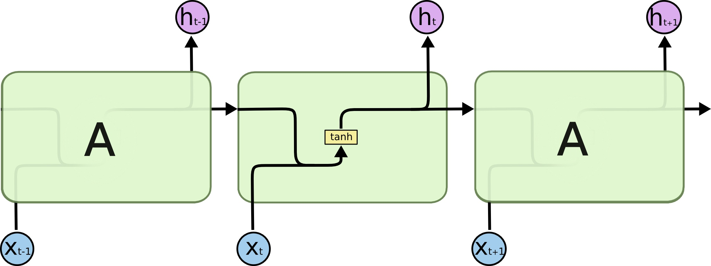
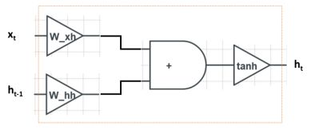
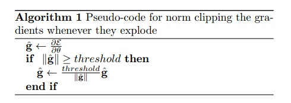
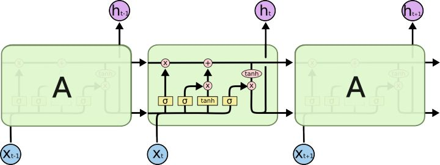
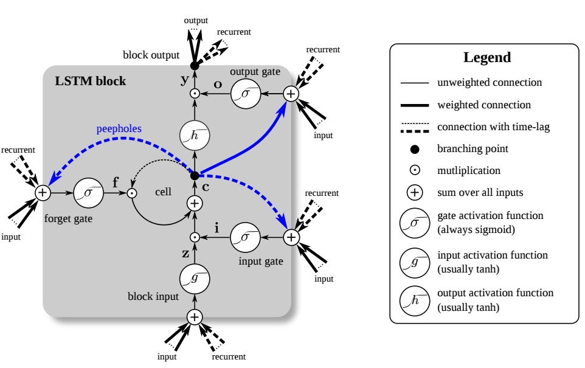
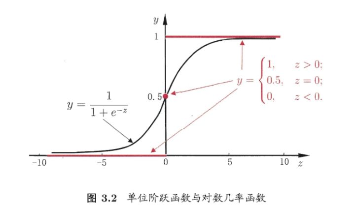
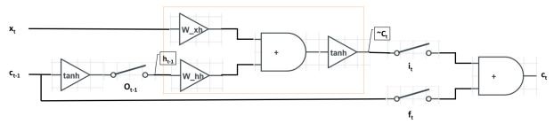
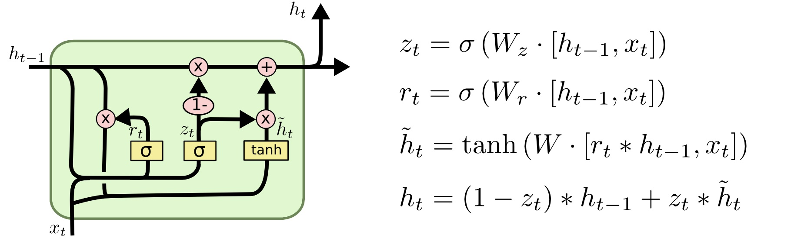
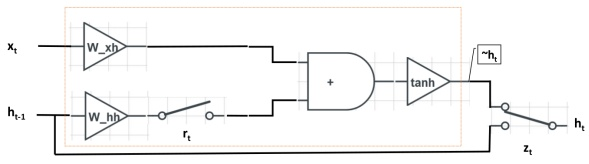

# 时序神经网络RNN、LSTM和GRU
RNN在处理时序数据时十分成功。但是，对RNN及其变种LSTM和GRU结构的理解仍然是一个困难的任务。本文介绍一种理解LSTM和GRU的简单通用的方法。通过对LSTM和GRU数学形式化的三次简化，最后将数据流形式画成一张图，可以简洁直观地对其中的原理进行理解与分析。此外，本文介绍的三次简化一张图的分析方法具有普适性，可广泛用于其他门控网络的分析。

## RNN
近些年，深度学习模型在处理有非常复杂内部结构的数据时十分有效。例如，图像数据的像素之间的2维空间关系非常重要，CNN（convolution neural networks，卷积神经网络）处理这种空间关系十分有效。而时序数据（sequential data）的变长输入序列之间时序关系非常重要，RNN（recurrent neural networks，循环神经网络，注意和recursive neural networks，递归神经网络的区别）处理这种时序关系十分有效。

### 模型结构

我们使用下标 $t$ 表示输入时序序列的不同位置，用 $\boldsymbol h_t$ 表示在时刻 $t$ 的系统隐层状态向量，用 $\boldsymbol x_t$ 表示时刻 $t$ 的输入。 $t$ 时刻的隐层状态向量 $\boldsymbol h_t$ 依赖于当前词 $\boldsymbol x_t$ 和前一时刻的隐层状态向量$\boldsymbol h_{t-1}$ ：$\boldsymbol h_t := \boldsymbol f(\boldsymbol x_t, \boldsymbol h_{t-1}) \\$，其中 $\boldsymbol f$ 是一个非线性映射函数。一种通常的做法是计算 $\boldsymbol x_t$ 和 $\boldsymbol h_{t-1} $的线性变换后经过一个非线性激活函数，例如
 $\boldsymbol h_t := \mathrm{tanh}(\boldsymbol W_{xh}\boldsymbol x_t + \boldsymbol W_{hh}\boldsymbol h_{t-1}) \\$,其中 $\boldsymbol W_{xh}$ 和 $\boldsymbol W_{hh}$ 是可学习的参数矩阵，激活函数tanh独立地应用到其输入的每个元素。

为了对RNN的计算过程做一个可视化，我们可以画出下图：

图中左边是输入 $\boldsymbol x_t$ 和 $\boldsymbol h_{t-1}$、右边是输出 $\boldsymbol h_t$ 。计算从左向右进行，整个运算包括三步：输入 $\boldsymbol x_t$ 和 $\boldsymbol h_{t-1}$ 分别乘以 $\boldsymbol W_{xh}$ 和 $\boldsymbol W_{hh}$ 、相加、经过tanh非线性变换。

我们可以认为 $\boldsymbol h_t$ 储存了网络中的记忆（memory），RNN学习的目标是使得 $\boldsymbol h_t$ 记录了在 t 时刻之前（含）的输入信息 $\boldsymbol x_1$, $\boldsymbol x_2$, $\ldots, \boldsymbol x_t$ 。在新词 $\boldsymbol x_t$ 输入到网络之后，之前的隐状态向量 $\boldsymbol h_{t-1}$ 就转换为和当前输入 $\boldsymbol x_t$ 有关的 $\boldsymbol h_t$ 。

### 梯度爆炸与梯度消失
虽然理论上RNN可以捕获长距离依赖，但实际应用中，RNN将会面临两个挑战：梯度爆炸（gradient explosion）和梯度消失（vanishing gradient）。

我们考虑一种简单情况，即激活函数是恒等（identity）变换，此时$\boldsymbol h_t := \boldsymbol W_{xh}\boldsymbol x_t + \boldsymbol W_{hh}\boldsymbol h_{t-1} \,. \\$在进行误差反向传播（error backpropagation）时，当我们已知损失函数 $\ell$ 对 $t$ 时刻隐状态向量$ \boldsymbol h_t$ 的偏导数 $\frac{\partial\ell}{\partial \boldsymbol h_t}$ 时，利用链式法则，我们计算损失函数 $\ell$ 对 $t$ 时刻隐状态向量 $\boldsymbol h_0$ 的偏导数$\begin{eqnarray} \frac{\partial \ell }{\partial \boldsymbol h_0}  &=&  (\frac{\partial \boldsymbol h_t} {\partial \boldsymbol h_0})^\top\frac{\partial \ell }{\partial \boldsymbol h_t} \\ \end{eqnarray}\,.  \\$我们可以利用RNN的依赖关系，沿时间维度展开，来计算$ \frac{\partial \boldsymbol h_t} {\partial \boldsymbol h_0}$，$\frac{\partial \boldsymbol h_t} {\partial \boldsymbol h_0} =  \prod_{i=1}^{t} \frac{\partial \boldsymbol h_i} {\partial \boldsymbol h_{i-1}} =  \prod_{i=1}^{t}  \boldsymbol W_{hh} = \boldsymbol W_{hh}^t \,. \\$其中 $r$ 是矩阵  $\boldsymbol W_{hh} $的秩（rank）。因此，$\frac{\partial \boldsymbol h_t} {\partial \boldsymbol h_0} =   \boldsymbol W_{hh}^t = \boldsymbol U\boldsymbol \Sigma^t \boldsymbol V^\top  = \sum_{i=1}^r \sigma_i^t \boldsymbol u_i \boldsymbol v_i^\top \,. \\$那么我们最后要计算的目标$\frac{\partial \ell }{\partial \boldsymbol h_0}  =  (\frac{\partial \boldsymbol h_t} {\partial \boldsymbol h_0})^\top\frac{\partial \ell }{\partial \boldsymbol h_t}  =(\sum_{i=1}^r \sigma_i^t \boldsymbol u_i \boldsymbol v_i^\top)^\top  \frac{\partial \ell }{\partial \boldsymbol h_t} = \sum_{i=1}^r \sigma_i^t \boldsymbol v_i \boldsymbol u_i^\top  \frac{\partial \ell }{\partial \boldsymbol h_t} \,. \\$当 $t$ 很大时，该偏导数取决于矩阵  $\boldsymbol W_{hh}$ 的最大的奇异值 $\sigma_1 $是大于1还是小于1，要么结果太大，要么结果太小：

#### 梯度爆炸
当 $\sigma_1 > 1$ ， $\lim_{t\to \infty} \sigma_1^t = \infty $，那么$\frac{\partial \ell }{\partial \boldsymbol h_0}  = \sum_{i=1}^r \sigma_i^t \boldsymbol v_i \boldsymbol u_i^\top  \frac{\partial \ell }{\partial \boldsymbol h_t} \approx \infty \cdot \boldsymbol v_1 \boldsymbol u_1^\top  \frac{\partial \ell }{\partial \boldsymbol h_t} = \infty \,. \\$此时偏导数 $\frac{\partial \boldsymbol h_t} {\partial \boldsymbol h_0}$ 将会变得非常大，实际在训练时将会遇到NaN错误，会影响训练的收敛，甚至导致网络不收敛。这好比要把本国的产品卖到别的国家，结果被加了层层关税，等到了别国市场的时候，价格已经变得非常高，老百姓根本买不起。在RNN中，梯度（偏导数）就是价格，随着向前推移，梯度越來越大。这种现象称为梯度爆炸。

梯度爆炸相对比较好处理，可以用梯度裁剪（gradient clipping）来解决：

这好比是不管前面的关税怎么加，设置一个最高市场价格，通过这个最高市场价格保证老百姓是买的起的。在RNN中，不管梯度回传的时候大到什么程度，设置一个梯度的阈值，梯度最多是这么大。

#### 梯度消失
当 $\sigma_1 < 1$ ， $\lim_{t\to \infty} \sigma_1^t = 0$ ，那么
$\frac{\partial \ell }{\partial \boldsymbol h_0}  = \sum_{i=1}^r \sigma_i^t \boldsymbol v_i \boldsymbol u_i^\top  \frac{\partial \ell }{\partial \boldsymbol h_t} \approx 0\cdot\boldsymbol v_1 \boldsymbol u_1^\top  \frac{\partial \ell }{\partial \boldsymbol h_t} = 0 \,. \\$此时偏导数 $\frac{\partial \boldsymbol h_t} {\partial \boldsymbol h_0}$ 将会变得十分接近0，从而在梯度更新前后没有什么区别，这会使得网络捕获长距离依赖（long-term dependency）的能力下降。这好比打仗的时候往前线送粮食，送粮食的队伍自己也得吃粮食。当补给点离前线太远时，还没等送到，粮食在半路上就已经被吃完了。在RNN中，梯度（偏导数）就是粮食，随着向前推移，梯度逐渐被消耗殆尽。这种现象称为梯度消失。

梯度消失现象解决起来困难很多，如何缓解梯度消失是RNN及几乎其他所有深度学习方法研究的关键所在。LSTM和GRU通过门（gate）机制控制RNN中的信息流动，用来缓解梯度消失问题。其核心思想是有选择性的处理输入。比如我们在看到一个商品的评论时，我们会重点关注其中的一些词，对它们进行处理。

LSTM和GRU的关键是会选择性地忽略其中一些词，不让其参与到隐层状态向量的更新中，最后只保留相关的信息进行预测。

## LSTM

LSTM（Long Short-Term Memory）由Hochreiter和Schmidhuber提出，其数学上的形式化表示如下:

$\begin{eqnarray} \boldsymbol i_t &:=& \mathrm{sigm}(\boldsymbol W_{xi}\boldsymbol x_t + \boldsymbol W_{hi}\boldsymbol h_{t-1}) \,, \\ \boldsymbol f_t &:=& \mathrm{sigm}(\boldsymbol W_{xf}\boldsymbol  x_t + \boldsymbol W_{hf}\boldsymbol h_{t-1}) \,, \\ \boldsymbol o_t &:=& \mathrm{sigm}(\boldsymbol W_{xo}\boldsymbol x_t + \boldsymbol W_{ho}\boldsymbol h_{t-1}) \,, \\ \tilde{\boldsymbol c}_t &:=& \mathrm{tanh}(\boldsymbol W_{xc}\boldsymbol x_t + \boldsymbol W_{hc}\boldsymbol h_{t-1}) \,, \\ \boldsymbol c_t &:=& \boldsymbol f_t \odot \boldsymbol c_{t-1} + \boldsymbol i_t \odot \tilde{\boldsymbol c}_t \,, \\ \boldsymbol h_t &:=& \boldsymbol o_t \odot \mathrm{tanh}(\boldsymbol c_t) \,.  \end{eqnarray} \\$

其中 $\odot$ 代表逐元素相乘，sigm代表sigmoid函数

$\mathrm{sigm}(z):=\frac{1}{1+\exp(-z)} \,. \\$

和RNN相比，LSTM多了一个隐状态变量 $\boldsymbol c_t $，称为细胞状态（cell state），用来记录信息。

这个公式看起来似乎十分复杂，为了更好的理解LSTM的机制，许多人用图来描述LSTM的计算过程。比如下面这张图：

似乎看完之后，对LSTM的理解仍然是一头雾水？这是因为这些图想把LSTM的所有细节一次性都展示出来，但是突然暴露这么多的细节会使你眼花缭乱，从而无处下手。

### 三次简化
因此，本文提出的方法旨在简化门控机制中不重要的部分，从而更关注在LSTM的核心思想。整个过程是三次简化一张图，具体流程如下：

#### 第一次简化
忽略门控单元 \boldsymbol i_t 、 \boldsymbol f_t 、 \boldsymbol o_t 的来源。3个门控单元的计算方法完全相同，都是由输入经过线性映射得到的，区别只是计算的参数不同：

$\begin{eqnarray} \boldsymbol i_t &:=& \mathrm{sigm}(\boldsymbol W_{xi}\boldsymbol x_t + \boldsymbol W_{hi}\boldsymbol h_{t-1}) \,, \\ \boldsymbol f_t &:=& \mathrm{sigm}(\boldsymbol W_{xf}\boldsymbol  x_t + \boldsymbol W_{hf}\boldsymbol h_{t-1}) \,, \\ \boldsymbol o_t &:=& \mathrm{sigm}(\boldsymbol W_{xo}\boldsymbol x_t + \boldsymbol W_{ho}\boldsymbol h_{t-1}) \,.  \end{eqnarray} \\$

使用相同计算方式的目的是它们都扮演了门控的角色，而使用不同参数的目的是为了误差反向传播时对三个门控单元独立地进行更新。在理解LSTM运行机制的时候，为了对图进行简化，我们不在图中标注三个门控单元的计算过程，并假定各门控单元是给定的。

#### 第二次简化
考虑一维门控单元 $i_t$ 、 $f_t$ 、 $o_t$。LSTM中对各维是独立进行门控的，所以为了表示和理解方便，我们只需要考虑一维情况，在理解LSTM原理之后，将一维推广到多维是很直接的。经过这两次简化，LSTM的数学形式只有下面三行

$\begin{eqnarray}   \tilde{\boldsymbol c}_t &:=& \mathrm{tanh}(\boldsymbol W_{xc}\boldsymbol x_t + \boldsymbol W_{hc}\boldsymbol h_{t-1}) \,, \\ \boldsymbol c_t &:=&  f_t \cdot \boldsymbol c_{t-1} + i_t \cdot \tilde{\boldsymbol c}_t \,, \\ \boldsymbol h_t &:=& o_t \cdot \mathrm{tanh}(\boldsymbol c_t) \,.  \end{eqnarray} \\$

由于门控单元变成了一维，所以向量和向量的逐元素相乘符号 $\odot$ 变成了数和向量相乘 $\cdot$ 。

#### 第三次简化
各门控单元二值输出。门控单元 $i_t$ 、 $f_t$ 、 $o_t$ 的由于经过了sigmoid激活函数，输出是范围是[0, 1]。激活函数使用sigmoid的目的是为了近似0/1阶跃函数，这样sigmoid实数值输出单调可微，可以基于误差反向传播进行更新。

既然sigmoid激活函数是为了近似0/1阶跃函数，那么，在进行LSTM理解分析的时候，为了理解方便，我们认为各门控单元{0, 1}二值输出，即门控单元扮演了电路中开关的角色，用于控制信息的通断。

#### 最终结果
将三次简化的结果用电路图表述出来，左边是输入，右边是输出。在LSTM中，有一点需要特别注意，LSTM中的细胞状态 $\boldsymbol c_t$ 实质上起到了RNN中隐层单元 $\boldsymbol h_t$ 的作用，这点在其他文献资料中不常被提到，所以整个图的输入是 $\boldsymbol x_t$ 和 $\boldsymbol c_{t-1}$ ，而不是 $\boldsymbol x_t$ 和 $\boldsymbol h_{t-1}$。为了方便画图，我们需要将公式做最后的调整

$\begin{eqnarray}  \boldsymbol h_{t-1} &:=& o_{t-1} \cdot \mathrm{tanh}(\boldsymbol c_{t-1}) \,.   \\  \tilde{\boldsymbol c}_t &:=& \mathrm{tanh}(\boldsymbol W_{xc}\boldsymbol x_t + \boldsymbol W_{hc}\boldsymbol h_{t-1}) \,, \\ \boldsymbol c_t &:=&  f_t \cdot \boldsymbol c_{t-1} + i_t \cdot \tilde{\boldsymbol c}_t \,. \end{eqnarray} \\$

最终结果如下：

和RNN相同的是，网络接受两个输入，得到一个输出。其中使用了两个参数矩阵 $\boldsymbol W_{xc}$ 和 $\boldsymbol W_{hc}$ ，以及tanh激活函数。不同之处在于，LSTM中通过3个门控单元 $i_t$ 、 $f_t$ 、 $o_t$ 来对的信息交互进行控制。当 $i_t$=1 （开关闭合）、 $f_t$=0 （开关打开）、 $o_t$=1 （开关闭合）时，LSTM退化为标准的RNN。

### LSTM各单元作用分析
根据这张图，我们可以对LSTM中各单元作用进行分析：

#### 输出门 $o_{t-1}$
输出门的目的是从细胞状态 $\boldsymbol c_{t-1} $产生隐层单元 $\boldsymbol h_{t-1}$ 。并不是 $\boldsymbol c_{t-1}$ 中的全部信息都和隐层单元 $\boldsymbol h_{t-1}$ 有关， $\boldsymbol c_{t-1}$ 可能包含了很多对 $\boldsymbol h_{t-1}$ 无用的信息。因此， $o_t$ 的作用就是判断 $\boldsymbol c_{t-1}$ 中哪些部分是对 $\boldsymbol h_{t-1}$ 有用的，哪些部分是无用的。

#### 输入门 $i_t$
$i_t$ 控制当前词 $\boldsymbol x_t$ 的信息融入细胞状态$ \boldsymbol c_t$ 。在理解一句话时，当前词 $\boldsymbol x_t$ 可能对整句话的意思很重要，也可能并不重要。输入门的目的就是判断当前词 $\boldsymbol x_t$ 对全局的重要性。当  $i_t$ 开关打开的时候，网络将不考虑当前输入 $\boldsymbol x_t$ 。

#### 遗忘门 $f_t$
$f_t$ 控制上一时刻细胞状态 $\boldsymbol c_{t-1}$ 的信息融入细胞状态 $\boldsymbol c_t$ 。在理解一句话时，当前词 $\boldsymbol x_t$ 可能继续延续上文的意思继续描述，也可能从当前词 $\boldsymbol x_t$ 开始描述新的内容，与上文无关。和输入门 $i_t$ 相反， $f_t$ 不对当前词 $\boldsymbol x_t$ 的重要性作判断，而判断的是上一时刻的细胞状态 $\boldsymbol c_{t-1}$ 对计算当前细胞状态 $\boldsymbol c_t$ 的重要性。当 $f_t$ 开关打开的时候，网络将不考虑上一时刻的细胞状态 $\boldsymbol c_{t-1}$ 。

#### 细胞状态 $\boldsymbol c_t$ 
 $\boldsymbol c_t$ 综合了当前词 $\boldsymbol x_t$ 和前一时刻细胞状态 $\boldsymbol c_{t-1}$ 的信息。这和ResNet中的残差逼近思想十分相似，通过从 $\boldsymbol c_{t-1}$ 到 $\boldsymbol c_t$ 的“短路连接”，梯度得已有效地反向传播。当 $f_t$ 处于闭合状态时， $\boldsymbol c_t$ 的梯度可以直接沿着最下面这条短路线传递到 $\boldsymbol c_{t-1}$ ，不受参数 $\boldsymbol W_{xh}$ 和 $\boldsymbol W_{hh}$ 的影响，这是LSTM能有效地缓解梯度消失现象的关键所在。

## GRU

### GRU的数学形式
GRU是另一种十分主流的RNN衍生物。 RNN和LSTM都是在设计网络结构用于缓解梯度消失问题，只不过是网络结构有所不同。GRU在数学上的形式化表示如下：

$\begin{eqnarray} \boldsymbol z_t &:=& \mathrm{sigm}(\boldsymbol W_{xz}\boldsymbol x_t + \boldsymbol W_{hz}\boldsymbol  h_{t-1})\,, \\ \boldsymbol r_t &:=& \mathrm{sigm}(\boldsymbol W_{xr}\boldsymbol x_t + \boldsymbol W_{hr}\boldsymbol h_{t-1})\,, \\ \tilde{\boldsymbol h}_t &:=& \mathrm{tanh}(\boldsymbol W_{xh}\boldsymbol x_t + \boldsymbol r_t\odot(\boldsymbol W_{hh}\boldsymbol h_{t-1}))\,, \\ \boldsymbol h_t &:=& (\boldsymbol 1-\boldsymbol z_t)\odot \tilde{\boldsymbol h}_t + \boldsymbol z_t \odot \boldsymbol h_{t-1} \,. \end{eqnarray} \\$

### 三次简化
为了理解GRU的设计思想，我们再一次运用三次简化一张图的方法来进行分析：

#### 第一次简化
忽略门控单元 \boldsymbol z_t 和 \boldsymbol r_t 的来源。

#### 考虑一维门控单元 $z_t$ 和 $r_t$
经过这两次简化，GRU的数学形式是以下两行

$\begin{eqnarray}  \tilde{\boldsymbol h}_t &:=& \mathrm{tanh}(\boldsymbol W_{xh}\boldsymbol x_t + r_t\cdot(\boldsymbol W_{hh}\boldsymbol h_{t-1}))\,, \\ \boldsymbol h_t &:=& (1-z_t)\cdot \tilde{\boldsymbol h}_t + z_t \cdot \boldsymbol h_{t-1} \,. \end{eqnarray} \\$

#### 第三次简化
各门控单元二值输出。这里和LSTM略有不同的地方在于，当 $z_t=1$ 时 $\boldsymbol h_t = \boldsymbol  h_{t-1} $；而当 $z_t = 0$ 时， $\boldsymbol h_t = \tilde{\boldsymbol h}_t$ 。因此， $z_t$  扮演的角色是一个个单刀双掷开关。

#### 最终结果
将三次简化的结果用电路图表述出来，左边是输入，右边是输出。

与LSTM相比，GRU将输入门 $i_t$ 和遗忘门 $f_t$ 融合成单一的更新门 $z_t$ ，并且融合了细胞状态 $\boldsymbol c_t$ 和隐层单元 $\boldsymbol h_t$ 。当 $r_t=1$ （开关闭合）、 $z_t=0$ （开关连通上面）GRU退化为标准的RNN。

### GRU各单元作用分析
根据这张图, 我们可以对GRU的各单元作用进行分析:

#### 重置门 $r_t$ 
 $r_t$ 用于控制前一时刻隐层单元 $\boldsymbol h_{t-1}$ 对当前词 $\boldsymbol x_t$ 的影响。如果 $\boldsymbol h_{t-1}$ 对 $\boldsymbol x_t$ 不重要， 即从当前词 $\boldsymbol x_t$ 开始表述了新的意思，与上文无关。那么开关 $r_t$ 可以打开，使得 $\boldsymbol h_{t-1}$ 对 $\boldsymbol x_t$ 不产生影响。
#### 更新门 $z_t$ 
$z_t$ 用于决定是否忽略当前词 $\boldsymbol x_t$ 。类似于LSTM中的输入门 $i_t$ ， $z_t$ 可以判断当前词 $\boldsymbol x_t$ 对整体意思的表达是否重要。当 $z_t$ 开关接通下面的支路时，我们将忽略当前词 $\boldsymbol x_t$ ，同时构成了从 $\boldsymbol h_{t-1}$ 到 $\boldsymbol h_t$ 的短路连接，这使得梯度得已有效地反向传播。和LSTM相同，这种短路机制有效地缓解了梯度消失现象，这个机制于highway networks十分相似。

## 小结
尽管RNN、LSTM、和GRU的网络结构差别很大，但是他们的基本计算单元是一致的，都是对$\boldsymbol x_t$ 和 $\boldsymbol h_t$ 做一个线性映射加tanh激活函数，见三个图的红色框部分。他们的区别在于如何设计额外的门控机制控制梯度信息传播用以缓解梯度消失现象。LSTM用了3个门、GRU用了2个，那能不能再少呢？MGU（minimal gate unit）尝试对这个问题做出回答，它只有一个门控单元。

另外这些哪种变体最好？差异大吗？Greff等人对流行的变体进行了比较，发现它们大致相同。Jozefowicz等人（2015）测试了超过一万个RNN架构，发现一些变体在某些任务上比LSTM更好。

## 参考文献
1. https://zhuanlan.zhihu.com/p/28297161
2. https://zhuanlan.zhihu.com/p/33113729
3. Yoshua Bengio, Patrice Y. Simard, and Paolo Frasconi. Learning long-term dependencies with gradient descent is difficult. IEEE Transactions on Neural Networks 5(2): 157-166, 1994.
4. Kyunghyun Cho, Bart van Merrienboer, Çaglar Gülçehre, Dzmitry Bahdanau, Fethi Bougares, Holger Schwenk, and Yoshua Bengio. Learning phrase representations using RNN encoder-decoder for statistical machine translation. In EMNLP, pages 1724-1734, 2014.
5. Junyoung Chung, Çaglar Gülçehre, KyungHyun Cho, and Yoshua Bengio. Empirical evaluation of gated recurrent neural networks on sequence modeling. In NIPS Workshop, pages 1-9, 2014.
6. Felix Gers. Long short-term memory in recurrent neural networks. PhD Dissertation, Ecole Polytechnique Fédérale de Lausanne, 2001.
7. Ian J. Goodfellow, Yoshua Bengio, and Aaron C. Courville. Deep learning. Adaptive Computation and Machine Learning, MIT Press, ISBN 978-0-262-03561-3, 2016.
8. Alex Graves. Supervised sequence labelling with recurrent neural networks. Studies in Computational Intelligence 385, Springer, ISBN 978-3-642-24796-5, 2012.
9. Klaus Greff, Rupesh Kumar Srivastava, Jan Koutník, Bas R. Steunebrink, and Jürgen Schmidhuber. LSTM: A search space odyssey. IEEE Transactions on Neural Networks and Learning Systems. 28(10): 2222-2232, 2017.
10. Kaiming He, Xiangyu Zhang, Shaoqing Ren, and Jian Sun. Deep residual learning for image recognition. In CVPR, pages 770-778, 2016.
11. Kaiming He, Xiangyu Zhang, Shaoqing Ren, and Jian Sun. Identity mappings in deep residual networks. In ECCV, pages 630-645, 2016.
12. Sepp Hochreiter and Jürgen Schmidhuber. Long short-term memory. Neural Computation 9(8): 1735-1780, 1997.
13. Rafal Józefowicz, Wojciech Zaremba, and Ilya Sutskever. An empirical exploration of recurrent network architectures. In ICML, pages 2342-2350, 2015.
14. Zachary Chase Lipton. A critical review of recurrent neural networks for sequence learning. CoRR abs/1506.00019, 2015.
15. Razvan Pascanu, Tomas Mikolov, and Yoshua Bengio. On the difficulty of training recurrent neural networks. In ICML, pages 1310-1318, 2013.
16. Rupesh Kumar Srivastava, Klaus Greff, and Jürgen Schmidhuber. Highway networks. In ICML Workshop, pages 1-6, 2015.
17. Guo-Bing Zhou, Jianxin Wu, Chen-Lin Zhang, and Zhi-Hua Zhou. Minimal gated unit for recurrent neural networks. International Journal of Automation and Computing, 13(3): 226-234, 2016.
