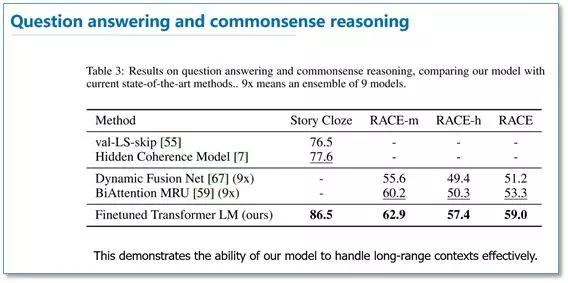

# 语言模型之综述(二)
最近，在自然语言处理（NLP）领域中，使用语言模型预训练方法在多项 NLP 任务上都获得了不错的提升，广泛受到了各界的关注。就此，我将最近看的一些相关论文进行总结，选取了几个代表性模型（包括 ELMo [1]，OpenAI GPT [2] 和 BERT [3]）和大家一起学习分享。

## 引言
我们知道目前神经网络在进行训练的时候基本都是基于后向传播（BP）算法，通过对网络模型参数进行随机初始化，然后通过 BP 算法利用例如 SGD 这样的优化算法去优化模型参数。那么预训练的思想就是，该模型的参数不再是随机初始化，而是先有一个任务进行训练得到一套模型参数，然后用这套参数对模型进行初始化，再进行训练。其实早期的使用自编码器栈式搭建深度神经网络就是这个思想。还有词向量也可以看成是第一层 word embedding 进行了预训练，此外在基于神经网络的迁移学习中也大量用到了这个思想。

接下来，我们就具体看一下这几篇用语言模型进行预训练的工作。

## ELMo
Deep Contextualized Word Representations 这篇论文来自华盛顿大学的工作，最后是发表在今年的 NAACL 会议上，并获得了最佳论文。

其实这个工作的前身来自同一团队在 ACL 2017 发表的 Semi-supervised sequence tagging with bidirectional language models ，只是在这篇论文里，他们把模型更加通用化了。

首先我们来看看他们工作的动机，他们认为一个预训练的词表示应该能够包含丰富的句法和语义信息，并且能够对多义词进行建模。而传统的词向量（例如 word2vec）是上下文无关的。例如下面"apple"的例子，这两个"apple"根据上下文意思是不同的，但是在 word2vec 中，只有 apple 一个词向量，无法对一词多义进行建模。

所以他们利用语言模型来获得一个上下文相关的预训练表示，称为 ELMo，并在 6 个 NLP 任务上获得了提升。

### 方法
在 EMLo 中，他们使用的是一个双向的 LSTM 语言模型，由一个前向和一个后向语言模型构成，目标函数就是取这两个方向语言模型的最大似然。

在预训练好这个语言模型之后，ELMo 就是根据下面的公式来用作词表示，其实就是把这个双向语言模型的每一中间层进行一个求和。最简单的也可以使用最高层的表示来作为 ELMo。

然后在进行有监督的 NLP 任务时，可以将 ELMo 直接当做特征拼接到具体任务模型的词向量输入或者是模型的最高层表示上。总结一下，不像传统的词向量，每一个词只对应一个词向量，ELMo 利用预训练好的双向语言模型，然后根据具体输入从该语言模型中可以得到上下文依赖的当前词表示（对于不同上下文的同一个词的表示是不一样的），再当成特征加入到具体的 NLP 有监督模型里。 

### 实验
总结一下，不像传统的词向量，每一个词只对应一个词向量，ELMo 利用预训练好的双向语言模型，然后根据具体输入从该语言模型中可以得到上下文依赖的当前词表示（对于不同上下文的同一个词的表示是不一样的），再当成特征加入到具体的 NLP 有监督模型里。 

在下面的分析实验中，我们可以看到使用所有层的效果要比只使用最后一层作为 ELMo 的效果要好。在输入还是输出上面加 EMLo 效果好的问题上，并没有定论，不同的任务可能效果不一样。

## OpenAI GPT
### 引言
我们来看看第二篇论文 Improving Language Understanding by Generative Pre-Training，这是 OpenAI 团队前一段时间放出来的预印版论文。他们的目标是学习一个通用的表示，能够在大量任务上进行应用。

这篇论文的亮点主要在于，他们利用了Transformer网络代替了LSTM作为语言模型来更好的捕获长距离语言结构。然后在进行具体任务有监督微调时使用了语言模型作为附属任务训练目标。最后在 12 个 NLP 任务上进行了实验，9 个任务获得了 SOTA。

### 方法
首先我们来看一下他们无监督预训练时的语言模型。他们仍然使用的是标准的语言模型目标函数，即通过前 k 个词预测当前词，但是在语言模型网络上，他们使用了 Google 团队在Attention is all your need 论文中提出的 Transformer 解码器作为语言模型。

Transformer 模型主要是利用自注意力（self-attention）机制的模型，这里我就不多进行介绍，大家可以看论文或者参考我之前的文章自然语言处理中的自注意力机制（Self-Attention Mechanism）

然后在具体 NLP 任务有监督微调时，与 ELMo 当成特征的做法不同，OpenAI GPT 不需要再重新对任务构建新的模型结构，而是直接在 Transformer 这个语言模型上的最后一层接上 softmax 作为任务输出层，然后再对这整个模型进行微调。他们还发现，如果使用语言模型作为辅助任务，能够提升有监督模型的泛化能力，并且能够加速收敛。

由于不同 NLP 任务的输入有所不同，在 Transformer 模型的输入上针对不同 NLP 任务也有所不同。

具体如下图，对于分类任务直接讲文本输入即可；对于文本蕴涵任务，需要将前提和假设用一个 Delim 分割向量拼接后进行输入；对于文本相似度任务，在两个方向上都使用 Delim 拼接后，进行输入；对于像问答多选择的任务，就是将每个答案和上下文进行拼接进行输入。

### 实验
下面我简单的列举了一下不同 NLP 任务上的实验结果。
#### 语言推理任务

#### 问答和常识推理任务

#### 语义相似度和分类任务

可以看到在多项任务上，OpenAI GPT 的效果要比 ELMo 的效果更好。从下面的消除实验来看，在去掉预训练部分后，所有任务都大幅下降，平均下降了 14.8%，说明预训练很有效；在大数据集上使用语言模型作为附加任务的效果更好，小数据集不然；利用 LSTM 代替 Transformer 后，结果平均下降了 5.6%，也体现了 Transformer 的性能。

## BERT
### 引言
上周 Google 放出了他们的语言模型预训练方法，瞬时受到了各界广泛关注，不少媒体公众号也进行了相应报道，那我们来看看这篇论文 BERT: Pre-training of Deep Bidirectional Transformers for Language Understanding。

这篇论文把预训练语言表示方法分为了基于特征的方法（代表 ELMo）和基于微调的方法（代表 OpenAI GPT）。而目前这两种方法在预训练时都是使用单向的语言模型来学习语言表示。

这篇论文中，作者们证明了使用双向的预训练效果更好。其实这篇论文方法的整体框架和 GPT 类似，是进一步的发展。具体的，BERT 是使用 Transformer 的编码器来作为语言模型，在语言模型预训练的时候，提出了两个新的目标任务（即遮挡语言模型 MLM 和预测下一个句子的任务），最后在 11 个 NLP 任务上取得了 SOTA。

### 方法
在语言模型上，BERT 使用的是 Transformer 编码器，并且设计了一个小一点的 base 结构和一个更大的网络结构。

对比一下三种语言模型结构，BERT 使用的是 Transformer 编码器，由于 self-attention 机制，所以模型上下层直接全部互相连接的。而 OpenAI GPT 使用的是 Transformer 编码器，它是一个需要从左到右的受限制的 Transformer，而 ELMo 使用的是双向 LSTM，虽然是双向的，但是也只是在两个单向的 LSTM 的最高层进行简单的拼接。所以只有 BERT 是真正在模型所有层中是双向的。

而在模型的输入方面，BERT 做了更多的细节，如下图。他们使用了 WordPiece embedding 作为词向量，并加入了位置向量和句子切分向量。此外，作者还在每一个文本输入前加入了一个 CLS 向量，后面会有这个向量作为具体的分类向量。

在语言模型预训练上，他们不再使用标准的从左到右预测下一个词作为目标任务，而是提出了两个新的任务。第一个任务他们称为 MLM，即在输入的词序列中，随机的挡上 15% 的词，然后任务就是去预测挡上的这些词，可以看到相比传统的语言模型预测目标函数，MLM 可以从任何方向去预测这些挡上的词，而不仅仅是单向的。

但是这样做会带来两个缺点：1. 预训练用 [MASK] 提出挡住的词后，在微调阶段是没有 [MASK] 这个词的，所以会出现不匹配；2. 预测 15% 的词而不是预测整个句子，使得预训练的收敛更慢。但是对于第二点，作者们觉得虽然是慢了，但是效果提升比较明显可以弥补。

对于第一点他们采用了下面的技巧来缓解，即不是总是用 [MASK] 去替换挡住的词，在 10% 的时间用一个随机词取替换，10% 的时间就用这个词本身。

而对于传统语言模型，并没有对句子之间的关系进行考虑。为了让模型能够学习到句子之间的关系，作者们提出了第二个目标任务就是预测下一个句子。其实就是一个二元分类问题，50% 的时间，输入一个句子和下一个句子的拼接，分类标签是正例，而另 50% 是输入一个句子和非下一个随机句子的拼接，标签为负例。最后整个预训练的目标函数就是这两个任务的取和求似然。

在微调阶段，不同任务的模型如下图，只是在输入层和输出层有所区别，然后整个模型所有参数进行微调。

### 实验
下面我们列出一下不同 NLP 上 BERT 的效果。

#### GLUE结果

#### QA结果

#### 实体识别结果

#### SWAG结果

可以看到在这些所有 NLP 任务上，BERT 都取得了 SOTA，而且相比 EMLo 和 GPT 的效果提升还是比较大的。在预训练实验分析上，可以看到本文提出的两个目标任务的作用还是很有效的，特别是在 MLM 这个目标任务上。

作者也做了模型规模的实验，大规模的模型效果更好，即使在小数据集上。

此外，作者也做了像 ELMo 当成特征加入的实验，从下图可以看到，当成特征加入最好效果能达到 96.1% 和微调的 96.4% 差不多，说明 BERT 对于基于特征和基于微调这两种方法都是有效的。

## 总结
最后进行简单的总结，和传统的词向量相比，使用语言模型预训练其实可以看成是一个句子级别的上下文的词表示，它可以充分利用大规模的单语语料，并且可以对一词多义进行建模。

而且从后面两篇论文可以看到，通过大规模语料预训练后，使用统一的模型或者是当成特征直接加到一些简单模型上，对各种 NLP 任务都能取得不错的效果，说明很大程度上缓解了具体任务对模型结构的依赖。在目前很多评测上也都取得了 SOTA，ELMo 也提供了官网供大家使用。

但是这些方法在空间和时间复杂度上都比较高，特别是 BERT，在论文中他们训练 base 版本需要在 16 个 TGPU 上，large 版本需要在 64 个 TPU 上训练 4 天。对于一般条件，一个 GPU 训练的话，得用上 1年。还有就是可以看出这些方法里面都存在很多工程细节，一些细节做得不好的话，效果也会大大折扣。

## 参考文献
1. [Deep Contextualized Word Representations](https://arxiv.org/pdf/1802.05365.pdf%C3%82)
2. [Improving Language Understanding by Generative Pre-Training](https://www.cs.ubc.ca/~amuham01/LING530/papers/radford2018improving.pdf)
3. [BERT: Pre-training of Deep Bidirectional Transformers for Language Understanding](https://arxiv.org/pdf/1810.04805.pdf?fbclid=IwAR3FQiWQzP7stmPWZ4kzrGmiUaN81UpiNeq4GWthrxmwgX0B9f1CvuXJC2E)
4. [Semi-supervised sequence tagging with bidirectional language models](https://arxiv.org/pdf/1705.00108.pdf)

