# Word2Vec 

## 概述 
Mikolov等人在2013年的文献[1]中,同时提出了CBOW(Continuous Bagof-Words)和Skip-gram模型.他们设计两个模型的主要目的是希望用更高效的方法获取词向量。因此，他们根据前人在 NNLM、 RNNLM 和 C&W 模型上的经验，简化现有模型，保留核心部分，得到了这两个模型。

## CBOW
CBOW 是 Continuous Bag-of-Words 的缩写，与神经网络语言模型不同的是，CBOW去掉了最耗时的非线性隐藏层。

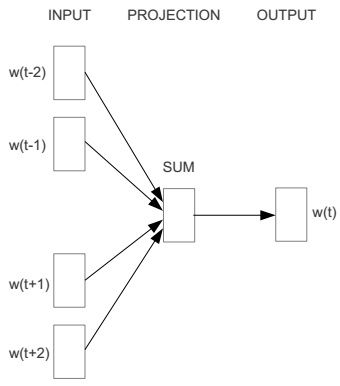

从图中可以看出，CBOW模型预测的是 p(wt|wt-2, wt-1,wt+1,wt+2) ，由于图中目标词 wt 前后只取了各两个词，所以窗口的总大小是2。假设目标词 wt 前后各取k个词，即窗口的大小是k，那么CBOW模型预测的将是p(wt|wt-k,wt-(k-1),...,wt-1,wt+1,...wt+(k-1),wt+k)

### 输入层到隐藏层
以图2为例，输入层是四个词的one-hot向量表示，分别为 xt-2，xt-1, xt+1, xt+2 （维度都为Vx1，V是模型的训练本文中所有词的个数），记输入层到隐藏层的权重矩阵为 W （维度为V x d，d是认为给定的词向量维度），隐藏层的向量为 h（维度为d x 1），那么

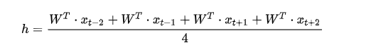

其实这里就是一个简单地求和平均。

### 隐藏层到输出层
记隐藏层到输出层的权重矩阵为U（维度为d x V），输出层的向量为 y （维度为V x 1），那么

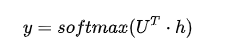

注意，输出层的向量 y 与输入层的向量为 xe 虽然维度是一样的，但是 y 并不是one-hot向量，并且向量 y 中的每个元素都是有意义的。例如，我们假设训练样本只有一句话“I like to eat apple”，此刻我们正在使用 I、like、eat、apple 四个词来预测 to ，输出层的结果如图3所示。

向量y中的每个元素表示我用 I、like、eat、apple 四个词预测出来的词是当元素对应的词的概率，比如是like的概率为0.05，是to的概率是0.80。由于我们想让模型预测出来的词是to，那么我们就要尽量让to的概率尽可能的大，所以我们目标是最大化函数 L

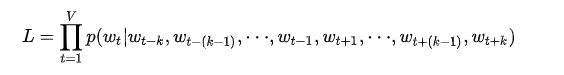

有了最大化的目标函数，我们接下来要做的就是求解这个目标函数，首先求 -log(L) ，然后求梯度，再梯度下降，具体细节在此省略，因为这种方法涉及到softmax层，softmax每次计算都要遍历整个词表，代价十分昂贵，所以实现的时候我们不用这种方法，而是用第4节中的层次softmax和负采样。

## Skip-Gram
Skip-Gram的模型图与CBOW恰好相反，如图4所示。

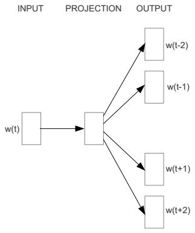

从图中可以看出，Skip-Gram模型预测的是 p(wt-2|wt),p(wt-1|wt),p(wt+1|wt),p(wt+2|wt) ，由于图中词 wt 前后只取了各两个词，所以窗口的总大小是2。假设词 wt 前后各取k个词，即窗口的大小是k，那么Skip-Gram模型预测的将是 p(wt+p|wt)(-k<=p<=k,k!=0).

### 输入层到隐藏层
记隐藏层到输出层的权重矩阵为 U （维度为d x V），输出层的向量为 y （维度为V x 1），那么

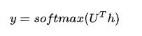

注意，输出层的向量 y 与输入层的向量为 xt 虽然维度是一样的，但是 y 并不是one-hot向量，并且向量 y 中的每个元素都是有意义的。具体的例子见CBOW中的图3，Skip-Gram里我们目标是最大化函数 L

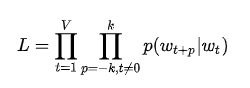

有了最大化的目标函数，我们接下来要做的就是求解这个目标函数，首先求 -log(L) ，然后求梯度，再梯度下降，具体细节在此省略，因为这种方法涉及到softmax层，softmax每次计算都要遍历整个词表，代价十分昂贵，所以实现的时候我们不用这种方法，而是用第4节中的层次softmax和负采样。

## 层次softmax和负采样
首先，层次softmax是一棵huffman树，树的叶子节点是训练文本中所有的词，非叶子节点都是一个逻辑回归二分类器，每个逻辑回归分类器的参数都不同，分别用  表示。假定分类器的输入是向量 h ，记逻辑回归分类器输出的结果  ，将向量 h 传递给节点的左孩子的概率为，否则传递给节点的右孩子的概率是。重复这个传递的流程直到叶子节点。

以图3中的例子为基础，更改之后的模型如图下。

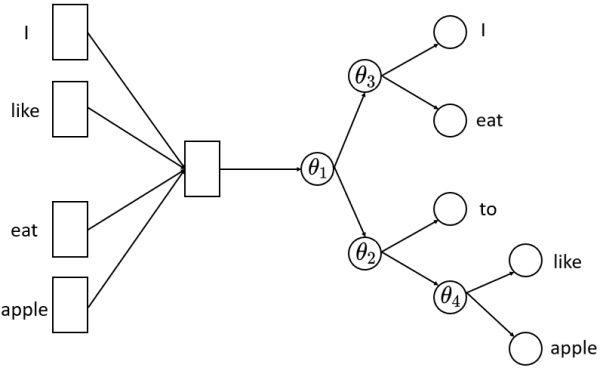

从图5.1和图5.2可以看出，我们就是将隐藏层的向量 h 直接传给了一个层次softmax，层次softmax的复杂度为 O(log(V)) 。层次softmax采样到每个词的概率分别如下：

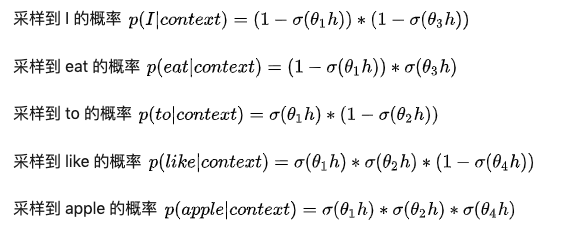

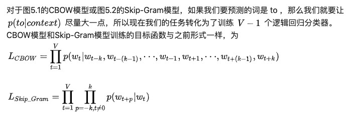

## 负采样
负采样实际上是采样负例来帮助训练的手段，其目的与层次softmax一样，是用来提升模型的训练速度。我们知道，模型对正例的预测概率是越大越好，模型对负例的预测概率是越小越好。由于正例的数量少，很容易保证每个正例的预测概率尽可能大，而负例的数量特别多，所以负采样的思路就是根据某种负采样的策略随机挑选一些负例，然后保证挑选的这部分负例的预测概率尽可能小。所以，负采样策略是对模型的效果影响很大，word2vec常用的负采样策略有均匀负采样、按词频率采样等等。

### CBOW
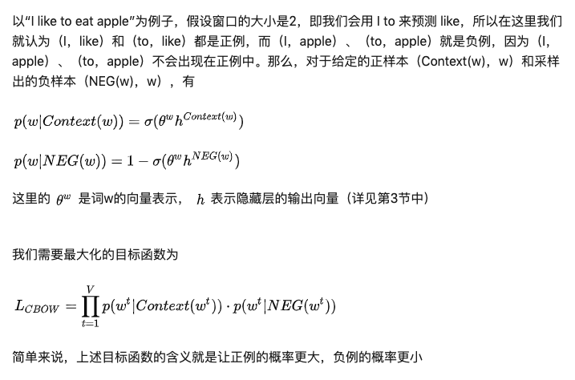

### Skip-Gram
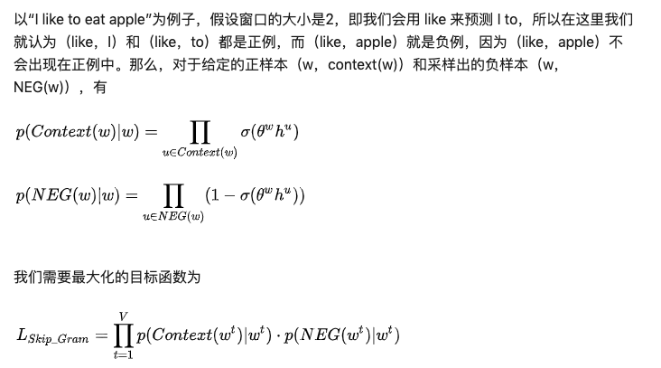

## 参考资料
* [Efficient estimation of word representations in vector space](https://arxiv.org/pdf/1301.3781.pdf%C3%AC%E2%80%94%20%C3%AC%E2%80%9E%C5%93)
* [一篇浅显易懂的word2vec原理讲解](https://zhuanlan.zhihu.com/p/44599645)
* [word2vec 中的数学原理详解](https://www.cnblogs.com/peghoty/p/3857839.html)
* [详细图解哈夫曼Huffman编码树](https://blog.csdn.net/FX677588/article/details/70767446)