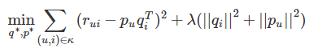
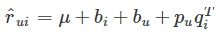
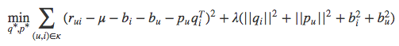
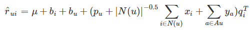
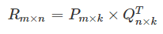
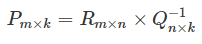
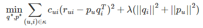
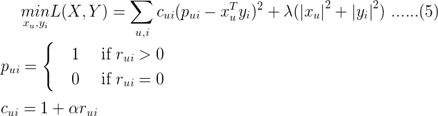
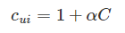

# 交替最小二乘法 ALS等矩阵分解算法
矩阵分解可以解决近邻推荐存在的问题，简单来说，矩阵分解就是把原来的大矩阵近似分解为两个小矩阵的乘积。矩阵分解的物理意义，就是把用户和物品都映射到一个k维空间，这样每一个用户得到一个向量p, 每一个物品得到一个向量q，两个向量的点积即为预测出的用户对物品的预测评分。

## SVD
### 基础的SVD
目标损失函数：



第一部分：控制着模型的偏差，第二部分：正则项，控制着模型的方差

### 增加偏置信息
存在情况：有些用户习惯给出偏高的评分；有些物品通常会收到偏高的评分。

因此改进SVD后得到带偏置信息的SVD.

一个用户给一个物品的评分会有4部分构成：



分别代表：全局平均分，物品的评分偏置，用户的评分偏置，用户和物品之间的兴趣偏好。

增加了偏置项的SVD目标函数变为：


### 增加历史行为
存在情况：有的用户评分少。即，显示反馈比隐式反馈少，因此可以利用隐式反馈来弥补。

SVD++结合用户的隐式反馈行为和属性。

假设评分矩阵中的物品有一个隐因子向量（维度为k)，因此用户有过行为的每个物品就有一个隐因子向量，把该用户操作过的物品隐因子加起来，用来表示用户的兴趣偏好。

类似的，用户属性进行onehot后，对每个特征也存在一种隐因子向量表示，将该用户的所有属性的对应的隐因子向量相加，也代表了一些偏好。

SVD++的目标函数，只要在用户向量p的基础上进行扩展增加隐式反馈向量x和用户属性向量y), 因此在学习时对隐向量也进行了学习:


### 时间因素
a. 对评分按照时间加权，让久远的评分趋近平均值；

b. 对评分时间划分区间，不同区间学习出不同的隐因子向量；

c. 对特殊时间点单独进行训练

## ALS 交替最小二乘原理
在有了目标函数以后，优化方法通常有两种：随机梯度下降，交替最小二乘（ALS），ALS在实际中应用较多。

ALS的核心概念就是交替。我们的任务是，找到两个矩阵P和Q, 让她们相乘后约等于原矩阵：


但是P和Q是未知的 ，因此无法直接求得。假设Q现在是已知的，那么P就可以根据R和Q计算：


反之，假设知道了P, 那么就可以求出Q. 交替的思路就是不断假设某一个子矩阵是已知的。

具体步骤：
```
初始化随机矩阵Q
将Q当作已知，根据R计算初矩阵P
得到矩阵P后，将P当作已知，重新去计算矩阵Q
两个过程交替进行，直到误差可以接受
```
ALS实际上就是对目标函数进行优化的方法，通过先固定其他维度，在单独对某一维度进行更新。

## ALS-WR 隐式反馈+ALS
隐式反馈关注的是用户的行为，而不是用户的评分。

### One-Class问题：

如果把预测用户行为看为二分类问题，猜测用户会不会做某件事，但实际上收集到的数据只有一种：用户干了某件事，而用户明确”不干“某件事的数据没有明确数据。

在ALS引入隐式反馈，得到加权的ALS.

加权的概念：查看商品的次数越多，代表喜欢程度越高，因此行为次数可以作为加权。

### 加权交替最小二乘：

如果用户对物品无隐式反馈则认为评分为0

如果用户对物品有至少一次隐式反馈则认为评分是1，次数作为该评分的置信度。

因此，现在目标函数变为：





其中多出来的cui就是置信度，因此目标函数变成了带权重的函数，次数越多，就越可信。实际上，置信度通常不直接用次数表示，而是如下表示：



其中α是超参数，C就是实际次数。

### 存在问题：

对于没有反馈的缺失值，在设定下，取值为0的评分非常多，因此我们不能直接把所有的缺失值作为负类别。

原因：

本身隐式反馈只有正类别是确定的，而负类别是假设的

导致正负样本不平衡，负样本多于正样本

因此需要对负样本进行采样, 挑选一部分缺失值作为负样本即可:

随机均匀采样和正类别一样多(不靠谱)

按照物品的热门程度采样(实践中采用): 一个越热门的物品, 用户越可能直到他的存在.如果这种情况下, 用户对他还没有反馈就表明这真的是负样本.

## 推荐计算
当我们得到用户和物品的隐向量后，直接点积就可以得到预测结果了。

但实际应用中，由于维度依然很大，直接计算点积复杂度很高。

FaceBook给出了两种方案：

* 利用专门设计的数据结构存储所有物品的隐因子向量，从而实现通过一个用户向量可以返回最相似的k个物品。工具：Faiss

* 先将物品的隐因子做聚类，然后在逐一计算用户和每个聚类中心的推荐分数，给用户推荐物品就变成了给用户推荐物品聚类。得到推荐的聚类后，再从聚类中挑选出物品作为推荐结果。

## 参考资料
* [推荐系统36式笔记（一）](http://hellodavid.top/2019/06/07/%E6%8E%A8%E8%8D%90%E7%B3%BB%E7%BB%9F36%E5%BC%8F%EF%BC%88%E4%B8%80%EF%BC%89/)
* [协同过滤之ALS-WR算法](https://vimsky.com/article/812.html)