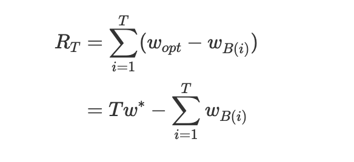
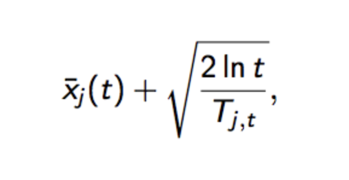

# 多臂老虎机（Multi-armed Bandit）

## 问题的描述和定义
一个赌徒，要去摇老虎机，走进赌场发现一台老虎机，老虎机拥有很多个摇臂而且各臂的外表一模一样。每次投一个币就能获得一次摇臂的机会，而且每个摇臂按下都有可能获得硬币----但是每个臂吐出硬币的概率分布是未知的。赌徒自然想最大化收益（累积N次的收入和），应该采取怎样的行动？

这就是多臂赌博机问题(Multi-armed bandit problem, K-armed bandit problem, MAB)。

MAB 问题简介

先来介绍下 MAB（Multi-armed bandit problem，多臂赌博机） 问题，有一个赌博机，一共有 k 个摇臂，玩家每次投一个游戏币后可以按一个摇臂，每个摇臂按下后都有可能吐出硬币作为奖励，但是每个摇臂吐出硬币的概率分布是未知的，玩家的目标是获得最大化的累积奖赏。

有选择的去调整策略： MAB 中的每个摇臂都是一个选项，因此它是一个有条件的选择问题，目标是获得最大化的累积奖赏，限制是已有的选择分支。

结合阅读： 推荐系统的EE问题

推荐系统中也存在很多类似于 MAB 的问题，它们叫做 EE（exploit－explore）问题：

* exploit 采矿挖掘的意思，利用已知的比较确定的用户的兴趣，然后推荐与之相关的内容；

* explore 则是探索，比如说当我表达了我喜欢历史的特征后，为了避免来回给我推荐历史话题，对于其他话题也进行了推荐，否则推荐出的结果来来回回都是中国历史...

## 问题边界--关于选择
1. 一个用户拥有各种各样的兴趣偏好──以我个人为例， 喜欢军事、历史、文化、游戏...... 那么当我初次来到一个电商平台时， 推荐系统怎么快速地知道我对每类内容的感兴趣的差异？ 这是一个cold start 问题。

2. 假设我们有若干种投放广告素材，怎么知道该给每个用户展示何种类型的广告从而得到最大的收益（点击率， 转化率）？

3. 算法工程师提出了新的模型，除了A/B test有没有更快的方法知道它是有效的？

4. ...

全都是关于选择的问题。多臂赌博机恰恰是用来解决选择的模型。

## Bandit算法
Bandit算法是指一类算法。 要比较不同Bandit算法的优劣， 可以用累积遗憾这个概念来衡量。


它顾名思义， 是指T次选择， 将每次选择的实际收益 WB_i与此次选择如果选择最好的策略带来的最大收益之差， 将T次差的加总就得到了累积遗憾。

在这个公式中，为了简化MAB问题，每个臂的收益不是0，就是1，也就是伯努利收益。

这个公式可以用来对比不同Bandit算法的效果：对相同的多臂问题，用不同的Bandit算法模拟试验相同次数，比比看哪个Bandit算法的累积遗憾增长的慢，那就是效果较好的算法。

## 几种Bandit算法

### Thompson sampling
原理： 假设每个臂是否产生收益，服从概率分布， 产生收益的概率为p。不断试验，得到一个置信度较高的概率p的概率分布， 就能近似解决这个问题了。

如何估计概率p的概率分布？

迭代步骤
```
1. 确定分布为Beta分布，确定一个初始化的平均值，来确定具体的分布概率密度函数；
2. 试验是假设概率p的分布符合 beta分布 ~~ beta(wins, loses) 参数wins, loses 
3. 每个臂都对应着一组beta分布的参数。 每次试验后， 选中一个摇臂， 有收益则该臂的wins+1， 否则 loses+1。
4. 选择摇臂的方式是： 用每个臂现有beta分布产生一个随机数b， 选择所有臂产生的随机数中最大的摇臂去展开策略。
```

### UCB（Upper Confidence Bound)
译为置信区间上界。整个过程和Thompson sampling类似，只是根据每个臂每次试验产生随机数b的时候有一个不同的地方，即：

 
其中加号前面是这个臂到目前的收益均值，后面的叫做bonus，本质上是均值的标准差，t是目前的试验次数，Tjt是这个臂被试次数。

这个公式反映：均值越大，标准差越小，被选中的概率会越来越大，起到了exploit的作用；同时哪些被选次数较少的臂也会得到试验机会，起到了explore的作用。

### Epsilon-Greedy算法
```
初始化选择一个（0， 1）之间 较小的正数， epsilon。

每次以 (0, epsilon )均分分布产生一个比epsilon小的数， 选择所有臂中随机选一个， 否则选择截止当前平均收益最大的那个臂。
```
Epsilon-Greedy 是看上去非常简单直接的算法。 通过控制epsilon的值控制对 Exploit和Explore的偏好程度。

越接近0， 越保守， 反之越激进。

### 朴素算法
比较简单， 非常容易实现。 每个臂有了均值后，一直选择均值最大的那个。

这个算法是在实际中最容易想到的。 比随机乱猜要好。


Bandit算法的思路：
小心尝试， 如果某次选择得到了比较好的结果， 那么就多选择它， 越确定某个选择会导致差的结果， 就少选择它。 如果某个选择实验次数少，导致不确定好坏， 就多给它一些被选择的机会， 直到确定它是金子还是石头， 把每次选择的机会给“确定效果还不错”或者是“不知道好坏的”的臂。

Bandit算法的环境因素：

* 臂 每次选择的项。

* 回报 每个臂之后的奖励（收益函数）

* 外部条件 决定每个臂有何差异的环境变量。

* 对于推荐系统， 就是臂--具体物品或类别， 也可以是某种推荐算法。

* 回报： 用户对推荐的结果的满意程度（点击？跳转？ etc）

* 环境： 给当前用户推荐时所有周边环境。

## Bandit算法要注意的问题
如果平台中交互物品的质量水平差异明显， 而且物品数量还较多，在资源位有限的情况下，用户尽快看到优质物品的机会不高，因为这时的推荐系统对大多数物品还是持不确定的态度， 需要更多的Explore。
 
用户数量如果过小， 导致用户与物品的交互行为少，那么算法则不能快速收殓。
而且在很多场景下，新入平台的用户很大程度上看到内容是会是平台老用户的历史沉淀所看到的结果。

## 参考资料
* [多臂老虎机（Multi-armed Bandit）](https://www.staticor.io/blog/algo)
* [专治选择困难症——bandit算法](https://zhuanlan.zhihu.com/p/21388070)

