# 神经协同过滤 Neural Collaborative Filtering

## 背景
尽管最近的一些工作已经把深度学习运用到了推荐的任务当中，但只是用深度学习给一些辅助的信息建模，例如项目的文字描述或音乐的声学特征等等。在表示用户与项目之间的交互是仍然使用矩阵分解等用内积来建模。这篇文章的工作主要是用多层神经网络给用户和数据之间的交互建模，我们数据主要基于隐式反馈，例如浏览记录、购买记录等等。在本文中，我们探讨了如何利用DNN来模拟噪声隐式反馈信号的中心问题。

* 显性反馈行为包括用户明确表示对物品喜好的行为
* 隐性反馈行为指的是那些不能明确反应用户喜好

## 论文贡献
* 我们提出了一种神经网络结构来模拟用户和项目的潜在特征，并设计了基于神经网络的协同过滤的通用框架NCF。
* 我们表明MF可以被解释为NCF的特例，并利用多层感知器来赋予NCF高水平的非线性建模能力。
* 我们对两个真实数据集进行广泛的实验，以证明我们的NCF方法的有效性和对使用深度学习进行协作过滤的承诺。

## 准备工作
### 符号说明
M  和 N 分别为项目和用户的数目。Y∈ℝM×N 表示从用户的隐性反馈得到的用户-项目交互矩阵，定义如下：

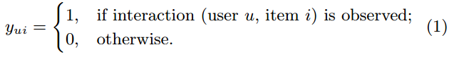

这里，yuiyui 值为 11 仅表示用户 uu 与项目 ii 之间有交互信息，并不意味 uu 喜欢 ii；同样的yuiyui 值为 00 也并不表示uu 讨厌 ii。这其中缺少负反馈信息。这也是隐性反馈的一个挑战，因为它给用户偏好信息带来了干扰。

隐式反馈的推荐任务可以表示为预测矩阵 YY 中未观察到交互的entry的分数yui=f(u,i|Θ)，这个分数最终用来给项目排名。

### 损失的计算
为了学习模型的参数 Θ，有两种loss可供选择，point-wise loss和pair-wise loss。

```
逐点损失（point-wise loss）：最小化 yui 与yui 之间的差距。
成对损失（pair-wise loss）：最大化观察到信息的entry yui与未观察到信息的entry yui之间的差距。
```

## 矩阵分解（Matrix Factorization）
令pupu 和 qiqi 分别表示用户 uu 和项目 ii 的潜在向量，MF用pu 和 qi 的内积来评估它们之间的交互yui：

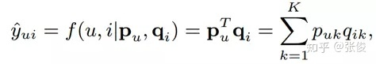

K  是潜在空间（latent space）的维度，MF模型是用户和项目的潜在因素的双向互动，它假设潜在空间的每一维都是相互独立的并且用相同的权重将它们线性结合。因此，MF可视为潜在因素（latent factor）的线性模型。

下图中的例子就展示了MF在低维潜在空间表示用户-项目复杂的交互的局限性。解决方法之一是扩大潜在空间的维度 K。但这可能有损模型的泛化能力。本文我们通过使用DNNs从数据中学习交互函数突破这一限制。

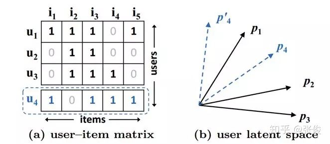

使用 jaccard 系数（集合 A 与 B 的交集与并集的比值作为集合的相似度）来作为用户之间真实的相似程度，那么下面评分矩阵用户 123 之间 S23>S12>S13，在 latent space 中的几何关系如右图所示，加入用户 4 时，S41>S43>S42，于是我们让用户 4 的特征靠近 1，然而无论怎么放，都无法使用户 3 比用户 2 更接近用户 4。

这就是使用内积描述相似度的局限性，我们可以增大 K 来解决这个问题，但是存在过拟合的风险。

## NCF（Neural Collaborative Filtering）框架

### 通用框架
下图展示的是NCF的通用框架。我们用多层感知机来模拟用户和项目之间的交互 yui。最底部的输入层是两个特征向量 VUu 和 VIi，分别用来描述用户 u 和项目 i。它们可以自行设计，支持广泛的用户和项目的模型，例如上下文感知（context-aware），基于内容（content-based），和基于邻居（neighbor-based）等构建方式。本文中，我们仅使用一个用户和一个项目作为输入特征，用one-hot编码将它们转化为二值稀疏向量。我们对输入使用这样的通用特征表示，可以很容易地使用的内容特征来表示用户和项目，以调整解决冷启动问题。

```
冷启动问题：如何在没有大量用户数据的情况下设计个性化推荐系统并让用户对推荐结果满意从而愿意使用推荐系统，就是冷启动问题。
分类：
（1）用户冷启动：如何给新用户做个性化推荐
（2）物品冷启动：如何将新物品推荐给可能对其感兴趣的用户。在新闻网站等时效性很强的网站中非常重要。
（2）系统冷启动：如何在一个新开发的网站上设计个性化推荐，从而在网站刚发布时就让用户体验到个性化推荐服务。没有用户，只有一些物品信息。
```

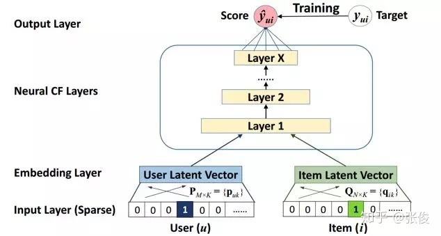

输入层（Input Layer）上面是嵌入层（Embedding Layer）;它是一个全连接层，用来将输入层的稀疏表示映射为一个密集向量（dense vector）。这些嵌入后的向量其实就可以看做是用户（项目）的潜在向量。然后我们将这些嵌入向量送入多层网络结构，最后得到预测的分数。NCF层的每一层可以被定制，用以发现用户-项目交互的某些潜在结构。最后一个隐层 X 的维度尺寸决定了模型的能力。最终输出层是预测分数 yui，文中，训练目标是最小化 yui和其目标值yui之间逐点损失（point-wise loss）。

我们将NCF的预测模型表示为：

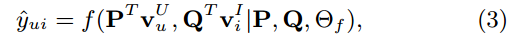

其中 ϕout 和 ϕx 分别表示为输出层和第 x 个neural CF层映射函数，总共有 X 个neural CF层。

### NCF的目标函数
常用的逐点学习方法主要是均方误差（squared loss）,但它并不适合处理隐性数据，文中提出了一种逐点学习NCF的概率学方法，特别注重隐性数据的二进制属性。

我们可以将 yui 的值作为一个标签——1表示项目 i 和用户 u 相关，否则为0。这样，预测分数 yui 就代表了项目 i 和用户 u 相关的可能性大小。因此，我们需要将网络输出限制到[0，1]的范围内。这可以通过在输出层 ϕout使用概率函数（e.g. 逻辑函数sigmoid或者probit函数）作为激活函数实现。经过以上设置后，我们这样定义似然函数：

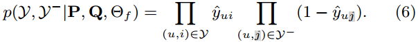

对似然函数取负对数，我们得到（负对数可以用来表示Loss函数，而且还能消除小数乘法的下溢出问题）:

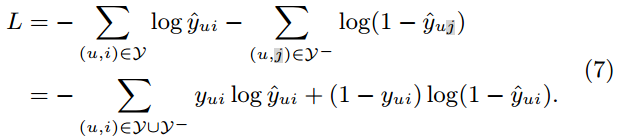

（注：上面灰色的 j完全可以用 i 替代）其中， ν 表示交互矩阵 Y中观察到的entry（如对电影有明确的评分，评级）， ν− 表示消极实例（negative instances，可以将未观察的样本全体视为消极实例，或者采取抽样的方式标记为消极实例）

这是NCF方法需要去最小化的目标函数，并且可以通过使用随机梯度下降（SGD）来进行训练优化。细心的读者可能发现了，这个函数和二类交叉熵损失函数（binary cross-entropy loss，又被成为log loss）是一样的。通过在NCF上使用这样一个概率处理（probabilistic treatment），我们把隐性反馈的推荐问题当做一个二分类问题来解决。

对于消极实例 ν− ，我们在每次迭代均匀地从未观察到的相互作用中采样（作为消极实例）并且对照可观察到交互的数量，控制采样比率。

### GMF（Generalized Matrix Factorization ）
下面我们展示如何将MF如何被解释为NCF框架的一个特例：

由于嵌入后的向量可以看做是潜在向量，我们用 PTVUu 表示用户的潜在向量 pu，QTVIi 表示项目的潜在向量 qi ,我们定义第一层神经CF层的映射函数为：

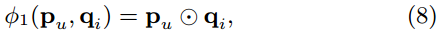

其中 aout 和 h 分别表示输出层的激活函数和连接权重。如果我们将 aout 看做一个恒等函数， h 权重全为 1，显然这就是我们的MF模型

在NCF的框架下，MF可以很容易地被泛化和推广。例如，如果我们允许从没有一致性约束（uniform constraint）的数据中学习hh ，则会形成MF的变体，它允许潜在维度的不同重要性。如果我们用一个非线性函数 aout ，将进一步推广MF到非线性集合，使得模型比线性MF模型更具有表现力。在本文的工作中，我们在NCF下实现一个更一般化的MF，它使用Sigmoid函数 σ(x)=1/(1+e−x)σ(x)=1/(1+e−x) 作为激活函数，通过log loss学习 hh。我们称之为GMF（Generalized Matrix Factorization，广义矩阵分解）。

### MLP (Multi-Layer Perceptron)
我们用MLP（多层感知机）来学习用户和项目潜在特征之间的相互作用。NCF框架下，MLP模型定义为：

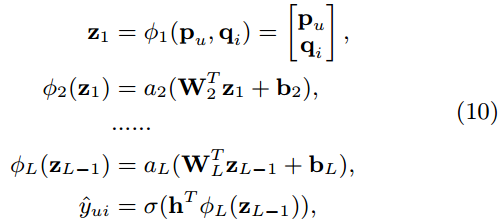

其中，这里的 Wx, bx 和 ax 分别表示第 x 层的感知机中的的权重矩阵，偏置向量（神经网络的神经元阈值）和激活函数。激活函数可以选择sigmoid，tanh和ReLU等等。经过分析我们选择ReLu函数（激活函数的总结和比较可以参考这里），实验结果也证明ReLU的表现略好于tanh和sigmoid。

在我们的结构中，每一层，相比于之前一层，神经元数量减少一半。

### GMF与MLP结合
到目前为止，我们已经开发了NCF的两个实例：GMF，它应用了一个线性内核来模拟潜在的特征交互；MLP，使用非线性内核从数据中学习交互函数。接下来的问题是：我们如何能够在NCF框架下融合GMF和MLP，使他们能够相互强化，以更好地对复杂的用户-项目交互建模？

一个直接的解决方法是让GMF和MLP共享相同的嵌入层（Embedding Layer），然后再结合它们分别对相互作用的函数输出。具体地说，对于结合GMF和单层MLP的模型可以公式化为：

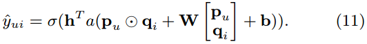

然而，共享GMF和MLP的嵌入层可能会限制融合模型的性能。例如，它意味着，GMF和MLP必须使用的大小相同的嵌入，对于数据集，两个模型的最佳嵌入尺寸差异很大，使得这种解决方案可能无法获得最佳的组合。

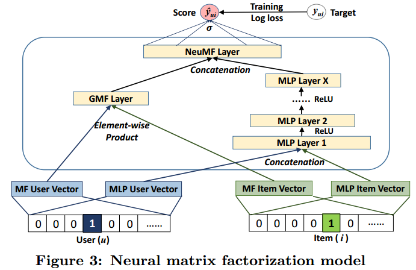

为了使得融合模型具有更大的灵活性，我们允许GMF和MLP学习独立的嵌入，并结合两种模型通过连接他们最后的隐层输出。上图（Figure 3）展示了我们的方案，公式如下：

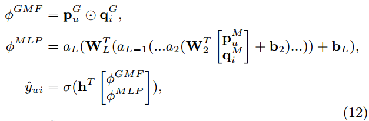

这里的 pGu 和 pMu 分别表示 GMF 部分和 MLP 部分的用户嵌入（user embedding）；同样的，qGi 和 qMi 分别表示项目的嵌入。如之前所讨论的，我们使用ReLU作为 MLP层的激活功能。该模型结合MF的线性度和DNNs的非线性度，用以建模用户-项目之间的潜在结构。我们将这一模式称为“NeuMF”，简称神经矩阵分解（Neural Matrix Factorization）。该模型的每个模型参数都能使用标准反向传播（back-propagation）计算。

### 预训练
由于NeuMF的目标函数的非凸性，基于梯度的优化方法只能找到局部最优解。初始化（initialization）在深度学习模型的收敛性和性能的方面起到了重要的作用。由于 NeuMF 是 GMF 和 MLP 的组合，我们建议使用 GMF 和 MLP 的预训练模型来初始化NeuMF。

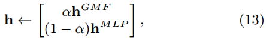

我们首先训练随机初始化的 GMF 和 MLP 直到模型收敛。然后，我们用它们的模型参数初始化 NeuMF 相应部分的参数。唯一的调整是在输出层，在那里我们将两者用权重连接起来：

对于从头开始训练的 GMF 和 MLP ，我们采用自适应矩估计（Adam，Adaptive Moment Estimation）[20]，它通过对不频繁的参数进行频繁和更大幅度的更新来适应每个参数的学习速率。Adam方法在两种模型上的收敛速度都比普通SGD快，并缓解了调整学习率的痛苦。在将预先训练的参数输入NeuMF之后，我们用普通SGD而不是Adam进行优化。 这是因为Adam需要保存更新参数的动量信息（momentum information）。因为我们用预先训练的模型参数初始化NeuMF，并且放弃保存动量信息，不适合用基于动量的方法进一步优化NeuMF。

### 实验结果
论文通过三个角度进行了试验：

RQ1 我们提出的NCF方法是否胜过 state-of-the-art 的隐性协同过滤方法？
RQ2 我们提出的优化框架（消极样本抽样的logloss）怎样为推荐任务服务？
RQ3 更深的隐藏单元是不是有助于对用户项目交互数据的学习？

使用的数据集：MovieLens 和 Pinterest 两个数据集

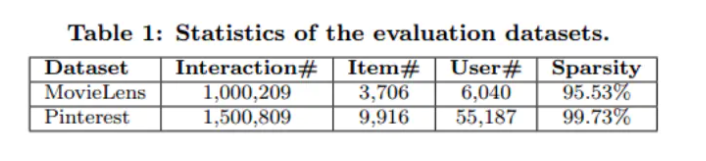

评估方案：为了评价项目推荐的性能，论文采用了leave-one-out方法评估，即：对于每个用户，我们将其最近的一次交互作为测试集（数据集一般都有时间戳），并利用余下的培训作为训练集。由于在评估过程中为每个用户排列所有项目花费的时间太多，所以遵循一般的策略，随机抽取100个不与用户进行交互的项目，将测试项目排列在这100个项目中。排名列表的性能由命中率（HR）和归一化折扣累积增益（NDCG）来衡量。同时，论文将这两个指标的排名列表截断为10。如此一来，HR直观地衡量测试项目是否存在于前10名列表中，而NDCG通过将较高分数指定为顶级排名来计算命中的位置。本文计算每个测试用户的这两个指标，并求取了平均分。

Baselines，论文将NCF方法与下列方法进行了比较：ItemPop，ItemKNN，BPR，eALS。

以下是三个结果的贴图，关于试验结果的解读，由于篇幅的原因，大家可以查看原论文。

RQ1试验结果

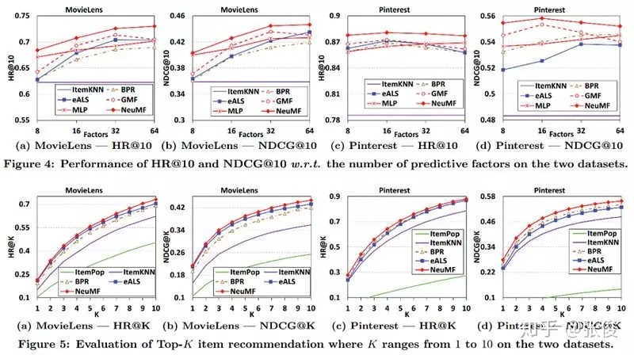

简单的结论，即NCF效果好于BaseLine模型，如果不好的话论文也不用写了，哈哈。

RQ2试验结果

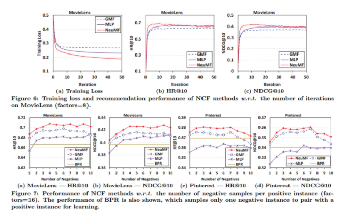

Figure 6 表示将模型看作一个二分类任务并使用logloss作为损失函数时的训练效果。
Figure7 表示采样率对模型性能的影响（横轴是采样率，即负样本与正样本的比例）。

RQ3试验结果

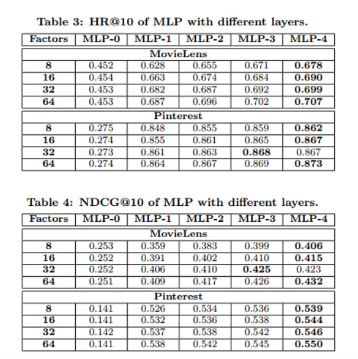

上面的表格设置了两个变量，分别是Embedding的长度K和神经网络的层数，使用类似网格搜索的方式展示了在两个数据集上的结果。增加Embedding的长度和神经网络的层数是可以提升训练效果的。

## 实战NCF项目
https://github.com/princewen/tensorflow_practice/tree/master/recommendation/Basic-NCF-Demo

## 参考资料
* [Neural Collaborative Filtering](https://www.comp.nus.edu.sg/~xiangnan/papers/ncf.pdf)
* [推荐系统论文阅读——Neural Collaborative Filtering](https://blog.csdn.net/stalbo/article/details/79431662)
* [深度协同过滤：用神经网络取代内积建模](https://zhuanlan.zhihu.com/p/37400021)
* [推荐系统遇上深度学习(十一)--神经协同过滤NCF原理及实战](https://www.jianshu.com/p/6173dbde4f53)

