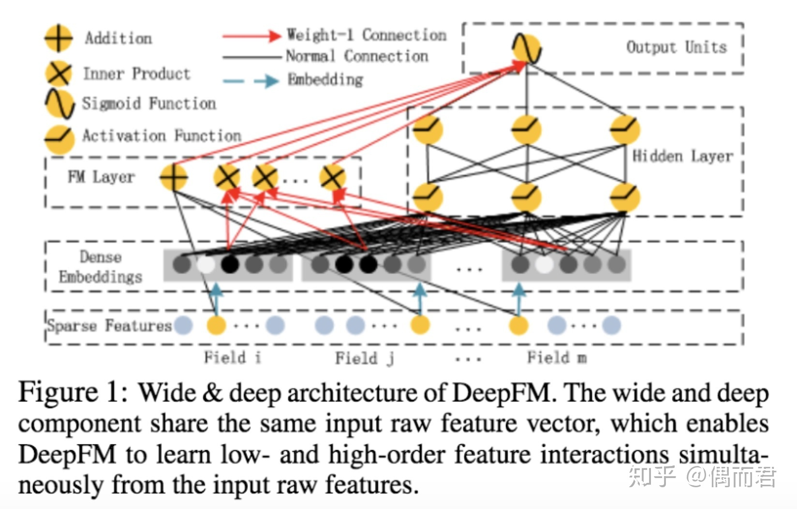

## DeepFM
与Wide & Deep的模型类似，DeepFM模型同样由浅层模型和深层模型联合训练得到。不同点主要有以下两点：

1. wide模型部分由LR替换为FM。FM模型具有自动学习交叉特征的能力，避免了原始Wide & Deep模型中浅层部分人工特征工程的工作。
2. 共享原始输入特征。DeepFM模型的原始特征将作为FM和Deep模型部分的共同输入，保证模型特征的准确与一致。

文中通过大量实验证明，DeepFM模型的AUC和Logloss都优于目前的最好效果。效率上，DeepFM和目前最优的效果的深度模型相当。

## Introduction
CTR预估是目前推荐系统的核心技术，其目标是预估用户点击推荐内容的概率。在CTR预估任务中，用户行为的隐式low-order和high-order特征都起到十分重要。有些特征是易于理解的，可以通过领域专家进行人工特征工程抽取特征。但是对于不易于理解的特征，如“啤酒和尿布”，则只能通过机器学习的方法得到。同样的对于需要特别巨量特征的模型，人工特征工程也是难以接受的。所以特征的自动学习显的十分重要。

简单线性模型，缺乏学习high-order特征的能力，很难从训练样本中学习到从未出现或极少出现的重要特征。FM模型可以通过点积和隐向量的形式学习交叉特征。由于复杂度的约束，FM通常只应用order-2的2重交叉特征。深层模型善于捕捉high-order复杂特征。现有模型用于CTR预估的有很多尝试，如CNN/RNN/FNN/PNN/W&D等，但都有各自的问题。FNN和PNN缺乏low-order特征，W&D需要人工构造Wide部分交叉特征。

本文提出的DeepFM模型是一种可以从原始特征中抽取到各种复杂度特征的端到端模型，没有人工特征工程的困扰。本文贡献如下：

* DeepFM模型包含FM和DNN两部分，FM模型可以抽取low-order特征，DNN可以抽取high-order特征。无需Wide&Deep模型人工特征工程。
* 由于输入仅为原始特征，而且FM和DNN共享输入向量特征，DeepFM模型训练速度很快。
* 在Benchmark数据集和商业数据集上，DeepFM效果超过目前所有模型。

## DeepFM 模型

为了同时利用low-order和high-order特征，DeepFM包含FM和DNN两部分，两部分共享输入特征。对于特征i，标量wi是其1阶特征的权重，该特征和其他特征的交互影响用隐向量Vi来表示。Vi输入到FM模型获得特征的2阶表示，输入到DNN模型得到high-order高阶特征。模型联合训练，结果可表示为：

### FM部分

FM模型不单可以建模1阶特征，还可以通过隐向量点积的方法高效的获得2阶特征表示，即使交叉特征在数据集中非常稀疏甚至是从来没出现过。这也是FM的优势所在。

### Deep部分

该部分和Wide&Deep模型类似，是简单的前馈网络。在输入特征部分，由于原始特征向量多是高纬度,高度稀疏，连续和类别混合的分域特征，为了更好的发挥DNN模型学习high-order特征的能力，文中设计了一套子网络结构，将原始的稀疏表示特征映射为稠密的特征向量。

子网络设计时的两个要点：

1. 不同field特征长度不同，但是子网络输出的向量需具有相同维度；
2. 利用FM模型的隐特征向量V作为网络权重初始化来获得子网络输出向量；

这里的第二点可以这么理解，如上图假设k=5，对于输入的一条记录，同一个field只有一个位置是1，那么在由输入得到dense vector的过程中，输入层只有一个神经元起作用，得到的dense vector其实就是输入层到embedding层该神经元相连的五条线的权重，即vi1，vi2，vi3，vi4，vi5。这五个值组合起来就是我们在FM中所提到的Vi。文中将FM的预训练V向量作为网络权重初始化替换为直接将FM和DNN进行整体联合训练，从而实现了一个端到端的模型。

假设子网络的输出层为

DNN网络第l层表示成

假设一共有H个隐藏层，DNN部分对CTR预测结果可以表示为：

## 实验部分
文中通过在Criteo数据集和Company*数据集进行大量实验，证明DeepFM在效果上超越了目前最优的模型，效率上的与当前最优模型相当。实验评价指标采用AUC和Logloss两个离线指标。

### 效率实验
实验在Criteo数据集上进行，通过

指标衡量模型执行时间。实验分别比较了各个模型在CPU和GPU上的运行效率，DeepFM都取得了和最优效率相当的结果。（从图中看OPNN的执行效率也很高，但是OPNN结果效果波动性大，不稳定）

### 效果实验

实验结果可以看出，DeepFM模型比其他对比模型AUC提升至少0.37%，logloss减少至少0.42%。同时可以得到以下结论：

1. 学习特征交互可以改善CTR预估模型。
2. 同时学习high-order和low-order特征可以改善CTR模型效果。
3. 通过共享输入特征学习high-order和low-order交互特征表示可以提升CTR模型。

### 参数学习实验
为了比较实验效果，文中对超参数进行了多组实验。详细内容直接看实验结果。

激活函数

Dropout

每层节点数

隐藏层数

网络形状

## 参考资料
* [DeepFM: A Factorization-Machine based Neural Network for CTR Prediction](https://arxiv.org/abs/1703.04247)
* [深度推荐模型之DeepFM](https://zhuanlan.zhihu.com/p/57873613)
