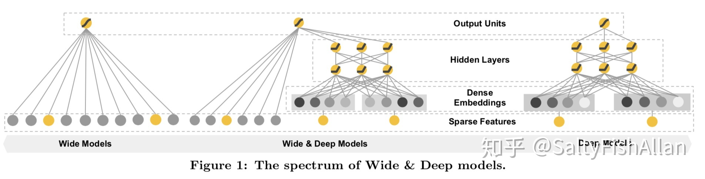
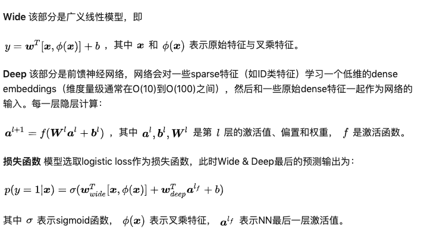
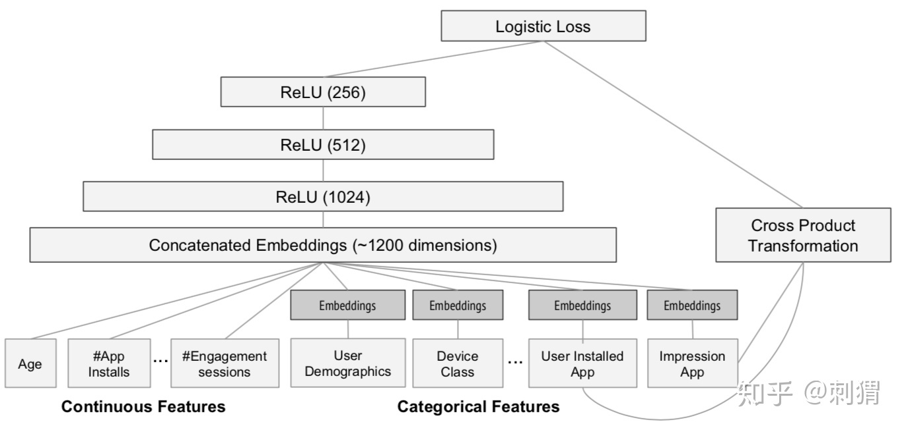
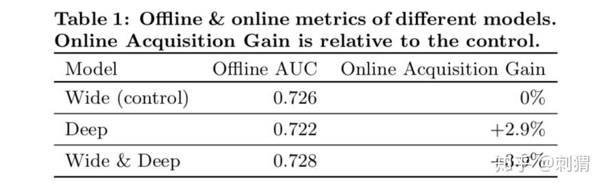

# Wide & Deep Learning for Recommender Systems
本文介绍 Google 发表在 DLRS 2016 上的文章《Wide & Deep Learning for Recommender System》。Wide & Deep 模型的核心思想是结合线性模型的记忆能力和 DNN 模型的泛化能力，从而提升整体模型性能。Wide & Deep 已成功应用到了 Google Play 的app推荐业务，并于TensorFlow中封装。该结构被提出后即引起热捧，在业界影响力非常大，很多公司纷纷仿照该结构并成功应用于自身的推荐等相关业务。

## Motivation
推荐系统的主要挑战之一，是同时解决Memorization和Generalization，理解这两个概念是理解全文思路的关键，下面分别进行解释。
### Memorization
面对拥有大规模离散sparse特征的CTR预估问题时，将特征进行非线性转换，然后再使用线性模型是在业界非常普遍的做法，最流行的即「LR+特征叉乘」。Memorization 通过一系列人工的特征叉乘（cross-product）来构造这些非线性特征，捕捉sparse特征之间的高阶相关性，即“记忆” 历史数据中曾共同出现过的特征对。

例如，特征1——专业: {计算机、人文、其他}，特征2——下载过音乐《消愁》:{是、否}，这两个特征one-hot后的特征维度分别为3维与2维，对应的叉乘结果是特征3——专业☓下载过音乐《消愁》: {计算机∧是，计算机∧否，人文∧是，人文∧否，其他∧是，其他∧否}。

典型代表是LR模型，使用大量的原始sparse特征和叉乘特征作为输入，很多原始的dense特征通常也会被分桶离散化构造为sparse特征。这种做法的优点是模型可解释高，实现快速高效，特征重要度易于分析，在工业界已被证明是很有效的。Memorization的缺点是：

1. 需要更多的人工设计；
2. 可能出现过拟合。可以这样理解：如果将所有特征叉乘起来，那么几乎相当于纯粹记住每个训练样本，这个极端情况是最细粒度的叉乘，我们可以通过构造更粗粒度的特征叉乘来增强泛化性；
3. 无法捕捉训练数据中未曾出现过的特征对。例如上面的例子中，如果每个专业的人都没有下载过《消愁》，那么这两个特征共同出现的频次是0，模型训练后的对应权重也将是0；

### Generalization
Generalization 为sparse特征学习低维的dense embeddings 来捕获特征相关性，学习到的embeddings 本身带有一定的语义信息。可以联想到NLP中的词向量，不同词的词向量有相关性，因此文中也称Generalization是基于相关性之间的传递。这类模型的代表是DNN和FM。

Generalization的优点是更少的人工参与，对历史上没有出现的特征组合有更好的泛化性 。但在推荐系统中，当user-item matrix非常稀疏时，例如有和独特爱好的users以及很小众的items，NN很难为users和items学习到有效的embedding。这种情况下，大部分user-item应该是没有关联的，但dense embedding 的方法还是可以得到对所有 user-item pair 的非零预测，因此导致 over-generalize并推荐不怎么相关的物品。此时Memorization就展示了优势，它可以“记住”这些特殊的特征组合。

Memorization根据历史行为数据，产生的推荐通常和用户已有行为的物品直接相关的物品。而Generalization会学习新的特征组合，提高推荐物品的多样性。 论文作者结合两者的优点，提出了一个新的学习算法——Wide & Deep Learning，其中Wide & Deep分别对应Memorization & Generalization。

## Model
### 模型结构
Wide & Deep模型结合了LR和DNN，其框架图如下所示。

### 联合训练
联合训练（Joint Training）和集成（Ensemble）是不同的，集成是每个模型单独训练，再将模型的结果汇合。相比联合训练，集成的每个独立模型都得学得足够好才有利于随后的汇合，因此每个模型的model size也相对更大。而联合训练的wide部分只需要作一小部分的特征叉乘来弥补deep部分的不足，不需要 一个full-size 的wide 模型。

在论文中，作者通过梯度的反向传播，使用 mini-batch stochastic optimization 训练参数，并对wide部分使用带L1正则的Follow- the-regularized-leader (FTRL) 算法，对deep部分使用 AdaGrad算法。

## Experiment
实验场景 Google Play商店的app推荐中，当一个user访问Google Play，会生成一个包含user和contextual信息的query，推荐系统的精排模型会对于候选池中召回的一系列apps（即item，文中也称 impression）进行打分，按打分生成app的排序列表返回给用户。Deep&Wide对应这里的精排模型，输入 x 包括<user，contextual，impression>的信息，y =1表示用户下载了impression app，打分即 p(y|x) 。

实验的Depp&Wide模型结构如下：

### 实验细节
* 训练样本约5000亿
* Categorical 特征（sparse）会有一个过滤阈值，即至少在训练集中出现m次才会被加入
* Continuous 特征（dense）通过CDF被归一化到 [0,1] 之间
* Categorical 特征映射到32维embeddings，和原始Continuous特征共1200维作为NN输入
* Wide部分只用了一组特征叉乘，即被推荐的app ☓ 用户下载的app
* 线上模型更新时，通过“热启动”重训练，即使用上次的embeddings和模型参数初始化

Wide部分设置很有意思，作者为什么这么做呢？结合业务思考，在Google Play商店的app下载中，不断有新的app推出，并且有很多“非常冷门、小众”的app，而现在的智能手机user几乎全部会安装一系列必要的app。联想前面对Memorization和Generalization的介绍，此时的Deep部分无法很好的为这些app学到有效的embeddding，而这时Wide可以发挥了它“记忆”的优势，作者在这里选择了“记忆”user下载的app与被推荐的app之间的相关性，有点类似“装个这个app后还可能会装什么”。对于Wide来说，它现在的任务是弥补Deep的缺陷，其他大部分的活就交给Deep了，所以这时的Wide相比单独Wide也显得非常“轻量级”，这也是Join相对于Ensemble的优势。

### 实验结果
通过3周的线上A/B实验，实验结果如下，其中Acquisition表示下载。

论文中也在Wide&Deep的性能方面给出了介绍和实验，这里不做叙述，简而言之，这是一个可以在工业界实际落地使用的模型，模型代码已经开源并封装于TensorFlow。

## Conclusion
1. 详细解释了目前常用的 Wide 与 Deep 模型各自的优势：Memorization 与 Generalization。
2. 结合 Wide 与 Deep 的优势，提出了联合训练的 Wide & Deep Learning。相比单独的 Wide / Deep模型，实验显示了Wide & Deep的有效性，并成功将之成功应用于Google Play的app推荐业务。
3. 目前Wide 结合 Deep的思想已经非常流行，结构虽然简单，从业界的很多反馈来看，合理地结合自身业务借鉴该结构，实际效果确实是efficient，我们的feeds流主模型也借鉴了该思想。

## 参考资料
* [Wide & Deep Learning for Recommender Systems](https://arxiv.org/abs/1606.07792)
* [详解 Wide & Deep 结构背后的动机](https://zhuanlan.zhihu.com/p/53361519)
* [论文笔记 - Wide & Deep for Recsys](https://zhuanlan.zhihu.com/p/39249201)
