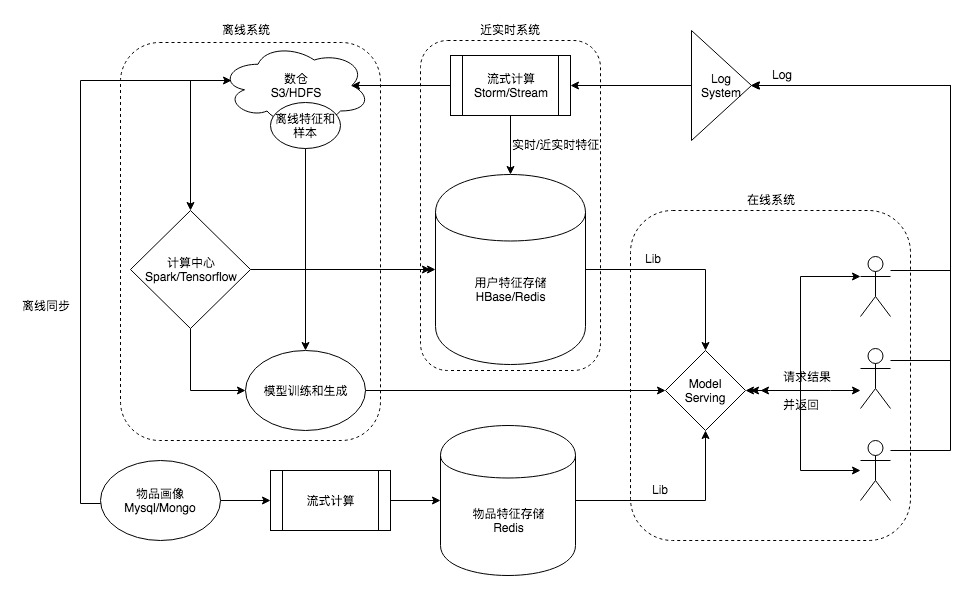

# 点击率预估系统概述

点击率预估系统广泛应用于推荐、搜索和广告场景中。本文主要介绍如何从零到一的搭建整个点击率预估系统的流程和实践。

如上所示，点击率预估系统主要包括三部分：
1. 在线系统，主要负责在线serving服务，根据外部请求的user_id和item_ids，然后根据id从数据库中获取对应的特征，
然后通过模型算出最终点击率，从而影响展示排序；
2. 离线系统；主要负责特征加工、样本生成和模型训练，从数仓中获取用户行为数据和物品信息并加工成用户特征和物品特征，
然后匹配上对应的点击行为加工成训练样本，最终通过样本训练最终的模型；
3. 近实时系统：近实时系统主要负责加工用户/内容近实时信息，因为用户行为实时生成、特征实时丰富，所以如果需要将这些更实时、更敏感的特征体现在训练和预测中，
则必须有近实时系统来处理这些基础数据。

以上三个系统中，在线系统和离线系统是必不可少的部分，是点击率预估的基本要素和基石，但近实时系统则看各方自己需求和能力，
不过实时系统虽然复杂，但效果提升较大，是非常值得完善的模块。

## 实时系统

## 离线系统

## 近实时系统

## 其他

