# 推荐算法综述

近10年来，推荐、搜索和广告等业务发展迅速，被广泛应用于各个场景中。特别是移动互联网的兴起，大家对手机APP的使用体验要求越来越高，其中特别重要的体验就是个性化需求的体验。因此，个性化需求被应用到各个领域和场景，如电商方向的淘宝、京东、拼多多，或社区方向的今日头条、抖音APP等。近10年来，推荐、搜索和广告等业务发展迅速，被广泛应用于各个场景中。
本文将从推荐系统的整体框架出发，介绍推荐算法在推荐系统不同环节的应用。

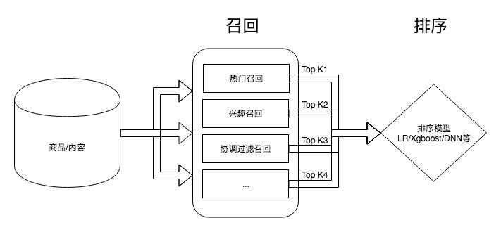

上述是推荐系统的通用框架，推荐系统框架主要分为两个部分：召回，排序。在召回环节，通过不同的召回方式，如热门召回、兴趣召回、协调过滤召回等，从物品池中选取TopK的物品，组成个性化召回池；在排序环节，用统一的排序方法，将个人召回池中的所有召回物品进行排序，最后根据排序结果展现给用户。
所以，根据上述召回和排序环节的结构，我们要优化最终的个性化推荐效果，我们可以从这两个环节中的任一环节入手，尽准确的让用户快速浏览到物品。

以下将从召回和排序两个环节对推荐算法进行介绍。

## 1. 召回
在推荐系统框架中，召回的主要作用是从海量(十万以上即可)的物品中，快速找出用户可能有兴趣的物品。因为排序部分只是对召回的物品进行排序，所以用户有没有机会触达他喜欢的物品，在很大程度上取决于召回模块，如果物品连进召回的机会的没有，那么即使排序优化的再好，用户也没机会看到他喜欢的物品。

如上图所示，召回环节中，一般会通过多路召回方式并行的对物品进行召回，如热门召回、兴趣召回、协同过滤召回等，一般热门和兴趣是相对明确等，需要探索和扩展的主要是协同过滤部分，以下将介绍不同的协调过滤算法。

### 1.1 常用的协同过滤算法

* 近邻思想的协同过滤
    * 基于用户的协同过滤
    * 基于物品的协同过滤
* 矩阵分解的协同过滤
    * SVD 奇异值分解
    * ALS 交替最小二乘法
* 基于协同主体回归的协同过滤
    * 概率主题模型
    
### 1.2 近邻思想的协同过滤 一般应用于在线协同部分，要做各种剪枝来优化效果
基于近邻思想的协同过滤思想即为"相似的用户倾向于消费相似的物品"。因此，如何找到相似用户和相似物品是核心。相似度的度量方式有很多，如欧式距离、余弦距离、皮尔逊相关系数、相关性分析等。

欧式距离：
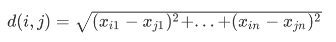

余弦距离：
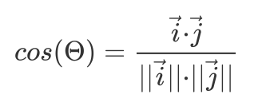

皮尔逊相关系数：
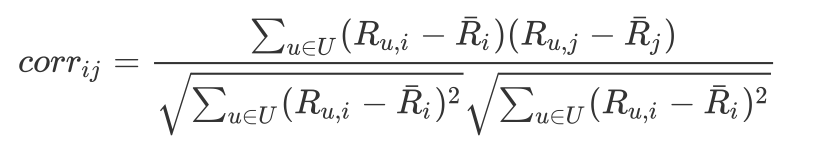

#### 1.2.1 基于用户的协同过滤
基于用户的协同过滤（User-Based）方法是最早的一种[基于协同过滤的推荐算法](http://citeseerx.ist.psu.edu/viewdoc/download?doi=10.1.1.38.3784&rep=rep1&type=pdf)，是一种基于"用户可能会喜欢和他具有相似爱好的用户所喜欢的物品"的假设。换而言之，具体相似偏好的用户在物品打分上也应该相似的。
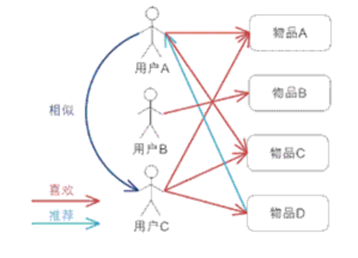

先通过相似度计算，选取与目标用户相似度最高的前 K 个用户，用这 K 个用户的打分情况对该目标用户对物品打分情况进行预测。最简单的基于用户的协同过滤推荐方法有两种：

* TopN 推荐：在这K哥用户中，统计出现频率最高且在目标用户的向量中未出现的物品，将这些物品构建成推荐列表。
* 关联推荐：利用这前 K 个用户的购买或打分记录进行关联规则挖掘，利用挖掘出的关联规则，结合目标用户的购买记录完成推荐，典型的推荐结果就是常见的“购买了某物品的用户还购买了什么物品”

当然，可以通过用户之间的相似度作为权重，加权得到用户 a 对物品 i 的打分。

基于用户的协同过滤方法：

* “个性化”的体现方式是：对于不同的用户，其最近邻是不同的，进而得到的推荐列表也不一样
* “协同过滤”的体现方式是：对一个用户进行推荐时，使用其它用户在物品上的观点来寻找和他相似的用户
* 优点在于：在数据集完善、物品丰富的条件下，能够获得较高的准确率， 而且能够避开物品信息上的挖掘进行推荐，能够对物品的关联性、用户的偏好进行隐式透明的挖掘
* 缺点在于：随着系统用户数量的增大，计算 Top-K 相关用户的时间会显著增长，使得该方法难以胜任用户量变化巨大的系统，*限制了系统的可扩展性*；同时，当新用户加入系统时，由于他的打分历史记录很少，难以准确计算真正与之对应的 Top-K 相关用户，这也进一步引出数据稀疏性的问题对系统可扩展性的限制。

#### 1.2.2 基于物品的协同过滤

鉴于基于用户的协同过滤方法，随着用户数增加，计算时间显著增长。Sarwar 等人在 WWW 2001 上提出了[基于物品的推荐](http://files.grouplens.org/papers/www10_sarwar.pdf)，基于物品的协同过滤方法是亚马逊网络商城的专利算法，目前也是亚马逊网络商城推荐系统的底层核心算法。

基于物品的协同过滤方法所基于的基本假设与基于用户的协同过滤方法类似，也就是“用户可能会喜欢与他之前曾经喜欢的物品相似的物品”。

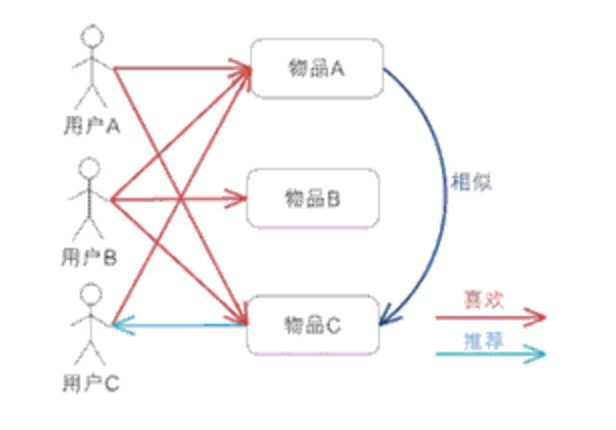

最简单的线上推荐是，当用户购买了某一商品后，直接向其推荐与该物品相似度最高的前 K 个商品。稍微复杂一点的推荐方法考虑了该用户所有的打分历史记录：对于一个用户行向量中的 0 值(用户未购买的物品)，我们需要去预测该用户在该物品上可能的打分，预测方法是：考虑所有该用户已经打过分的物体，以它们与该物体的相似度为权重，对它们的分值进行加权平均，作为对该物体的预测打分，最终以预测打分的高低为顺序给出推荐列表

基于物品的协同过滤方法：

* 计算简单，容易实现实时响应，由于物品被打分的变化剧烈程度要比用户低得多，因此物品相似度的计算一般可以采用离线完成、定期更新的方式，从而减少了线上计算，实现实时响应，提高效率，尤其对于用户数远 大于商品数的情况下效果更加显著，比如用户新添加了几个感兴趣的商品之后，可以立即给出新的推荐
* 可解释性好，用户可能不了解其他人的购物情况，但是对自己的购物历史总是很清楚的，另外用户总是希望自己有最后的决定权，如果系统推荐的商品不满意，需要有办法让用户改进它，基于物品的协同过滤方法方法很容易让用户理解为什么推荐了某个商品，并且当用户在兴趣列表里添 加或删除商品时，可以调整系统的推荐结果

### 1.3 矩阵分解的协同过滤
基于矩阵分解的协同过滤方法实际上就是对用户-物品评分矩阵做一个分解，以得到用户和物品两个角度的潜在因素矩阵，最后可以得到这个矩阵中所有位置的近似解。该类模型可以是一种有监督的模型，所以可以离线统计衡量模型效果。该类型协同过滤算法应用相对较多，效果也不错。不过也需要进行一定的剪枝操作和热门打压操作。

#### 1.3.1 SVD分解
在推荐系统中，用户和物品之间没有直接关系。但是我们可以通过特征把它们联系在一起。对于电影来说，这样的特征可以是：喜剧还是悲剧，是动作片还是爱情片。用户和这样的特征之间是有关系的，比如某个用户喜欢看爱情片，另外一个用户喜欢看动作片；物品和特征之间也是有关系的，比如某个电影是喜剧，某个电影是悲剧。那么通过和特征之间的联系，我们就找到了用户和物品之间的关联。

SVD 奇异值分解在数学上的定义指的是，对于任意一个 m 行 n 列的矩阵 $A_{m*n}$，可以被写成三个矩阵的乘积：

U：m 行 m 列的列正交矩阵，用来表示用户层面的特征
S：m 行 n 列的对角线矩阵，矩阵元素非负
V：n 行 n 列的正交矩阵的倒置，用来表示物品层面的特征
即：
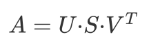

由于 S 是一个对角矩阵，每个元素非负，而且依次减小。可以大致理解如下：在线性空间里，每个向量代表一个方向。所以特征值是代表该矩阵向着该特征值对应特征向量方向的变化权重。所以我们可以取 S 对角线上前 k 个元素，这样 U 和 V 也会相应的降维，从而实现了降维的目的，减少计算量。

这样，当我们得到一个新用户对物品的评分向量后，可通过与 U 和 S 矩阵的乘积，得到新用户的特征表示，从而找到与其相近的其他用户，再基于这些相近的用户对物品的打分情况，给出新用户对其未打分商品的评分预测。

但由于 SVD 奇异值分解计算量较大，所以一般都用 矩阵分解（Matrix Factorization）的形式
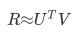

这两个矩阵 U 和 V 是通过学习的方式得到的，而不是直接做矩阵分解。可以通过定义损失函数，然后通过梯度下降的方法，逼近得到这两个矩阵，从而实现用户对物品评分的预测。

#### 1.3.2  ALS 交替最小二乘法
交替最小二乘法（Alternatingleast squares）实际上就是上述损失函数最小化的一个求解方法，当然还有其他方法比如 SGD 等。每次迭代，

* 固定 V，逐个更新每个 user 的特征 u (对 u 求偏导，令偏导为 0 求解)
* 固定 U，逐个更新每个 item 的特征 v (对 v 求偏导，令偏导为 0 求解)

#### 1.3.3 ALS-WR 模型

以上模型适用于用户对商品的有明确的评分矩阵的场景，然而很多情况下用户没有明确的反馈对商品的偏好，而是通过一些行为隐式的反馈。比如对商品的购买次数、对电视节目收看的次数或者时长，这时我们可以推测次数越多，看得时间越长，用户的偏好程度越高，但是对于没有购买或者收看的节目，可能是由于用户不知道有该商品，或者没有途径获取该商品，我们不能确定的推测用户不喜欢该商品。ALS-WR 通过置信度的权重来解决此问题，对于我们更确信用户偏好的项赋予较大的权重，对于没有反馈的项，赋予较小的权重。目标函数如下：

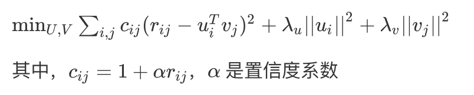

在实际应用中，由于待分解的矩阵常常是非常稀疏的，与 SVD 相比，ALS 能有效的解决过拟合问题。基于 ALS 的矩阵分解的协同过滤算法的可扩展性也优于 SVD。与随机梯度下降的求解方式相比，一般情况下随机梯度下降比 ALS 速度快。但有两种情况 ALS 更优于随机梯度下降：当系统能够并行化时，ALS 的扩展性优于随机梯度下降法。ALS-WR 能够有效的处理用户对商品的隐式反馈的数据ALS-WR 模型

以上模型适用于用户对商品的有明确的评分矩阵的场景，然而很多情况下用户没有明确的反馈对商品的偏好，而是通过一些行为隐式的反馈。比如对商品的购买次数、对电视节目收看的次数或者时长，这时我们可以推测次数越多，看得时间越长，用户的偏好程度越高，但是对于没有购买或者收看的节目，可能是由于用户不知道有该商品，或者没有途径获取该商品，我们不能确定的推测用户不喜欢该商品。ALS-WR 通过置信度的权重来解决此问题，对于我们更确信用户偏好的项赋予较大的权重，对于没有反馈的项，赋予较小的权重。目标函数如下：在实际应用中，由于待分解的矩阵常常是非常稀疏的，与 SVD 相比，ALS 能有效的解决过拟合问题。基于 ALS 的矩阵分解的协同过滤算法的可扩展性也优于 SVD。与随机梯度下降的求解方式相比，一般情况下随机梯度下降比 ALS 速度快。但有两种情况 ALS 更优于随机梯度下降：

* 当系统能够并行化时，ALS 的扩展性优于随机梯度下降法
* ALS-WR 能够有效的处理用户对商品的隐式反馈的数据

ALS算法在Netflix的一次比赛中获得了第一的名次，另外spark-ml也集成了ALS和ALS-WR算法。

### 1.4 协同主题回归算法

协同主题回归算法实际上就是结合主题概率模型和协同过滤模型。最简单的结合思路是：

* 将主题分布概率 $\theta$ 替代协同过滤中物品的潜特征 $v$，即
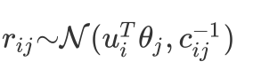

* 但这种方式会导致 内容有差异但主题相似 的文章容易被认作相似，而得到推荐

因此，协同主题回归算法的结合思路是：
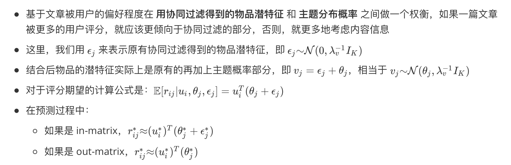
协同主题回归算法可以在一定程度上解决 冷启动 的问题，通过概率主题模型作为补充，更好地去解决矩阵分解过程中 out-matrix 的现象。

## 2. 排序

排序模型主要目的就是将召回的个性化物品进行进一步的优化排序，从而提高用户的浏览效率。一般情况下，排序模型都是有监督的模型，通过有监督的方法优化排序后用户浏览行为的某一指标，如点击率、浏览时长等，用分类或回归的方式拟合用户对某个物品的行为指标，如点击率，从个人将预测为高点击率的物品排在前面，使得用户能快速触达。
常用的排序模型主要分为两种：点击率预估模型（CTR）和Learning To Rank模型（LTR），CTR主要应用在feed场景下，LTR主要应用在搜索排序场景下。

### 2.1 常见的排序模型

* 传统分类模型
    * LR
    * FM
* Boost模型
    * GBDT
    * Xgboost
    * MLR
* 深度模型
    * FNN
    * Wide and Deep 
    * DeepFM
* 增强学习 reinforcement learning
    * Q-learning
    * reinforcement learning

### 2.2 传统分类模型
传统的分类和回归模型有很多，而适用于推荐和广告系统的不多，主要为LR和FM两个模型。

#### 2.2.1 Logistic Regression, LR模型
点击率预估：把被点击的样本当成正例，把未点击的样本当成负例，那么样本的ctr实际上就是样本为正例的概率。因此只要有分类算法可以算出样本为正的概率，就可以作为点击率预估模型使用，而LR就满足这样的条件。另外LR相比于其他模型有求解简单、可解释强的优点，这也是工业界所看重的。

Logistic Regression的函数如下所示：
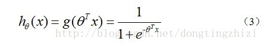

假设我们已经训练好了一组权值¥$w_{}^T$。只要把我们需要预测的 $x$ 代入到上面的方程，输出的y值就是这个标签为正类的概率，我们就能够判断输入数据是属于哪个类别。其中w即为权值参数，x为样本特征。
LR的损失函数如下所示：
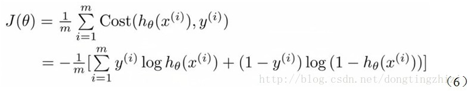

根据上述的损失函数定义，然后通过梯度下降的方法，逼近得到权值参数w，得到最早函数结果。

需要单独强调的是，在Logistic Regression 模型中，权值参数w和样本特征x之间是线性关系。在这里x表示什么呢？一般情况下x有三部分组成：用户特征、物品特征、场景特征，这三种特征共同构成了x的特征空间。很多时候，用户特征和物品特征相关连的时候，才和点击行为有强相关性，那么这种关联性在LR模型中是没办法体现的。对于这种情况，一般会有两种方式解决：

* 人工构建高阶特征。在进入模型之前，可以用笛卡尔积的方式人工对两两相关的特征进行交叉，从而得到相应的二阶、甚至高阶特征，然后这些特征作为一种x的组成，加入到模型的特征空间中；
* 人工构建特征成本太高，通过优化模型，在模型中解决特征的交叉问题。

下面的FM和其他树模型，就具备自己构建二阶甚至高阶特征的能力。

#### 2.2.2 [Factorization Machines](https://www.csie.ntu.edu.tw/~b97053/paper/Rendle2010FM.pdf), FM模型
和Logistic Regression模型相比，FM模型增加了二阶特征项，模型具体如下所示：

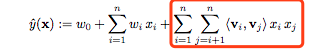

通过上述公式可知，FM比LR模型多了二阶项，并且这个二阶项和直接将x两两相乘不同，它的表示含义中存在着因子积分解的理念。
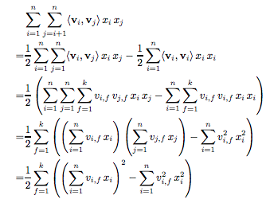

通过上诉可知，经过公式变化，这种n^2的复杂度计算最后可以等价为n*k的复杂度，大大降低了计算量。

和LR相同的，FM可以构造类似的损失函数，然后用梯度下架的方法，从而训练得到参数w、v。

相对LR而言，模型FM增加了特征两两之间的关联信息，并且还将模型复杂度控制在O(n)，大大提高了模型的表现能力。不过该模型依然存在不少弊端：

* 超参数k的选取，k越大，模型表现力越强，但计算复杂度越高，一个合适的k显得非常重要；
* 模型表达了二阶的相关性，但不能引入更高阶的信息，表达能力依然有限；

在上述两个模型中，如果希望模型最后能有较好的效果，往往都逃不开特征工程。

### 2.3 Boosting
Boosting方法是一种用来提高弱分类算法准确度的方法,这种方法通过构造一个预测函数系列,然后以一定的方式将他们组合成一个预测函数。 Boosting是一种提高任意给定学习算法准确度的方法。下面主要介绍树状结构的Boosting模型——回归树组成的Xgboost模型和LR组合的MLR模型。

#### 2.3.1 Gradient Boosting Decision Tree，GBDT
GBDT，是由多颗回归树组合而成的一种模型结构。

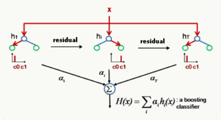

如上图所示，GBDT是把所有树的结论累加起来做最终结论的。GBDT的核心就在于，每一棵树学的是之前所有树结论和的残差(负梯度)，这个残差就是一个加预测值后能得真实值的累加量。比如样本x的真实概率是1，但第一棵树的预测概率是0.6，差了0.4，即残差为0.4。那么在第二棵树里我们把x的概率设为0.4去学习，如果第二棵树真的能把x分到0.4的叶子节点，那累加两棵树的结论就是x的真实结果；如果第二棵树的结论是0.3，则x仍然存在0.1的残差，第三棵树里x的概率就变成0.1，继续学，直到最后收敛。

GBDT的好处显而易见，主要在于树模型可以提取特征的高阶信息，并且通过将多棵弱分类器组合的方式将结果组合一起，从而提高准确率。但GBDT的弱点也非常明显，主要有两点：

* 因为模型是级联的组成，因此在训练过程中，每棵树不能并行训练，迭代非常缓慢；
* 树模型对连续型特征具有很强的表达能力和特征提取能力，但是对one-hot特征的学习能力很弱；
* 最终组成的树的个数和深度有限，所以最终使用到的特征也有限，会浪费较多的中长尾特征。

#### 2.3.1 [Xgboost](https://www.kdd.org/kdd2016/papers/files/rfp0697-chenAemb.pdf) 模型
Xgboost模型是Gradient Boosting Decision Tree(GBDT)的一种改进，主要做了以下修正：

* 和GBDT不同，xgboost给损失函数增加了正则化项（L1或L2正则化项，视学习目标不同而取不同正则化参数。）
* 有些损失函数是难以计算导数的，鉴于这种情况，xgboost使用损失函数的二阶泰勒展开作为损失函数的拟合
* GBDT的节点分裂方式是遍历所有特征的所有可能划分，再选取最优者分裂。xgboost使用分位点及分位数法，近似地计算，有效降低计算量，使得不同特征有并行处理的方式。

目前Xgboost模型基本是点击率预估模型的标配，并且是一个非常不错的baseline。

#### 2.3.2 [大规模稀疏非线性模型 MLR](https://arxiv.org/pdf/1704.05194.pdf)
MLR是阿里妈妈常有的模型之一，和Xgboost模型相比，MLR可以提取到很多中场尾特征和one-hot的信息，从而优化模型，这对一些已经做了很多特征工程并在LR上有一定效果的团队而言是一个不错的选择。话不多说，直接上他们内部的介绍。
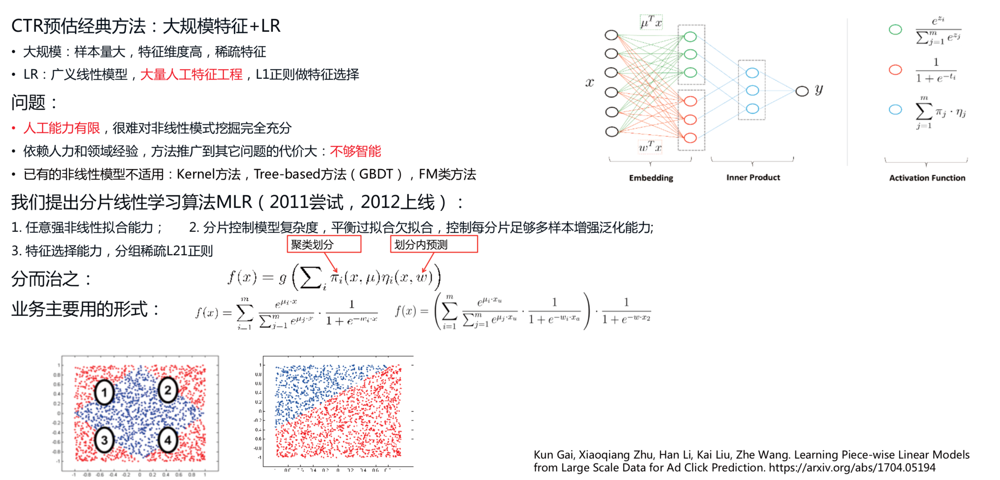

### 2.4 深度模型
自深度学习模型发展至今，在图像和自然语言领域都取得了非常卓越的成绩，可以说是完全碾压了几乎所有的传统机器学习模型。其主要特点在于，通过改造复杂的模型结构，适于各式各样的信息输入模式，并且有非常强的特征抽取能力。对于排序模型也不例外，自从深度模型成员加入之后，业界又有了很大的突破，并且因为深度模型强大的特征提取能力，使得特征工程的工作大大减少。以下介绍3个比较典型的深度模型在点击率预估中的应用。

#### 2.4.1 [FNN模型](https://arxiv.org/pdf/1601.02376.pdf)
先从最简单的DNN模型FNN开始。如下图所示：
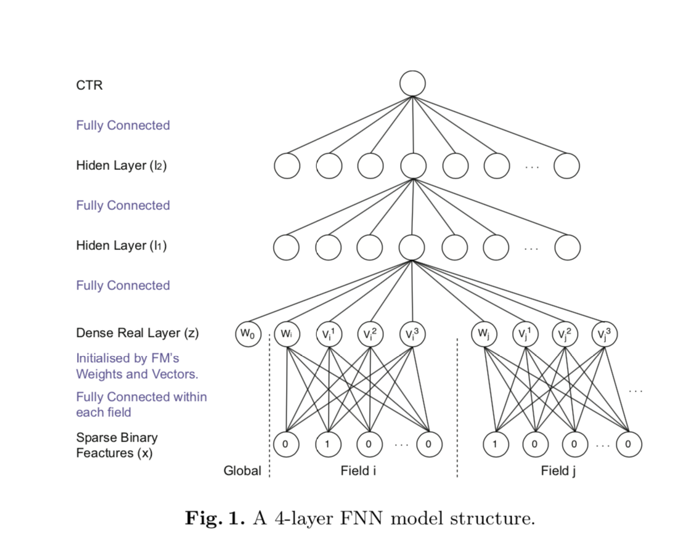

样本特征先按field进行embedding，然后后面再接两层Hiden Layer，最后输出CTR结果。模型结构简单易懂，再次不做详细介绍，有兴趣的同学可以直接看论文。在这里简单聊一下该模型的优缺点。优点如下：

* 模型相对简单且效果良好，模型输入 部分是将特征按Field继续输入，且通过模型本身的特征提取能力对特征进行优化；
* 引入DNN网络结构，就代表更多可能，如多优化目标等；
* 模型输入特征可以不再要求特征工程，大大降低了开发成本

缺点也有不少：

* 模型相对简单，且处理方式单一，特征提取能力相对有限，并不能完全替代特征工程，如经纬度特征等；
* 计算复杂度相对较高，训练过程必须GPU加速；
* 存在超参数k的选取，另外相对传统模型而言，调参过程相对复杂在所难免。

#### 2.4.2 [Wide And Deep](https://arxiv.org/pdf/1606.07792.pdf)
Wide And Deep模型是上述模型的一种改进。因为在上述模型中，FNN模型网络相对简单，提取的高阶特征可能有限，所以为了将更多的高阶特征加入到模型中来，所以在FNN模型的旁路中并行添加了wide部分，即LR模型，这样既可以使用FNN模块来对大部分特征做较强的特征提取，也能将单独做的特征工程部分引入，增加了更多可能性。模型结构图如下：

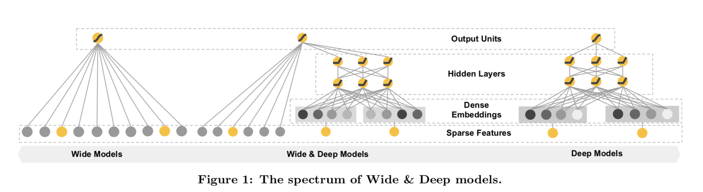

#### 2.4.3 [DeepFM](https://arxiv.org/pdf/1703.04247.pdf)
如果说Wide And Deep 是LR和FNN的组合，DeepFM就是FM和FNN的组合。

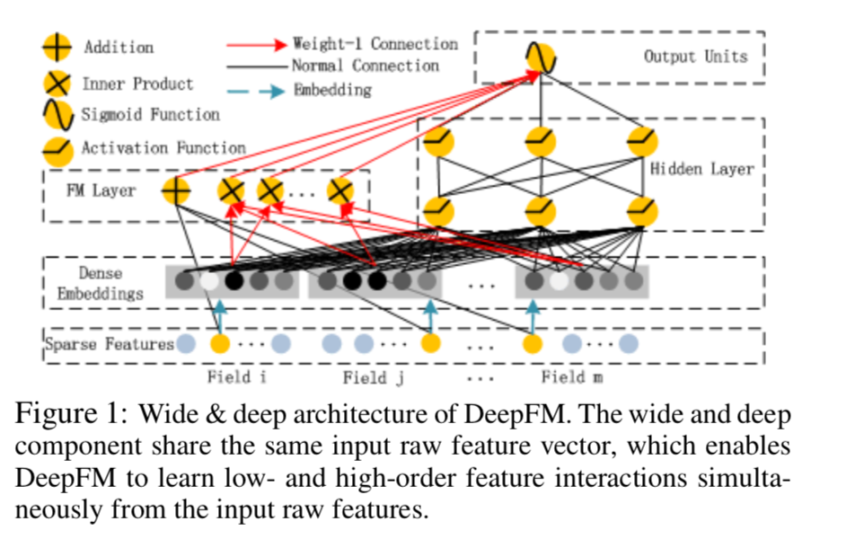

和Wide And Deep、FNN相比，DeepFM的好处是表达能力比FNN更强，且不需要做特征工程。这篇论文还介绍和比较了其他DNN模型，结果如下：

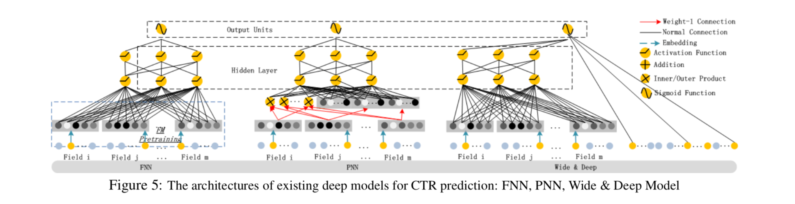
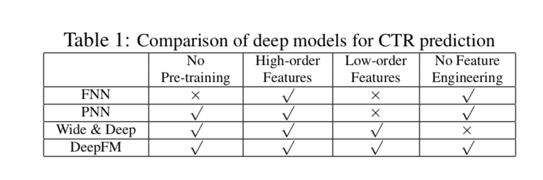
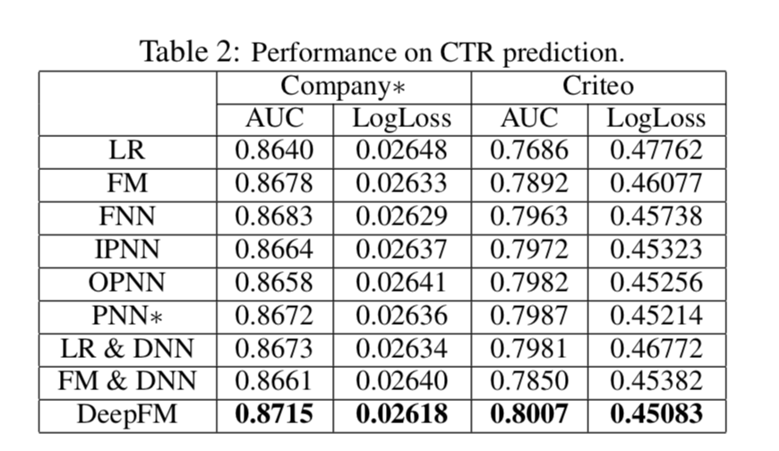

### 2.5 增强学习

#### 2.5.1 Q-Learning

#### 2.5.2 Reinforcement Learning

## 总结
以上，从召回层中的各种模型开始介绍，一直到当前最前沿的增强学习。不同系统阶段和工程阶段，算法的选型也不一样，并不是越复杂的模型效果一定越好，相反，因为一些简单模型复杂度低、对复杂特征的要求低反而能取得很好的效果。

如果你目前正在从零到一的搭建推荐系统，那么建议你从召回开始，排序部分可以先用一些简单的公式或者策略进行处理。当召回策略取得还不错的效果，且召回通道也增加到7-8种以上，简单的公式和策略已经阻碍了效果的增长，那么就是时候开始搭建排序系统了。另外排序系统建议限从先从xgboost开始，这样即使特征相对少，且不做特征工程的前提下，也能取得不错的特征。然后再考虑用Xgboost+LR/FM，最后再往DNN进行升级。这样在不变动整体框架的情况下，能不断的继承过去积累的资本，不断前行。嗯嗯，貌似没有提到强化学习，是因为强化学习目前对于中小型公司而言过于复杂，而且模型需要实时更新反馈，上线后有跑偏的可能，所以对数据、模型的监控和控制、乃至整个系统控制的要求都非常严格。

## 参考文献
* [A survey of collaborative filtering techniques](http://downloads.hindawi.com/archive/2009/421425.pdf)
* [Matrix Factorization Techniques for Recommender Systems](https://datajobs.com/data-science-repo/Recommender-Systems-[Netflix].pdf)
* [Factorization machines](https://www.csie.ntu.edu.tw/~b97053/paper/Rendle2010FM.pdf)
* [XGBoost: A Scalable Tree Boosting System](https://www.kdd.org/kdd2016/papers/files/rfp0697-chenAemb.pdf)
* [Deep Learning over Multi-field Categorical Data](https://arxiv.org/pdf/1601.02376.pdf)
* [Wide & deep learning for recommender systems](https://arxiv.org/pdf/1606.07792.pdf)
* [DeepFM: A Factorization-Machine based Neural Network for CTR Prediction](https://arxiv.org/pdf/1703.04247.pdf)